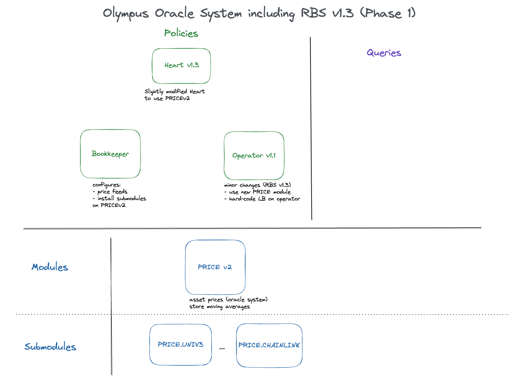
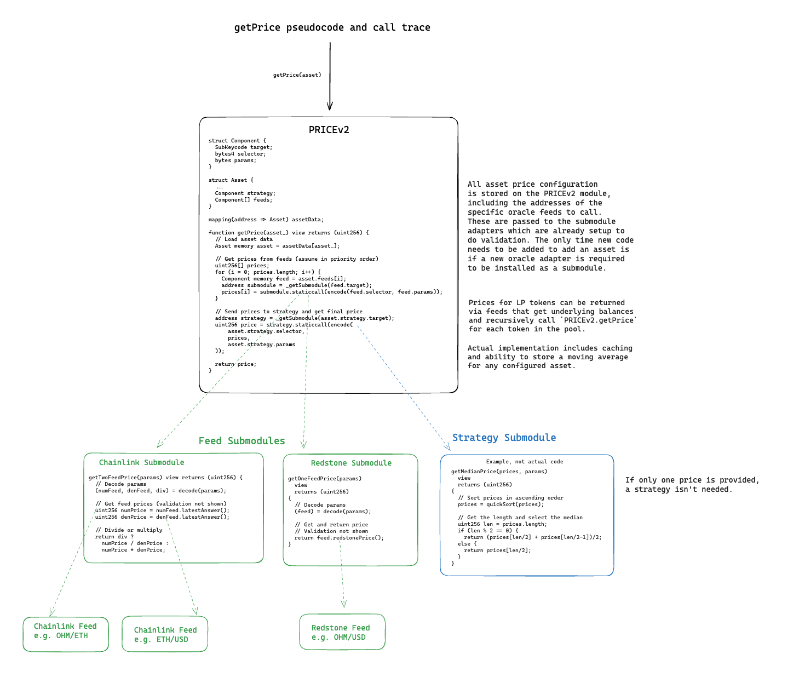

# OlympusDAO Oracle System (PRICEv2) Audit

The purpose of this audit is to review the security of a new infrastructure system for the Olympus protocol: a generalized price oracle system to be used across Olympus products. The first product to be migrated to use the new oracle system is the Range-Bound Stability (RBS) mechanism. Minor updates have been made to the RBS policies and are included in this audit. Additionally, we introduce a new primitive in Default Framework to have additional abstraction needed for the oracle system: Submodules.

These contracts will be installed in the Olympus V3 "Bophades" system, based on the [Default Framework](https://palm-cause-2bd.notion.site/Default-A-Design-Pattern-for-Better-Protocol-Development-7f8ace6d263c4303b108dc5f8c3055b1).

## Audit Scope

The contracts in-scope for this audit are:

```ml
src
├─ Submodules.sol
├─ policies
|   ├─ RBS
|   |   ├─ Heart.sol (minor updates)
|   |   ├─ Operator.sol (minor updates)
|   ├─ OCA
|   |   ├─ Bookkeeper.sol
├─ modules
|   ├─ PRICE
|   |   ├─ PRICE.v2.sol
|   |   ├─ OlympusPrice.v2.sol
|   |   ├─ submodules
|   |   |   ├─ feeds
|   |   |   |   ├─ ChainlinkPriceFeeds.sol
|   |   |   |   ├─ UniswapV3Price.sol
|   |   |   |   ├─ UniswapV2PoolTokenPrice.sol
|   |   |   |   ├─ BalancerPoolTokenPrice.sol
|   |   |   ├─ strategies
|   |   |   |   ├─ SimplePriceFeedStrategy.sol
```

The in-scope contracts depend on or are dependencies for these previously audited contracts:

```ml
src
├─ Kernel.sol
├─ modules
|   ├─ RANGE
|   |   ├─ RANGE.v1.sol
|   |   ├─ OlympusRange.sol
|   ├─ TRSRY
|   |   ├─ TRSRY.v1.sol
|   |   ├─ OlympusTreasury.sol
|   ├─ ROLES
|   |   ├─ ROLES.v1.sol
|   |   ├─ OlympusRoles.sol
```

Several external interfaces and libraries are used to interact with other protocols including Uniswap V2, Uniswap V3, Chainlink, and Balancer V2. These dependencies are stored locally in the `src/libraries` and `src/interfaces` folders.

Additionally, the contracts use various base contracts from `solmate` including `ERC20` and `ReentrancyGuard`.

## On-chain context

```
DEPLOYMENT: mainnet initially, arbitrum and optimism later
ERC20: whitelisted
ERC721: none
ERC777: none
FEE-ON-TRANSFER: none
REBASING TOKENS: none
ADMIN: trusted
EXTERNAL-ADMINS: trusted
```

Please answer the following questions to provide more context:

### Q: Are there any additional protocol roles? If yes, please explain in detail:

1. The roles
2. The actions those roles can take
3. Outcomes that are expected from those roles
4. Specific actions/outcomes NOT intended to be possible for those roles

A: There are generally three roles in the current access control framework for Olympus. These are each held by a separate multisig.

-   Admin (DAO MS) - Required for any functions that install new contracts or update system dependencies or that can withdraw reserves or arbitrarily mint/burn OHM
-   Policy (Policy MS) - Able to set system parameters for various systems to optimize performance, such as market op durations and scale
-   Emergency (Emergency MS) - Able to deactivate key system components in the event of emergency.

---

### Q: Is the code/contract expected to comply with any EIPs? Are there specific assumptions around adhering to those EIPs that Watsons should be aware of?

A: None

---

### Q: Please list any known issues/acceptable risks that should not result in a valid finding.

A: We're aware that L2 deployments of Chainlink oracles require additional validation of the sequencer uptime feed. We don't intend to deploy to L2s immediately and will add a L2 version of that submodule when we do.

---

### Q: Please provide links to previous audits (if any).

A: Olympus V3 was audited multiple times prior to launch in November, 2022. The currently deployed Olympus V3 contracts can be found on [GitHub](https://github.com/OlympusDAO/olympus-v3).
You can reference these audits here:

-   Spearbit (07/2022)
    -   [Report](https://docs.olympusdao.finance/assets/files/OlympusDAO-1-1ec939694a04535f430fd977a133c77a.pdf)
-   Code4rena Olympus V3 Audit (08/2022)
    -   [Repo](https://github.com/code-423n4/2022-08-olympus)
    -   [Findings](https://github.com/code-423n4/2022-08-olympus-findings)
-   Kebabsec Olympus V3 Remediation and Follow-up Audits (10/2022 - 11/2022)
    -   [Remediation Audit Phase 1 Report](https://hackmd.io/tJdujc0gSICv06p_9GgeFQ)
    -   [Remediation Audit Phase 2 Report](https://hackmd.io/@12og4u7y8i/rk5PeIiEs)
    -   [Follow-on Audit Report](https://hackmd.io/@12og4u7y8i/Sk56otcBs)

---

### Q: Are there any off-chain mechanisms or off-chain procedures for the protocol (keeper bots, input validation expectations, etc)?

A: The RBS system is triggered on an 8 hour interval via a keeper bot. The Heart.sol contract implements a Reverse Dutch Auction to incentivize keeper bots to call the function at an efficient price.

---

### Q: In case of external protocol integrations, are the risks of an external protocol pausing or executing an emergency withdrawal acceptable? If not, Watsons will submit issues related to these situations that can harm your protocol's functionality.

A: Not Acceptable. The only external integration are in the price feed submodules. The issues of a price feed failing to return data or update are known. Issues related to the validation of data returned from the price feeds is acceptable though.

## Submodules Overview

The requirements of the PRICEv2 Oracle System necessitated expanding our current protocol design paradigms to include a new component: Submodules.

Submodules can be thought of as upgradable components of a Module. They are installed and managed locally by a Module. The rest of the system has no context for them and must interact with them through a Module. The reason to have upgradeable components of a Module is to avoid the need to migrate data from one version of a Module to another. This is somewhat analagous to a Diamond pattern, but is more "Default-native". The Submodules implemented in this system do not need to be called directly by external contracts since their return data is processed before being returned, but a version that incorporates delegatecall logic could expose the Submodule functionality directly.

Submodules borrow the "keycode" identification system used by the Kernel for modules to allow simpler references and upgrading of submodules within the parent Module.

Submodules can have permissioned or unpermissioned functions, but the only permission available is `onlyParent` which requires a function to be called by the parent Module.

The Submodules implemented for the PRICEv2 are all stateless adapters to external price sources, but Submodules can be stateful as well, e.g. if configuration data for a specific adapter was stored on the Submodule.

## PRICEv2 Oracle System Overview

The purpose of the Olympus PRICEv2 Oracle System is to standardize and simplify the consumption of oracle price feeds across Olympus' user products. Specifically, previous products each had to manually implement validation of external oracles and deal with value scaling. Additionally, a standardized oracle system is a pre-requisite for calculating various protocol-level metrics on-chain, such as treasury value, which are contemplated for future, more automated versions of the protocol.

Features:

-   A price can be configured for any asset, identified by its contract address.
-   Any interface for an oracle can be supported by creating a submodule for it. The current ones are Chainlink, UniV3, LP token prices (Univ2, balancer).
-   Prices for complex tokens can be calculated via recursive calls within PRICEv2 via submodules designed for this purpose (see LP token price submodules).
-   Allows defining a strategy to determine a price from multiple sources, including using a moving average as one of the sources. An example is taking the median of three price sources. Strategies can also be added by adding new submodules. An asset with only one feed does not require a strategy.
-   All prices are standardized in the same number of decimals (18) and are against USD (the system unit of account)
-   Any two asset prices can be combined to get a relative price of asset A in units of asset B via a single function call. An example would be OHM/DAI price.
-   A moving average can be configured and stored for any asset configured on the PRICE module. Different policies can maintain moving averages for tokens required for their use case.

### Architecture

The oracle system has 4 main pieces:

-   Bookkeeper Policy - provides access-controlled functions for managing PRICEv2 module data configuration and submodules.
-   PRICEv2 Module - The core of the oracle system. The module exposes two key functions `getPrice(asset)` and `getPriceIn(asset,base)` which allow policies to easily retrieve prices of configured assets in the system unit of account (USD) or in terms of another asset.
-   Feed Submodules - Submodules that serve as an adapter to specific price feeds and handle all validation of price data from them.
-   Strategy Submodules - Submodules that performs logic on an array of prices from different feeds and returns a canonical value for the asset.

The following diagram places these in context of the Default Framework:


### Price Resolution

Oracles are a large risk in any DeFi system that incorporates them. Most systems use a single oracle feed for an asset and exit if there is a problem validating the data provided. To avoid reliance on any single oracle or any one provider long-term, we designed this system to be able to ingest one or more price feeds for a specific asset and then apply a strategy to determine a canonical price to use for any system within the protocol. Therefore, an asset can be configured with:

-   1 or more price feed sources (e.g. Chainlink, UniV3)
-   A strategy to resolve data from the various price feeds (e.g. median, average, first non-zero). A strategy is not required if there is only one price feed.

Additionally, some token prices are based on the price of a bundle of assets which they represent a claim on (e.g. LP tokens, ERC4626 vaults). By allowing recursion from a Submodule back to the PRICEv2 module, we can dynamically calculate prices for these tokens. An example would be a Balancer OHM-WETH token. The BalancerPoolTokenPrice submodule gets the tokens in the pool and calls `PRICEv2.getPrice()` for each asset and then uses balance data to determine get the pool token value. We recognize that many recent exploits have happened due to vulnerable LP token pricing oracles. As such, we've implemented re-entrancy guard checks on both the Balancer and UniV2 LP calculations to ensure the internal balances have not been altered via a flash loan during a transaction. We have a submodule implemented for Curve LP tokens as well, but we have not identified a solution to triggering the lock within a staticcall.

The amount of abstraction and external calls in this design comes at the cost of some additional gas costs. We seek to mitigate these where possible, but do value the long-term flexibility this design offers. One way to mitigate operation gas costs is to avoid multiple calls for the same data within a given time period. As such, every configured asset can have a value cached by calling `PRICEv2.storePrice()`. This single function stores observations whether a moving average is being tracked or just a single value is cached. Because we cache values and (potentially) store moving averages, the `PRICEv2.getPrice(asset, variant)` takes an asset address and a enum called Variant, which can be Current, Last, or MovingAverage and returns the price value and the timestamp it is current until. We have added additional convenience functions that allow conditionally falling back to the current price if the cached value isn't current or past a certain age.

Here is a diagram showing pseudo-code for the getPrice function and an example call trace:


### Operation

To configure system:

1. Admin role installs feed and strategy submodules on PRICEv2 via Bookkeeper
2. Policy role configures asset price feeds and strategy on PRICEv2 via Bookkeeper
3. Contracts (such as Operator) consume price feed data from PRICEv2

## RBS v1.3 Overview

The OlympusDAO RBS system was audited extensively from 07/2022 to 11/2022 (see links above). The general purpose of the system is to perform market operations to stabilize the price of OHM against a reserve asset (current configured as DAI). It does so by offering fixed price "wall" swaps at a certain spread to the current target price, and by deploying dutch auction "cushion" markets at a narrow spread. Since the audits a couple minor adjustments were made, including:

-   v1.1: Add a minimum target price to the system that is manually set by permissioned roles.
-   v1.2: Change the heart reward logic to use a reverse dutch auction system to allow for more reliable incentivization of keepers.

Additionally, the introduction of the PRICEv2 system requires some additional small updates to use the new oracle system instead of the purpose-built PRICEv1 version. The changes in this version include:

-   Moving the minimum target price variable and setter functions from the PRICEv1 module contract to the Operator policy contract.
-   Swapping out PRICEv1 references for PRICEv2 in the Operator policy contract (e.g. `PRICEv1.getLastPrice()` to `PRICEv2.getPriceIn(ohm, reserve)`).
-   Swapping out PRICEv1 references for PRICEv2 in the Heart policy contract (e.g. `PRICEv1.updateMovingAverage()` to `PRICEv2.storePrice(ohm); PRICEv2.storePrice(reserve);`).

## Getting Started

This repository uses Foundry as its development and testing environment. You must first [install Foundry](https://getfoundry.sh/) to build the contracts and run the test suite.

### Clone the repository into a local directory

```sh
git clone https://github.com/OlympusDAO/bophades
```

### Install dependencies

```sh
cd bophades
git checkout price-v2
npm install # install npm modules for linting and doc generation
forge build # installs git submodule dependencies when contracts are compiled
```

### Build

Compile the contracts with `forge build`.

### Tests

Run the full test suite with `forge test`. However, there are some Fork tests for other parts of the protocol that can run into RPC rate limit issues. It is recommended to run the test suite without the fork tests for this audit. Specifically, you can run `forge test --nmc Fork`.

Fuzz tests have been written to cover a range of inputs. Default number of runs is 256, more were used when troubleshooting edge cases.

### Linting

Pre-configured `solhint` and `prettier-plugin-solidity`. Can be run by

```sh
npm run lint
```
