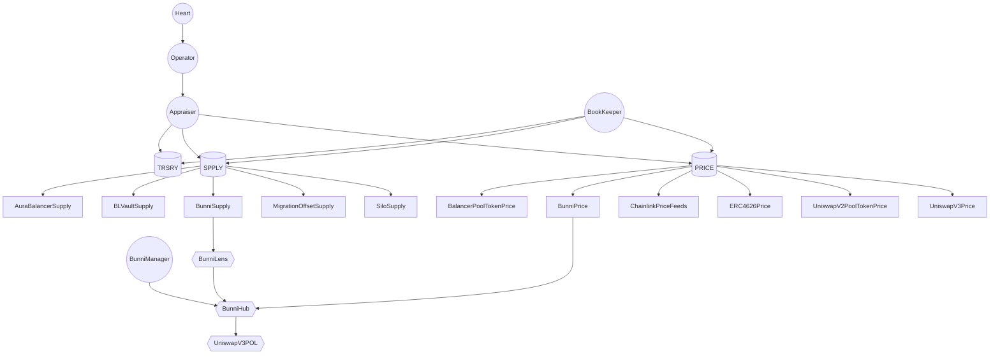
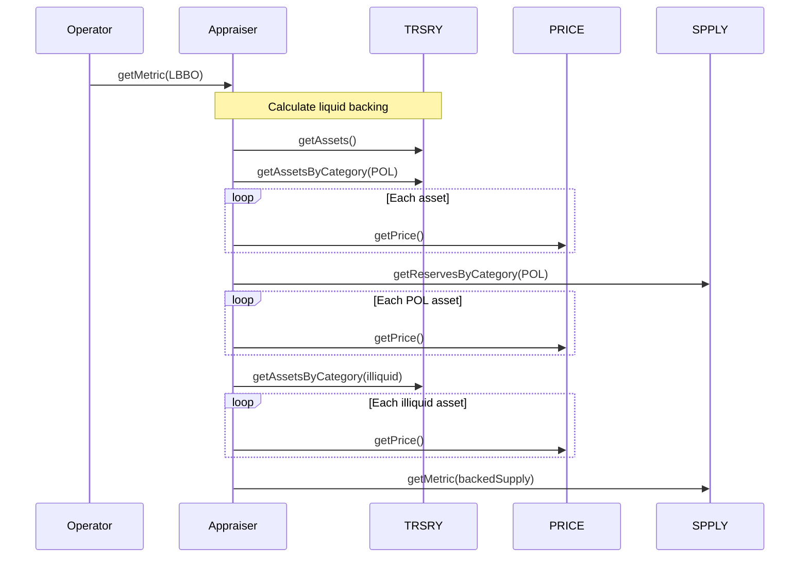

# OlympusDAO RBS v2 Audit

## Purpose

The purpose of this audit is to review an upgraded Range-Bound Stability system that that requires no manual intervention. This is aligned with the progressive automation and decentralization of the Olympus protocol.

These contracts will be installed in the Olympus V3 "Bophades" system, based on the [Default Framework](https://palm-cause-2bd.notion.site/Default-A-Design-Pattern-for-Better-Protocol-Development-7f8ace6d263c4303b108dc5f8c3055b1).

## Scope

### In-Scope Contracts

The contracts in-scope for this audit are:

-   [modules/](../../src/modules)
    -   [PRICE/](../../src/modules/PRICE)
        -   [submodules/](../../src/modules/PRICE/submodules)
            -   [feeds/](../../src/modules/PRICE/submodules/feeds)
                -   [BunniPrice.sol](../../src/modules/PRICE/submodules/feeds/BunniPrice.sol)
    -   [RANGE/](../../src/modules/RANGE)
        -   [OlympusRange.sol](../../src/modules/RANGE/OlympusRange.sol)
        -   [RANGE.v2.sol](../../src/modules/RANGE/RANGE.v2.sol)
    -   [SPPLY/](../../src/modules/SPPLY)
        -   [submodules/](../../src/modules/SPPLY/submodules)
            -   [BunniSupply.sol](../../src/modules/SPPLY/submodules/BunniSupply.sol)
        -   [OlympusSupply.sol](../../src/modules/SPPLY/OlympusSupply.sol)
        -   [SPPLY.v1.sol](../../src/modules/SPPLY/SPPLY.v1.sol)
-   [policies/](../../src/policies)
    -   [OCA/](../../src/policies/OCA)
        -   [interfaces/](../../src/policies/OCA/interfaces)
            -   [IAppraiser.sol](../../src/policies/OCA/interfaces/IAppraiser.sol)
        -   [Appraiser.sol](../../src/policies/OCA/Appraiser.sol)
        -   [Bookkeeper.sol](../../src/policies/OCA/Bookkeeper.sol)
    -   [RBS/](../../src/policies/RBS)
        -   [interfaces/](../../src/policies/RBS/interfaces)
            -   [IHeart.sol](../../src/policies/RBS/interfaces/IHeart.sol)
            -   [IOperator.sol](../../src/policies/RBS/interfaces/IOperator.sol)
        -   [Heart.sol](../../src/policies/RBS/Heart.sol)
        -   [Operator.sol](../../src/policies/RBS/Operator.sol)
    -   [UniswapV3/](../../src/policies/UniswapV3)
        -   [interfaces/](../../src/policies/UniswapV3/interfaces)
            -   [IBunniManager.sol](../../src/policies/UniswapV3/interfaces/IBunniManager.sol)
        -   [BunniManager.sol](../../src/policies/UniswapV3/BunniManager.sol)

Tests for the in-scope contracts are contained in the following locations:

-   [test/](../../src/test)
    -   [modules/](../../src/test/modules)
        -   [PRICE.v2/](../../src/test/modules/PRICE.v2)
            -   [submodules/](../../src/test/modules/PRICE.v2/submodules)
                -   [feeds/](../../src/test/modules/PRICE.v2/submodules/feeds)
                    -   [BunniPrice.t.sol](../../src/test/modules/PRICE.v2/submodules/feeds/BunniPrice.t.sol)
        -   [SPPLY/](../../src/test/modules/SPPLY)
            -   [submodules/](../../src/test/modules/SPPLY/submodules)
                -   [BunniSupply.t.sol](../../src/test/modules/SPPLY/submodules/BunniSupply.t.sol)
        -   [RANGE.t.sol](../../src/test/modules/RANGE.t.sol)
    -   [policies/](../../src/test/policies)
        -   [Bonds/](../../src/test/policies/Bonds)
            -   [BondCallback.t.sol](../../src/test/policies/Bonds/BondCallback.t.sol)
            -   [BondManager.t.sol](../../src/test/policies/Bonds/BondManager.t.sol)
        -   [OCA/](../../src/test/policies/OCA)
            -   [Appraiser.t.sol](../../src/test/policies/OCA/Appraiser.t.sol)
            -   [Bookkeeper.t.sol](../../src/test/policies/OCA/Bookkeeper.t.sol)
        -   [RBS/](../../src/test/policies/RBS)
            -   [Heart.t.sol](../../src/test/policies/RBS/Heart.t.sol)
            -   [Operator.t.sol](../../src/test/policies/RBS/Operator.t.sol)
        -   [UniswapV3/](../../src/test/policies/UniswapV3)
            -   [BunniManager.t.sol](../../src/test/policies/UniswapV3/BunniManager.t.sol)

Notes:

-   PRICEv2 and its Submodules have already been audited ([audit section](#previous-audits)), and are therefore out of scope. However, some minor changes may have been made, and new Submodules added. To determine which changes are in-scope, compare the current state against commit `9c10dc188210632b6ce46c7a836484e8e063151f`.
-   Additional context may be gained from analysing the `src/scripts/deploy/DeployV2.sol` file.

### External Contracts

Several external interfaces and libraries are used to interact with other protocols. These dependencies are stored locally in the following folders:

-   `lib`
-   `src/external`
-   `src/libraries`
-   `src/interfaces`

See the [solidity-metrics.html](./solidity-metrics.html) file for details on external contracts that are referenced.

### Previously Audited Contracts

The in-scope contracts depend on or are dependencies for these previously audited contracts:

-   [modules/](../../src/modules)
    -   [MINTR/](../../src/modules/MINTR)
        -   [MINTR.v1.sol](../../src/modules/MINTR/MINTR.v1.sol)
        -   [OlympusMinter.sol](../../src/modules/MINTR/OlympusMinter.sol)
    -   [PRICE/](../../src/modules/PRICE)
        -   [OlympusPrice.v2.sol](../../src/modules/PRICE/OlympusPrice.v2.sol)
        -   [PRICE.v2.sol](../../src/modules/PRICE/PRICE.v2.sol)
    -   [ROLES/](../../src/modules/ROLES)
        -   [OlympusRoles.sol](../../src/modules/ROLES/OlympusRoles.sol)
        -   [ROLES.v1.sol](../../src/modules/ROLES/ROLES.v1.sol)
    -   [SPPLY/](../../src/modules/SPPLY)
        -   [OlympusSupply.sol](../../src/modules/SPPLY/OlympusSupply.sol)
        -   [SPPLY.v1.sol](../../src/modules/SPPLY/SPPLY.v1.sol)
    -   [TRSRY/](../../src/modules/TRSRY)
        -   [OlympusTreasury.sol](../../src/modules/TRSRY/OlympusTreasury.sol)
        -   [TRSRY.v1.sol](../../src/modules/TRSRY/TRSRY.v1.sol)
-   [policies/](../../src/policies)
    -   [OHM/](../../src/policies/OHM)
        -   [Burner.sol](../../src/policies/OHM/Burner.sol)
        -   [Minter.sol](../../src/policies/OHM/Minter.sol)
    -   [RolesAdmin.sol](../../src/policies/RolesAdmin.sol)
-   [Kernel.sol](../../src/Kernel.sol)

## Previous Audits

Olympus V3 was audited multiple times prior to launch in November, 2022. The currently deployed Olympus V3 contracts can be found on [GitHub](https://github.com/OlympusDAO/olympus-v3).

You can review previous audits here:

-   Spearbit (07/2022)
    -   [Report](https://storage.googleapis.com/olympusdao-landing-page-reports/audits/2022-08%20Code4rena.pdf)
-   Code4rena Olympus V3 Audit (08/2022)
    -   [Repo](https://github.com/code-423n4/2022-08-olympus)
    -   [Findings](https://github.com/code-423n4/2022-08-olympus-findings)
-   Kebabsec Olympus V3 Remediation and Follow-up Audits (10/2022 - 11/2022)
    -   [Remediation Audit Phase 1 Report](https://hackmd.io/tJdujc0gSICv06p_9GgeFQ)
    -   [Remediation Audit Phase 2 Report](https://hackmd.io/@12og4u7y8i/rk5PeIiEs)
    -   [Follow-on Audit Report](https://hackmd.io/@12og4u7y8i/Sk56otcBs)
-   Cross-Chain Bridge by OtterSec (04/2023)🙏🏼
    -   [Report](https://storage.googleapis.com/olympusdao-landing-page-reports/audits/Olympus-CrossChain-Audit.pdf)
-   PRICEv2 by HickupHH3 (06/2023)
    -   [Report](https://storage.googleapis.com/olympusdao-landing-page-reports/audits/2023_7_OlympusDAO-final.pdf)
    -   [Pre-Audit Commit](https://github.com/OlympusDAO/bophades/tree/17fe660525b2f0d706ca318b53111fbf103949ba)
    -   [Post-Remediations Commit](https://github.com/OlympusDAO/bophades/tree/9c10dc188210632b6ce46c7a836484e8e063151f)
-   RBS 1.3 & 1.4 by HickupHH3 (11/2023)
    -   [Report](https://storage.googleapis.com/olympusdao-landing-page-reports/audits/OlympusDAO%20Nov%202023.pdf)
    -   [Pre-Audit Commit](https://github.com/OlympusDAO/bophades/tree/7a0902cf3ced19d41aafa83e96cf235fb3f15921)
    -   [Post-Remediations Commit](https://github.com/OlympusDAO/bophades/tree/e61d954cc620254effb014f2d2733e59d828b5b1)

## Architecture

### Overview

The diagram illustrates the architecture of the components:



Legend:

-   Circle: policy
-   Cylinder: module
-   Rectangle: submodule
-   Hexagon: external contract

The diagram demonstrates the interactions of the different components when calling `getMetric()` to obtain liquid backing per backed OHM:



The components are outlined in the following sub-sections.

### Submodules

The requirements of the system necessitated expanding our current protocol design paradigms to include a new component: Submodules.

Submodules can be thought of as upgradable components of a Module. They are installed and managed locally by a Module. The rest of the system has no context for them and must interact with them through a Module. The reason to have upgradeable components of a Module is to avoid the need to migrate data from one version of a Module to another. This is somewhat analogous to a Diamond pattern, but is more "Default-native". The Submodules implemented in this system do not need to be called directly by external contracts since their return data is processed before being returned, but a version that incorporates delegatecall logic could expose the Submodule functionality directly.

Submodules borrow the "keycode" identification system used by the Kernel for modules to allow simpler references and upgrading of submodules within the parent Module.

Submodules can have permissioned or unpermissioned functions, but the only permission available is `onlyParent` which requires a function to be called by the parent Module.

The Submodules implemented for the PRICEv2 module are all stateless adapters to external price sources, but Submodules can be stateful as well, e.g. if configuration data for a specific adapter was stored on the Submodule. On the other hand, the Submodules for the SPPLY module are stateful.

### TRSRY v1.1 (Module)

Features:

-   Add/remove assets to be managed and tracked
-   Add/remove assets to/from categories
-   Add/remove locations to track asset balances in
-   Category groups containing mutually-exclusive categories (e.g. liquid and illiquid)

### PRICE v2 (Module)

The PRICE module standardizes and simplifies the consumption of oracle price feeds across the Olympus protocol.

The PRICEv2 oracle system has 3 main pieces:

-   PRICEv2 Module The core of the oracle system. The module exposes two key functions `getPrice(asset)` and `getPriceIn(asset,base)` which allow policies to easily retrieve prices of configured assets in the system unit of account (USD) or in terms of another asset
-   Feed Submodules: Submodules that serve as an adapter to specific price feeds and handle all validation of price data from them
-   Strategy Submodules: Submodules that performs logic on an array of prices from different feeds and returns a canonical value for the asset.

Features:

-   Add/remove price definitions for assets
-   Set one or more sources to derive the price (e.g. a Balancer pool, Chainlink price feeds)
-   Set a strategy to handle the price(s) received
-   Caching price values
-   Tracking a moving average

#### Price Resolution

Oracles are a large risk in any DeFi system that incorporates them. Most systems use a single oracle feed for an asset and exit if there is a problem validating the data provided. To avoid reliance on any single oracle or any one provider long-term, we designed this system to be able to ingest one or more price feeds for a specific asset and then apply a strategy to determine a canonical price to use for any system within the protocol. Therefore, an asset can be configured with:

-   1 or more price feed sources (e.g. Chainlink, UniV3)
-   A strategy to resolve data from the various price feeds (e.g. median, average, first non-zero). A strategy is not required if there is only one price feed.

Additionally, some token prices are based on the price of a bundle of assets which they represent a claim on (e.g. LP tokens, ERC4626 vaults). By allowing recursion from a Submodule back to the PRICEv2 module, we can dynamically calculate prices for these tokens. An example would be a Balancer OHM-WETH token. The BalancerPoolTokenPrice submodule gets the tokens in the pool and calls `PRICEv2.getPrice()` for each asset and then uses balance data to determine get the pool token value. We recognize that many recent exploits have happened due to vulnerable LP token pricing oracles. As such, we've implemented re-entrancy guard checks on both the Balancer and UniV2 LP calculations to ensure the internal balances have not been altered via a flash loan during a transaction. We have a submodule implemented for Curve LP tokens as well, but we have not identified a solution to triggering the lock within a staticcall.

The amount of abstraction and external calls in this design comes at the cost of some additional gas costs. We seek to mitigate these where possible, but do value the long-term flexibility this design offers. One way to mitigate operation gas costs is to avoid multiple calls for the same data within a given time period. As such, every configured asset can have a value cached by calling `PRICEv2.storePrice()`. This single function stores observations whether a moving average is being tracked or just a single value is cached. Because we cache values and (potentially) store moving averages, the `PRICEv2.getPrice(asset, variant)` takes an asset address and a enum called Variant, which can be Current, Last, or MovingAverage and returns the price value and the timestamp it is current until. We have added additional convenience functions that allow conditionally falling back to the current price if the cached value isn't current or past a certain age.

Here is a diagram showing pseudo-code for the getPrice function and an example call trace:


### SPPLY (Module)

The SPPLY module tracks OHM supply across different locations and categories

Features:

-   Add/remove categories of supply
-   Add/remove locations to categories
-   Calculate OHM supply per category
-   Calculate reserves per category
-   Calculate supply metrics (e.g. backed OHM supply)
-   Submodules to enable different sources to be used to determine supply (e.g. protocol-owned liquidity in a Uniswap V3 position)

### Cross-Chain Bridge (Policy)

Integrates with LayerZero to facilitate cross-chain bridging of OHM.

Features:

-   Adds a variable to track the net quantity of OHM that has been bridged. This is used by SPPLY

### Appraiser (Policy)

A new policy that provides high-level metrics, often combining values from TRSRY, PRICE and SPPLY.

Features:

-   Calculate the value of asset holdings
-   Calculate the value of asset holdings in a category
-   Calculate metrics (e.g. liquid backing per backed OHM)

### BookKeeper (Policy)

A new policy to provide convenient configuration of TRSRY, PRICE and SPPLY.

### BunniManager (Policy)

A new policy that enables Uniswap V3 positions to be managed by the Bophades system, using the [Bunni contracts](https://github.com/ZeframLou/bunni)

Features:

-   Create an ERC20-compatible LP token for a given Uniswap V3 pool
-   Deposit/withdraw liquidity into the pool's position
-   Harvest and re-invest fees from the position back into the pool
-   Register an existing Bunni LP token with the policy, to be used when migrating policy versions

The policy would typically be used in the following manner:

1. Call `BunniManager.deployPoolToken()` with the address of the Uniswap V3 pool
    - This would result in an ERC20 token being created to represent the full-range liquidity position
2. Call `BunniManager.deposit()` with the amount of liquidity desired
    - An equivalent amount of shares of the ERC20 token would be minted and deposited into `TRSRY`
3. Call `BunniManager.activatePoolToken()`, which would configure the ERC20 token with `TRSRY`, `SPPLY` and `PRICE`

### RBS - Operator/Heart (Policy)

The OlympusDAO RBS system was audited extensively from 07/2022 to 11/2023 (see links above). The general purpose of the system is to perform market operations to stabilize the price of OHM against a reserve asset (current configured as DAI). It does so by offering fixed price "wall" swaps at a certain spread to the current target price, and by deploying dutch auction "cushion" markets at a narrow spread. Recent changes include:

-   v1.1
    -   Add a minimum target price to the system that is manually set by permissioned roles
-   v1.2
    -   Change the heart reward logic to use a reverse dutch auction system to allow for more reliable incentivization of keepers
-   v1.3
    -   Uses sDAI (stored in the Bophades TRSRY module) as a source of funds for RBS operations
-   v1.4
    -   Asymmetric spreads (including a breaking change in the RANGE module)
    -   Minting of OHM for keeper rewards (instead of requiring manual deposits)
    -   Trigger the OHM Distributor during the heartbeat

Additionally, the introduction of the PRICEv2 system requires some additional small updates to use the new oracle system instead of the purpose-built PRICEv1 version. The changes in this version include:

-   Moving the minimum target price variable and setter functions from the PRICEv1 module contract to the Operator policy contract.
-   Swapping out PRICEv1 references for PRICEv2 in the Operator policy contract (e.g. `PRICEv1.getLastPrice()` to `PRICEv2.getPriceIn(ohm, reserve)`).
-   Swapping out PRICEv1 references for PRICEv2 in the Heart policy contract (e.g. `PRICEv1.updateMovingAverage()` to `PRICEv2.storePrice(ohm); PRICEv2.storePrice(reserve);`).
-   Utilises the liquid backing per backed OHM metric from Appraiser as the target price, instead of a manual value

## Frequently-Asked Questions

### Q: Is the code/contract expected to comply with any EIPs? Are there specific assumptions around adhering to those EIPs that Watsons should be aware of?

A: None

### Q: Please list any known issues/acceptable risks that should not result in a valid finding

A: The following are known issues/limitations:

1. The PRICE and SPPLY submodules that use an on-chain method to access the reserves of a liquidity pool or positions are susceptible to sandwich attacks and multi-block manipulation
    - Assets in PRICEv2 can be configured to track the moving average of an asset price in order to mitigate this risk
    - Assets in PRICEv2 can be configured with multiple price feeds and a reconciliation strategy (e.g. average, median, average if a deviation is present) in order to mitigate this risk

## Getting Started

This repository uses Foundry as its development and testing environment. You must first [install Foundry](https://getfoundry.sh/) to build the contracts and run the test suite.

### Clone the repository into a local directory

```sh
git clone https://github.com/OlympusDAO/bophades
```

### Install dependencies

```sh
cd bophades
git checkout price-v2
pnpm run install # install npm modules for linting and doc generation
forge build # installs git submodule dependencies when contracts are compiled
```

### Build

Compile the contracts with `forge build`.

### Tests

Run the full test suite with `pnpm run test`. However, there are some Fork tests for other parts of the protocol that can run into RPC rate limit issues. It is recommended to run the test suite without the fork tests for this audit. Specifically, you can run `pnpm run test:unit`.

Fuzz tests have been written to cover a range of inputs. Default number of runs is 256, more were used when troubleshooting edge cases.

### Linting

Pre-configured `solhint` and `prettier-plugin-solidity`. Can be run by

```sh
pnpm run lint
```

### Code Metrics

Code metrics have been calculated using the following command:

```shell
pnpm run metrics src/modules/PRICE/submodules/feeds/BunniPrice.sol src/modules/SPPLY/submodules/BunniSupply.sol src/scripts/deploy/DeployV2.sol src/policies/OCA/**.sol src/policies/RBS/**.sol src/policies/UniswapV3/BunniManager.sol src/policies/Bonds/**.sol src/modules/RANGE/**.sol --exclude=src/policies/RBS/PriceConfig.sol --exclude=src/modules/RANGE/RANGE.v1.sol
```
