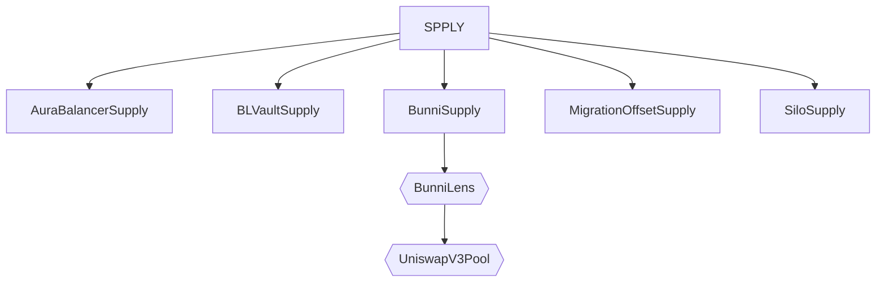
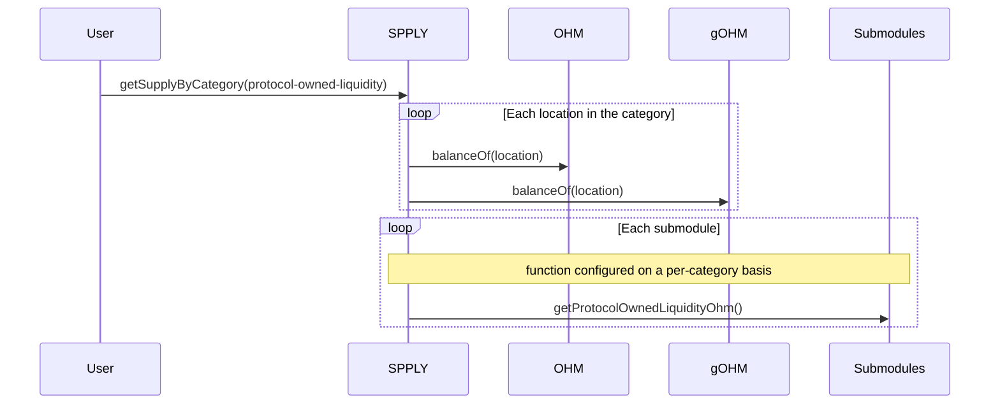

# OlympusDAO SPPLY and TRSRY v1.1 Audit

## Purpose

The purpose of this audit is to review the SPPLY system that provides data and metrics on the supply of the OHM token and the upgraded TRSRY module that provides data on asset balances. This is part of a larger on-chain accounting system that will provide data to an automated Range-Bound Stability (RBS) 2.0.

These contracts will be installed in the Olympus V3 "Bophades" system, based on the [Default Framework](https://palm-cause-2bd.notion.site/Default-A-Design-Pattern-for-Better-Protocol-Development-7f8ace6d263c4303b108dc5f8c3055b1).

## Scope

### In-Scope Contracts

The contracts in-scope for this audit are:

-   [libraries/](../../src/libraries/)
    -   [Deviation.sol](../../src/libraries/Deviation.sol)
    -   [UniswapV3/](../../src/libraries/UniswapV3/)
        -   [BunniHelper.sol](../../src/libraries/UniswapV3/BunniHelper.sol)
        -   [Oracle.sol](../../src/libraries/UniswapV3/Oracle.sol)
-   [modules/](../../src/modules)
    -   [SPPLY/](../../src/modules/SPPLY)
        -   [submodules/](../../src/modules/SPPLY/submodules)
            -   [AuraBalancerSupply.sol](../../src/modules/SPPLY/submodules/AuraBalancerSupply.sol)
            -   [BLVaultSupply.sol](../../src/modules/SPPLY/submodules/BLVaultSupply.sol)
            -   [BunniSupply.sol](../../src/modules/SPPLY/submodules/BunniSupply.sol)
            -   [CustomSupply.sol](../../src/modules/SPPLY/submodules/CustomSupply.sol)
            -   [IncurDebtSupply.sol](../../src/modules/SPPLY/submodules/IncurDebtSupply.sol)
            -   [MigrationOffsetSupply.sol](../../src/modules/SPPLY/submodules/MigrationOffsetSupply.sol)
            -   [SentimentArbSupply.sol](../../src/modules/SPPLY/submodules/SentimentArbSupply.sol)
            -   [SiloArbSupply.sol](../../src/modules/SPPLY/submodules/SiloArbSupply.sol)
            -   [SiloSupply.sol](../../src/modules/SPPLY/submodules/SiloSupply.sol)
        -   [OlympusSupply.sol](../../src/modules/SPPLY/OlympusSupply.sol)
        -   [SPPLY.v1.sol](../../src/modules/SPPLY/SPPLY.v1.sol)
    -   [TRSRY/](../../src/modules/TRSRY)
        -   [OlympusTreasury.sol](../../src/modules/TRSRY/OlympusTreasury.sol)
        -   [TRSRY.v1.sol](../../src/modules/TRSRY/TRSRY.v1.sol)

Tests for the in-scope contracts are contained in the following locations:

-   [test/](../../src/test)
    -   [mocks/](../../src/test/mocks)
        -   [AuraMocks.sol](../../src/test/mocks/AuraMocks.sol)
        -   [BalancerMocks.sol](../../src/test/mocks/BalancerMocks.sol)
        -   [MockBalancerPool.sol](../../src/test/mocks/MockBalancerPool.sol)
        -   [MockBalancerVault.sol](../../src/test/mocks/MockBalancerVault.sol)
        -   [MockSilo.sol](../../src/test/mocks/MockSilo.sol)
    -   [modules/](../../src/test/modules)
        -   [SPPLY/](../../src/test/modules/SPPLY)
            -   [submodules/](../../src/test/modules/SPPLY/submodules)
                -   [AuraBalancerSupply.t.sol](../../src/test/modules/SPPLY/submodules/AuraBalancerSupply.t.sol)
                -   [BLVaultSupply.t.sol](../../src/test/modules/SPPLY/submodules/BLVaultSupply.t.sol)
                -   [BunniSupply.t.sol](../../src/test/modules/SPPLY/submodules/BunniSupply.t.sol)
                -   [IncurDebtSupply.t.sol](../../src/test/modules/SPPLY/submodules/IncurDebtSupply.t.sol)
                -   [SentimentArbSupply.t.sol](../../src/test/modules/SPPLY/submodules/SentimentArbSupply.t.sol)
                -   [SiloArbSupply.t.sol](../../src/test/modules/SPPLY/submodules/SiloArbSupply.t.sol)
                -   [SiloSupply.t.sol](../../src/test/modules/SPPLY/submodules/SiloSupply.t.sol)
            -   [SPPLY.v1.t.sol](../../src/test/modules/SPPLY/SPPLY.v1.t.sol)
    -   [Submodules.t.sol](../../src/test/Submodules.t.sol)

Notes:

-   Additional context may be gained from analysing the `src/scripts/deploy/DeployV2.sol` file.

### External Contracts

Several external interfaces and libraries are used to interact with other protocols. These dependencies are stored locally in the following folders:

-   `lib`
-   `src/external`
-   `src/libraries`
-   `src/interfaces`

See the [solidity-metrics.html](./solidity-metrics.html) file for details on external contracts that are referenced.

### Previously Audited Contracts

The in-scope contracts depend on or are dependencies for these previously audited contracts:

-   [Kernel.sol](../../src/Kernel.sol)

## Previous Audits

Olympus V3 was audited multiple times prior to launch in November, 2022. The currently deployed Olympus V3 contracts can be found on [GitHub](https://github.com/OlympusDAO/olympus-v3).

You can review previous audits here:

-   Spearbit (07/2022)
    -   [Report](https://storage.googleapis.com/olympusdao-landing-page-reports/audits/2022-08%20Code4rena.pdf)
-   Code4rena Olympus V3 Audit (08/2022)
    -   [Repo](https://github.com/code-423n4/2022-08-olympus)
    -   [Findings](https://github.com/code-423n4/2022-08-olympus-findings)
-   Kebabsec Olympus V3 Remediation and Follow-up Audits (10/2022 - 11/2022)
    -   [Remediation Audit Phase 1 Report](https://hackmd.io/tJdujc0gSICv06p_9GgeFQ)
    -   [Remediation Audit Phase 2 Report](https://hackmd.io/@12og4u7y8i/rk5PeIiEs)
    -   [Follow-on Audit Report](https://hackmd.io/@12og4u7y8i/Sk56otcBs)
-   Cross-Chain Bridge by OtterSec (04/2023)
    -   [Report](https://storage.googleapis.com/olympusdao-landing-page-reports/audits/Olympus-CrossChain-Audit.pdf)
-   PRICEv2 by HickupHH3 (06/2023)
    -   [Report](https://storage.googleapis.com/olympusdao-landing-page-reports/audits/2023_7_OlympusDAO-final.pdf)
    -   [Pre-Audit Commit](https://github.com/OlympusDAO/bophades/tree/17fe660525b2f0d706ca318b53111fbf103949ba)
    -   [Post-Remediations Commit](https://github.com/OlympusDAO/bophades/tree/9c10dc188210632b6ce46c7a836484e8e063151f)
-   RBS 1.3 & 1.4 by HickupHH3 (11/2023)
    -   [Report](https://storage.googleapis.com/olympusdao-landing-page-reports/audits/OlympusDAO%20Nov%202023.pdf)
    -   [Pre-Audit Commit](https://github.com/OlympusDAO/bophades/tree/7a0902cf3ced19d41aafa83e96cf235fb3f15921)
    -   [Post-Remediations Commit](https://github.com/OlympusDAO/bophades/tree/e61d954cc620254effb014f2d2733e59d828b5b1)

## Architecture

### Overview

The diagram illustrates the architecture of the components:



Legend:

-   Circle: policy
-   Cylinder: module
-   Rectangle: submodule
-   Hexagon: external contract

The diagram demonstrates the interactions of the different components when calling `getSupplyByCategory()`:



The components are outlined in the following sub-sections.

### Submodules

The requirements of the system necessitated expanding our current protocol design paradigms to include a new component: Submodules.

Submodules can be thought of as upgradable components of a Module. They are installed and managed locally by a Module. The rest of the system has no context for them and must interact with them through a Module. The reason to have upgradeable components of a Module is to avoid the need to migrate data from one version of a Module to another. This is somewhat analogous to a Diamond pattern, but is more "Default-native". The Submodules implemented in this system do not need to be called directly by external contracts since their return data is processed before being returned, but a version that incorporates delegatecall logic could expose the Submodule functionality directly.

Submodules borrow the "keycode" identification system used by the Kernel for modules to allow simpler references and upgrading of submodules within the parent Module.

Submodules can have permissioned or unpermissioned functions, but the only permission available is `onlyParent` which requires a function to be called by the parent Module.

The Submodules implemented for the SPPLY module are all stateful adapters to external sources, but Submodules can be stateless as well.

### TRSRY v1.1 (Module)

Features:

-   Add/remove assets to be managed and tracked
-   Add/remove assets to/from categories
-   Add/remove locations to track asset balances in
-   Category groups containing mutually-exclusive categories (e.g. liquid and illiquid)

### SPPLY (Module)

A new module to track OHM supply across different locations and categories

Features:

-   Add/remove categories of supply
-   Add/remove locations to categories
-   Calculate OHM supply per category
-   Calculate reserves per category
-   Calculate supply metrics (e.g. backed OHM supply)
-   Submodules to enable different sources to be used to determine supply (e.g. protocol-owned liquidity in a Uniswap V3 position)

## Frequently-Asked Questions

### Q: Is the code/contract expected to comply with any EIPs? Are there specific assumptions around adhering to those EIPs that Watsons should be aware of?

A: None

### Q: Please list any known issues/acceptable risks that should not result in a valid finding

A: The following are known issues/limitations:

1. The SPPLY submodules that use an on-chain method to access the reserves of a liquidity pool or positions are susceptible to sandwich attacks and multi-block manipulation
    - Where possible, downstream consumers of the data need to conduct sanity-checks.
    - Where possible, SPPLY submodules will check for re-entrancy in the source (e.g. liquidity pool). This has been implemented in the AuraBalancerSupply submodule.

## Getting Started

This repository uses Foundry as its development and testing environment. You must first [install Foundry](https://getfoundry.sh/) to build the contracts and run the test suite.

### Clone the repository into a local directory

```sh
git clone https://github.com/OlympusDAO/bophades
```

### Install dependencies

```sh
cd bophades
git checkout rbs-v2
pnpm run install # install npm modules for linting and doc generation
forge build # installs git submodule dependencies when contracts are compiled
```

### Build

Compile the contracts with `forge build`.

### Tests

Run the full test suite with `pnpm run test`. However, there are some Fork tests for other parts of the protocol that can run into RPC rate limit issues. It is recommended to run the test suite without the fork tests for this audit. Specifically, you can run `pnpm run test:unit`.

Fuzz tests have been written to cover a range of inputs. Default number of runs is 256, more were used when troubleshooting edge cases.

### Linting

Pre-configured `solhint` and `prettier-plugin-solidity`. Can be run by

```sh
pnpm run lint
```

### Code Metrics

Code metrics have been calculated using the following command:

```shell
pnpm run metrics src/modules/SPPLY/**/*.sol src/modules/TRSRY/**/*.sol src/libraries/Deviation.sol src/libraries/UniswapV3/BunniHelper.sol src/libraries/UniswapV3/Oracle.sol
```
