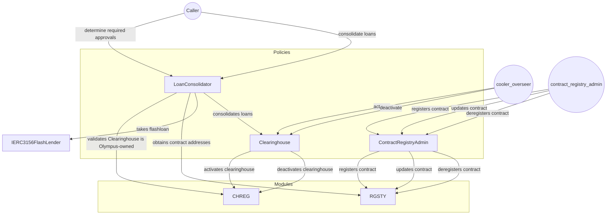

# Olympus Loan Consolidator Audit

## Purpose

The purpose of this audit is to review the Cooler Loans LoanConsolidator contract and associated contracts.

These contracts will be installed in the Olympus V3 "Bophades" system, based on the [Default Framework](https://palm-cause-2bd.notion.site/Default-A-Design-Pattern-for-Better-Protocol-Development-7f8ace6d263c4303b108dc5f8c3055b1).

## Scope

### In-Scope Contracts

The contracts in scope for this audit are:

- [src/](../../src)
    - [interfaces/](../../src/interfaces)
        - [maker-dao/](../../src/interfaces/maker-dao)
            - [IERC3156FlashBorrower.sol](../../src/interfaces/maker-dao/IERC3156FlashBorrower.sol)
            - [IERC3156FlashLender.sol](../../src/interfaces/maker-dao/IERC3156FlashLender.sol)
    - [modules/](../../src/modules)
        - [CHREG/](../../src/modules/CHREG)
            - [CHREG.v1.sol](../../src/modules/CHREG/CHREG.v1.sol)
            - [OlympusClearinghouseRegistry.sol](../../src/modules/CHREG/OlympusClearinghouseRegistry.sol)
        - [RGSTY/](../../src/modules/RGSTY)
            - [RGSTY.v1.sol](../../src/modules/RGSTY/RGSTY.v1.sol)
            - [OlympusContractRegistry.sol](../../src/modules/RGSTY/OlympusContractRegistry.sol)
    - [policies/](../../src/policies)
        - [ContractRegistryAdmin.sol](../../src/policies/ContractRegistryAdmin.sol)
        - [LoanConsolidator.sol](../../src/policies/LoanConsolidator.sol)

The following pull requests can be referred to for the in-scope contracts:

- [Clearinghouse Registry](https://github.com/OlympusDAO/bophades/pull/191)
- [LoanConsolidator v1](https://github.com/OlympusDAO/bophades/pull/397)
- [LoanConsolidator v2](https://github.com/OlympusDAO/bophades/pull/412)

See the [solidity-metrics.html](./solidity-metrics.html) report for a summary of the code metrics for these contracts.

### Previous Audits

You can review previous audits here:

- Spearbit (07/2022)
    - [Report](https://storage.googleapis.com/olympusdao-landing-page-reports/audits/2022-08%20Code4rena.pdf)
- Code4rena Olympus V3 Audit (08/2022)
    - [Repo](https://github.com/code-423n4/2022-08-olympus)
    - [Findings](https://github.com/code-423n4/2022-08-olympus-findings)
- Kebabsec Olympus V3 Remediation and Follow-up Audits (10/2022 - 11/2022)
    - [Remediation Audit Phase 1 Report](https://hackmd.io/tJdujc0gSICv06p_9GgeFQ)
    - [Remediation Audit Phase 2 Report](https://hackmd.io/@12og4u7y8i/rk5PeIiEs)
    - [Follow-on Audit Report](https://hackmd.io/@12og4u7y8i/Sk56otcBs)
- Cross-Chain Bridge by OtterSec (04/2023)🙏🏼
    - [Report](https://storage.googleapis.com/olympusdao-landing-page-reports/audits/Olympus-CrossChain-Audit.pdf)
- PRICEv2 by HickupHH3 (06/2023)
    - [Report](https://storage.googleapis.com/olympusdao-landing-page-reports/audits/2023_7_OlympusDAO-final.pdf)
    - [Pre-Audit Commit](https://github.com/OlympusDAO/bophades/tree/17fe660525b2f0d706ca318b53111fbf103949ba)
    - [Post-Remediations Commit](https://github.com/OlympusDAO/bophades/tree/9c10dc188210632b6ce46c7a836484e8e063151f)
- Cooler Loans by Sherlock (09/2023)
    - [Report](https://docs.olympusdao.finance/assets/files/Cooler_Update_Audit_Report-f3f983a8ee8632637790bcc136275aa0.pdf)
- RBS 1.3 & 1.4 by HickupHH3 (11/2023)
    - [Report](https://storage.googleapis.com/olympusdao-landing-page-reports/audits/OlympusDAO%20Nov%202023.pdf)
    - [Pre-Audit Commit](https://github.com/OlympusDAO/bophades/tree/7a0902cf3ced19d41aafa83e96cf235fb3f15921)
    - [Post-Remediations Commit](https://github.com/OlympusDAO/bophades/tree/e61d954cc620254effb014f2d2733e59d828b5b1)

## Architecture

### Overview

The diagram illustrates the architecture of the components:

### CHREG (Module)

Features:

- Activate and deactivate Clearinghouses
- Access a list of active Clearinghouses
- Access a list of all Clearinghouses (regardless of state)

The Clearinghouse Registry is a module that requires permissioned access in order to activate/deactivate a Clearinghouse.

In the current implementation, when a Clearinghouse policy is activated (via `activate()`) by a permissioned user (`cooler_overseer` role), the policy marks the Clearinghouse as active in the Clearinghouse Registry.

### RGSTY (Module)

Features:

- Tracks contract addresses against an alpha-numeric name
- Access a list of registered names
- Access the current address for a given name
- Update the address for a given name
- Deregister a name
- Contract addresses can be registered as mutable or immutable

The Contract Registry is a module that requires permissioned access in order to add/update/remove an address for a given name.

### Contract Registry Admin (Policy)

Features:

- Register a name for a contract address
- Update the address for a given name
- Deregister a name

The Contract Registry Admin is a policy that enables modification of the RGSTY module. It is gated to the `contract_registry_admin` role.

### Loan Consolidator (Policy)

Features:

- Enables the owner of Cooler Loans to consolidate multiple loans (within the same Cooler) into a single loan, using an ERC3156 flash loan provider.
- Enables the owner of Cooler Loans to migrate loans between Clearinghouses and debt tokens (DAI and USDS).
- Has a helper function to advise the owner on the approvals of gOHM/DAI/sDAI required in order to complete the consolidation.
- The policy can optionally take a protocol fee (sent to the TRSRY) that is set to 0 by default.
- Utilises the CHREG module to obtain the list of Clearinghouse policies.
- Utilises the RGSTY module to obtain the addresses of contracts.
- The loan consolidation functionality can be activated/deactivated by the `loan_consolidator_admin` role.
