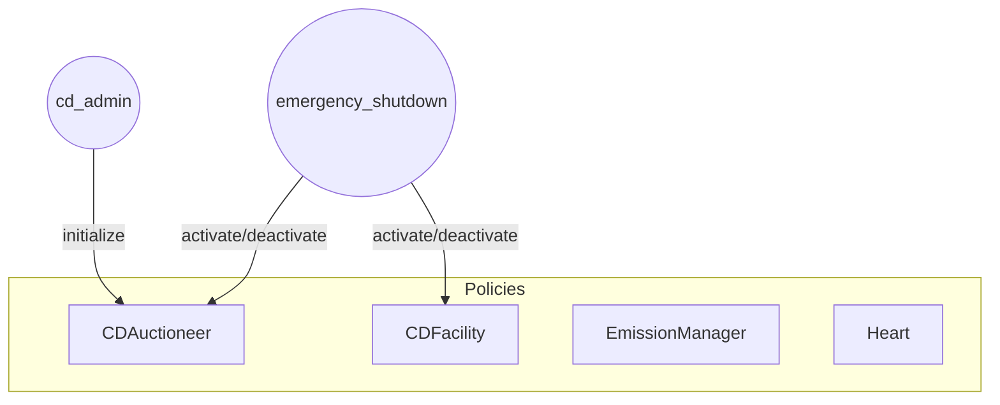
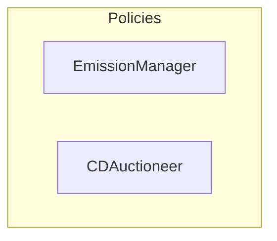

# Olympus Convertible Deposits Audit

## Purpose

The purpose of this audit is to review the Convertible Deposits (CD) contracts.

These contracts will be installed in the Olympus V3 "Bophades" system, based on the [Default Framework](https://palm-cause-2bd.notion.site/Default-A-Design-Pattern-for-Better-Protocol-Development-7f8ace6d263c4303b108dc5f8c3055b1).

## Design

The CD contracts provide a mechanism for the protocol to operate an auction that is infinite duration and infinite capacity. Bidders are required to deposit the configured reserve token into the auctioneer (`CDAuctioneer`), and in return they receive a convertible deposit token (`CDEPO`) that can be converted into the configured bid token (OHM) or redeemed for the deposited reserve token.

### Auction Design

The auction is designed to be infinite duration and infinite capacity. The auction is made up of "ticks", where each tick is a price and capacity (number of OHM that can be purchased).

The auction has a number of parameters that affect its behaviour:

- Minimum Price: the minimum price of reserve token per OHM
- Tick Size: the size/capacity of each tick, in terms of OHM
- Tick Step: the percentage increase per tick
- Target: the target amount of OHM sold per day

The `EmissionManager` is responsible for periodically tuning these auction parameters according to the protocol's emission schedule.

There are a few additional behaviours:

- As tick capacity is depleted, the auctioneer will increase the price of the subsequent tick.
- With each multiple of the day target being reached, the auctioneer will progressively halve the size of each tick.
- The active tick price will decay over time, in the absence of any bids.

### Convertible Deposit Design

A successful bidder will receive a convertible deposit that can be converted into OHM or redeemed for the deposited reserve token. The deposit is composed of:

- A quantity of `CDEPO` tokens, which is a fungible ERC20 token across all deposits and terms.
- A `CDPOS` ERC721 token, which represents the non-fungible position of the bidder. This includes terms such as the expiry date, conversion price and size of the convertible deposit.

Using the `CDFacility` policy, convertible deposit holders are able to:

- Convert their deposit into OHM at any time, at the conversion price of the deposit terms.
- Reclaim the deposited reserve tokens after expiry, with a discount.

## Scope

### In-Scope Contracts

- [src/](../../src)
    - [libraries/](../../src/libraries)
        - [DecimalString.sol](../../src/libraries/DecimalString.sol)
        - [Timestamp.sol](../../src/libraries/Timestamp.sol)
        - [Uint2Str.sol](../../src/libraries/Uint2Str.sol)
    - [modules/](../../src/modules)
        - [CDEPO/](../../src/modules/CDEPO)
            - [CDEPO.v1.sol](../../src/modules/CDEPO/CDEPO.v1.sol)
            - [OlympusConvertibleDepository.sol](../../src/modules/CDEPO/OlympusConvertibleDepository.sol)
        - [CDPOS/](../../src/modules/CDPOS)
            - [CDPOS.v1.sol](../../src/modules/CDPOS/CDPOS.v1.sol)
            - [OlympusConvertibleDepositPositions.sol](../../src/modules/CDPOS/OlympusConvertibleDepositPositions.sol)
    - [policies/](../../src/policies)
        - [interfaces/](../../src/policies/interfaces)
            - [IConvertibleDepositAuctioneer.sol](../../src/policies/interfaces/IConvertibleDepositAuctioneer.sol)
            - [IConvertibleDepositFacility.sol](../../src/policies/interfaces/IConvertibleDepositFacility.sol)
            - [IEmissionManager.sol](../../src/policies/interfaces/IEmissionManager.sol)
        - [CDAuctioneer.sol](../../src/policies/CDAuctioneer.sol)
        - [CDFacility.sol](../../src/policies/CDFacility.sol)
        - [EmissionManager.sol](../../src/policies/EmissionManager.sol)

The following pull requests can be referred to for the in-scope contracts:

- [Convertible Deposits](https://github.com/OlympusDAO/olympus-v3/pull/29)

See the [solidity-metrics.html](./solidity-metrics.html) report for a summary of the code metrics for these contracts.

### Previous Audits

You can review previous audits here:

- Spearbit (07/2022)
    - [Report](https://storage.googleapis.com/olympusdao-landing-page-reports/audits/2022-08%20Code4rena.pdf)
- Code4rena Olympus V3 Audit (08/2022)
    - [Repo](https://github.com/code-423n4/2022-08-olympus)
    - [Findings](https://github.com/code-423n4/2022-08-olympus-findings)
- Kebabsec Olympus V3 Remediation and Follow-up Audits (10/2022 - 11/2022)
    - [Remediation Audit Phase 1 Report](https://hackmd.io/tJdujc0gSICv06p_9GgeFQ)
    - [Remediation Audit Phase 2 Report](https://hackmd.io/@12og4u7y8i/rk5PeIiEs)
    - [Follow-on Audit Report](https://hackmd.io/@12og4u7y8i/Sk56otcBs)
- Cross-Chain Bridge by OtterSec (04/2023)🙏🏼
    - [Report](https://storage.googleapis.com/olympusdao-landing-page-reports/audits/Olympus-CrossChain-Audit.pdf)
- PRICEv2 by HickupHH3 (06/2023)
    - [Report](https://storage.googleapis.com/olympusdao-landing-page-reports/audits/2023_7_OlympusDAO-final.pdf)
    - [Pre-Audit Commit](https://github.com/OlympusDAO/bophades/tree/17fe660525b2f0d706ca318b53111fbf103949ba)
    - [Post-Remediations Commit](https://github.com/OlympusDAO/bophades/tree/9c10dc188210632b6ce46c7a836484e8e063151f)
- Cooler Loans by Sherlock (09/2023)
    - [Report](https://docs.olympusdao.finance/assets/files/Cooler_Update_Audit_Report-f3f983a8ee8632637790bcc136275aa0.pdf)
- RBS 1.3 & 1.4 by HickupHH3 (11/2023)
    - [Report](https://storage.googleapis.com/olympusdao-landing-page-reports/audits/OlympusDAO%20Nov%202023.pdf)
    - [Pre-Audit Commit](https://github.com/OlympusDAO/bophades/tree/7a0902cf3ced19d41aafa83e96cf235fb3f15921)
    - [Post-Remediations Commit](https://github.com/OlympusDAO/bophades/tree/e61d954cc620254effb014f2d2733e59d828b5b1)
- Emission Manager by yAudit (11/2024)
    - [Report](https://storage.googleapis.com/olympusdao-landing-page-reports/audits/2024_11_EmissionManager_ReserveMigrator.pdf)
    - [Pre-Audit Commit](https://github.com/OlympusDAO/bophades/tree/e367e7977ea58a2fd365296d9c9f620c7cd0512d)
    - [Post-Remediations Commit](https://github.com/OlympusDAO/bophades/tree/3ace544f24adfd3d218ae625b9d1449321f9e184)
- LoanConsolidator by HickupHH3 (11/2024)
    - [Report](https://storage.googleapis.com/olympusdao-landing-page-reports/audits/2024_10_LoanConsolidator_Audit.pdf)
    - [Pre-Audit Commit](https://github.com/OlympusDAO/bophades/tree/95479d5d4a9bb941c60c7a8347709d9fc895b819)
    - [Post-Remediations Commit](https://github.com/OlympusDAO/bophades/tree/d2d5b63dee16a259400628df4cf6ce2d3df02558)

## Architecture

### Overview

The diagrams below illustrate the architecture of the components.

#### Activation and Deactivation

#### Auction Tuning

#### Deposit Creation

#### Deposit Conversion

#### Deposit Reclaim

### CDEPO (Module)

### CDPOS (Module)

### CDFacility (Policy)

### CDAuctioneer (Policy)

### EmissionManager (Policy)
