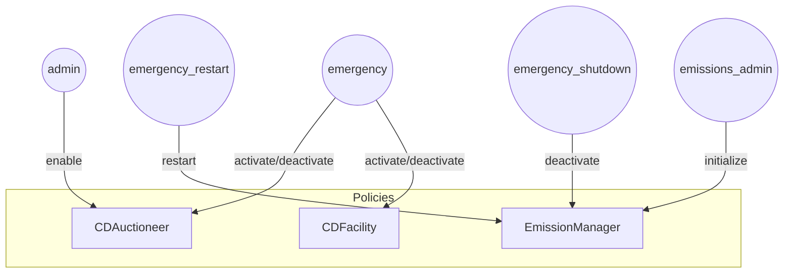
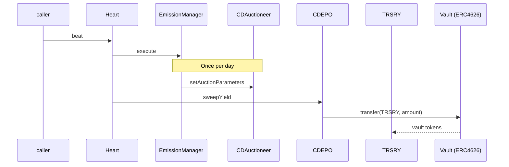
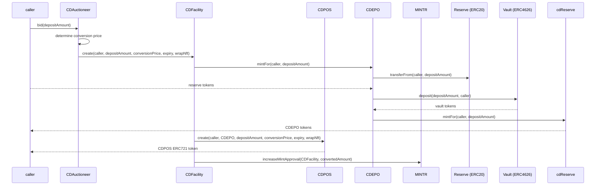
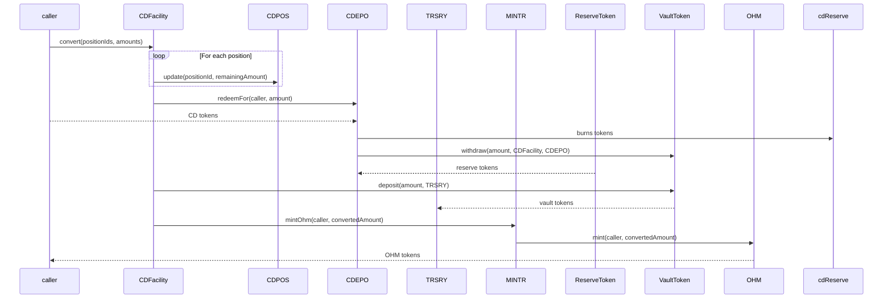
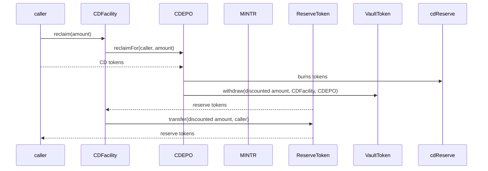
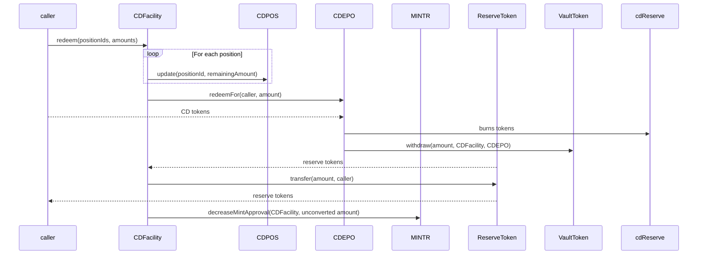

# Olympus Convertible Deposits Audit

## Purpose

The purpose of this audit is to review the Convertible Deposits (CD) contracts.

These contracts will be installed in the Olympus V3 "Bophades" system, based on the [Default Framework](https://palm-cause-2bd.notion.site/Default-A-Design-Pattern-for-Better-Protocol-Development-7f8ace6d263c4303b108dc5f8c3055b1).

## Design

The CD contracts provide a mechanism for the protocol to operate an auction that is infinite duration and infinite capacity. Bidders are required to deposit the configured reserve token (e.g. USDS) into the auctioneer (`CDAuctioneer`), and in return they receive a convertible deposit token (`cdUSDS`) that can be converted into the configured bid token (OHM) or redeemed for the deposited reserve token.

### Auction Design

The auction is designed to be infinite duration and infinite capacity. The auction is made up of "ticks", where each tick is a price and capacity (number of OHM that can be purchased).

The auction has a number of parameters that affect its behaviour:

- Minimum Price: the minimum price of reserve token per OHM
- Tick Size: the size/capacity of each tick, in terms of OHM
- Tick Step: the percentage increase per tick
- Target: the target amount of OHM sold per day

The `EmissionManager` is responsible for periodically tuning these auction parameters according to the protocol's emission schedule.

There are a few additional behaviours:

- As tick capacity is depleted, the auctioneer will increase the price of the subsequent tick.
- With each multiple of the day target being reached, the auctioneer will progressively halve the size of each tick.
- The active tick price will decay over time, in the absence of any bids.

### Convertible Deposit Design

A successful bidder will receive a convertible deposit that can be converted into OHM or redeemed for the deposited reserve token. The deposit is composed of:

- A quantity of CD tokens, which is a fungible ERC20 token across all deposits and terms.
- A `CDPOS` ERC721 token, which represents the non-fungible position of the bidder. This includes terms such as the expiry date, conversion price and size of the convertible deposit.

Using the `CDFacility` policy, convertible deposit holders are able to:

- Convert their deposit into OHM before expiry, at the conversion price of the deposit terms.
- Redeem the deposited reserve tokens after expiry.
- Reclaim the deposited reserve tokens before expiry, with a discount.

## Scope

### In-Scope Contracts

- [src/](../../src)
    - [libraries/](../../src/libraries)
        - [DecimalString.sol](../../src/libraries/DecimalString.sol)
        - [Timestamp.sol](../../src/libraries/Timestamp.sol)
        - [Uint2Str.sol](../../src/libraries/Uint2Str.sol)
    - [modules/](../../src/modules)
        - [CDEPO/](../../src/modules/CDEPO)
            - [CDEPO.v1.sol](../../src/modules/CDEPO/CDEPO.v1.sol)
            - [OlympusConvertibleDepository.sol](../../src/modules/CDEPO/OlympusConvertibleDepository.sol)
        - [CDPOS/](../../src/modules/CDPOS)
            - [CDPOS.v1.sol](../../src/modules/CDPOS/CDPOS.v1.sol)
            - [OlympusConvertibleDepositPositions.sol](../../src/modules/CDPOS/OlympusConvertibleDepositPositions.sol)
    - [policies/](../../src/policies)
        - [interfaces/](../../src/policies/interfaces)
            - [IConvertibleDepositAuctioneer.sol](../../src/policies/interfaces/IConvertibleDepositAuctioneer.sol)
            - [IConvertibleDepositFacility.sol](../../src/policies/interfaces/IConvertibleDepositFacility.sol)
            - [IEmissionManager.sol](../../src/policies/interfaces/IEmissionManager.sol)
        - [CDAuctioneer.sol](../../src/policies/CDAuctioneer.sol)
        - [CDFacility.sol](../../src/policies/CDFacility.sol)
        - [EmissionManager.sol](../../src/policies/EmissionManager.sol)
        - [Heart.sol](../../src/policies/Heart.sol)

The following pull requests can be referred to for the in-scope contracts:

- [Convertible Deposits](https://github.com/OlympusDAO/olympus-v3/pull/29)

See the [solidity-metrics.html](./solidity-metrics.html) report for a summary of the code metrics for these contracts.

### Previous Audits

You can review previous audits here:

- Spearbit (07/2022)
    - [Report](https://storage.googleapis.com/olympusdao-landing-page-reports/audits/2022-08%20Code4rena.pdf)
- Code4rena Olympus V3 Audit (08/2022)
    - [Repo](https://github.com/code-423n4/2022-08-olympus)
    - [Findings](https://github.com/code-423n4/2022-08-olympus-findings)
- Kebabsec Olympus V3 Remediation and Follow-up Audits (10/2022 - 11/2022)
    - [Remediation Audit Phase 1 Report](https://hackmd.io/tJdujc0gSICv06p_9GgeFQ)
    - [Remediation Audit Phase 2 Report](https://hackmd.io/@12og4u7y8i/rk5PeIiEs)
    - [Follow-on Audit Report](https://hackmd.io/@12og4u7y8i/Sk56otcBs)
- Cross-Chain Bridge by OtterSec (04/2023)🙏🏼
    - [Report](https://storage.googleapis.com/olympusdao-landing-page-reports/audits/Olympus-CrossChain-Audit.pdf)
- PRICEv2 by HickupHH3 (06/2023)
    - [Report](https://storage.googleapis.com/olympusdao-landing-page-reports/audits/2023_7_OlympusDAO-final.pdf)
    - [Pre-Audit Commit](https://github.com/OlympusDAO/bophades/tree/17fe660525b2f0d706ca318b53111fbf103949ba)
    - [Post-Remediations Commit](https://github.com/OlympusDAO/bophades/tree/9c10dc188210632b6ce46c7a836484e8e063151f)
- Cooler Loans by Sherlock (09/2023)
    - [Report](https://docs.olympusdao.finance/assets/files/Cooler_Update_Audit_Report-f3f983a8ee8632637790bcc136275aa0.pdf)
- RBS 1.3 & 1.4 by HickupHH3 (11/2023)
    - [Report](https://storage.googleapis.com/olympusdao-landing-page-reports/audits/OlympusDAO%20Nov%202023.pdf)
    - [Pre-Audit Commit](https://github.com/OlympusDAO/bophades/tree/7a0902cf3ced19d41aafa83e96cf235fb3f15921)
    - [Post-Remediations Commit](https://github.com/OlympusDAO/bophades/tree/e61d954cc620254effb014f2d2733e59d828b5b1)
- Emission Manager by yAudit (11/2024)
    - [Report](https://storage.googleapis.com/olympusdao-landing-page-reports/audits/2024_11_EmissionManager_ReserveMigrator.pdf)
    - [Pre-Audit Commit](https://github.com/OlympusDAO/bophades/tree/e367e7977ea58a2fd365296d9c9f620c7cd0512d)
    - [Post-Remediations Commit](https://github.com/OlympusDAO/bophades/tree/3ace544f24adfd3d218ae625b9d1449321f9e184)
- LoanConsolidator by HickupHH3 (11/2024)
    - [Report](https://storage.googleapis.com/olympusdao-landing-page-reports/audits/2024_10_LoanConsolidator_Audit.pdf)
    - [Pre-Audit Commit](https://github.com/OlympusDAO/bophades/tree/95479d5d4a9bb941c60c7a8347709d9fc895b819)
    - [Post-Remediations Commit](https://github.com/OlympusDAO/bophades/tree/d2d5b63dee16a259400628df4cf6ce2d3df02558)

## Architecture

### Overview

The diagrams below illustrate the architecture of the components.

#### Activation and Deactivation

Callers with the appropriate permissions can activate and deactivate the functionality of the CDAuctioneer and CDFacility contracts.

#### Auction Tuning

As part of the regular heartbeat, the EmissionManager contract will calculate the desired emission rate and set the auction parameters on CDAuctioneer accordingly.

During the same heartbeat, the CDEPO module will be called to sweep any yield into the TRSRY module.

#### Deposit Creation

A bidder can call `bid()` on the CDAuctioneer to create a deposit. This will result in the caller receiving the CD tokens and a CDPOS position.

#### Deposit Conversion

Prior to the expiry of the convertible deposit, a deposit owner can convert their deposit into OHM at the conversion price of the deposit terms.

#### Reclaim Deposit

The holder of convertible deposit tokens can reclaim their underlying deposit at any time. A discount (`reclaimRate()` on the CDFacility contract) is applied on the deposit that is returned. The forfeited asset quantity will be swept into the TRSRY module during the next heartbeat.

#### Redeem Deposit

After the convertible deposit conversion expiry and before the redemption expiry, a deposit owner can redeem their underlying deposit. The full underlying deposit is returned.

### EmissionManager (Policy)

This release contains an updated EmissionManager policy with the following changes:

- In every third epoch, it:
    - Tunes the auction run by CDAuctioneer
    - Launches an auction for the quantity of OHM unsold through auction over the configured tracking period

### CDAuctioneer (Policy)

CDAuctioneer is a policy that runs the aforementioned infinite duration and infinite capacity auction of deposits in exchange for future conversion to OHM.

There are two main functions in this policy:

- `setAuctionParameters()` is gated to a role held by the EmissionManager, which enables it to periodically tune the auction parameters
- `bid()` is ungated and enables the caller to bid in the auction. The function determines the amount of OHM that is convertible for the given deposit amount, and uses CDFacility to issue the CD tokens and position.

### CDFacility (Policy)

CDFacility is a policy that is responsible for issuing CD tokens and handling subsequent interactions with CD token holders.

The CDAuctioneer is able to call the following function:

- `create()`: results in the deposit of the configured reserve token (USDS), issuance of an equivalent amount of CD tokens (cdUSDS) and creation of a convertible deposit position.

CD token holders can perform the following actions:

- `convert()`: convert their deposit position into OHM before conversion expiry
- `reclaim()`: reclaim a discounted quantity of the underlying asset, USDS, at any time. This does not require a CDPOS position id.
- `redeem()`: redeem their deposit position for the underlying asset, USDS, after conversion expiry and before redemption expiry

### CDEPO (Module)

CDEPO is a Module that owns and manages the CD tokens that have been created.

Each CD token is an ERC20 contract managed by the CDEPO module, and the token represents the deposit of the underlying asset in a 1:1 ratio. The token is used with convertible deposits facilitated by the CDFacility, and so is typically shortened to "CD token" or "cd" + underlying token name, e.g. "cdUSDS".

Unpermissioned callers are able to perform the following actions:

- Mint cd tokens in exchange for the underlying asset
- Reclaim the underlying asset in exchange for the cd tokens (after applying a discount)

Bophades policies with the correct permissions are able to perform the additional following actions:

- Redeem the underlying asset in exchange for the CD tokens (without applying a discount)
- Sweep any forfeited yield and assets into the caller's address

### CDPOS (Module)

CDPOS is an ERC721 token and a Module representing the terms of a convertible deposit position.

When a new position is created, it does not, by default, mint an ERC721 token to the owner. The state is instead stored within the contract.

Unpermissioned callers are able to perform the following actions:

- Wrap the caller's existing position into an ERC721
- Unwrap the caller's existing position from an ERC721, which burns the token

Permissions policies are able to perform the following actions:

- Create new positions
- Update the remaining deposit for an existing position
