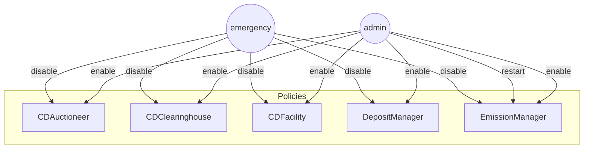
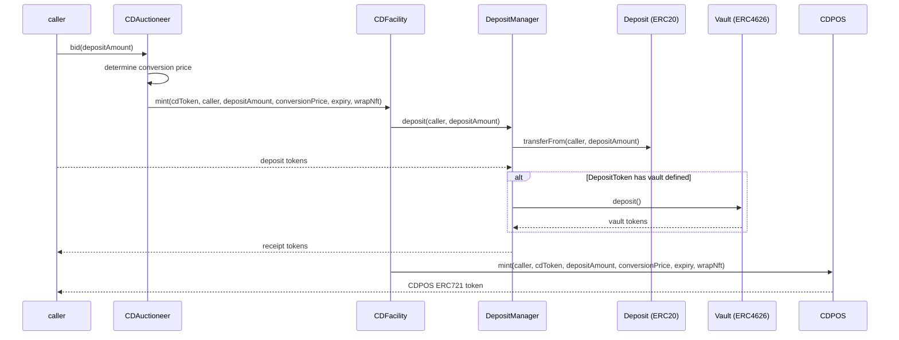
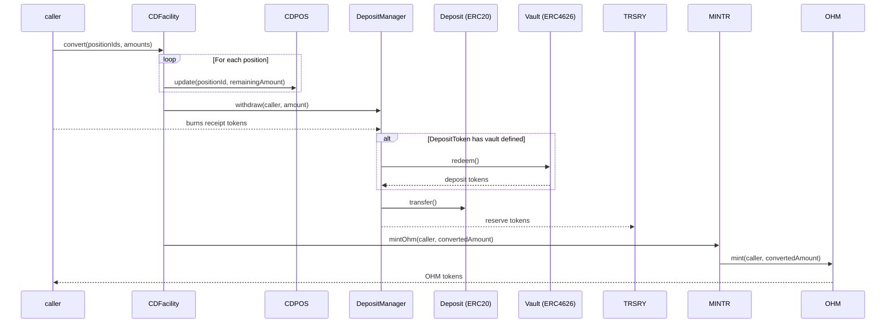
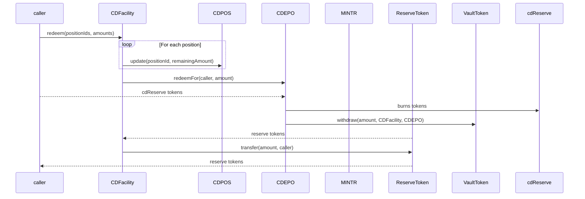

# Olympus Convertible Deposits Audit

## Purpose

The purpose of this audit is to review the Convertible Deposits (CD) contracts.

These contracts will be installed in the Olympus V3 "Bophades" system, based on the [Default Framework](https://palm-cause-2bd.notion.site/Default-A-Design-Pattern-for-Better-Protocol-Development-7f8ace6d263c4303b108dc5f8c3055b1).

## Design

The Convertible Deposits system in the Olympus protocol seeks to incentivise deposits of reserve tokens, upon which the protocol earns yield, and provide opportunities for speculation around yield and the price of OHM.

For a given reserve token, e.g. `USDS`, and deposit period, e.g. 3 months, there exists a convertible deposit (CD) token, e.g. `cdUSDS-3m`.

The system offers two mutually-exclusive mechanisms to mint and use CD tokens:

- Deposit with the option to convert to OHM before an expiry date
- Deposit with the ability to earn yield from the ERC4626 vault strategy

| Mechanism         | Conversion to OHM | Yield    |
|-------------------|-------------------|----------|
| OHM Call Option   | Yes               | No       |
| Yield Deposit     | No                | Yes      |

### OHM Call Option

This mechanism longs OHM, with the expectation that the issued conversion price will be lower than the market price at the time of conversion.

The conversion price is determined through an infinite duration and infinite capacity auction.

#### Auction Design

Bidders are required to deposit the configured token (e.g. USDS) into the auctioneer (`CDAuctioneer`), and in return they receive a convertible deposit token (`cdUSDS-3m`) that can be converted into the configured bid token (OHM) or redeemed for the deposited reserve token.

The auction is made up of "ticks", where each tick is a price and capacity (number of OHM that can be purchased).

The auction has a number of parameters that affect its behaviour:

- Minimum Price: the minimum price of reserve token per OHM
- Tick Size: the size/capacity of each tick, in terms of OHM
- Tick Step: the percentage increase per tick
- Target: the target amount of OHM sold per day

The `EmissionManager` is responsible for periodically tuning these auction parameters according to the protocol's emission schedule.

There are a few additional behaviours:

- As tick capacity is depleted, the auctioneer will increase the price of the subsequent tick by the configured tick step percentage.
- Auction capacity (up to the target) is added proportionally throughout each day period.
- In the absence of any bids, the active tick price will decay over time.
    - Remaining capacity is adjusted by the tick size and the price reduced by the configured tick step until within the tick size.
    - A floor of the configured minimum price also applies.
- With each multiple of the day target being reached, the auctioneer will progressively halve the size of each tick.
- At the end of each period, when `setAuctionParameters()` is called, the day's auction results will be stored on a rolling basis for the configured auction tracking period.
    - If there is an under-selling of OHM capacity at the end of the tracking period, EmissionManager will create a bond market for the remaining OHM capacity. This ensures that the emission target per period is reached.

### Yield-Bearing Deposits

The second approach enables depositors to claim the yield from the ERC4626 vault strategy, without a call option on OHM.

A user can deposit the configured token (e.g. USDS) into the facility (`YieldDepositFacility`), and in return receive:

- An equivalent amount of a convertible deposit token (`cdUSDS-3m`)
- A position record (optionally wrapped to a ERC721 token) with the deposit period
    - The holder of this record/token can claim the vault token (e.g. `cdUSDS`) yield at any time, and in any frequency.
    - A protocol fee will be deducted upon harveting yield.
    - The holder is free to do what they wish with the CD token - it does not affect claiming yield.

As the time that the yield is harvested is not fixed, flexibility is added to the system in the following manner:

- The conversion rate between each vault shares and its assets is periodically recorded (every 8 hours).
- When claiming yield, the difference between the current and previous vault conversion rate is used to determine how much yield to transfer to the position owner.
- If the position has not yet expired, the current conversion rate between the vault shares and assets will be used.
- If the position has expired in the past, by default the function call will revert. This is because the function has no mechanism to find the conversion rate nearest to the expiry time.
    - The caller can provide a timestamp hint as a parameter, which is then used to find the conversion rate. Provided there is a stored conversion rate, that will be used.

### Convertible Deposit Token Design

Across both mechanisms (call option and yield deposits), depositors will receive the following:

- A quantity of CD tokens, which is a fungible ERC20 token across all deposits of the same deposit token and deposit period.
    - e.g. `USDS` deposits with periods of 1, 3 and 6 months are distinct tokens: `cdUSDS-1m`, `cdUSDS-3m`, `cdUSDS-6m`
- The deposit position will be recorded and can be optionally wrapped to an ERC721 NFT. The position includes terms, such as:
    - deposit date
    - deposit period
    - conversion price (call option only)
    - size of the convertible deposit

Using the `CDFacility` policy, convertible deposit holders are able to:

- Convert their deposit into OHM before conversion expiry, at the conversion price of the deposit terms. (Call option only)
- Lock their CD tokens into the redemption queue
- Reclaim the deposited tokens at any time, with a discount.

### Convertible Deposit Token Manager

The CD token manager provides lifecycle management for CD tokens:

- Creating CD tokens
- Minting CD tokens
- Custodying of deposited funds
- Redemption of deposited funds
- Reclaiming of deposited funds (with a haircut)
- Burning CD tokens
- Sweeping protocol yield

#### Redemption

CD token holders can redeem the underlying token quantity in full by depositing (committing) their CD tokens to the token manager vault.

- The CD tokens must remain in the vault for the deposit period in order to be redeemed.
- A user can borrow against the CD tokens while they are in the vault.
- Withdrawing (uncommitting) CD tokens from the vault will reset the counter.
- After the CD tokens have been in the vault for the deposit period, they can be redeemed 1:1 for the underlying tokens.

#### Handling of Deposited Funds

Funds deposited are custodied in the CD token manager, and attributed to the dependent contract (e.g. CDFacility and YieldDepositFacility). This results in the following:

- The deposited funds are separated from the protocol treasury
- The deposited funds cannot be accessed by other components in the protocol
- Dependent contracts cannot access funds deposited by other contracts

## Scope

### In-Scope Contracts

- [src/](../../src)
    - [external/](../../src/external/)
        - [clones/](../../src/external/clones/)
            - [CloneERC20.sol](../../src/external/clones/CloneERC20.sol)
    - [libraries/](../../src/libraries)
        - [DecimalString.sol](../../src/libraries/DecimalString.sol)
        - [Timestamp.sol](../../src/libraries/Timestamp.sol)
        - [Uint2Str.sol](../../src/libraries/Uint2Str.sol)
    - [modules/](../../src/modules)
        - [CDEPO/](../../src/modules/CDEPO)
            - [CDEPO.v1.sol](../../src/modules/CDEPO/CDEPO.v1.sol)
            - [ConvertibleDepositTokenClone.sol](../../src/modules/CDEPO/ConvertibleDepositTokenClone.sol)
            - [IConvertibleDeposit.sol](../../src/modules/CDEPO/IConvertibleDeposit.sol)
            - [IConvertibleDepositERC20.sol](../../src/modules/CDEPO/IConvertibleDepositERC20.sol)
            - [IConvertibleDepository.sol](../../src/modules/CDEPO/IConvertibleDepository.sol)
            - [OlympusConvertibleDepository.sol](../../src/modules/CDEPO/OlympusConvertibleDepository.sol)
        - [CDPOS/](../../src/modules/CDPOS)
            - [CDPOS.v1.sol](../../src/modules/CDPOS/CDPOS.v1.sol)
            - [OlympusConvertibleDepositPositionManager.sol](../../src/modules/CDPOS/OlympusConvertibleDepositPositionManager.sol)
    - [policies/](../../src/policies)
        - [interfaces/](../../src/policies/interfaces)
            - [IConvertibleDepositAuctioneer.sol](../../src/policies/interfaces/IConvertibleDepositAuctioneer.sol)
            - [IConvertibleDepositFacility.sol](../../src/policies/interfaces/IConvertibleDepositFacility.sol)
            - [IEmissionManager.sol](../../src/policies/interfaces/IEmissionManager.sol)
            - [IGenericClearinghouse.sol](../../src/policies/interfaces/IGenericClearinghouse.sol)
        - [CDAuctioneer.sol](../../src/policies/CDAuctioneer.sol)
        - [CDClearinghouse.sol](../../src/policies/CDClearinghouse.sol)
        - [CDFacility.sol](../../src/policies/CDFacility.sol)
        - [EmissionManager.sol](../../src/policies/EmissionManager.sol)
        - [Heart.sol](../../src/policies/Heart.sol)
        - [YieldRepurchaseFacility.sol](../../src/policies/YieldRepurchaseFacility.sol)

The following pull requests can be referred to for the in-scope contracts:

- [Convertible Deposits](https://github.com/OlympusDAO/olympus-v3/pull/29)

See the [solidity-metrics.html](./solidity-metrics.html) report for a summary of the code metrics for these contracts.

### Previous Audits

You can review previous audits here:

- Spearbit (07/2022)
    - [Report](https://storage.googleapis.com/olympusdao-landing-page-reports/audits/2022-08%20Code4rena.pdf)
- Code4rena Olympus V3 Audit (08/2022)
    - [Repo](https://github.com/code-423n4/2022-08-olympus)
    - [Findings](https://github.com/code-423n4/2022-08-olympus-findings)
- Kebabsec Olympus V3 Remediation and Follow-up Audits (10/2022 - 11/2022)
    - [Remediation Audit Phase 1 Report](https://hackmd.io/tJdujc0gSICv06p_9GgeFQ)
    - [Remediation Audit Phase 2 Report](https://hackmd.io/@12og4u7y8i/rk5PeIiEs)
    - [Follow-on Audit Report](https://hackmd.io/@12og4u7y8i/Sk56otcBs)
- Cross-Chain Bridge by OtterSec (04/2023)🙏🏼
    - [Report](https://storage.googleapis.com/olympusdao-landing-page-reports/audits/Olympus-CrossChain-Audit.pdf)
- PRICEv2 by HickupHH3 (06/2023)
    - [Report](https://storage.googleapis.com/olympusdao-landing-page-reports/audits/2023_7_OlympusDAO-final.pdf)
    - [Pre-Audit Commit](https://github.com/OlympusDAO/bophades/tree/17fe660525b2f0d706ca318b53111fbf103949ba)
    - [Post-Remediations Commit](https://github.com/OlympusDAO/bophades/tree/9c10dc188210632b6ce46c7a836484e8e063151f)
- Cooler Loans by Sherlock (09/2023)
    - [Report](https://docs.olympusdao.finance/assets/files/Cooler_Update_Audit_Report-f3f983a8ee8632637790bcc136275aa0.pdf)
- RBS 1.3 & 1.4 by HickupHH3 (11/2023)
    - [Report](https://storage.googleapis.com/olympusdao-landing-page-reports/audits/OlympusDAO%20Nov%202023.pdf)
    - [Pre-Audit Commit](https://github.com/OlympusDAO/bophades/tree/7a0902cf3ced19d41aafa83e96cf235fb3f15921)
    - [Post-Remediations Commit](https://github.com/OlympusDAO/bophades/tree/e61d954cc620254effb014f2d2733e59d828b5b1)
- Emission Manager by yAudit (11/2024)
    - [Report](https://storage.googleapis.com/olympusdao-landing-page-reports/audits/2024_11_EmissionManager_ReserveMigrator.pdf)
    - [Pre-Audit Commit](https://github.com/OlympusDAO/bophades/tree/e367e7977ea58a2fd365296d9c9f620c7cd0512d)
    - [Post-Remediations Commit](https://github.com/OlympusDAO/bophades/tree/3ace544f24adfd3d218ae625b9d1449321f9e184)
- LoanConsolidator by HickupHH3 (11/2024)
    - [Report](https://storage.googleapis.com/olympusdao-landing-page-reports/audits/2024_10_LoanConsolidator_Audit.pdf)
    - [Pre-Audit Commit](https://github.com/OlympusDAO/bophades/tree/95479d5d4a9bb941c60c7a8347709d9fc895b819)
    - [Post-Remediations Commit](https://github.com/OlympusDAO/bophades/tree/d2d5b63dee16a259400628df4cf6ce2d3df02558)
- Cooler V2 by Electisec (03/2025)
    - [Report](https://storage.googleapis.com/olympusdao-landing-page-reports/audits/Olympus_CoolerV2-Electisec_report.pdf)
    - The PolicyEnabler and PolicyAdmin mix-ins are audited here

## Architecture

### Overview

The diagrams below illustrate the architecture of the components.

#### Activation and Deactivation

Callers with the appropriate permissions can activate and deactivate the functionality of the CDAuctioneer and CDFacility contracts.

#### Auction Tuning

As part of the regular heartbeat, the EmissionManager contract will calculate the desired emission rate and set the auction parameters on CDAuctioneer accordingly.

During the same heartbeat, the CDEPO module will be called to sweep any yield into the TRSRY module.

#### Deposit Creation

A bidder can call `bid()` on the CDAuctioneer to create a deposit. This will result in the caller receiving the CD tokens and a CDPOS position.

#### Deposit Conversion

Prior to the expiry of the convertible deposit, a deposit owner can convert their deposit into OHM at the conversion price of the deposit terms.

#### Reclaim Deposit

The holder of convertible deposit tokens can reclaim their underlying deposit at any time. A discount (`reclaimRate()` on the CDEPO contract) is applied on the deposit that is returned. The forfeited asset quantity will be swept into the TRSRY module during the next heartbeat.

#### Redeem Deposit

TODO commit, uncommit, redeem

After the convertible deposit conversion expiry and before the redemption expiry, a deposit owner can redeem their underlying deposit. The full underlying deposit is returned.

#### Borrowing Against Receipt Tokens

Depositors that have committed to redeeming their deposit can borrow against that deposit.

TODO liquidation

#### Repayment Against Receipt Token Loan

When a depositor has borrowed against their receipt tokens, they must repay the loan in order to complete the redemption.

TODO repayment

### EmissionManager (Policy)

This release contains an updated EmissionManager policy with the following changes:

- In every third epoch, it:
    - Tunes the auction run by CDAuctioneer
    - Launches an auction for the quantity of OHM unsold through auction over the configured tracking period
- Uses the PolicyEnabler mix-in for enabling/disabling the functionality and role validation

### CDAuctioneer (Policy)

CDAuctioneer is a policy that runs the aforementioned infinite duration and infinite capacity auction of deposits in exchange for future conversion to OHM.

There are two main state-changing functions in this policy:

- `setAuctionParameters()` is gated to a role held by the EmissionManager, which enables it to periodically tune the auction parameters
- `bid()` is ungated and enables the caller to bid in the auction. The function determines the amount of OHM that is convertible for the given deposit amount, and uses CDFacility to issue the CD tokens and position.

Other relevant functions are:

- `getCurrentTick()` gets the details of the current tick, accounting for capacity added since the last successful bid.
- `previewBid()` indicates the amount of OHM that a given deposit could be converted to, given current tick capacity and pricing.
    - This function implements the logic of moving up ticks and prices until the bid amount is fulfilled, and adjusting the tick size after reaching multiples of the period target.

Each CDAuctioneer is deployed with a single, immutable bid token. The CDEPO module must have a CD token created for that bid token at the time of activating the policy.

### CDClearinghouse (Policy)

The CDClearinghouse policy enables CD token holders to borrow the underlying asset against their CD token. The purpose is to enable users with CD positions to utilise the paired asset before conversion or redemption.

The policy is a modified version of the existing [Clearinghouse policy](../../src/policies/Clearinghouse.sol). It adheres to the interface (extracted into [IGenericClearinghouse](../../src/policies/interfaces/IGenericClearinghouse.sol)), but makes the following changes:

- Users borrow the associated ERC4626 vault token (e.g. sUSDS) against the quantity of CD tokens
- The loan-to-collateral ratio is in terms of the underlying asset (e.g. USDS), and converted to vault token (e.g. sUSDS) terms at the time of loan origination.
- Does not store funding in the CDClearinghouse contract (unlike the original Clearinghouse), and instead incurs debt from CDEPO.

### CDFacility (Policy)

CDFacility is a policy that is responsible for issuing CD tokens and handling subsequent interactions with CD token holders.

The CDAuctioneer is able to mint a call option:

- `mint()`: results in the deposit of the configured reserve token (USDS), issuance of an equivalent amount of CD tokens (cdUSDS) and creation of a convertible deposit position in the CDPOS module.

The public can mint a yield-bearing deposit:

- `mintYieldDeposit()`: results in the deposit of the configured deposit token (USDS), issuance of an equivalent amount of CD tokens (cdUSDS) and creation of a convertible deposit position in the CDPOS module.
- `claimYield()`: transfers the variable yield accrued from the vault token (e.g. sUSDS) after deducting the yield fee. However, when the deposit is in the redemption queue, the yield is fixed.

CD token holders can perform the following actions:

- `convert()`: convert their deposit position into OHM before conversion expiry.
- `reclaim()`: reclaim a discounted quantity of the underlying asset, USDS, at any time. This does not require a CDPOS position ID.
- `redeem()`: redeem their deposit position for the underlying asset, USDS, after conversion expiry and before redemption expiry.

### YieldRepurchaseFacility (Policy)

The YieldRepurchaseFacility tracks yield earned from different protocol features and uses that yield to buy back and burn OHM.

The changes to this policy are:

- Includes the vault token balance in CDEPO in yield calculations

### YieldDepositFacility (Policy)

TODO

### CDEPO (Module)

CDEPO is a Module that owns and manages the CD tokens that have been created.

Each CD token is an ERC20 contract managed by the CDEPO module, and the token represents the deposit of the underlying asset in a 1:1 ratio. The token is used with convertible deposits facilitated by the CDFacility, and so is typically shortened to "CD token" or "cd" + underlying token name, e.g. "cdUSDS".

Unpermissioned callers are able to perform the following actions:

- Mint CD tokens by providing the underlying asset
- Burn CD tokens (without obtaining the underlying asset)
- Reclaim the underlying asset in exchange for the CD tokens (after applying a discount)

Bophades policies with the correct permissions are able to perform the additional following actions:

- Redeem CD tokens in exchange for the underlying asset (without applying a discount)
- Sweep any forfeited yield and assets into the caller's address
- Manage debt (in terms of ERC4626 vault tokens)

### CDPOS (Module)

CDPOS is an ERC721 token and a Module representing the terms of a convertible deposit position.

When a new position is created, it does not, by default, mint an ERC721 token to the owner. The state is instead stored within the contract.

Unpermissioned callers are able to perform the following actions:

- Wrap the caller's existing position into an ERC721
- Unwrap the caller's existing position from an ERC721, which burns the token

Permissioned policies are able to perform the following actions:

- Mint new positions
- Update the remaining deposit for an existing position
