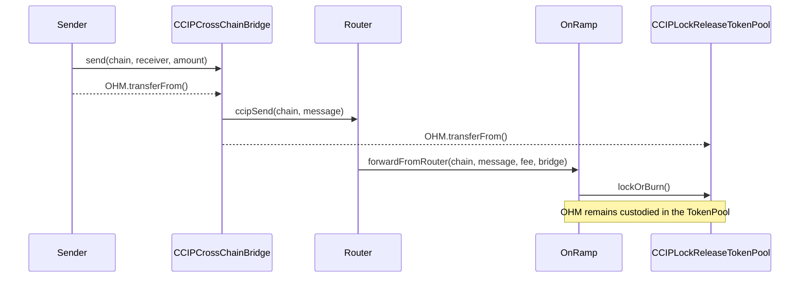
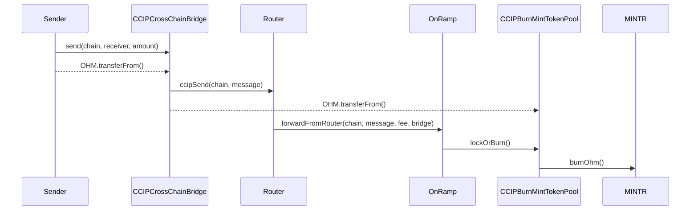
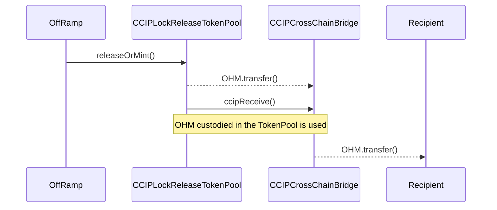
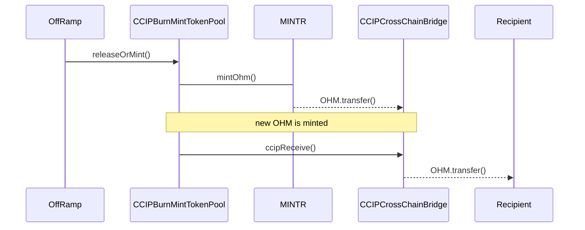

# CCIP Bridge Audit

## Purpose

The purpose of this audit is to review the new bridging contracts utilising Chainlink CCIP.

These contracts will be installed in the Olympus V3 "Bophades" system, based on the [Default Framework](https://palm-cause-2bd.notion.site/Default-A-Design-Pattern-for-Better-Protocol-Development-7f8ace6d263c4303b108dc5f8c3055b1).

## Design

Keeping the architecture of CCIP in mind, the integration has been designed in the following manner:

- User-facing bridge contract that packages the message for the CCIP contracts and ensures that token approval is in place
- Token pool contracts that interact with the CCIP on- and off-ramp contracts to handle burn/mint or lock/release of OHM tokens, as appropriate

## Scope

### In-Scope Contracts

The contracts in scope for this audit are:

- [src/](../../src)
    - [periphery/](../../src/periphery)
        - [bridge/](../../src/periphery/bridge)
            - [CCIPCrossChainBridge.sol](../../src/periphery/bridge/CCIPCrossChainBridge.sol)
            - [CCIPLockReleaseTokenPool.sol](../../src/periphery/bridge/CCIPLockReleaseTokenPool.sol)
        - [interfaces/](../../src/periphery/interfaces)
            - [ICCIPCrossChainBridge.sol](../../src/periphery/interfaces/ICCIPCrossChainBridge.sol)
        - [PeripheryEnabler.sol](../../src/periphery/PeripheryEnabler.sol)
    - [policies/](../../src/policies)
        - [bridge/](../../src/policies/bridge)
            - [BurnMintTokenPoolBase.sol](../../src/policies/bridge/BurnMintTokenPoolBase.sol)
            - [CCIPBurnMintTokenPool.sol](../../src/policies/bridge/CCIPBurnMintTokenPool.sol)
        - [interfaces/](../../src/policies/interfaces)
            - [ICCIPTokenPool.sol](../../src/policies/interfaces/ICCIPTokenPool.sol)

[PR 69](https://github.com/OlympusDAO/olympus-v3/pull/69) provides the changes.

### Previous Audits

You can review previous audits here:

- Spearbit (07/2022)
    - [Report](https://storage.googleapis.com/olympusdao-landing-page-reports/audits/2022-08%20Code4rena.pdf)
- Code4rena Olympus V3 Audit (08/2022)
    - [Repo](https://github.com/code-423n4/2022-08-olympus)
    - [Findings](https://github.com/code-423n4/2022-08-olympus-findings)
- Kebabsec Olympus V3 Remediation and Follow-up Audits (10/2022 - 11/2022)
    - [Remediation Audit Phase 1 Report](https://hackmd.io/tJdujc0gSICv06p_9GgeFQ)
    - [Remediation Audit Phase 2 Report](https://hackmd.io/@12og4u7y8i/rk5PeIiEs)
    - [Follow-on Audit Report](https://hackmd.io/@12og4u7y8i/Sk56otcBs)
- Cross-Chain Bridge by OtterSec (04/2023)🙏🏼
    - [Report](https://storage.googleapis.com/olympusdao-landing-page-reports/audits/Olympus-CrossChain-Audit.pdf)
- PRICEv2 by HickupHH3 (06/2023)
    - [Report](https://storage.googleapis.com/olympusdao-landing-page-reports/audits/2023_7_OlympusDAO-final.pdf)
    - [Pre-Audit Commit](https://github.com/OlympusDAO/bophades/tree/17fe660525b2f0d706ca318b53111fbf103949ba)
    - [Post-Remediations Commit](https://github.com/OlympusDAO/bophades/tree/9c10dc188210632b6ce46c7a836484e8e063151f)
- Cooler Loans by Sherlock (09/2023)
    - [Report](https://docs.olympusdao.finance/assets/files/Cooler_Update_Audit_Report-f3f983a8ee8632637790bcc136275aa0.pdf)
- RBS 1.3 & 1.4 by HickupHH3 (11/2023)
    - [Report](https://storage.googleapis.com/olympusdao-landing-page-reports/audits/OlympusDAO%20Nov%202023.pdf)
    - [Pre-Audit Commit](https://github.com/OlympusDAO/bophades/tree/7a0902cf3ced19d41aafa83e96cf235fb3f15921)
    - [Post-Remediations Commit](https://github.com/OlympusDAO/bophades/tree/e61d954cc620254effb014f2d2733e59d828b5b1)
- Emission Manager by yAudit (11/2024)
    - [Report](https://storage.googleapis.com/olympusdao-landing-page-reports/audits/2024_11_EmissionManager_ReserveMigrator.pdf)
    - [Pre-Audit Commit](https://github.com/OlympusDAO/bophades/tree/e367e7977ea58a2fd365296d9c9f620c7cd0512d)
    - [Post-Remediations Commit](https://github.com/OlympusDAO/bophades/tree/3ace544f24adfd3d218ae625b9d1449321f9e184)
- LoanConsolidator by HickupHH3 (11/2024)
    - [Report](https://storage.googleapis.com/olympusdao-landing-page-reports/audits/2024_10_LoanConsolidator_Audit.pdf)
    - [Pre-Audit Commit](https://github.com/OlympusDAO/bophades/tree/95479d5d4a9bb941c60c7a8347709d9fc895b819)
    - [Post-Remediations Commit](https://github.com/OlympusDAO/bophades/tree/d2d5b63dee16a259400628df4cf6ce2d3df02558)
- Cooler V2 by Electisec (03/2025)
    - [Report](https://storage.googleapis.com/olympusdao-landing-page-reports/audits/Olympus_CoolerV2-Electisec_report.pdf)
    - The PolicyEnabler and PolicyAdmin mix-ins are audited here

### Modifications to Audited Contracts

Some of the in-scope contracts modify or include unmodified code from the CCIP contracts that have been previously audited:

- `BurnMintTokenPoolBase.sol`
    - The `releaseOrMint()` function is the same as in the source [BurnMintTokenPoolAbstract.sol](https://github.com/smartcontractkit/chainlink/blob/develop/contracts/src/v0.8/ccip/pools/BurnMintTokenPoolAbstract.sol) file, with the `mint()` call on line 46 replaced with a call to a `_mint()` virtual function. This was to allow for custom mint signatures/behaviours (which is already supported for token burning).
- `CCIPLockReleaseTokenPool.sol`
    - The `lockOrBurn()` and `releaseOrMint()` functions are the same as in the source [LockReleaseTokenPool.sol](https://github.com/smartcontractkit/chainlink/blob/develop/contracts/src/v0.8/ccip/pools/LockReleaseTokenPool.sol) file, with the addition of `onlyEnabled` modifiers and `public` visibility. Calling `super.lockOrBurn()` and `super.releaseOrMint()` was not possible, due to the `external` visibility.

## Implementation

The following sections provide detail on the processes and implementation.

### Bridge

`CCIPCrossChainBridge` is a convenience contract that can be used when sending OHM.

It offers the following benefits to the end-user:

- Construction of the CCIP message used for bridging, including chain-specific extra arguments
- Fee calculation (which requires constructing the CCIP message)
- Failure handling on the destination chain, allowing for retries

A side-effect of this is that the `CCIPCrossChainBridge` contract will be recorded as the receiver in the bridging transaction. Upon receipt, the contract will decode the actual receiver address from the message data, and transfer the bridged OHM to that address.

This bridging contract, however, is optional. An end-user or application can send a CCIP message directly to the CCIP router in order to conduct a bridging transaction (without availing the benefits mentioned above).

### Token Pools

#### Sending - Canonical Chain

On the canonical/base chain (Mainnet for production and Sepolia for testing), a lightly modified `LockReleaseTokenPool` is used, which custodies OHM that is bridged out.

In contract to previous bridging implementations by Olympus (which utilised a "burn and mint" approach), the `LockReleaseTokenPool` was adopted for the following reasons:

- In the event that bridging infrastructure is compromised, the quantity of OHM in the `LockReleaseTokenPool` will provide a hard cap to the amount of OHM that can be bridged back to the canonical chain.
- The same outcome is achievable with a "burn and mint" approach, but required more significant additions to the `BurnMintTokenPool` contract. The preference is to reduce the amount of custom code, and so the "lock and release" approach has been adopted.
- This also has the benefit that the `LockReleaseTokenPool` does not require mint and burn permissions from the Bophades Kernel, and can operate as an external periphery contract.

#### Sending - Other Chains

When sending OHM from other non-canonical chains (regardless of which chain the recipient is located on), the "burn and mint" approach is used.

#### Receiving - Canonical Chain

On the canonical/base chain (Mainnet for production and Sepolia for testing), a lightly modified `LockReleaseTokenPool` is used.

As mentioned in the section on [Sending OHM - Canonical Chain](#sending---canonical-chain), the amount of OHM bridged from the canonical chain is custodied in the TokenPool. Instead of minting new OHM upon bridging in, the custodied OHM is used. This provides additional protection: in the scenario where the bridging infrastructure is exploited and fraudulent bridging messages are sent to the TokenPool on the canonical chain, the amount of OHM that could enter circulating would have a hard cap set by the balance of OHM custodied in the TokenPool contract.

#### Receiving - Other Chains

When receiving OHM on a non-canonical chain (regardless of which chain the sender is located on), the "burn and mint" approach is used.

