# Olympus Convertible Deposits Audit

## Purpose

The purpose of this audit is to review the contracts for the Convertible Deposits (CD) system.

These contracts will be installed in the Olympus V3 "Bophades" system, based on the [Default Framework](https://palm-cause-2bd.notion.site/Default-A-Design-Pattern-for-Better-Protocol-Development-7f8ace6d263c4303b108dc5f8c3055b1).

## Design

The Convertible Deposits system in the Olympus protocol seeks to incentivise deposits of reserve tokens, upon which the protocol earns yield, and provide opportunities for speculation around yield and the price of OHM.

For a given reserve token, e.g. `USDS`, and deposit period, e.g. 3 months, there exists a receipt (r) token, e.g. `rUSDS-3m`.

The system offers two mutually-exclusive mechanisms:

- Deposit with the option to convert to OHM before an expiry date
- Deposit with the ability to earn yield from the ERC4626 vault strategy

| Mechanism             | Conversion to OHM | Yield    |
|-----------------------|-------------------|----------|
| Convertible Deposit   | Yes               | No       |
| Yield Deposit         | No                | Yes      |

### Convertible Deposit

This mechanism longs OHM, with the expectation that the issued conversion price will be lower than the market price at the time of conversion.

The conversion price is determined through an infinite duration and infinite capacity auction.

#### Auction Design

Bidders are required to deposit the configured token (e.g. USDS) via the auctioneer (`ConvertibleDepositAuctioneer`), and in return they receive a receipt token (`rUSDS-3m`) that can be converted into the configured bid token (OHM) or redeemed for the deposit token at the end of a waiting period.

The auction is made up of "ticks", where each tick is a price and capacity (number of OHM that can be purchased).

The auction has a number of parameters that affect its overall behaviour:

- Minimum Price: the minimum price of reserve token per OHM
- Tick Size: the size/capacity of each tick, in terms of OHM
- Tick Step: the percentage increase per tick
- Target: the target amount of OHM sold per day

The `EmissionManager` is responsible for periodically tuning these auction parameters according to the protocol's emission schedule.

There are a few additional behaviours:

- As tick capacity is depleted, the auctioneer will increase the price of the subsequent tick by the configured tick step percentage.
- Auction capacity (up to the target) is added proportionally throughout each day period.
- In the absence of any bids, the active tick price will decay over time.
    - Remaining capacity is adjusted by the tick size and the price reduced by the configured tick step until within the tick size.
    - A floor of the configured minimum price also applies.
- With each multiple of the day target being reached, the auctioneer will progressively halve the size of each tick.
- At the end of each period, when `setAuctionParameters()` is called, the day's auction results will be stored on a rolling basis for the configured auction tracking period.
    - If there is an under-selling of OHM capacity at the end of the tracking period, EmissionManager will create a bond market for the remaining OHM capacity. This ensures that the emission target per period is reached.

Each auctioneer is configured for a single deposit token (e.g. `USDS`), but can accept one or more configured deposit periods (e.g. 3, 6, 9 months). Each deposit token and period combination will have a different auction state (tick price and size).

### Yield-Bearing Deposits

The second approach enables depositors to claim the yield from an ERC4626 vault strategy, without the ability to convert to OHM.

A user can deposit the configured token (e.g. USDS) into the facility (`YieldDepositFacility`), and in return receive:

- An equivalent amount of a receipt token (e.g. `rUSDS-3m`)
- A position record (optionally wrapped to a ERC721 token) with the deposit period
    - The holder of this record/token can claim the vault token yield at any time, and in any frequency.
    - A protocol fee will be deducted upon harvesting yield.
    - The holder is free to do what they wish with the receipt token - it does not affect claiming yield.

As the time that the yield is harvested is not fixed, flexibility is added to the system in the following manner:

- The conversion rate between each vault shares and its assets is periodically recorded (every 8 hours).
- When claiming yield, the difference between the current and previous vault conversion rate is used to determine how much yield to transfer to the position owner.
- If the position has not yet expired, the current conversion rate between the vault shares and assets will be used.
- If the position has expired in the past, by default the function call will revert. This is because the function has no mechanism to find the conversion rate nearest to the expiry time.
    - The caller can provide a timestamp hint as a parameter, which is then used to find the conversion rate. Provided there is a stored conversion rate, that will be used.

### Receipt Tokens

Across both mechanisms (convertible and yield deposits), depositors will receive the following:

- A quantity of receipt tokens, which is a fungible ERC6909 (or optionally ERC20) token across all deposits of the same deposit token and deposit period.
    - e.g. `USDS` deposits with periods of 1, 3 and 6 months are distinct tokens: `rUSDS-1m`, `rUSDS-3m`, `rUSDS-6m`
- The deposit position will be recorded and can be optionally wrapped to an ERC721 NFT. The position includes terms, such as:
    - deposit date
    - deposit period
    - conversion price (convertible only)
    - size of the convertible deposit

Using the `ConvertibleDepositFacility` policy, convertible deposit holders are able to:

- Convert their deposit into OHM before conversion expiry, at the conversion price of the deposit terms (convertible only).
- Reclaim the deposited tokens at any time, with a discount.

### Custodying Deposits

The DepositManager provides lifecycle management for deposits and receipt tokens:

- Creating receipt tokens
- Minting receipt tokens
- Custodying of deposited funds
- Withdrawing deposited funds
- Burning receipt tokens
- Sweeping protocol yield

Funds deposited are custodied in the deposit manager, and attributed to the dependent contract (e.g. ConvertibleDepositFacility and YieldDepositFacility). This results in the following:

- The deposited funds are separated from the protocol treasury
- The deposited funds cannot be accessed by other components in the protocol
- Dependent contracts cannot access funds deposited by other contracts

The receipt tokens are also issued from the DepositManager via the ERC6909Wrappable abstract contract. This is done so that no other contract in the Bophades system is able to arbitrarily mint the same receipt tokens without the funds being custodied in the DepositManager.

## Scope

### In-Scope Contracts

- [src/](../../src)
    - [bases/](../../src/bases/)
        - [BaseAssetManager.sol](../../src/bases/BaseAssetManager.sol)
        - [BasePeriodicTaskManager.sol](../../src/bases/BasePeriodicTaskManager.sol)
    - [external/](../../src/external/)
        - [clones/](../../src/external/clones/)
            - [CloneERC20.sol](../../src/external/clones/CloneERC20.sol)
    - [libraries/](../../src/libraries)
        - [AddressStorageArray.sol](../../src/libraries/AddressStorageArray.sol)
        - [CloneableReceiptToken.sol](../../src/libraries/CloneableReceiptToken.sol)
        - [DecimalString.sol](../../src/libraries/DecimalString.sol)
        - [ERC6909Wrappable.sol](../../src/libraries/ERC6909Wrappable.sol)
        - [Timestamp.sol](../../src/libraries/Timestamp.sol)
        - [Uint2Str.sol](../../src/libraries/Uint2Str.sol)
    - [modules/](../../src/modules)
        - [DEPOS/](../../src/modules/DEPOS)
            - [DEPOS.v1.sol](../../src/modules/DEPOS/DEPOS.v1.sol)
            - [OlympusDepositPositionManager.sol](../../src/modules/DEPOS/OlympusDepositPositionManager.sol)
            - [PositionTokenRenderer.sol](../../src/modules/DEPOS/PositionTokenRenderer.sol)
    - [policies/](../../src/policies)
        - [deposits/](../../src/policies/deposits/)
            - [BaseDepositFacility.sol](../../src/policies/deposits/BaseDepositFacility.sol)
            - [ConvertibleDepositAuctioneer.sol](../../src/policies/deposits/ConvertibleDepositAuctioneer.sol)
            - [ConvertibleDepositFacility.sol](../../src/policies/deposits/ConvertibleDepositFacility.sol)
            - [DepositManager.sol](../../src/policies/deposits/DepositManager.sol)
            - [DepositRedemptionVault.sol](../../src/policies/deposits/DepositRedemptionVault.sol)
            - [YieldDepositFacility.sol](../../src/policies/deposits/YieldDepositFacility.sol)
        - [EmissionManager.sol](../../src/policies/EmissionManager.sol)
        - [Heart.sol](../../src/policies/Heart.sol)
        - [ReserveWrapper.sol](../../src/policies/ReserveWrapper.sol)

The following pull requests can be referred to for the in-scope contracts:

- [Convertible Deposits](https://github.com/OlympusDAO/olympus-v3/pull/29)

See the [solidity-metrics.html](./solidity-metrics.html) report for a summary of the code metrics for these contracts.

### Previous Audits

You can review previous audits here:

- Spearbit (07/2022)
    - [Report](https://storage.googleapis.com/olympusdao-landing-page-reports/audits/2022-08%20Code4rena.pdf)
- Code4rena Olympus V3 Audit (08/2022)
    - [Repo](https://github.com/code-423n4/2022-08-olympus)
    - [Findings](https://github.com/code-423n4/2022-08-olympus-findings)
- Kebabsec Olympus V3 Remediation and Follow-up Audits (10/2022 - 11/2022)
    - [Remediation Audit Phase 1 Report](https://hackmd.io/tJdujc0gSICv06p_9GgeFQ)
    - [Remediation Audit Phase 2 Report](https://hackmd.io/@12og4u7y8i/rk5PeIiEs)
    - [Follow-on Audit Report](https://hackmd.io/@12og4u7y8i/Sk56otcBs)
- Cross-Chain Bridge by OtterSec (04/2023)🙏🏼
    - [Report](https://storage.googleapis.com/olympusdao-landing-page-reports/audits/Olympus-CrossChain-Audit.pdf)
- PRICEv2 by HickupHH3 (06/2023)
    - [Report](https://storage.googleapis.com/olympusdao-landing-page-reports/audits/2023_7_OlympusDAO-final.pdf)
    - [Pre-Audit Commit](https://github.com/OlympusDAO/bophades/tree/17fe660525b2f0d706ca318b53111fbf103949ba)
    - [Post-Remediations Commit](https://github.com/OlympusDAO/bophades/tree/9c10dc188210632b6ce46c7a836484e8e063151f)
- Cooler Loans by Sherlock (09/2023)
    - [Report](https://docs.olympusdao.finance/assets/files/Cooler_Update_Audit_Report-f3f983a8ee8632637790bcc136275aa0.pdf)
- RBS 1.3 & 1.4 by HickupHH3 (11/2023)
    - [Report](https://storage.googleapis.com/olympusdao-landing-page-reports/audits/OlympusDAO%20Nov%202023.pdf)
    - [Pre-Audit Commit](https://github.com/OlympusDAO/bophades/tree/7a0902cf3ced19d41aafa83e96cf235fb3f15921)
    - [Post-Remediations Commit](https://github.com/OlympusDAO/bophades/tree/e61d954cc620254effb014f2d2733e59d828b5b1)
- Emission Manager by yAudit (11/2024)
    - [Report](https://storage.googleapis.com/olympusdao-landing-page-reports/audits/2024_11_EmissionManager_ReserveMigrator.pdf)
    - [Pre-Audit Commit](https://github.com/OlympusDAO/bophades/tree/e367e7977ea58a2fd365296d9c9f620c7cd0512d)
    - [Post-Remediations Commit](https://github.com/OlympusDAO/bophades/tree/3ace544f24adfd3d218ae625b9d1449321f9e184)
- LoanConsolidator by HickupHH3 (11/2024)
    - [Report](https://storage.googleapis.com/olympusdao-landing-page-reports/audits/2024_10_LoanConsolidator_Audit.pdf)
    - [Pre-Audit Commit](https://github.com/OlympusDAO/bophades/tree/95479d5d4a9bb941c60c7a8347709d9fc895b819)
    - [Post-Remediations Commit](https://github.com/OlympusDAO/bophades/tree/d2d5b63dee16a259400628df4cf6ce2d3df02558)
- Cooler V2 by Electisec (03/2025)
    - [Report](https://storage.googleapis.com/olympusdao-landing-page-reports/audits/Olympus_CoolerV2-Electisec_report.pdf)
    - The PolicyEnabler and PolicyAdmin mix-ins are audited here

## Processes

### Activation and Deactivation

Callers with the appropriate permissions can activate and deactivate the functionality of the contracts.

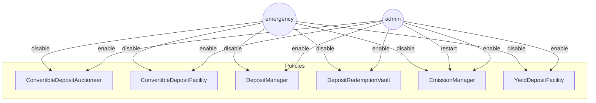

### Auction Tuning

As part of the regular heartbeat, the EmissionManager contract will calculate the desired emission rate and set the auction parameterson ConvertibleDepositAuctioneer for the EmissionManager's configured reserve asset.

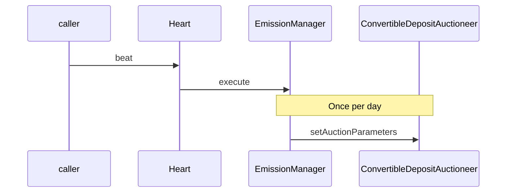

### Making a Deposit

A bidder can call `bid()` on the ConvertibleDepositAuctioneer to create a deposit. This will result in the caller receiving the receipt tokens and a DEPOS position.

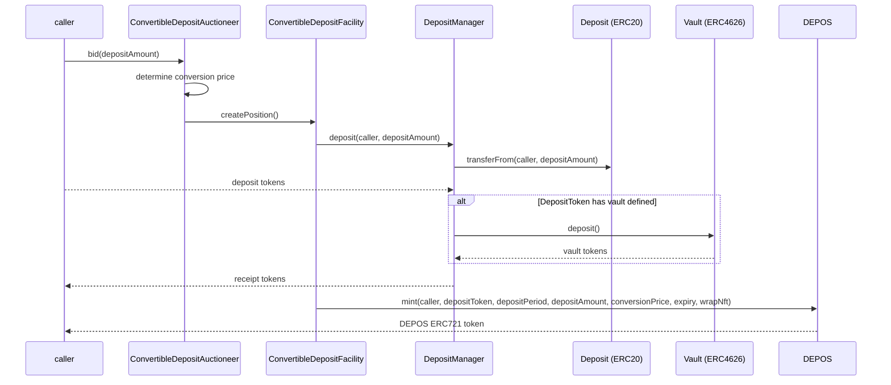

### Converting a Deposit

Prior to the expiry of the convertible deposit, a deposit owner can convert their deposit into OHM at the conversion price of the deposit terms.

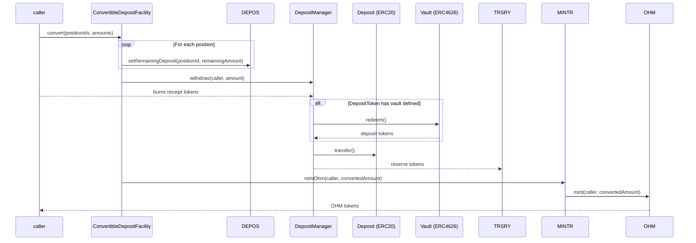

### Reclaiming a Deposit

The holder of receipt tokens can reclaim their underlying deposit at any time. A discount (`getAssetPeriodReclaimRate()` on the DepositManager contract) is applied on the deposit that is returned, which is transferred to the TRSRY.

A position created by the deposit facility being called is required in order to reclaim. This is to prevent imbalances in the deposits and yield across deposit facilities.

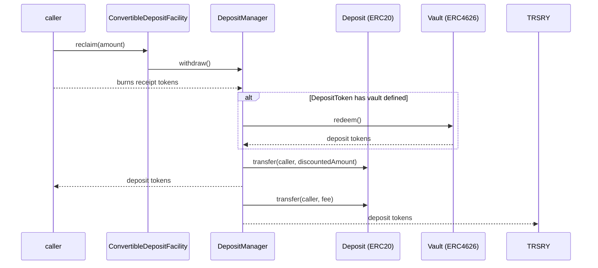

### Redeeming a Deposit

Receipt token holders can redeem the underlying token quantity in full through the dedicated `DepositRedemptionVault` contract.

- Receipt tokens can be deposited towards redemption (`startRedemption()`) without a deposit position
    - Users select which facility to use for redemption at initiation
    - Receipt tokens are transferred to the redemption vault as collateral
    - Deposits are committed to the selected facility
    - Choosing a facility is required as the receipt tokens are fungible - receipt tokens created by one operator (e.g. ConvertibleDepositFacility) can be redeemed through another (e.g. YieldDepositFacility).
- The receipt tokens must remain in the vault for the deposit period in order to be redeemed.
- After the receipt tokens have been in the vault for the deposit period, they can be redeemed 1:1 for the underlying tokens (`finishRedemption()`).
- Users can cancel redemptions (`cancelRedemption()`) and receive the specified amount of receipt tokens back.

#### Redeeming a Deposit - Start

A depositor can start the process to redeem their deposit amount by providing the receipt tokens to the redemption vault. The underlying deposit amount will be redeemable after the deposit period has passed.

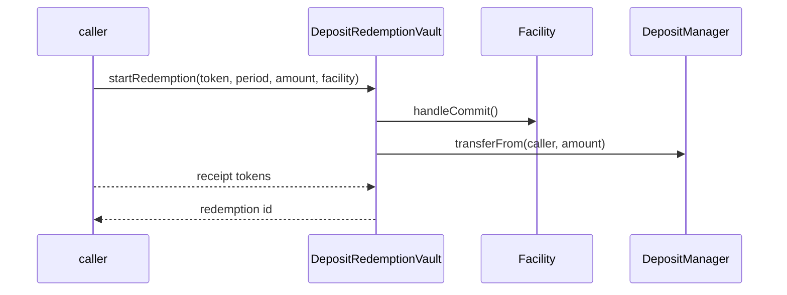

This action also marks the specified amount as committed via the calling facility, which prevents the DepositManager from allowing withdrawals that would result in there being insufficient funds to honour redemption commitments.

#### Redeeming a Deposit - Cancel

After starting redemption, the depositor can cancel and withdraw the receipt tokens. This will reset the timer for any subsequent redemptions.

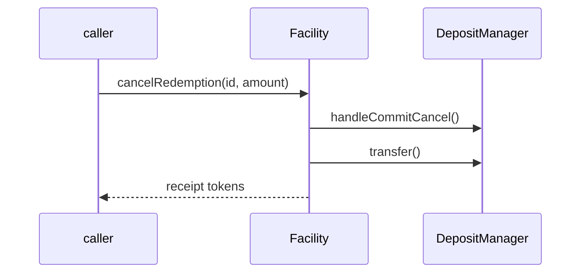

#### Redeeming a Deposit - Finish

Once the receipt token's deposit period has passed, the depositor can finish the redemption.

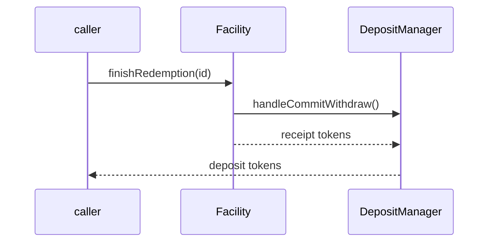

#### Borrowing Against Redemption

The architecture supports borrowing against active redemptions:

- Users can borrow up to the configured percentage of their redemption amount against in-progress redemptions
- A single loan (of the maximum borrowable amount) can be taken against the a redemption
- Loans have fixed interest rates and match the redemption period duration
- Repayment is handled through the redemption vault
    - The loan interest is repaid first, followed by the principal
- Loans can be extended by 1 or more months at a time, with interest charged at the time of extension
- Third parties can claim default against expired loans, in return for a keeper reward
    - The redemption and loan owner will retain any principal that has been repaid
    - The remainder (including any buffer between the loan amount and redemption amount) will be reclaimed by the protocol

#### Borrowing Against Redemption - Borrow

Depositors with active redemptions can borrow against their redemption amount.

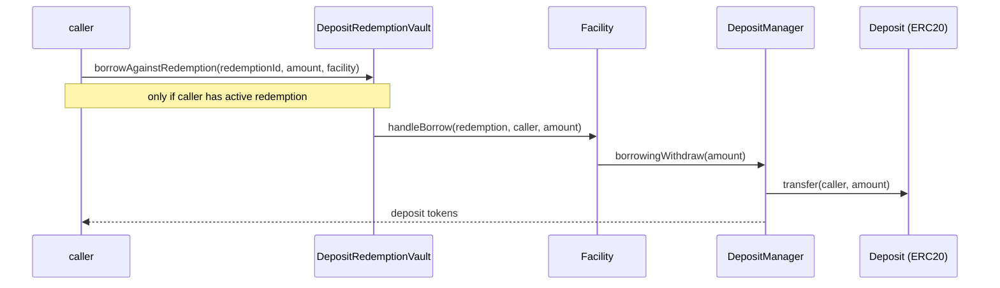

#### Borrowing Against Redemption - Repay

Repayments first repay the interest, followed by the principal.

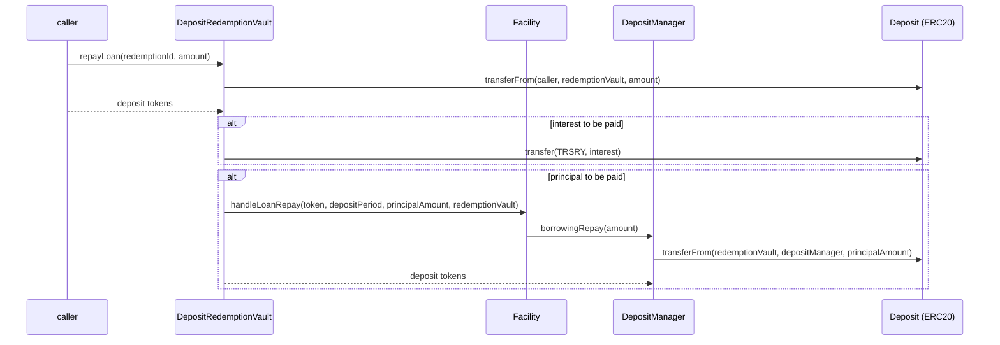

#### Borrowing Against Redemption - Extend

Loans can be extended in multiples of months.

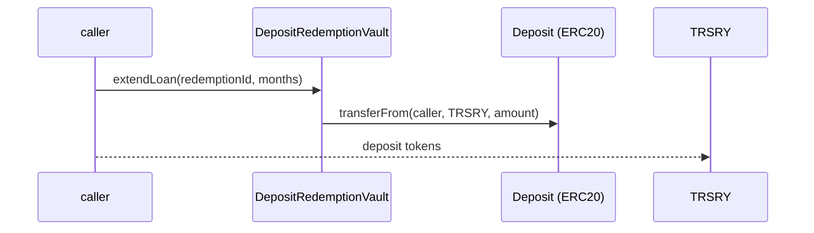

#### Borrowing Against Redemption - Default

After a loan has expired, third-parties can claim default on that loan.

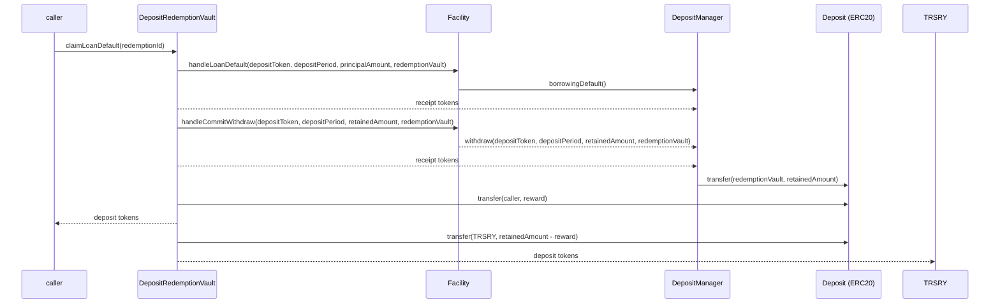

## Architecture

### EmissionManager (Policy)

This release contains an updated EmissionManager policy with the following changes:

- In every third epoch, it:
    - Tunes the auction run by ConvertibleDepositAuctioneer
    - Launches an auction for the quantity of OHM unsold through auction over the configured tracking period
- Uses the PolicyEnabler mix-in for enabling/disabling the functionality and role validation

### ConvertibleDepositAuctioneer (Policy)

ConvertibleDepositAuctioneer is a policy that runs the aforementioned infinite duration and infinite capacity auction of deposits in exchange for future conversion to OHM.

There are two main state-changing functions in this policy:

- `setAuctionParameters()` is gated to a role held by the EmissionManager, which enables it to periodically tune the auction parameters
- `bid()` is ungated and enables the caller to bid in the auction. The function determines the amount of OHM that is convertible for the given deposit amount, and uses ConvertibleDepositFacility to issue the receipt tokens and deposit position.

Other relevant functions are:

- `getCurrentTick()` gets the details of the current tick, accounting for capacity added since the last successful bid.
- `previewBid()` indicates the amount of OHM that a given deposit could be converted to, given current tick capacity and pricing.
    - This function implements the logic of moving up ticks and prices until the bid amount is fulfilled, and adjusting the tick size after reaching multiples of the period target.

Each ConvertibleDepositAuctioneer is deployed with a single, immutable bid token, with deposit periods that can be enabled/disabled.

### ConvertibleDepositFacility (Policy)

ConvertibleDepositFacility is a policy that is responsible for taking deposits, issuing receipt tokens and handling subsequent interactions with receipt token holders.

The ConvertibleDepositAuctioneer is able to mint a convertible deposit:

- `createPosition()`: results in the deposit of the configured reserve token (e.g. USDS) for a period period (e.g. 6 months), issuance of an equivalent amount of receipt tokens (rUSDS-6m) and creation of a convertible deposit position in the DEPOS module.

Receipt token holders can perform the following actions:

- `convert()`: convert their deposit position into OHM before conversion expiry.
- `reclaim()`: reclaim a discounted quantity of the underlying asset, USDS, at any time. This requires a DEPOS position ID.

The facility also implements the `IDepositFacility` interface to support callbacks for authorized operators:

- `handleCommit()`: committing funds for redemption
- `handleCommitCancel()`: cancelling committed funds
- `handleCommitWithdraw()`: withdrawing previously committed funds
- `handleBorrow()`: borrows from deposits
- `handleLoanRepay()`: makes a repayment against a loan
- `handleLoanDefault()`: handles a loan default

### DepositRedemptionVault (Policy)

The `DepositRedemptionVault` is a dedicated contract that manages all redemption and borrowing operations, separating redemption logic from the facility contracts. This enables better modularity.

Key functions:

- `startRedemption()`: initiates redemption with facility selection
- `finishRedemption()`: completes redemption through the selected facility
- `cancelRedemption()`: cancels redemption and returns receipt tokens
- `borrowAgainstRedemption()`: allows borrowing against active redemptions
- `repayLoan()`: handles loan repayment
- `extendLoan()`: handles loan extension
- `claimDefaultedLoan()`: handles defaulting of a loan

The vault coordinates with registered facilities through the `IDepositFacility` interface and maintains centralized state for all redemption operations.

### YieldDepositFacility (Policy)

The YieldDepositFacility enables users to create yield-bearing deposits. The redemption functionality has been separated into the centralized `DepositRedemptionVault` contract.

The public can mint a yield-bearing deposit:

- `createPosition()`: results in the deposit of the configured deposit token (USDS), issuance of an equivalent amount of receipt tokens (rUSDS) and creation of a yield deposit position in the DEPOS module.
- `claimYield()`: transfers the variable yield accrued from the vault token (e.g. sUSDS) after deducting the yield fee.

The facility also implements the `IDepositFacility` interface to support callbacks for authorized operators:

- `handleCommit()`: committing funds for redemption
- `handleCommitCancel()`: cancelling committed funds
- `handleCommitWithdraw()`: withdrawing previously committed funds
- `handleBorrow()`: borrows from deposits
- `handleLoanRepay()`: makes a repayment against a loan
- `handleLoanDefault()`: handles a loan default

### Deposit Manager (Policy)

The deposit manager is responsible for custodying deposits and issuing receipt tokens in return. It is designed to prevent any party other than the operator from accessing funds, in order to protect depositor funds - this includes from other permissioned Policies that governance may install.

Each receipt token is an ERC6909 token (optionally wrapped into an ERC20 clone contract) managed by the deposit manager. The receipt token represents the deposit of the underlying asset in a 1:1 ratio. The receipt token can be referred to as an "rToken" and will have the deposit period appended, e.g. "rUSDS-6m".

The DepositManager also supports borrowing operations:

- Borrowing withdrawal functionality for facility contracts
- Repayment deposit functionality for loan repayments
- Operator/facility borrowing permissions and limits
- Borrowing state tracking per operator

Unpermissioned callers are able to perform the following actions:

- None

Bophades policies with the `deposit_operator` role are able to perform the following actions:

- Deposit assets into the DepositManager
- Withdraw assets from the DepositManager
- Claim yield on deposited assets
- Borrow against available deposits

Bophades policies with the `admin` or `manager` role are able to perform the following actions:

- Configure a deposit asset and ERC4626 vault
    - Setting the vault is optional, as not all deposit assets will have an ERC4626 vault.
    - Setting the vault after the initial configuration is not supported, as it presents a security risk. For example, governance could install an ERC4626 vault under its control into which all assets are transferred.
- Add asset periods (deposit asset and period combinations)
- Enable/disable asset periods

### Heart (Policy)

The Heart is a long-standing policy that acts as the interface for a third-party keeper to trigger a heartbeat.

The major change to this contract is the addition of the `BasePeriodicTaskManager` abstract contract. Previous versions of the heart required re-deployment whenever a new version of a policy or a new policy needed to be added to the configuration. Instead, the new version of the Heart policy has an ordered array of periodic tasks that will be performed at each heartbeat.

### ReserveWrapper (Policy)

A small periodic task (callable by the Heart policy) that will wrap any balance of a specified ERC20 into an ERC4626 vault, provided there is a balance in the TRSRY module.

### DEPOS (Module)

DEPOS is an ERC721 token and a Module representing the terms of a deposit position.

When a new position is created, it does not, by default, mint an ERC721 token to the owner. The state is instead stored within the contract.

Unpermissioned callers are able to perform the following actions:

- Wrap the caller's existing position into an ERC721
- Unwrap the caller's existing position from an ERC721, which burns the token

Permissioned policies are able to perform the following actions:

- Mint new positions
- Update the remaining deposit for an existing position
- Update the additional data for an existing position
