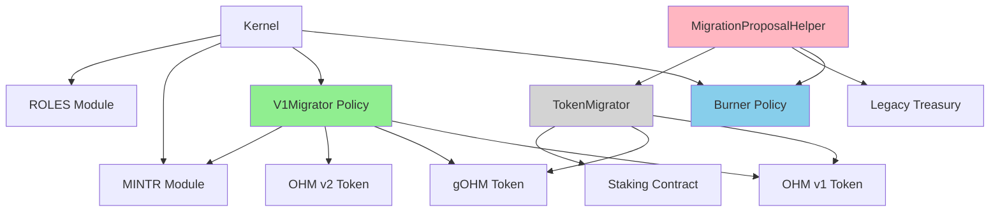
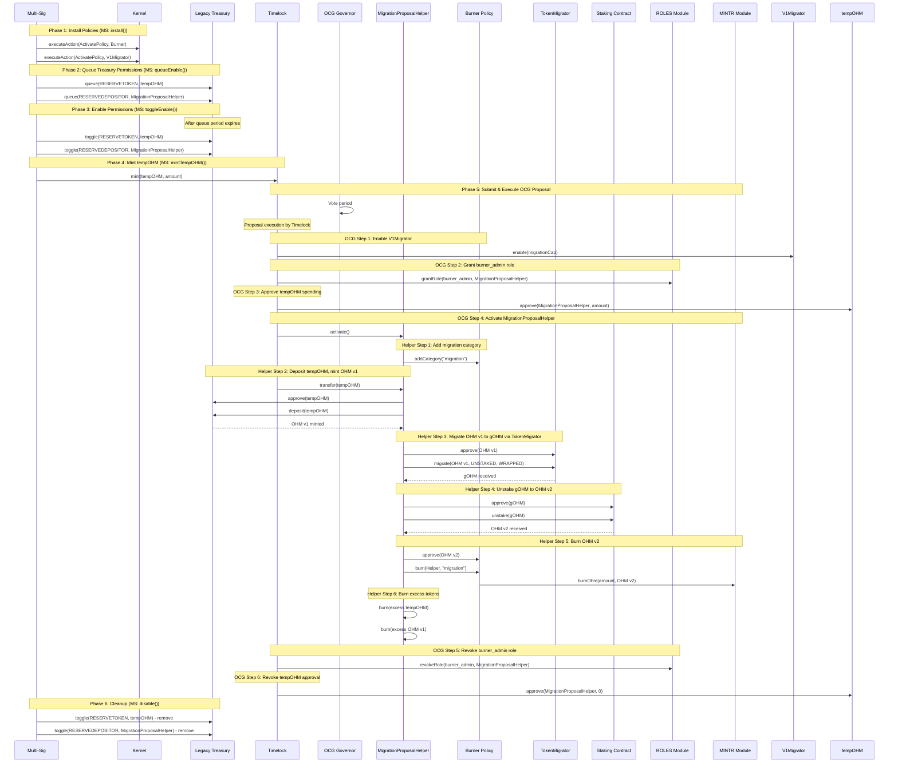
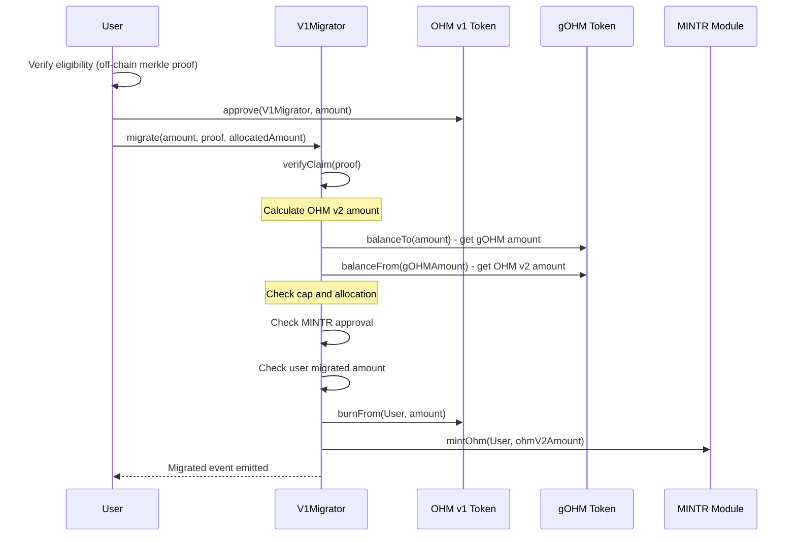

# OHM v1 Migrator Audit

## Purpose

This audit covers the V1Migrator feature, which lets OHM v1 holders migrate to OHM v2. The feature also defunds TokenMigrator and burns the surplus gOHM it holds.

The contracts will be installed in the Olympus V3 "Bophades" system, based on the [Default Framework](https://palm-cause-2bd.notion.site/Default-A-Design-Pattern-for-Better-Protocol-Development-7f8ace6d263c4303b108dc5f8c3055b1).

This feature introduces three main components:

- V1Migrator: A new policy for OHM v1 to OHM v2 migration using merkle proofs for an allowlist
- Burner: A new policy for burning OHM v2 and tracking the burns by category
- A set of temporary contracts to pull the gOHM from TokenMigrator and burn it

## Design Rationale

### Problem Statement

The old TokenMigrator contract was part of a previous generation of Olympus contracts and presents technical debt. The original migration system let OHM v1 holders convert to gOHM, but the remaining balance in the migrator is stranded supply that was never properly accounted for. The TokenMigrator also has no governance-controlled limits on migrations.

### Solution Approach

The new design addresses these issues:

1. Defunding the TokenMigrator: the OCG proposal in MigrationProposal and the associated MigrationProposalHelper contract will extract all gOHM from TokenMigrator, unstake it to OHM v2, and burn it. This removes the inflationary surplus from circulation.

2. Mint-on-Demand Migration: Instead of holding pre-minted tokens in a migrator contract, V1Migrator mints on demand. When a user migrates OHM v1, the contract burns the OHM v1 and mints new OHM v2 via the MINTR module. This eliminates stranded supply.

3. Migration Cap via MINTR Approval: V1Migrator uses the MINTR module's mint approval system to enforce a hard cap on total migrations. The cap can be adjusted by governance, providing flexibility while preventing infinite minting.

4. Merkle-Based Eligibility: Users provide a merkle proof to demonstrate eligibility. The merkle tree acts as an allowlist, letting the DAO and governance control which addresses can migrate and their allocated amounts.

5. Partial Migrations: Users can migrate any amount up to their allocation in multiple transactions, with the contract tracking total migrated amount per user.

### Why This Design?

- Security

    - MigrationProposalHelper: The single-use pattern prevents reuse.
    - V1Migrator: Merkle proofs function as an allowlist, ensuring only eligible addresses can migrate. The MINTR cap limits supply impact.

- Flexibility: The migration cap can be adjusted via governance. The merkle root can be updated to add eligible users or change allocations.

- Transparency: Burner categories enable clear on-chain tracking of migration-related burns.

- Efficiency: The nonce-based root update system allows O(1) merkle tree updates compared to O(n) user iteration.

## Scope

### In-Scope Contracts

- [src/](../../src)
    - [external/](../../src/external)
        - [OwnedERC20.sol](../../src/external/OwnedERC20.sol) - ERC20 token with owner-only mint (used for tempOHM)
    - [policies/](../../src/policies)
        - [Burner.sol](../../src/policies/Burner.sol) - A policy for burning OHM v2 and tracking burns by category
        - [V1Migrator.sol](../../src/policies/V1Migrator.sol) - Migration policy for OHM v1 to OHM v2
        - [interfaces/](../../src/policies/interfaces)
            - [IV1Migrator.sol](../../src/policies/interfaces/IV1Migrator.sol) - Interface for V1Migrator
    - [proposals/](../../src/proposals)
        - [MigrationProposal.sol](../../src/proposals/MigrationProposal.sol) - OCG proposal script (not deployed, defines proposal actions)
        - [MigrationProposalHelper.sol](../../src/proposals/MigrationProposalHelper.sol) - Single-use helper contract for treasury defunding

[PR #196](https://github.com/OlympusDAO/olympus-v3/pull/196) contains these changes.

### Out of Scope (Previously Audited)

These utilities were previously audited and are not in scope:

- PolicyAdmin.sol - Role-based access control mix-in
- PolicyEnabler.sol - Policy enable/disable management
- RoleDefinitions.sol - Role constant definitions

### Scripts and Tests

These are not in scope but provided for context:

- src/scripts/ops/batches/MigrationProposalSetup.sol - MS batch orchestration script
- src/scripts/ops/batches/args/MigrationProposalSetup_OHMv1ToMigrate.json - Args file with OHMv1ToMigrate value
- Test files for all in-scope contracts

## Previous Audits

- Spearbit (07/2022)
    - [Report](https://storage.googleapis.com/olympusdao-landing-page-reports/audits/2022-08%20Code4rena.pdf)
- Code4rena Olympus V3 Audit (08/2022)
    - [Repo](https://github.com/code-423n4/2022-08-olympus)
    - [Findings](https://github.com/code-423n4/2022-08-olympus-findings)
- Kebabsec Olympus V3 Remediation and Follow-up Audits (10/2022 - 11/2022)
    - [Remediation Audit Phase 1 Report](https://hackmd.io/tJdujc0gSICv06p_9GgeFQ)
    - [Remediation Audit Phase 2 Report](https://hackmd.io/@12og4u7y8i/rk5PeIiEs)
    - [Follow-on Audit Report](https://hackmd.io/@12og4u7y8i/Sk56otcBs)
- Cross-Chain Bridge by OtterSec (04/2023)
    - [Report](https://storage.googleapis.com/olympusdao-landing-page-reports/audits/Olympus-CrossChain-Audit.pdf)
- PRICEv2 by HickupHH3 (06/2023)
    - [Report](https://storage.googleapis.com/olympusdao-landing-page-reports/audits/2023_7_OlympusDAO-final.pdf)
    - [Pre-Audit Commit](https://github.com/OlympusDAO/bophades/tree/17fe660525b2f0d706ca318b53111fbf103949ba)
    - [Post-Remediations Commit](https://github.com/OlympusDAO/bophades/tree/9c10dc188210632b6ce46c7a836484e8e063151f)
- Cooler Loans by Sherlock (09/2023)
    - [Report](https://docs.olympusdao.finance/assets/files/Cooler_Update_Audit_Report-f3f983a8ee8632637790bcc136275aa0.pdf)
- RBS 1.3 & 1.4 by HickupHH3 (11/2023)
    - [Report](https://storage.googleapis.com/olympusdao-landing-page-reports/audits/OlympusDAO%20Nov%202023.pdf)
    - [Pre-Audit Commit](https://github.com/OlympusDAO/bophades/tree/7a0902cf3ced19d41aafa83e96cf235fb3f15921)
    - [Post-Remediations Commit](https://github.com/OlympusDAO/bophades/tree/e61d954cc620254effb014f2d2733e59d828b5b1)
- Emission Manager by yAudit (11/2024)
    - [Report](https://storage.googleapis.com/olympusdao-landing-page-reports/audits/2024_11_EmissionManager_ReserveMigrator.pdf)
    - [Pre-Audit Commit](https://github.com/OlympusDAO/bophades/tree/e367e7977ea58a2fd365296d9c9f620c7cd0512d)
    - [Post-Remediations Commit](https://github.com/OlympusDAO/bophades/tree/3ace544f24adfd3d218ae625b9d1449321f9e184)
- LoanConsolidator by HickupHH3 (11/2024)
    - [Report](https://storage.googleapis.com/olympusdao-landing-page-reports/audits/2024_10_LoanConsolidator_Audit.pdf)
    - [Pre-Audit Commit](https://github.com/OlympusDAO/bophades/tree/95479d5d4a9bb941c60c7a8347709d9fc895b819)
    - [Post-Remediations Commit](https://github.com/OlympusDAO/bophades/tree/d2d5b63dee16a259400628df4cf6ce2d3df02558)
- Cooler V2 by Electisec (03/2025)
    - [Report](https://storage.googleapis.com/olympusdao-landing-page-reports/audits/Olympus_CoolerV2-Electisec_report.pdf)
    - The PolicyEnabler and PolicyAdmin mix-ins are audited here
- CCIP Bridge (05/2025)
    - [Pre-Audit Commit](https://github.com/OlympusDAO/bophades/tree/0907cb6a8d67644fe34a80a7a7ee5e463975a48e)
    - [Post-Remediations Commit](https://github.com/OlympusDAO/bophades/tree/d057689a0c1ff80ccda90b5e3db5a9bb3e4a9c27)
- Convertible Deposits by yAudit (07/2025)
    - [Report](https://storage.googleapis.com/olympusdao-landing-page-reports/audits/2025_07_ConvertibleDeposits_yAudit.pdf)
    - [Pre-Audit Commit](https://github.com/OlympusDAO/bophades/tree/3b52a61e2ec9c8d6b0b7ea3be00fa7e14e7df19a)
    - [Post-Remediations Commit](https://github.com/OlympusDAO/bophades/tree/5fd77d8ec8a4f78d5fa306de30ec06bc6af9e98c)

## Architecture

## Implementation

### MigrationProposalSetup (MS Batch Script)

The MigrationProposalSetup contract orchestrates setup and execution:

- install() - Activates Burner and V1Migrator policies in the Kernel
- queueEnable() - Queues legacy treasury permissions (tempOHM as reserve token, MigrationProposalHelper as depositor)
- toggleEnable() - Enables queued legacy treasury permissions after timelock expires
- mintTempOHM() - Mints tempOHM to Timelock based on OHMv1ToMigrate amount
- setOHMv1ToMigrate(amount) - Sets the migration limit on MigrationProposalHelper (from args file: 197543809682892 (197543.81 OHM at 9 decimals))
- disable() - Removes legacy treasury permissions after OCG execution (cleanup)

Each function includes post-batch validation to ensure correct state transitions.

### OCG Proposal + MigrationProposalHelper

The on-chain governance proposal (MigrationProposal.sol) is not a deployed contract. It defines 6 actions executed by the Timelock, working with the MigrationProposalHelper single-use contract:

OCG Proposal Actions (executed by Timelock):

1. Enable V1Migrator - Calls V1Migrator.enable(migrationCap) with initial migration cap
2. Grant burner_admin role - Grants burner_admin role to MigrationProposalHelper via RolesAdmin
3. Approve tempOHM - Timelock approves MigrationProposalHelper to spend tempOHM
4. Activate MigrationProposalHelper - Calls MigrationProposalHelper.activate():
   - Adds "migration" category to Burner
   - Deposits tempOHM to legacy treasury, receives OHM v1
   - Migrates OHM v1 to gOHM via TokenMigrator
   - Unstakes gOHM to OHM v2
   - Burns OHM v2 via Burner
   - Burns any excess tempOHM and OHM v1
5. Revoke burner_admin role - Removes the role from MigrationProposalHelper
6. Revoke tempOHM approval - Sets approval to 0

MigrationProposalHelper State:

- isActivated - Single-use flag, prevents re-entrancy
- OHMv1ToMigrate - Maximum OHM v1 amount to migrate (197543809682892 at 9 decimals, 197543.81 OHM)
- Hardcoded legacy contract addresses (Legacy Treasury, TokenMigrator, Staking, gOHM, OHM v1, OHM v2)

### V1Migrator Policy

The V1Migrator policy lets OHM v1 holders migrate to OHM v2 via merkle proof verification:

- Merkle proof verification - Users provide a merkle proof to demonstrate eligibility (allowlist)
- Partial migrations - Users can migrate any amount up to their allocation in multiple transactions
- OHM v1 → gOHM → OHM v2 conversion - Uses gOHM's balanceTo and balanceFrom to match production flow
- Migration cap via MINTR approval - The MINTR module enforces a hard cap on total migrations
- Nonce-based root updates - When the merkle root is updated, a nonce increments and invalidates all previous migration records

### Burner Policy

The Burner policy enables burning OHM v2 and tracking burns by category:

- Categories - Burns are tracked by category (e.g., "migration", "surplus")
- burner_admin role - A role that can add categories and burn on behalf of users
- Migration category - The "migration" category tracks migration-related burns

### tempOHM (OwnedERC20)

OwnedERC20 is an ERC20 token with owner-only mint functionality:

- Owner-controlled minting - Only the owner (DAO MS) can mint tokens
- Burn function - Token holders can burn their own tokens
- Purpose - Used as a temporary token to mint OHM v1 via legacy treasury deposit

## Processes

### Complete Activation Flow

### User Migration Flow

## Key Assumptions

1. tempOHM valuation: 1:1 with OHM in legacy treasury (1e18 tempOHM = 1e9 OHM)
2. OHMv1ToMigrate: 197543809682892 OHM v1 (9 decimals, 197543.81 OHM) - from args file
3. gOHM conversion: Uses balanceTo/balanceFrom to match production flow
4. Legacy contracts: Mainnet addresses are hardcoded in MigrationProposalHelper
5. Timelock period: Standard treasury timelock applies to queue/toggle operations
