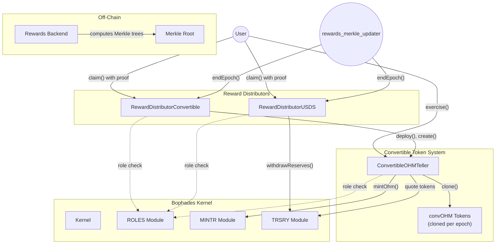
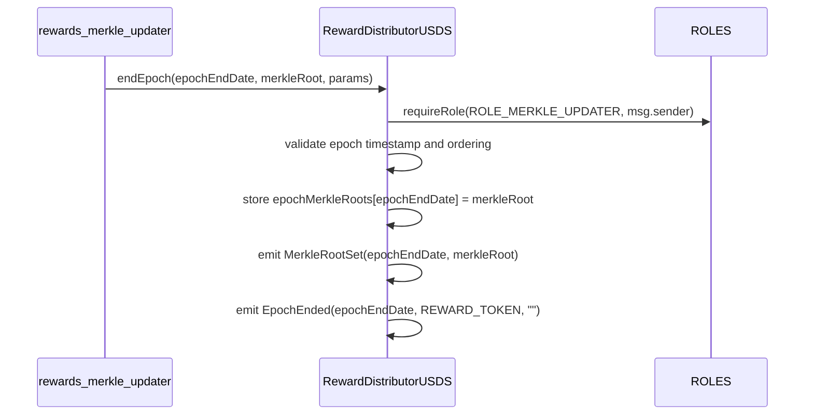
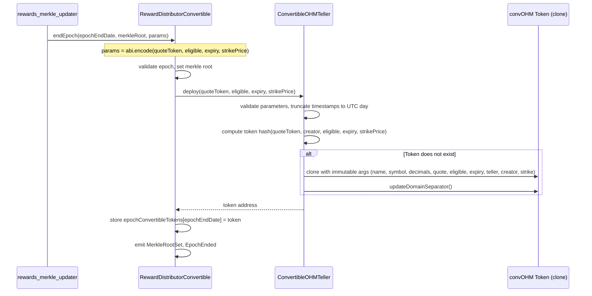
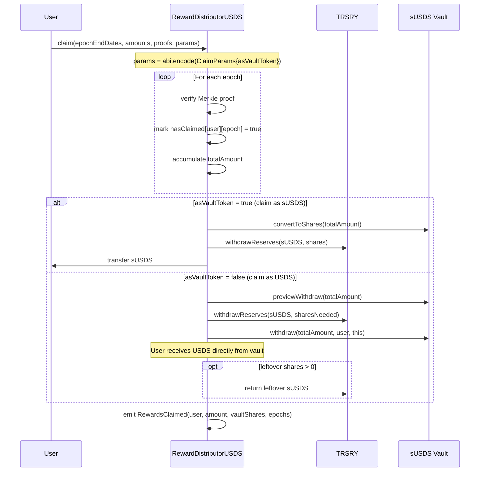
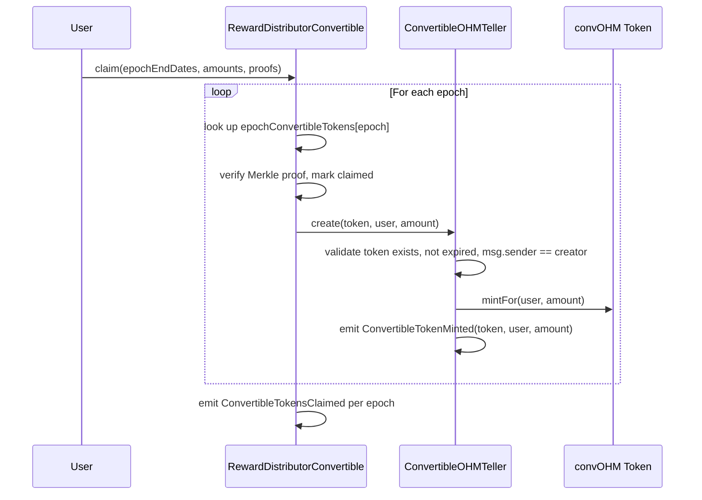
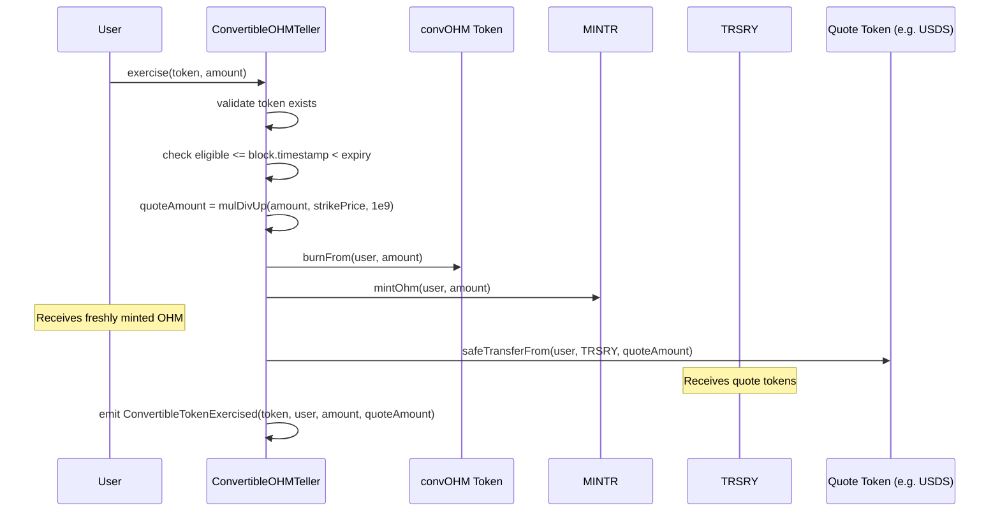
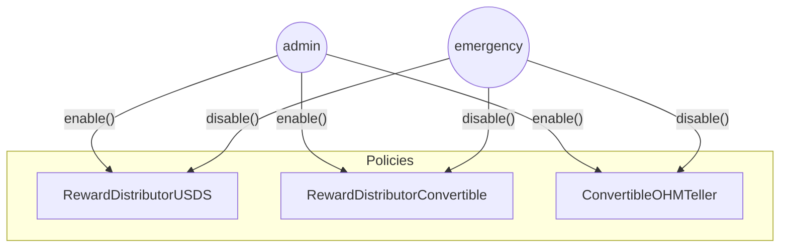
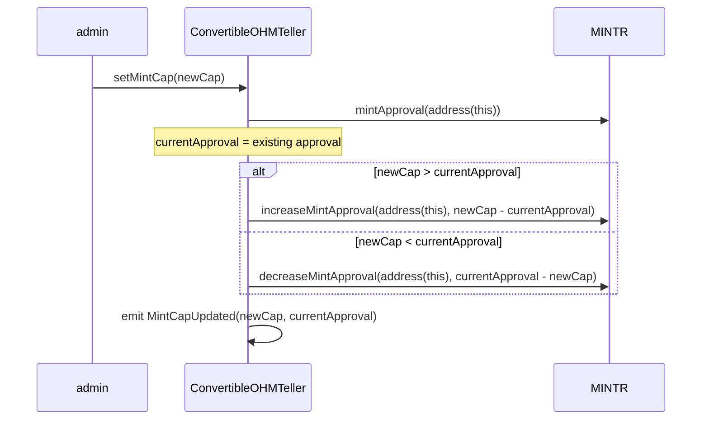

# Olympus Rewards Distribution Audit

## Purpose

The purpose of this audit is to review the contracts for the Rewards Distribution system.

These contracts will be installed in the Olympus V3 "Bophades" system, based on the [Default Framework](https://palm-cause-2bd.notion.site/Default-A-Design-Pattern-for-Better-Protocol-Development-7f8ace6d263c4303b108dc5f8c3055b1).

## Design

The Rewards Distribution system incentivises participation in protocol activities (CD deposits, conversions, governance voting, etc.) by distributing rewards through an epoch-based Merkle tree mechanism.

### Overview

Users earn "Drachma" points off-chain by engaging with the protocol. At the end of each epoch, accumulated points determine each user's share of a reward pool. An off-chain backend computes a Merkle tree of cumulative entitlements, and the root is posted on-chain. Users then submit Merkle proofs to claim their rewards.

The system supports two reward types through separate distributor contracts:

| Reward Type | Distributor | Token | Mechanism |
|---|---|---|---|
| USDS Vault Rewards | `RewardDistributorUSDS` | sUSDS / USDS | Treasury withdrawal of vault tokens |
| Convertible OHM Rewards | `RewardDistributorConvertible` | convOHM | Fixed-strike call options on OHM |

### USDS Vault Rewards

The USDS reward distributor withdraws sUSDS (the ERC4626 vault token for USDS) from the Olympus Treasury to fulfil claims. Users may choose to receive:

- **sUSDS** (vault token) -- transferred directly from treasury
- **USDS** (underlying) -- sUSDS is withdrawn from treasury, unwrapped via the vault, and the underlying USDS is transferred to the user. Any leftover vault shares from rounding are returned to the treasury.

### Convertible OHM Rewards (convOHM)

Convertible OHM tokens are fixed-strike American-style call options on OHM. Each epoch produces a distinct convOHM token with specific parameters (quote token, strike price, eligibility window, expiry).

The lifecycle is:

1. **Deploy** -- When an epoch ends, an off-chain backend calculates token configuration params, the admin then sets the Merkle root and the `RewardDistributorConvertible` deploys a new convOHM token via the `ConvertibleOHMTeller`.
2. **Claim** -- Users submit Merkle proofs to the distributor, which mints convOHM to them via the teller.
3. **Exercise** -- Between the eligible date and expiry, convOHM holders can exercise their tokens: they pay `amount * strikePrice / 1e9` in the quote token (e.g. USDS), the convOHM is burned, and fresh OHM is minted to the user via the MINTR module.
4. **Expiry** -- Unexercised tokens expire worthless. There is no reclaim mechanism (unlike the Bond Protocol original, which pre-deposited collateral).

#### Token Naming

Each convOHM token is named with the format:

- **Name**: `<quoteSymbol>/OHM <price> <YYYYMMDD>` (e.g. `USDS/OHM 15.50 20260301` with the date marking the conversion eligibility period)
- **Symbol**: `convOHM-<YYYYMMDD>` (e.g. `convOHM-20260301`)

#### Forked from Bond Protocol

The `ConvertibleOHMTeller` and `ConvertibleOHMToken` contracts are forked from [Bond Protocol's option-contracts](https://github.com/Bond-Protocol/option-contracts) (`FixedStrikeOptionTeller` and `FixedStrikeOptionToken`), which have been [previously audited](https://github.com/Bond-Protocol/option-contracts/tree/master/audit) and battle-tested in production.

Key changes from the Bond Protocol originals:

| Change | Detail |
|---|---|
| Kernel integration | Replaced Solmate `Auth` with Bophades Policy framework (ROLES, MINTR, TRSRY modules) |
| OHM-only call options | Removed `payoutToken`, `receiver`, and `call/put` parameters |
| Mint-on-exercise model | OHM is minted via MINTR on exercise instead of pre-deposited collateral |
| Creator isolation | Token hash includes `creator` (deploying distributor) to prevent cross-distributor collisions |
| Removed features | `reclaim()`, protocol fees (`claimFees()`), collateral tracking |
| Mint cap management | Added MINTR approval management to control total OHM minting |
| Reentrancy guard | Upgraded from `ReentrancyGuard` to `ReentrancyGuardTransient` (gas optimized) |

The clone libraries (`Clone.sol`, `CloneERC20.sol`) are **verbatim copies** from Bond Protocol and are included for completeness but should require minimal review.

## Scope

### In-Scope Contracts

The contracts in scope for this audit are:

#### Reward Distribution Infrastructure

- [src/](../../src/)
    - [policies/](../../src/policies/)
        - [rewards/](../../src/policies/rewards/)
            - [BaseRewardDistributor.sol](../../src/policies/rewards/BaseRewardDistributor.sol)
            - [BaseVaultRewardDistributor.sol](../../src/policies/rewards/BaseVaultRewardDistributor.sol)
            - [RewardDistributorConvertible.sol](../../src/policies/rewards/RewardDistributorConvertible.sol)
            - [RewardDistributorUSDS.sol](../../src/policies/rewards/RewardDistributorUSDS.sol)
        - [interfaces/](../../src/policies/interfaces/)
            - [rewards/](../../src/policies/interfaces/rewards/)
                - [IRewardDistributor.sol](../../src/policies/interfaces/rewards/IRewardDistributor.sol)
                - [IRewardDistributorConvertible.sol](../../src/policies/interfaces/rewards/IRewardDistributorConvertible.sol)
                - [IVaultRewardDistributor.sol](../../src/policies/interfaces/rewards/IVaultRewardDistributor.sol)

#### Convertible Token System (Forked from Bond Protocol)

- [src/](../../src/)
    - [policies/](../../src/policies/)
        - [rewards/](../../src/policies/rewards/)
            - [convertible/](../../src/policies/rewards/convertible/)
                - [ConvertibleOHMTeller.sol](../../src/policies/rewards/convertible/ConvertibleOHMTeller.sol)
                - [ConvertibleOHMToken.sol](../../src/policies/rewards/convertible/ConvertibleOHMToken.sol)
                - [interfaces/](../../src/policies/rewards/convertible/interfaces/)
                    - [IConvertibleOHMTeller.sol](../../src/policies/rewards/convertible/interfaces/IConvertibleOHMTeller.sol)
                - [lib/](../../src/policies/rewards/convertible/lib/)
                    - [clones/](../../src/policies/rewards/convertible/lib/clones/)
                        - [Clone.sol](../../src/policies/rewards/convertible/lib/clones/Clone.sol)
                        - [CloneERC20.sol](../../src/policies/rewards/convertible/lib/clones/CloneERC20.sol)

See the [solidity-metrics.html](./solidity-metrics.html) report for a summary of the code metrics for these contracts.

### Audit Priority

Given the Bond Protocol fork, the audit effort should be weighted as follows:

| Priority | Contracts | Rationale |
|---|---|---|
| **High** | `BaseRewardDistributor`, `BaseVaultRewardDistributor`, `RewardDistributorConvertible`, `RewardDistributorUSDS` | Entirely new code; Merkle tree logic, treasury interactions, claim flows |
| **High** | `ConvertibleOHMTeller` (deltas from Bond Protocol) | Kernel integration, MINTR minting model, removed features, creator isolation |
| **Medium** | `ConvertibleOHMToken` (deltas from Bond Protocol) | Reduced immutable layout, added creator field, renamed mint/burn |
| **Low** | `Clone.sol`, `CloneERC20.sol` | Verbatim copies from audited Bond Protocol code |
| **Low** | Interface files | Type definitions, events, errors (no logic) |

### Out-of-Scope

- Off-chain Merkle tree generation (Drachma point calculation, pool sizing, tree construction)
- Deployment scripts (`src/scripts/`)
- Proposal contracts (`src/proposals/`)
- Test files (`src/test/`)
- Existing Bophades modules (Kernel, MINTR, TRSRY, ROLES) -- previously audited

## Architecture

### Inheritance Hierarchy

```
Policy (Bophades)
  |
  +-- BaseRewardDistributor (abstract)
  |     |   implements IRewardDistributor, IVersioned, PolicyEnabler
  |     |   provides: epoch management, Merkle verification, claim tracking
  |     |
  |     +-- BaseVaultRewardDistributor (abstract)
  |     |     |   implements IVaultRewardDistributor
  |     |     |   provides: vault token handling, treasury withdrawal, claim/preview
  |     |     |
  |     |     +-- RewardDistributorUSDS (concrete)
  |     |           provides: sUSDS/USDS transfer logic
  |     |
  |     +-- RewardDistributorConvertible (concrete)
  |           implements IRewardDistributorConvertible
  |           provides: convOHM token deployment and minting via Teller
  |
  +-- ConvertibleOHMTeller (concrete)
        implements IConvertibleOHMTeller, IVersioned, PolicyEnabler, ReentrancyGuardTransient
        provides: token deployment, minting, exercise, mint cap management

CloneERC20 (standalone, from Bond Protocol)
  |
  +-- ConvertibleOHMToken
        provides: immutable-args ERC20 with mint/burn gated to teller
```

### System Overview



### Access Control

| Role | Holder | Permissions |
|---|---|---|
| `rewards_merkle_updater` | Off-chain backend / multisig | Call `endEpoch()` on distributors |
| `convertible_distributor` | `RewardDistributorConvertible` | Call `deploy()` and `create()` on `ConvertibleOHMTeller` |
| `convertible_admin` | Multisig / governance | Call `setMinDuration()` on `ConvertibleOHMTeller` |
| Admin role (PolicyEnabler) | Multisig / governance | Enable/disable distributors and teller, `setMintCap()` |
| Emergency role (PolicyEnabler) | Emergency multisig | Disable distributors and teller |

### Module Dependencies

| Contract | ROLES | MINTR | TRSRY |
|---|---|---|---|
| `BaseRewardDistributor` | Yes (via derived) | - | - |
| `BaseVaultRewardDistributor` | Yes | - | Yes |
| `RewardDistributorUSDS` | Yes | - | Yes |
| `RewardDistributorConvertible` | Yes | - | - |
| `ConvertibleOHMTeller` | Yes | Yes | Yes |

## Processes

### Ending an Epoch (USDS Rewards)

An authorised caller posts the Merkle root for a completed epoch. The epoch end date must be at a day boundary (23:59:59 UTC) and at least `MIN_EPOCH_DURATION` (1 day) after the previous epoch.



### Ending an Epoch (Convertible Rewards)

Similar to USDS, but also deploys a new convOHM token for the epoch via the teller.



### Claiming USDS Rewards



### Claiming Convertible Rewards



### Exercising convOHM



### Activation and Deactivation

All distributors and the teller use the `PolicyEnabler` pattern for lifecycle management.



### Mint Cap Management

The `ConvertibleOHMTeller` manages its own MINTR approval to enforce a protocol-wide cap on OHM minting through convOHM exercise.

