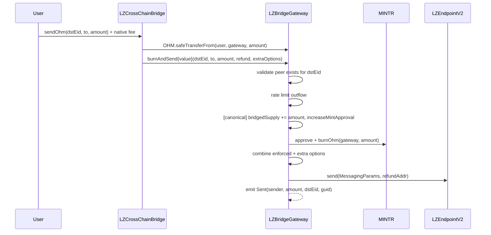
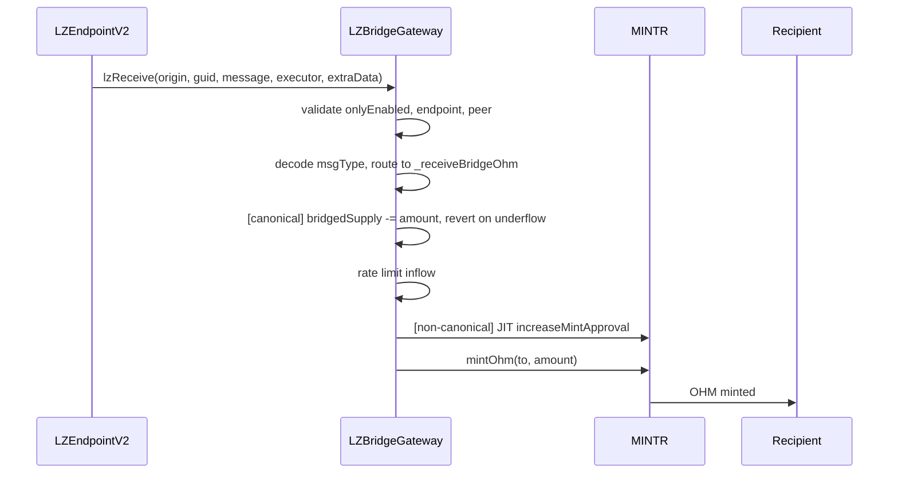

# Olympus LayerZero Bridge Security Upgrade Audit

## Purpose

The purpose of this audit is to review the security upgrade of the Olympus LayerZero cross-chain OHM bridge infrastructure, replacing the existing `CrossChainBridge` policy with a new four-contract architecture: `LZBridgeGateway` (infrastructure policy), `LZEndpointDelegate` (stateless LZ-endpoint delegate policy), `LZCrossChainBridge` (periphery facilitator), and `LZBridgeAndDelegateConfig` (timelock policy).

These contracts will be installed in the Olympus V3 "Bophades" system, based on the [Default Framework](https://palm-cause-2bd.notion.site/Default-A-Design-Pattern-for-Better-Protocol-Development-7f8ace6d263c4303b108dc5f8c3055b1).

## Design

The existing `CrossChainBridge` policy (deployed on Ethereum, Arbitrum, Optimism, Base, and Berachain) combines user-facing bridging, LayerZero V1 endpoint communication, and OHM mint/burn into a single contract. This upgrade separates concerns into four contracts and introduces several security hardening measures.

The new design splits the bridge into four contracts:

1. **LZBridgeGateway** (Policy) — Infrastructure contract that handles user-facing LayerZero V2 endpoint communication (send/receive, peer management, enforced options, rate limiting), OHM mint/burn via MINTR, and bridged supply tracking. OApp-authorized endpoint operations (libraries, ULN/Executor config, messaging channel control) live on the LZEndpointDelegate policy. The configuration mutators that touch bridged supply, the LZ endpoint delegate, rate limits, in-flight state, and the grace period are gated by the `bridge_configurator` role, which is expected to be granted exclusively to `LZBridgeAndDelegateConfig` (the timelock policy); the one-shot `initializeBridgedSupply` bootstrap is gated by `bridge_admin` / `admin` for the post-OCG handoff.
2. **LZEndpointDelegate** (Policy) — Stateless policy assigned as the gateway's LayerZero V2 endpoint delegate. Forwards OApp-authorized endpoint calls (library and config management, messaging channel control) on behalf of the gateway, gated to the `bridge_configurator` role.
3. **LZCrossChainBridge** (Periphery) — User-facing facilitator contract authorized via the `bridge_facilitator` role. Users approve and send OHM through this contract, which transfers it to the gateway for burning and cross-chain messaging. The configurator-gated setters (`setGateway`, `setReEnabler`, `setGracePeriod`, post-bootstrap `setConfigurator`) are reachable only through `LZBridgeAndDelegateConfig`.
4. **LZBridgeAndDelegateConfig** (Policy) — Timelock policy expected to hold the `bridge_configurator` role on the gateway and the LZ endpoint delegate and to be pinned as the periphery bridge's `configurator`, so that every `bridge_configurator`-gated or `configurator`-gated mutator on the three contracts above is reached only through its timelock queue. Proposer roles (`bridge_admin`, `bridge_rate_limiter`, `admin`) queue actions through typed helpers; after the configured delay anyone may execute the queued action; the emergency role can cancel before execution. The policy inherits the reusable `TimelockBatchQueue` base for atomic multi-action batches.

```text
User -> LZCrossChainBridge (bridge_facilitator role) -> LZBridgeGateway (policy) -> LZ Endpoint V2 -> [destination]
```

On receive:

```text
LZ Endpoint V2 -> LZBridgeGateway.lzReceive -> validate peer -> mint OHM to recipient
```

Additionally, an OCG proposal (backed by the `LZBridgeActivator` helper contract that splits configuration across multiple sub-actions to stay within the governance 15-action limit) and multisig batch scripts handle the on-chain migration: deployment, pre-OCG activation of gateway / delegate / config policies, OCG execution (LZ V2 config + peers + options + enable gateway, with `bridge_configurator` granted to the activator for the duration and then permanently re-granted to the config policy), one-shot bootstrap of the periphery bridge's `configurator` variable, old bridge disablement, bridged supply snapshot via `initializeBridgedSupply`, non-canonical chain setup, and Ethereum periphery activation.

## Scope

Branch: `lz-bridge-upgrade`

### In-Scope Contracts

#### Core Contracts

- [src/](../../src)
    - [periphery/](../../src/periphery/)
        - [bridge/](../../src/periphery/bridge/)
            - [LZCrossChainBridge.sol](../../src/periphery/bridge/LZCrossChainBridge.sol) — Facilitator (periphery)
        - [interfaces/](../../src/periphery/interfaces/)
            - [ILZCrossChainBridge.sol](../../src/periphery/interfaces/ILZCrossChainBridge.sol) — Facilitator interface
    - [policies/](../../src/policies/)
        - [bridge/](../../src/policies/bridge/)
            - [LZBridgeGateway.sol](../../src/policies/bridge/LZBridgeGateway.sol) — Gateway infrastructure policy
            - [LZEndpointDelegate.sol](../../src/policies/bridge/LZEndpointDelegate.sol) — Stateless policy assigned as the gateway's LZ V2 endpoint delegate. Every external function forwards the call to the LayerZero endpoint with `LZEndpointDelegate.GATEWAY` as the OApp argument; the endpoint accepts these calls only while this policy is the gateway's endpoint delegate
            - [LZBridgeAndDelegateConfig.sol](../../src/policies/bridge/LZBridgeAndDelegateConfig.sol) — Timelock policy expected to hold `bridge_configurator` on the gateway and the LZ endpoint delegate and to be pinned as the periphery bridge's `configurator`, so that every `bridge_configurator`-gated or `configurator`-gated mutator on those three contracts is reached only through its timelock queue. Exposes a `queue([...])` batch entry point for gateway / delegate / facilitator sub-actions plus typed `queueSetTarget*` / `queueSetTimelockDelay` self-config helpers; execution is permissionless after the timelock and emergency-cancellable
        - [interfaces/](../../src/policies/interfaces/)
            - [ILZBridgeGateway.sol](../../src/policies/interfaces/ILZBridgeGateway.sol) — Gateway interface
            - [ILZEndpointDelegate.sol](../../src/policies/interfaces/ILZEndpointDelegate.sol) — Delegate policy interface (immutables, view accessors)
            - [ILZEndpointV2Authorized.sol](../../src/policies/interfaces/ILZEndpointV2Authorized.sol) — LZ V2 endpoint delegate-callable surface (libraries, ULN/Executor config, messaging channel control)
            - [ILZBridgeAndDelegateConfig.sol](../../src/policies/interfaces/ILZBridgeAndDelegateConfig.sol) — config policy interface (queue helpers, target slots, timelock constants). The configured timelock delay is bounded by `MIN_TIMELOCK_DELAY` (1 day) and `MAX_TIMELOCK_DELAY` (30 days); the default at deployment is 1 day. The execution window is `EXECUTION_WINDOW` (3 days): a queued action expires `executableAt + 3 days` if not executed.
        - [utils/](../../src/policies/utils/)
            - [TimelockBatchQueue.sol](../../src/policies/utils/TimelockBatchQueue.sol) — Reusable abstract base for atomic batched timelocked actions; inherited by `LZBridgeAndDelegateConfig`
        - [interfaces/utils/](../../src/policies/interfaces/utils/)
            - [ITimelockBatchQueue.sol](../../src/policies/interfaces/utils/ITimelockBatchQueue.sol) — Reusable timelock queue interface (events, errors, data structures, lifecycle methods)
    - [bases/](../../src/bases/)
        - [Rescueable.sol](../../src/bases/Rescueable.sol) — Reusable abstract base exposing privileged `rescue()` to sweep accidentally-sent assets; subclasses authorize via the `_authorizeRescue()` hook.
        - [interfaces/IRescueable.sol](../../src/bases/interfaces/IRescueable.sol) — Rescue interface (declares only the `rescue(token, to)` function)
    - [libraries/Errors.sol](../../src/libraries/Errors.sol) — Shared custom errors to be reused by different contracts instead of contract-local duplicates
    - [libraries/ERC7528Constants.sol](../../src/libraries/ERC7528Constants.sol) — EIP-7528 native-asset sentinel address

**OApp provenance:** Peer management, endpoint send/receive, and enforced-option logic are ported inline from `@lz-oapp-evm v0.4.1` (OAppCore, OAppSender, OAppReceiver, OAppOptionsType3) because those contracts assume OZ Ownable, incompatible with Bophades Kernel RBAC.

#### Deployment & Configuration

These contracts configure and deploy the core contracts. Misconfiguration here (wrong addresses, wrong confirmation counts, incorrect role grants, wrong migration ordering) can undermine the security properties of the core contracts.

- [src/](../../src)
    - [scripts/deploy/](../../src/scripts/deploy/)
        - [DeployV3.s.sol](../../src/scripts/deploy/DeployV3.s.sol) — `deployLZBridgeGateway()`, `deployLZEndpointDelegate()`, `deployLZCrossChainBridge()`, `deployLZBridgeAndDelegateConfig()`, and `deployLZBridgeActivator()` deployment functions
    - [scripts/ops/lib/](../../src/scripts/ops/lib/)
        - [LZConfigLib.sol](../../src/scripts/ops/lib/LZConfigLib.sol) — Shared LZ V2 constants (endpoints, message libraries, DVNs, executors, confirmation counts), chain/EID mappings, and configuration encoding helpers
    - [proposals/](../../src/proposals/)
        - [LZBridgeSecurityUpgradeProposal.sol](../../src/proposals/LZBridgeSecurityUpgradeProposal.sol) — OCG proposal: configures and enables the gateway on Ethereum (pins V2 libraries, sets ULN/Executor config, peers, enforced options, grants bridge roles)
        - [LZBridgeActivator.sol](../../src/proposals/LZBridgeActivator.sol) — OCG activator contract invoked by the proposal; splits LZ V2 configuration across multiple actions to stay within the governance 15-action limit, and carries per-chain DVN routing (four required DVNs per route, swapping the Google Cloud DVN for the Horizen DVN on routes that touch Berachain; no optional DVNs — pins the NIL sentinel)
    - [scripts/ops/batches/](../../src/scripts/ops/batches/)
        - [LZBridgeGatewayBatch.sol](../../src/scripts/ops/batches/LZBridgeGatewayBatch.sol) — Ethereum MS batch: `activateGateway` (install gateway, delegate, and Config in Kernel) and `initBridgedSupply` (one-shot `initializeBridgedSupply` bootstrap)
        - [LZBridgeGatewayL2Batch.sol](../../src/scripts/ops/batches/LZBridgeGatewayL2Batch.sol) — L2 MS batch split into five entry points by caller responsibility: `activateGateway` (deactivate old bridge, activate new gateway/delegate/Config), `grantRoles` (grant bridge roles plus a temporary `bridge_configurator`), `configureAndEnable` (configure LZ V2 libraries/ULN/executor, set peers, set enforced options, enable the gateway), `wireConfig` (revoke the temporary `bridge_configurator` from the DAO MS, grant the permanent role to the config policy, and enable the config policy), and `revokeSetupRoles` (optional post-setup cleanup: revoke admin role from DAO MS on chains where it was granted during migration). Each entry point has a matching post-batch `_validate*` check. Inlines the shared LZ V2 configuration helpers and per-chain DVN addresses.
        - [LZCrossChainBridgeBatch.sol](../../src/scripts/ops/batches/LZCrossChainBridgeBatch.sol) — Ethereum MS batch: `initializeConfigurator` (one-shot owner call pinning the periphery bridge to the config policy), `disableOldBridge` (post-OCG), `setup` (deactivate old + enable new)
        - [LZCrossChainBridgeL2Batch.sol](../../src/scripts/ops/batches/LZCrossChainBridgeL2Batch.sol) — L2 MS batch: `initializeConfigurator`, `disableOldBridge`, `setupL2` (enable bridge)

### Previous Audits

You can review previous audits here:

- Spearbit (07/2022)
    - [Report](https://storage.googleapis.com/olympusdao-landing-page-reports/audits/2022-08%20Code4rena.pdf)
- Code4rena Olympus V3 Audit (08/2022)
    - [Repo](https://github.com/code-423n4/2022-08-olympus)
    - [Findings](https://github.com/code-423n4/2022-08-olympus-findings)
- Kebabsec Olympus V3 Remediation and Follow-up Audits (10/2022 - 11/2022)
    - [Remediation Audit Phase 1 Report](https://hackmd.io/tJdujc0gSICv06p_9GgeFQ)
    - [Remediation Audit Phase 2 Report](https://hackmd.io/@12og4u7y8i/rk5PeIiEs)
    - [Follow-on Audit Report](https://hackmd.io/@12og4u7y8i/Sk56otcBs)
- Cross-Chain Bridge by OtterSec (04/2023)
    - [Report](https://storage.googleapis.com/olympusdao-landing-page-reports/audits/Olympus-CrossChain-Audit.pdf)
- Cooler V2 by Electisec (03/2025)
    - [Report](https://storage.googleapis.com/olympusdao-landing-page-reports/audits/Olympus_CoolerV2-Electisec_report.pdf)
    - The PolicyEnabler and PolicyAdmin mix-ins are audited here

## Implementation

### Key Security Improvements Over CrossChainBridge

1. **Bridged supply tracking** (canonical chain only): Tracks outbound OHM (`bridgedSupply`) with an underflow check on inbound receives, preventing unlimited mints from non-canonical chains.
2. **Receive gating on `lzReceive`**: The original `CrossChainBridge` does not check `bridgeActive` on inbound messages. The new gateway gates `lzReceive` on an `isReceiveEnabled` flag that is automatically set on `enable` and cleared on `disable` (and can additionally be toggled by `admin` / `emergency` via `setIsReceiveEnabled` while the gateway is disabled), so disabling the bridge blocks both inbound and outbound transfers. Note: disabling the gateway does **not** block the inbound-channel management functions (`skip`, `nilify`, `burn`, `clear`), which live on `LZEndpointDelegate` (a separate policy).
3. **Elimination of custom retry mechanism**: The original `CrossChainBridge` stores failed message hashes in `failedMessages` and exposes a `retryMessage` function that does not re-validate the trusted remote. The new gateway removes this entirely in favour of native LayerZero V2 message delivery, which enforces peer validation on retry and eliminates the risk of replaying messages from removed peers.
4. **Separation of concerns**: The facilitator (`LZCrossChainBridge`) has no MINTR permissions and is authorized via the `bridge_facilitator` role. It merely transfers OHM to the gateway and calls `burnAndSend`.
5. **Typed message encoding**: Payload format changed from `abi.encode(to, amount)` to `abi.encode(uint8 msgType, bytes data)` to support future message types.
6. **Explicit LZ V2 endpoint configuration**: Migration from default LayerZero V1 configuration to explicitly pinned V2 endpoint configuration (SendUln302/ReceiveUln302 libraries, DVN and Executor config), eliminating the drag-along vulnerability and the proof library substitution attack vector. Verification requires four DVNs on every route: LayerZero Labs, Canary, and Nethermind, plus a fourth DVN selected per route — Google Cloud on chains where it is available, and Horizen for routes that touch Berachain (where Google Cloud is not available). Optional DVNs are pinned to the LayerZero NIL sentinel (`optionalDVNCount == type(uint8).max`) so the OApp-level config explicitly declares "no optional DVNs" rather than inheriting the EID-level default — a future change to LayerZero's default cannot silently attach an optional DVN to verified messages.
7. **Timelock-gated privileged operations via `LZBridgeAndDelegateConfig`**: the privileged configuration mutators on `LZBridgeGateway`, `LZEndpointDelegate`, and the periphery `LZCrossChainBridge` are gated by the `bridge_configurator` role (on the gateway and the delegate) or by the `configurator` variable (on the periphery). In the intended deployment that role is granted exclusively to the `LZBridgeAndDelegateConfig` policy and the periphery's `configurator` is pinned at the same policy, so those mutators are reached only through the policy's timelock queue. These contracts do not enforce a timelock themselves; it is enforced only by the `LZBridgeAndDelegateConfig` role holder. Granting `bridge_configurator` to any other address bypasses the timelock for these mutators. Proposer roles partition the queue surface: `bridge_admin` (or `admin`) queues most actions, `bridge_rate_limiter` (or `bridge_admin` / `admin`) is the narrower role bounded to the four rate-limit / in-flight-clear mutators, and `admin` is the only role that may queue self-mutations (rotation of the policy's `gateway` / `delegate` / `facilitator` variables, timelock-delay updates, and rotation of the periphery's configurator). Execution is permissionless once the timelock has elapsed; the `emergency` role can cancel a queued action at any time before execution. The LayerZero V2 OApp-authorized endpoint functions (libraries, ULN/Executor config, messaging control) live on the `LZEndpointDelegate` policy, which the gateway points at via `setDelegate`; the LayerZero endpoint accepts the forwarded calls with the gateway passed as the OApp argument. The delegate can be reassigned in the future (e.g. if the LayerZero endpoint interface changes) via `setDelegate`.
    Two functions are intentionally outside the `bridge_configurator` / `configurator` gates: the one-shot `LZBridgeGateway.initializeBridgedSupply`, which is called under `bridge_admin` / `admin` immediately after the OCG proposal to bootstrap the canonical bridged supply, and the bootstrap call to `LZCrossChainBridge.setConfigurator`, which is used once after deployment to seed the configurator variable. After both bootstrap calls and the corresponding role / configurator grants, the policy's timelock queue is the only path to those mutators. The remaining non-`bridge_configurator` surface on the gateway covers operational responses that must be immediate: `setPeer`, `setEnforcedOptions`, `setIsReceiveEnabled`, `enable` / `disable` / `reEnable`, and `rescue`.
8. **Enforced Type 3 options**: Replaces LayerZero V1 adapter parameters with enforced Type 3 options that guarantee minimum destination gas per message type. The gateway supports combining enforced options with caller-supplied options at send time.
9. **Per-endpoint bidirectional rate limiting**: Mandatory rate limiting via `OffsettingRateLimiter` inheritance. Each peer EID has independent outbound and inbound rate limits with a sliding-window decay; both directions revert with `RateLimitExceeded` once the configured limit is exhausted. Activity in one direction offsets the in-flight amount of the counterpart (with a floor at zero), so balanced round trips free capacity faster than purely additive accounting. Limits are applied at activation time (24-hour window throughout): on canonical Ethereum, 100,000 OHM outbound and 55,000 OHM inbound per remote; on each non-canonical chain, outbound is 50,000 OHM towards Ethereum and 100,000 OHM towards every other non-canonical peer, while inbound is 110,000 OHM per remote regardless of source.
10. **V2 inbound-channel management primitives**: Replaces the V1 `forceResumeReceive` with native V2 inbound-channel management functions (`skip`, `nilify`, `burn`, `clear`). These live on `LZEndpointDelegate` and are gated directly to `bridge_admin` / `admin`.
11. **Multi-network Berachain routing**: The Berachain bridge now supports routes to Arbitrum, Optimism, and Base in addition to Ethereum.
12. **Asset rescue**: Both the gateway and the periphery facilitator inherit the `Rescueable` base, exposing a privileged `rescue(token, to)` that sweeps the full balance of an ERC20 (or the native asset, identified via the EIP-7528 sentinel `ERC7528Constants`) to a non-zero recipient. On `LZBridgeGateway`, rescue is gated by `manager` or `admin`; on `LZCrossChainBridge`, by the contract `owner`. Rescue is callable while the contract is disabled. This recovers assets accidentally sent to either contract without depending on the bridging path.

### LZ V2 Receiver Callbacks

The gateway implements `ILayerZeroReceiver`:

- **`allowInitializePath(origin)`**: Returns `true` only if the peer for `origin.srcEid` is non-zero and equals `origin.sender`. The explicit zero check prevents a cleared or unset peer from matching a zero sender. Controls which communication paths the LZ V2 endpoint can initialize for this contract.
- **`nextNonce(_, _)`**: Returns `0` — unordered (nonce-independent) delivery, the default per `OAppReceiver` (`@lz-oapp-evm-0.4.1`). Matches the original V1 CrossChainBridge, which also does not enforce message ordering.

### Bridged Supply Tracking

On the canonical chain (Ethereum, `IS_CANONICAL == true`):

- **Outbound** (`burnAndSend`): `bridgedSupply += amount`
- **Inbound** (`_receiveBridgeOhm`): `bridgedSupply -= amount`; reverts if underflow

On non-canonical chains: supply tracking is skipped entirely.

`initializeBridgedSupply` is the one-shot bootstrap, gated by `bridge_admin` or `admin`, used immediately after the OCG proposal so the DAO MS can write the canonical chain's initial bridged supply without going through the `bridge_configurator` role (and therefore without paying the `LZBridgeAndDelegateConfig` timelock). It reverts on a second call, on a non-zero current bridged supply, and on a zero amount; after the bootstrap the `bridge_configurator`-gated `increaseBridgedSupply` and `decreaseBridgedSupply` (expected to be reached only via a `LZBridgeAndDelegateConfig.queue` batch carrying a `gateway.increaseBridgedSupply` / `gateway.decreaseBridgedSupply` sub-action) are the only path for error recovery.

### Message Flow

#### Sending OHM (Source Chain)



#### Receiving OHM (Destination Chain)



### Access Control Summary

#### LZBridgeGateway

| Function                  | Direct caller                                  | Notes |
| ------------------------- | ---------------------------------------------- | ----- |
| `burnAndSend`             | `bridge_facilitator`                           | `givenEnabled` |
| `lzReceive`               | LZ Endpoint + peer                             | `isReceiveEnabled == true` |
| `setPeer`                 | `admin`                                        |  |
| `setEnforcedOptions`      | `admin`                                        |  |
| `setIsReceiveEnabled`     | `admin` / `emergency`                          | `givenDisabled` |
| `enable`                  | `admin`                                        | `givenDisabled` |
| `disable`                 | `admin` / `emergency`                          | `givenEnabled` |
| `reEnable`                | `manager`                                      | inside `gracePeriod` since `lastTransitionAt` |
| `initializeBridgedSupply` | `bridge_admin` / `admin`                       | one-shot bootstrap; canonical chain only |
| `setGracePeriod`          | `bridge_configurator`                          | expected to be timelocked |
| `setDelegate`             | `bridge_configurator`                          | expected to be timelocked (`queue` with a `gateway.setDelegate` sub-action) |
| `increaseBridgedSupply`   | `bridge_configurator`                          | expected to be timelocked; canonical chain only |
| `decreaseBridgedSupply`   | `bridge_configurator`                          | expected to be timelocked; canonical chain only |
| `setOutRateLimits`        | `bridge_configurator`                          | expected to be timelocked |
| `setInRateLimits`         | `bridge_configurator`                          | expected to be timelocked |
| `clearOutboundInFlight`   | `bridge_configurator`                          | expected to be timelocked |
| `clearInboundInFlight`    | `bridge_configurator`                          | expected to be timelocked |
| `rescue`                  | `manager` / `admin`                            |  |

`reEnable` is bounded by the `gracePeriod` window measured from `lastTransitionAt`. The window is initialized at construction time (default `1 days`) and may be reconfigured via the `bridge_configurator`-gated `setGracePeriod`, expected to be reached only through a `LZBridgeAndDelegateConfig.queue` batch carrying a `gateway.setGracePeriod` sub-action.

`setDelegate` points the gateway's LayerZero endpoint delegate at the `LZEndpointDelegate` policy, whose surface is listed below.

#### LZEndpointDelegate

| Function                   | Direct caller            | Notes |
| -------------------------- | ------------------------ | ----- |
| `setSendLibrary`           | `bridge_configurator`    | `givenEnabled`; expected to be timelocked |
| `setReceiveLibrary`        | `bridge_configurator`    | `givenEnabled`; expected to be timelocked |
| `setReceiveLibraryTimeout` | `bridge_configurator`    | `givenEnabled`; expected to be timelocked |
| `setEndpointConfig`        | `bridge_configurator`    | `givenEnabled`; expected to be timelocked |
| `skip`                     | `bridge_admin` / `admin` | `givenEnabled` |
| `nilify`                   | `bridge_admin` / `admin` | `givenEnabled` |
| `burn`                     | `bridge_admin` / `admin` | `givenEnabled` |
| `clear`                    | `bridge_admin` / `admin` | `givenEnabled` |
| `enable`                   | `admin`                  | `givenDisabled` |
| `disable`                  | `admin` / `emergency`    | `givenEnabled` |

The library / endpoint-config setters are gated by `bridge_configurator` and are reached only as delegate sub-actions of `LZBridgeAndDelegateConfig.queue`.
The inbound-channel management primitives (`skip`, `nilify`, `burn`, `clear`) are gated directly to `bridge_admin` / `admin`.

#### LZCrossChainBridge

| Function             | Direct caller   | Notes |
| -------------------- | --------------- | ----- |
| `sendOhm`            | public          | `givenEnabled` |
| `enable` / `disable` | `owner`         |  |
| `reEnable`           | `reEnabler`     | inside `gracePeriod` since `lastTransitionAt` |
| `setConfigurator`    | `owner` (bootstrap, while `configurator == address(0)`) or `configurator` (rotation) | ERC-165 guard against bricking |
| `setGateway`         | `configurator`  | expected to be timelocked |
| `setReEnabler`       | `configurator`  | expected to be timelocked |
| `setGracePeriod`     | `configurator`  | expected to be timelocked; `givenEnabled` |
| `rescue`             | `owner`         |  |

`reEnable` is bounded by the `gracePeriod` window measured from `lastTransitionAt`. The window is initialized at construction time (default `1 days`) and may be reconfigured via the configurator-gated `setGracePeriod`. The `reEnabler` address is set in the constructor (the DAO MS in production) and may be updated or cleared by the configurator via the configurator-gated `setReEnabler`; while the address is `address(0)`, `reEnable` always reverts.

The `configurator` variable is the address that gates every configurator-gated setter. The bootstrap path is restricted to the contract `owner` (the DAO MS in production) and writes the variable only while it is unset; subsequent rotations must come from the current configurator. In the intended deployment the configurator is the `LZBridgeAndDelegateConfig` policy, so the configurator-gated setters are reached only through that policy's timelock queue. Both paths require the new configurator to implement `ILZBridgeAndDelegateConfig` (checked via ERC-165).

#### LZBridgeAndDelegateConfig

Gateway, delegate, and facilitator mutators are submitted as sub-actions of the single `queue([...])` batch entry point. The caller must hold the proposer role required by **every** sub-action in the batch. The proposer role for each supported (target, selector) sub-action:

| Sub-action (target.selector)                                                       | Proposer role                                |
| ---------------------------------------------------------------------------------- | -------------------------------------------- |
| `gateway.setDelegate`                                                              | `bridge_admin` / `admin`                     |
| `gateway.increaseBridgedSupply` / `gateway.decreaseBridgedSupply`                  | `bridge_admin` / `admin`                     |
| `gateway.setGracePeriod`                                                           | `bridge_admin` / `admin`                     |
| `gateway.setOutRateLimits` / `gateway.setInRateLimits`                             | `bridge_rate_limiter` / `bridge_admin` / `admin` |
| `gateway.clearOutboundInFlight` / `gateway.clearInboundInFlight`                   | `bridge_rate_limiter` / `bridge_admin` / `admin` |
| `delegate.setSendLibrary` / `delegate.setReceiveLibrary` / `delegate.setReceiveLibraryTimeout` | `bridge_admin` / `admin`           |
| `delegate.setEndpointConfig`                                                       | `bridge_admin` / `admin`                     |
| `facilitator.setGateway` / `facilitator.setReEnabler` / `facilitator.setGracePeriod` | `bridge_admin` / `admin`                   |
| `facilitator.setConfigurator`                                                      | `admin`                                      |

The policy's own configuration is rotated through typed self helpers, which reject self-targeted sub-actions inside `queue`:

| Function                                                                          | Proposer role                                |
| --------------------------------------------------------------------------------- | -------------------------------------------- |
| `queue`                                                                           | proposer role(s) implied by every sub-action; self-targeted sub-actions rejected |
| `queueSetTargetGateway` / `queueSetTargetDelegate` / `queueSetTargetFacilitator`  | `admin`                                      |
| `queueSetTimelockDelay`                                                           | `admin`                                      |
| `cancelQueuedAction`                                                              | `emergency`                                  |
