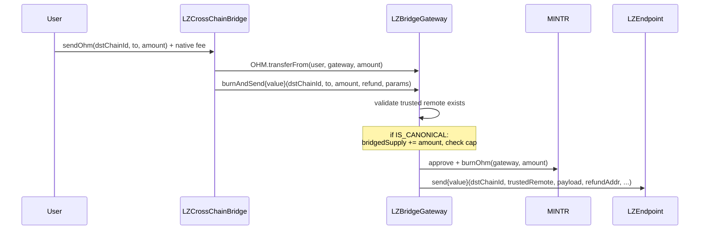
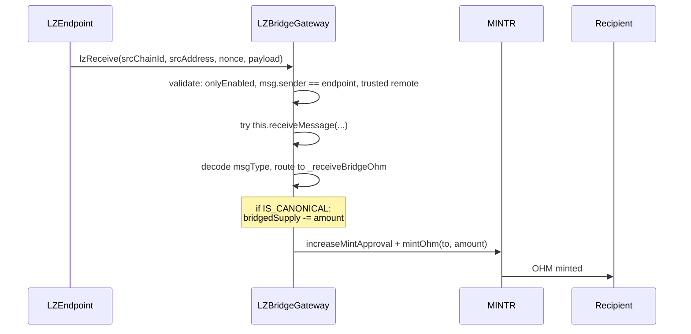
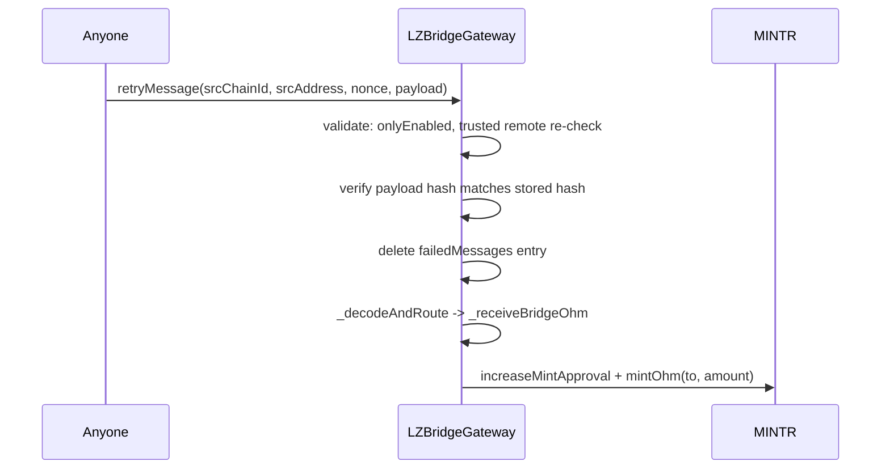

# Olympus LayerZero Bridge Security Upgrade Audit

## Purpose

The purpose of this audit is to review the security upgrade of the Olympus LayerZero cross-chain OHM bridge infrastructure, replacing the existing `CrossChainBridge` policy with a new two-contract architecture: `LZBridgeGateway` (infrastructure policy) and `LZCrossChainBridge` (periphery facilitator).

These contracts will be installed in the Olympus V3 "Bophades" system, based on the [Default Framework](https://palm-cause-2bd.notion.site/Default-A-Design-Pattern-for-Better-Protocol-Development-7f8ace6d263c4303b108dc5f8c3055b1).

## Design

The existing `CrossChainBridge` policy (deployed on Ethereum mainnet and Arbitrum) combines user-facing bridging, LayerZero endpoint communication, and OHM mint/burn into a single contract. This upgrade separates concerns into two contracts and introduces several security hardening measures.

The new design splits the bridge into two contracts:

1. **LZBridgeGateway** (Policy) - Infrastructure contract that handles all LayerZero endpoint communication, OHM mint/burn via MINTR, trusted remote management, and bridged supply cap enforcement.
2. **LZCrossChainBridge** (Periphery) - User-facing facilitator contract that has no privileged access to the Olympus protocol. Users approve and send OHM through this contract, which transfers it to the gateway for burning and cross-chain messaging.

```
User -> LZCrossChainBridge (facilitator) -> LZBridgeGateway (policy) -> LZ Endpoint -> [destination]
```

On receive:

```
LZ Endpoint -> LZBridgeGateway.lzReceive -> validate trusted remote -> mint OHM to recipient
```

Additionally, an OCG proposal and multisig batch scripts handle the on-chain migration: deactivating the old bridge, activating and configuring the new contracts, setting trusted remotes, granting roles, and enabling the bridge.

## Scope

### In-Scope Contracts

#### Core Contracts

- [src/](../../src)
    - [periphery/](../../src/periphery/)
        - [bridge/](../../src/periphery/bridge/)
            - [LZCrossChainBridge.sol](../../src/periphery/bridge/LZCrossChainBridge.sol) - Facilitator (periphery)
        - [interfaces/](../../src/periphery/interfaces/)
            - [ILZCrossChainBridge.sol](../../src/periphery/interfaces/ILZCrossChainBridge.sol) - Facilitator interface
    - [policies/](../../src/policies/)
        - [bridge/](../../src/policies/bridge/)
            - [LZBridgeGateway.sol](../../src/policies/bridge/LZBridgeGateway.sol) - Gateway infrastructure policy
        - [interfaces/](../../src/policies/interfaces/)
            - [ILZBridgeGateway.sol](../../src/policies/interfaces/ILZBridgeGateway.sol) - Gateway interface

#### Deployment & Configuration

These contracts configure and deploy the core contracts. Misconfiguration here (wrong addresses, wrong confirmation counts, incorrect role grants, wrong migration ordering) can undermine the security properties of the core contracts.

- [src/](../../src)
    - [libraries/](../../src/libraries/)
        - [LZConfigLib.sol](../../src/libraries/LZConfigLib.sol) - Shared LZ V1 ULN301 constants (endpoints, DVNs, executor, confirmation counts) and internal helpers
    - [proposals/](../../src/proposals/)
        - [LZBridgeSecurityUpgradeProposal.sol](../../src/proposals/LZBridgeSecurityUpgradeProposal.sol) - OCG proposal: configures gateway on Ethereum (LZ versions, ULN config, trusted remotes, supply cap)
    - [scripts/ops/batches/](../../src/scripts/ops/batches/)
        - [lib/](../../src/scripts/ops/batches/lib/)
            - [LZBridgeBatchScript.sol](../../src/scripts/ops/batches/lib/LZBridgeBatchScript.sol) - Base class with shared constants, per-chain DVN addresses, and config validation
            - [LZBridgeL2BatchScript.sol](../../src/scripts/ops/batches/lib/LZBridgeL2BatchScript.sol) - Base class for non-canonical chains (skips heartbeat validation)
        - [LZBridgeGatewayBatch.sol](../../src/scripts/ops/batches/LZBridgeGatewayBatch.sol) - Ethereum MS batch: activate gateway, set initial bridged supply
        - [LZBridgeGatewayL2Batch.sol](../../src/scripts/ops/batches/LZBridgeGatewayL2Batch.sol) - MS batch for non-canonical chains: deactivate old bridge, activate gateway, grant roles, configure LZ, set trusted remotes, enable
        - [LZCrossChainBridgeBatch.sol](../../src/scripts/ops/batches/LZCrossChainBridgeBatch.sol) - Ethereum MS batch: set gateway ref, enable facilitator, deactivate old bridge
        - [LZCrossChainBridgeL2Batch.sol](../../src/scripts/ops/batches/LZCrossChainBridgeL2Batch.sol) - MS batch for non-canonical chains: set gateway ref, enable facilitator

Branch: `lz-bridge-security-revamp` (base commit: `31b2502a51782f23bf0c63ffc9c53ee427c63a5d`)

### Previous Audits

You can review previous audits here:

- Spearbit (07/2022)
    - [Report](https://storage.googleapis.com/olympusdao-landing-page-reports/audits/2022-08%20Code4rena.pdf)
- Code4rena Olympus V3 Audit (08/2022)
    - [Repo](https://github.com/code-423n4/2022-08-olympus)
    - [Findings](https://github.com/code-423n4/2022-08-olympus-findings)
- Kebabsec Olympus V3 Remediation and Follow-up Audits (10/2022 - 11/2022)
    - [Remediation Audit Phase 1 Report](https://hackmd.io/tJdujc0gSICv06p_9GgeFQ)
    - [Remediation Audit Phase 2 Report](https://hackmd.io/@12og4u7y8i/rk5PeIiEs)
    - [Follow-on Audit Report](https://hackmd.io/@12og4u7y8i/Sk56otcBs)
- Cross-Chain Bridge by OtterSec (04/2023)
    - [Report](https://storage.googleapis.com/olympusdao-landing-page-reports/audits/Olympus-CrossChain-Audit.pdf)
- Cooler V2 by Electisec (03/2025)
    - [Report](https://storage.googleapis.com/olympusdao-landing-page-reports/audits/Olympus_CoolerV2-Electisec_report.pdf)
    - The PolicyEnabler and PolicyAdmin mix-ins are audited here

## Implementation

### Key Security Improvements Over CrossChainBridge

1. **Bridged supply cap** (canonical chain only): Tracks outbound OHM (`bridgedSupply`) and enforces a configurable `bridgedSupplyCap` to limit exposure in case of bridge compromise.
2. **`onlyEnabled` on `lzReceive`**: The original `CrossChainBridge` does not check `bridgeActive` on inbound messages. The new gateway checks `onlyEnabled`, meaning disabling the bridge blocks both inbound and outbound transfers.
3. **Trusted remote re-validation on retry**: The original `retryMessage` does not re-validate the trusted remote. If a trusted remote is removed after a message fails, the original allows replay. The new gateway re-validates on retry.
4. **`onlyEnabled` on `retryMessage`**: The original allows retrying failed messages even when the bridge is disabled. The new gateway enforces `onlyEnabled`.
5. **Separation of concerns**: The facilitator (`LZCrossChainBridge`) has no MINTR permissions. It merely transfers OHM to the gateway and calls `burnAndSend`. This limits the blast radius if the facilitator is compromised.
6. **Typed message encoding**: Payload format changed from `abi.encode(to, amount)` to `abi.encode(uint8 msgType, bytes data)` to support future message types (e.g. governance relay).
7. **`bridge_admin` role separation**: LZ endpoint configuration (`setConfig`, `setSendVersion`, `setReceiveVersion`, `forceResumeReceive`) and `setBridgedSupply` use a dedicated `bridge_admin` role, separate from the `admin` role used for business-level configuration.

### Bridged Supply Tracking

On the canonical chain (Ethereum, `IS_CANONICAL == true`):

- **Outbound** (`burnAndSend`): `bridgedSupply += amount`; reverts if `bridgedSupply > bridgedSupplyCap`
- **Inbound** (`_receiveBridgeOhm`): `bridgedSupply -= amount`; reverts if underflow

On non-canonical chains: supply tracking is skipped entirely.

`setBridgedSupply` is available to the `bridge_admin` role for migration bootstrapping and error recovery.

### Message Flow

#### Sending OHM (Source Chain)



#### Receiving OHM (Destination Chain)



#### Retrying Failed Messages



### Access Control Summary

#### LZBridgeGateway (Policy)

| Function | Access | Description |
|---|---|---|
| `burnAndSend` | `onlyFacilitator` + `onlyEnabled` | Burn OHM and send cross-chain |
| `lzReceive` | `onlyEnabled` + `msg.sender == LZ_ENDPOINT` | Receive LZ messages |
| `receiveMessage` | `msg.sender == address(this)` | Internal routing (self-call only) |
| `retryMessage` | `onlyEnabled` | Retry failed messages (public) |
| `setFacilitator` | `onlyAdminRole` | Set facilitator address |
| `setBridgedSupplyCap` | `onlyAdminRole` | Set bridged supply cap (canonical only) |
| `setTrustedRemote` | `onlyAdminRole` | Set/clear trusted remote |
| `setPrecrime` | `onlyAdminRole` | Set precrime address |
| `setBridgedSupply` | `onlyRole("bridge_admin")` | Manual supply correction (canonical only) |
| `setConfig` | `onlyRole("bridge_admin")` | LZ endpoint configuration |
| `setSendVersion` | `onlyRole("bridge_admin")` | LZ send version |
| `setReceiveVersion` | `onlyRole("bridge_admin")` | LZ receive version |
| `forceResumeReceive` | `onlyRole("bridge_admin")` | Force resume LZ receive queue |
| `enable` / `disable` | `onlyAdminRole` / `onlyEmergencyOrAdminRole` | PolicyEnabler |

#### LZCrossChainBridge (Periphery)

| Function | Access | Description |
|---|---|---|
| `sendOhm` | `onlyEnabled` (public) | User-facing: send OHM cross-chain |
| `setGateway` | `onlyOwner` | Set gateway address |
| `enable` / `disable` | `onlyOwner` | PeripheryEnabler |