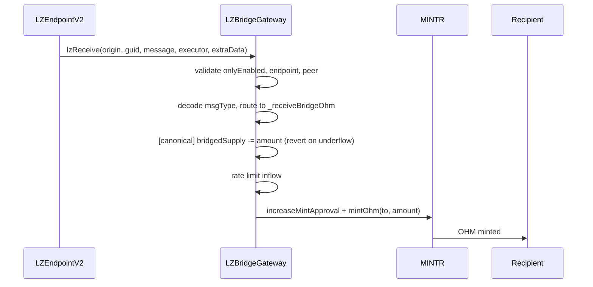

# Olympus LayerZero Bridge Security Upgrade Audit

## Purpose

The purpose of this audit is to review the security upgrade of the Olympus LayerZero cross-chain OHM bridge infrastructure, replacing the existing `CrossChainBridge` policy with a new two-contract architecture: `LZBridgeGateway` (infrastructure policy) and `LZCrossChainBridge` (periphery facilitator).

These contracts will be installed in the Olympus V3 "Bophades" system, based on the [Default Framework](https://palm-cause-2bd.notion.site/Default-A-Design-Pattern-for-Better-Protocol-Development-7f8ace6d263c4303b108dc5f8c3055b1).

## Design

The existing `CrossChainBridge` policy (deployed on Ethereum mainnet and Arbitrum) combines user-facing bridging, LayerZero endpoint communication, and OHM mint/burn into a single contract. This upgrade separates concerns into two contracts and introduces several security hardening measures.

The new design splits the bridge into two contracts:

1. **LZBridgeGateway** (Policy) - Infrastructure contract that handles all LayerZero V2 endpoint communication, OHM mint/burn via MINTR, peer management, enforced options, rate limiting, bridged supply tracking and cap enforcement, and proxying of LZ V2 endpoint configuration and message management functions for the `bridge_admin` role.
2. **LZCrossChainBridge** (Periphery) - User-facing facilitator contract that has no privileged access to the Olympus protocol. Users approve and send OHM through this contract, which transfers it to the gateway for burning and cross-chain messaging.

```
User -> LZCrossChainBridge (facilitator) -> LZBridgeGateway (policy) -> LZ Endpoint V2 -> [destination]
```

On receive:

```
LZ Endpoint V2 -> LZBridgeGateway.lzReceive -> validate peer -> mint OHM to recipient
```

Additionally, an OCG proposal and multisig batch scripts handle the on-chain migration across seven phases: deployment, pre-OCG gateway wiring, OCG execution (LZ V2 config + peers + cap + options + enable gateway), old bridge disablement, bridged supply snapshot, non-canonical chain setup, and Ethereum periphery activation.

## Scope

### In-Scope Contracts

#### Core Contracts

- [src/](../../src)
    - [periphery/](../../src/periphery/)
        - [bridge/](../../src/periphery/bridge/)
            - [LZCrossChainBridge.sol](../../src/periphery/bridge/LZCrossChainBridge.sol) - Facilitator (periphery)
        - [interfaces/](../../src/periphery/interfaces/)
            - [ILZCrossChainBridge.sol](../../src/periphery/interfaces/ILZCrossChainBridge.sol) - Facilitator interface
    - [policies/](../../src/policies/)
        - [bridge/](../../src/policies/bridge/)
            - [LZBridgeGateway.sol](../../src/policies/bridge/LZBridgeGateway.sol) - Gateway infrastructure policy
        - [interfaces/](../../src/policies/interfaces/)
            - [ILZBridgeGateway.sol](../../src/policies/interfaces/ILZBridgeGateway.sol) - Gateway interface
            - [ILZEndpointV2Admin.sol](../../src/policies/interfaces/ILZEndpointV2Admin.sol) - LZ V2 endpoint admin interface

**OApp provenance:** Peer management, endpoint send/receive, and enforced-option logic are ported inline from `@lz-oapp-evm v0.4.1` (OAppCore, OAppSender, OAppReceiver, OAppOptionsType3) because those contracts assume OZ Ownable, incompatible with Bophades Kernel RBAC. Ported code is in scope. `RateLimiter` is the only OApp contract inherited directly (no Ownable dependency); its integration and `_outflow` override are in scope, the base contract itself is not.

#### Deployment & Configuration

These contracts configure and deploy the core contracts. Misconfiguration here (wrong addresses, wrong confirmation counts, incorrect role grants, wrong migration ordering) can undermine the security properties of the core contracts.

- [src/](../../src)
    - [scripts/deploy/](../../src/scripts/deploy/)
        - [DeployV3.s.sol](../../src/scripts/deploy/DeployV3.s.sol) - `deployLZCrossChainBridge()` and `deployLZBridgeGateway()` deployment functions
    - [libraries/](../../src/libraries/)
        - [LZConfigLib.sol](../../src/libraries/LZConfigLib.sol) - Shared LZ V2 constants (endpoints, SendUln302/ReceiveUln302 libraries, DVNs, executor, confirmation counts) and encoding helpers
    - [proposals/](../../src/proposals/)
        - [LZBridgeSecurityUpgradeProposal.sol](../../src/proposals/LZBridgeSecurityUpgradeProposal.sol) - OCG proposal: configures gateway on Ethereum (pins V2 libraries, sets ULN/Executor config, peers, supply cap, enforced options)
    - [scripts/ops/batches/](../../src/scripts/ops/batches/)
        - [lib/](../../src/scripts/ops/batches/lib/)
            - [LZBridgeBatchScript.sol](../../src/scripts/ops/batches/lib/LZBridgeBatchScript.sol) - Base class with shared constants, per-chain DVN addresses, and LZ V2 configuration helpers
            - [LZBridgeL2BatchScript.sol](../../src/scripts/ops/batches/lib/LZBridgeL2BatchScript.sol) - Base class for non-canonical chains (skips OlympusHeart validation)
        - [LZBridgeGatewayBatch.sol](../../src/scripts/ops/batches/LZBridgeGatewayBatch.sol) - Ethereum MS batch: activate gateway, set initial bridged supply
        - [LZBridgeGatewayL2Batch.sol](../../src/scripts/ops/batches/LZBridgeGatewayL2Batch.sol) - L2 MS batch: deactivate old bridge, activate gateway, grant roles, configure LZ V2, set peers, set enforced options, enable
        - [LZCrossChainBridgeBatch.sol](../../src/scripts/ops/batches/LZCrossChainBridgeBatch.sol) - Ethereum MS batch: `setGateway` (pre-OCG), `disableOldBridge` (post-OCG), `setup` (deactivate old + enable new)
        - [LZCrossChainBridgeL2Batch.sol](../../src/scripts/ops/batches/LZCrossChainBridgeL2Batch.sol) - L2 MS batch: `disableOldBridge`, `setupL2` (set gateway ref + enable facilitator)

Branch: `lz-bridge-security-upgrade-v2`

### Previous Audits

You can review previous audits here:

- Spearbit (07/2022)
    - [Report](https://storage.googleapis.com/olympusdao-landing-page-reports/audits/2022-08%20Code4rena.pdf)
- Code4rena Olympus V3 Audit (08/2022)
    - [Repo](https://github.com/code-423n4/2022-08-olympus)
    - [Findings](https://github.com/code-423n4/2022-08-olympus-findings)
- Kebabsec Olympus V3 Remediation and Follow-up Audits (10/2022 - 11/2022)
    - [Remediation Audit Phase 1 Report](https://hackmd.io/tJdujc0gSICv06p_9GgeFQ)
    - [Remediation Audit Phase 2 Report](https://hackmd.io/@12og4u7y8i/rk5PeIiEs)
    - [Follow-on Audit Report](https://hackmd.io/@12og4u7y8i/Sk56otcBs)
- Cross-Chain Bridge by OtterSec (04/2023)
    - [Report](https://storage.googleapis.com/olympusdao-landing-page-reports/audits/Olympus-CrossChain-Audit.pdf)
- Cooler V2 by Electisec (03/2025)
    - [Report](https://storage.googleapis.com/olympusdao-landing-page-reports/audits/Olympus_CoolerV2-Electisec_report.pdf)
    - The PolicyEnabler and PolicyAdmin mix-ins are audited here

## Implementation

### Key Security Improvements Over CrossChainBridge

1. **Bridged supply cap** (canonical chain only): Tracks outbound OHM (`bridgedSupply`) and enforces a configurable `bridgedSupplyCap` to limit exposure in case of bridge compromise. Combined with an underflow check on inbound receives, this prevents unlimited mints from non-canonical chains.
2. **`onlyEnabled` on `lzReceive`**: The original `CrossChainBridge` does not check `bridgeActive` on inbound messages. The new gateway checks `onlyEnabled`, meaning disabling the bridge blocks both inbound and outbound transfers.
3. **Elimination of custom retry mechanism**: The original `CrossChainBridge` stores failed message hashes in `failedMessages` and exposes a `retryMessage` function that does not re-validate the trusted remote. The new gateway removes this entirely in favour of native LayerZero V2 message delivery, which enforces peer validation on retry and eliminates the risk of replaying messages from removed peers.
4. **Separation of concerns**: The facilitator (`LZCrossChainBridge`) has no MINTR permissions. It merely transfers OHM to the gateway and calls `burnAndSend`. This limits the blast radius if the facilitator is compromised.
5. **Typed message encoding**: Payload format changed from `abi.encode(to, amount)` to `abi.encode(uint8 msgType, bytes data)` to support future message types.
6. **Explicit LZ V2 endpoint configuration**: Migration from default LayerZero V1 configuration to explicitly pinned V2 endpoint configuration (SendUln302/ReceiveUln302 libraries, DVN and Executor config), eliminating the drag-along vulnerability and the proof library substitution attack vector. Verification uses dual-DVN confirmation (LayerZero DVN + Google Cloud DVN).
7. **`bridge_admin` role separation**: LZ endpoint configuration (`setSendLibrary`, `setReceiveLibrary`, `setEndpointConfig`, `skip`, `nilify`, `burn`, `clear`), `setBridgedSupply`, and `setDelegate` use a dedicated `bridge_admin` role, separate from the `admin` role used for business-level configuration. The `setDelegate` function allows setting an LZ endpoint delegate as a fallback mechanism for future endpoint interface changes not yet proxied by the gateway; by default no delegate is set and all endpoint administration flows through the gateway's own functions.
8. **Enforced Type 3 options**: Replaces LayerZero V1 adapter parameters with enforced Type 3 options that guarantee minimum destination gas per message type. The gateway supports combining enforced options with caller-supplied options at send time.
9. **Per-endpoint rate limiting**: Opt-in rate limiting via `RateLimiter` inheritance. Outbound transfers are enforced against a per-EID limit; inbound transfers reduce the in-flight amount (enabling more outbound), but are not independently capped. The gateway overrides `_outflow` to skip unconfigured EIDs (where `limit == 0 && window == 0`); the base `_inflow` is safe for unconfigured EIDs without override.
10. **V2 message recovery primitives**: Replaces the V1 `forceResumeReceive` with native V2 recovery functions (`skip`, `nilify`, `burn`, `clear`), administered by the `bridge_admin` role.

### LZ V2 Receiver Callbacks

The gateway implements `ILayerZeroReceiver`:

- **`allowInitializePath(origin)`**: Returns `true` only if `peers[origin.srcEid] == origin.sender`. Controls which communication paths the LZ V2 endpoint can initialize for this contract.
- **`nextNonce(_, _)`**: Returns `0` — unordered (nonce-independent) delivery, the default per `OAppReceiver` (`@lz-oapp-evm-0.4.1`). Matches the original V1 CrossChainBridge, which also does not enforce message ordering.

### Bridged Supply Tracking

On the canonical chain (Ethereum, `IS_CANONICAL == true`):

- **Outbound** (`burnAndSend`): `bridgedSupply += amount`; reverts if `bridgedSupply > bridgedSupplyCap`
- **Inbound** (`_receiveBridgeOhm`): `bridgedSupply -= amount`; reverts if underflow

On non-canonical chains: supply tracking is skipped entirely.

`setBridgedSupply` is available to the `bridge_admin` role for migration bootstrapping and error recovery.

### Message Flow

#### Sending OHM (Source Chain)


#### Receiving OHM (Destination Chain)



### Access Control Summary

#### LZBridgeGateway (Policy)

| Function | Access | Description |
|---|---|---|
| `burnAndSend` | `onlyFacilitator` + `onlyEnabled` | Burn OHM and send cross-chain |
| `lzReceive` | `onlyEnabled` + `msg.sender == LZ_ENDPOINT` + peer check | Receive LZ V2 messages |
| `setPeer` | `onlyAdminRole` | Set/clear peer gateway for a remote EID |
| `setDelegate` | `onlyRole("bridge_admin")` | Set delegate on LZ endpoint |
| `setFacilitator` | `onlyAdminRole` | Set facilitator address |
| `setBridgedSupplyCap` | `onlyAdminRole` | Set bridged supply cap (canonical only) |
| `setBridgedSupply` | `onlyRole("bridge_admin")` | Manual supply correction (canonical only) |
| `setEnforcedOptions` | `onlyAdminRole` | Set enforced Type 3 options per EID/msgType |
| `setRateLimits` | `onlyAdminRole` | Set rate limit configs per EID |
| `resetRateLimits` | `onlyRole("bridge_admin")` | Reset rate limit state (amountInFlight) |
| `setSendLibrary` | `onlyRole("bridge_admin")` | Pin send library on LZ endpoint |
| `setReceiveLibrary` | `onlyRole("bridge_admin")` | Pin receive library on LZ endpoint |
| `setReceiveLibraryTimeout` | `onlyRole("bridge_admin")` | Set receive library migration timeout |
| `setEndpointConfig` | `onlyRole("bridge_admin")` | Set ULN/Executor config on a message library |
| `skip` | `onlyRole("bridge_admin")` | Skip a nonce on the LZ endpoint |
| `nilify` | `onlyRole("bridge_admin")` | Nilify a payload on the LZ endpoint |
| `burn` | `onlyRole("bridge_admin")` | Burn a payload on the LZ endpoint |
| `clear` | `onlyRole("bridge_admin")` | Clear a message on the LZ endpoint |
| `enable` / `disable` | `onlyAdminRole` / `onlyEmergencyOrAdminRole` | PolicyEnabler |

#### LZCrossChainBridge (Periphery)

| Function | Access | Description |
|---|---|---|
| `sendOhm` | `onlyEnabled` (public) | User-facing: send OHM cross-chain |
| `setGateway` | `onlyOwner` | Set gateway address |
| `enable` / `disable` | `onlyOwner` | PeripheryEnabler |
