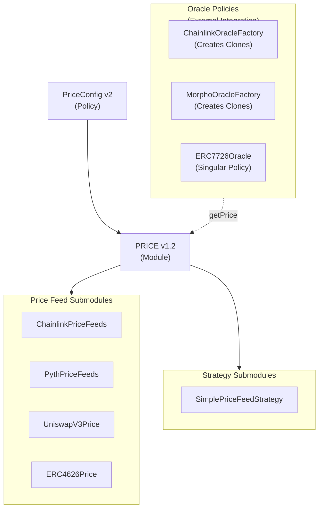
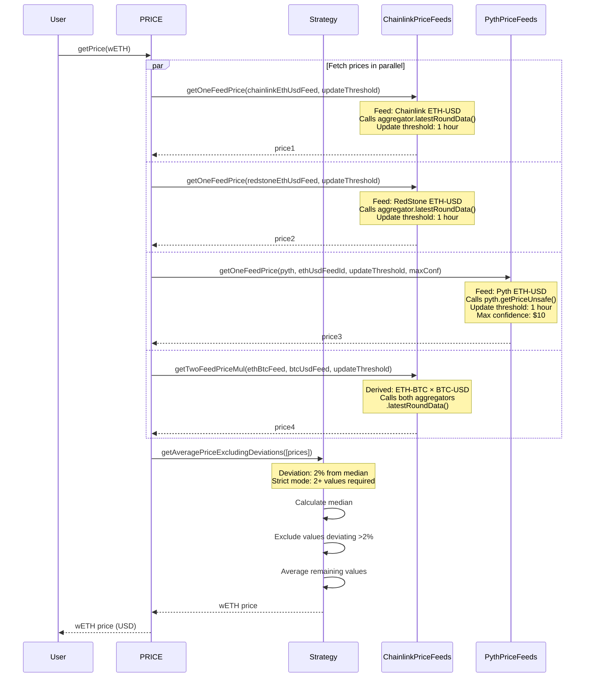
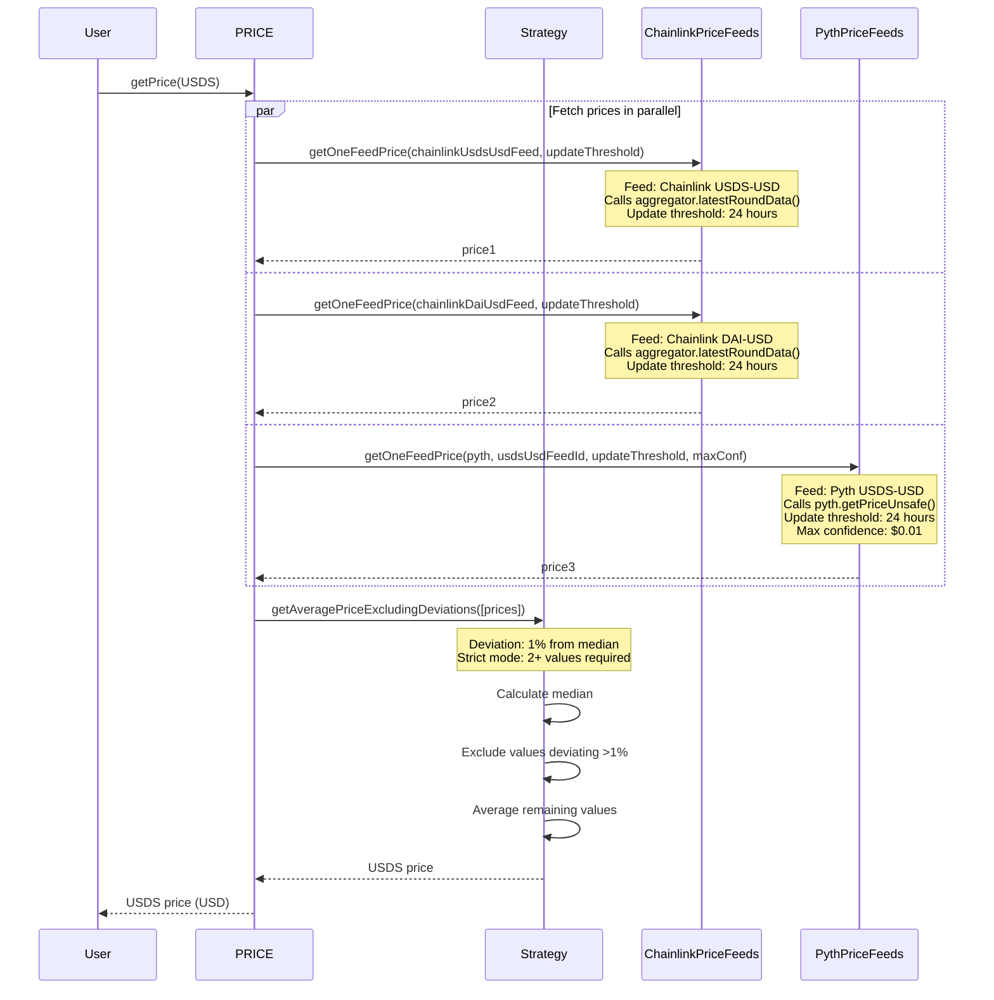
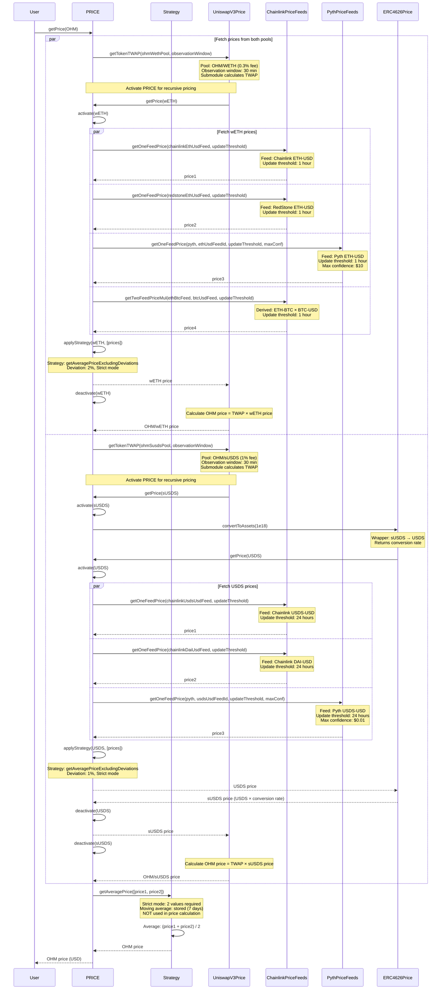
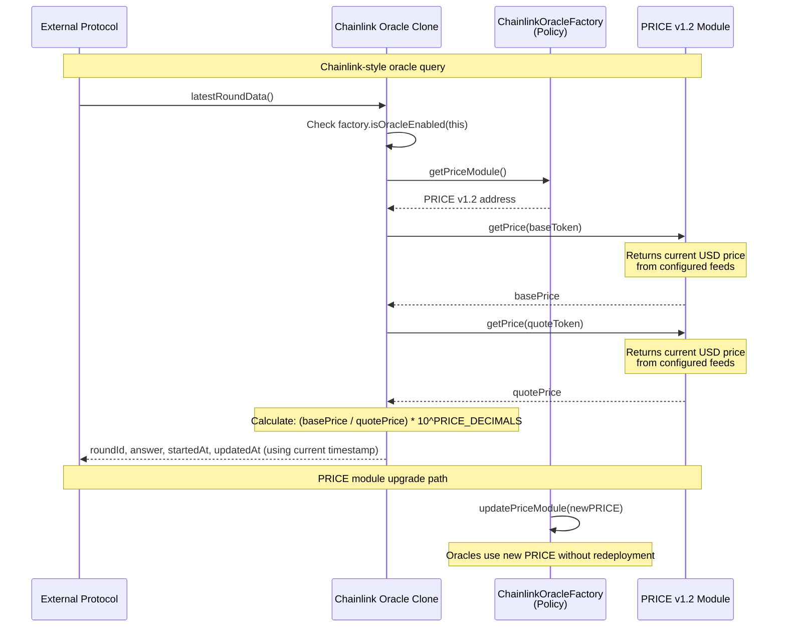
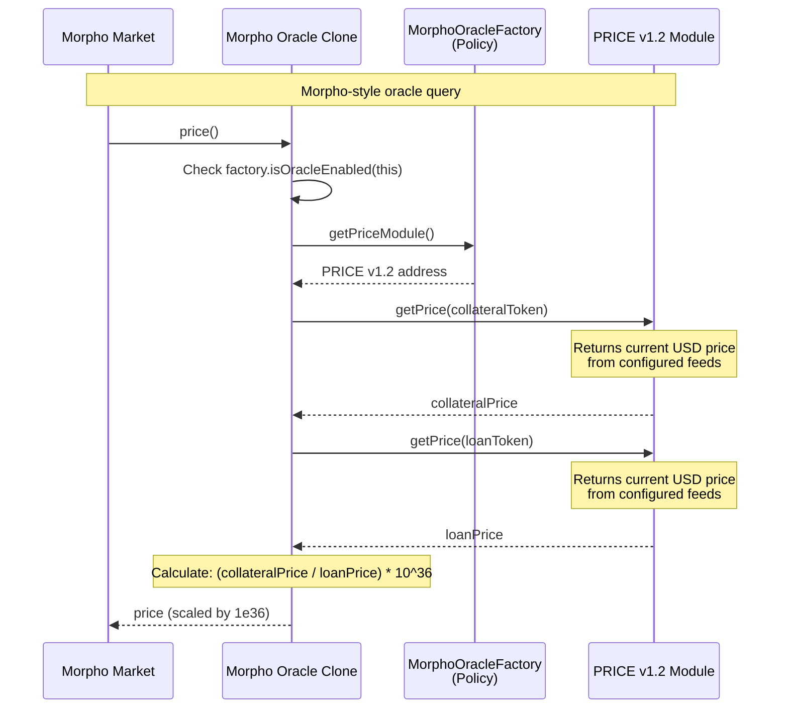
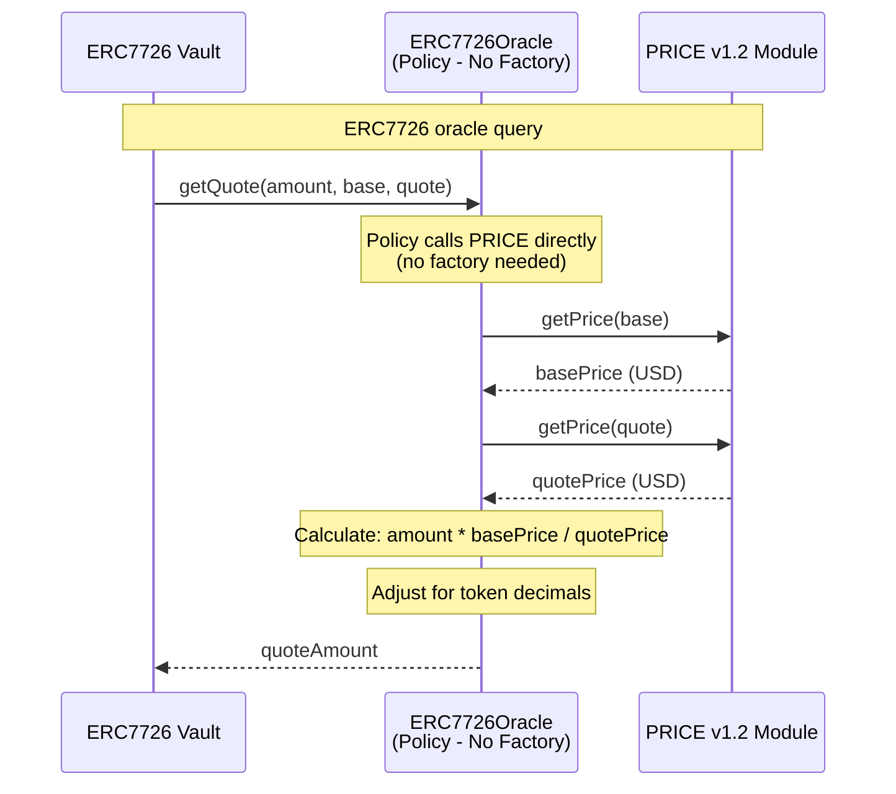

# OlympusDAO PRICE v1.2 Audit - Price Feed Improvements

## Purpose

The purpose of this audit is to review the upgrade from PRICE v1 to PRICE v1.2, which improves the resilience of price feeds used by protocol contracts, particularly for OHM. The upgrade introduces multi-feed price resolution with deviation filtering, reducing reliance on single data sources and increasing fault tolerance.

**Key Improvements:**

- Multi-feed price resolution (3-4 independent feeds for wETH, 3 feeds for USDS)
- Deviation filtering to exclude outliers or manipulated feeds
- Strict mode requiring multiple valid sources before accepting prices
- Pyth Network integration for additional oracle redundancy
- Backwards compatibility with v1 interface (no policy changes required)

## Scope

### In-Scope Contracts

The contracts in-scope for this audit are:

#### New Contracts (not in original PRICE v2 import)

**Interfaces:**

- [src/interfaces/IPyth.sol](../../src/interfaces/IPyth.sol) - Pyth Network oracle interface
- [src/modules/PRICE/submodules/strategies/ISimplePriceFeedStrategy.sol](../../src/modules/PRICE/submodules/strategies/ISimplePriceFeedStrategy.sol) - Strategy interface

**PRICE Module:**

- [src/modules/PRICE/IPRICE.v2.sol](../../src/modules/PRICE/IPRICE.v2.sol) - PRICE v2 interface
- [src/modules/PRICE/OlympusPrice.v1_2.sol](../../src/modules/PRICE/OlympusPrice.v1_2.sol) - PRICE v1.2 implementation (v2 + v1 compatibility)

**PRICE Submodules:**

- [src/modules/PRICE/submodules/feeds/PythPriceFeeds.sol](../../src/modules/PRICE/submodules/feeds/PythPriceFeeds.sol) - Pyth price feed submodule

**Oracle Policies (for external protocol integration):**

- [src/policies/interfaces/price/IChainlinkOracle.sol](../../src/policies/interfaces/price/IChainlinkOracle.sol) - Chainlink oracle interface
- [src/policies/interfaces/price/IERC7726Oracle.sol](../../src/policies/interfaces/price/IERC7726Oracle.sol) - ERC7726 oracle interface
- [src/policies/interfaces/price/IMorphoOracle.sol](../../src/policies/interfaces/price/IMorphoOracle.sol) - Morpho oracle interface
- [src/policies/interfaces/price/IOracleFactory.sol](../../src/policies/interfaces/price/IOracleFactory.sol) - Oracle factory interface
- [src/policies/price/BaseOracleFactory.sol](../../src/policies/price/BaseOracleFactory.sol) - Base oracle factory
- [src/policies/price/ChainlinkOracleCloneable.sol](../../src/policies/price/ChainlinkOracleCloneable.sol) - Cloneable Chainlink oracle
- [src/policies/price/ChainlinkOracleFactory.sol](../../src/policies/price/ChainlinkOracleFactory.sol) - Chainlink oracle factory
- [src/policies/price/ERC7726Oracle.sol](../../src/policies/price/ERC7726Oracle.sol) - ERC7726 vault oracle (singular policy, not a factory)
- [src/policies/price/MorphoOracleCloneable.sol](../../src/policies/price/MorphoOracleCloneable.sol) - Cloneable Morpho oracle
- [src/policies/price/MorphoOracleFactory.sol](../../src/policies/price/MorphoOracleFactory.sol) - Morpho oracle factory

**Price Configuration:**

- [src/policies/price/PriceConfig.v2.sol](../../src/policies/price/PriceConfig.v2.sol) - Price configuration policy v2

**Configuration Scripts:**

- [src/scripts/ops/batches/ConfigurePriceV1_2.sol](../../src/scripts/ops/batches/ConfigurePriceV1_2.sol) - PRICE v1.2 asset configuration batch script
- [src/scripts/ops/batches/ConfigureOracles.sol](../../src/scripts/ops/batches/ConfigureOracles.sol) - Oracle factory activation batch script

**OCG Proposal:**

- [src/proposals/OracleProposal.sol](../../src/proposals/OracleProposal.sol) - OCG proposal to enable oracle policies and deploy initial oracles

#### Modified Contracts (changes since base import)

The following contracts have been modified since the original PRICE v2 import from commit `13062da62eca83a42a4b0e13bc4622b824a2ae35`. Only the modifications are in-scope for this audit:

- [src/modules/PRICE/OlympusPrice.v2.sol](../../src/modules/PRICE/OlympusPrice.v2.sol) - Added IVersioned interface, internal state variables (`_decimals`, `_observationFrequency`), supportsInterface
- [src/modules/PRICE/PRICE.v2.sol](../../src/modules/PRICE/PRICE.v2.sol) - Added IVersioned interface, internal state variables, supportsInterface
- [src/modules/PRICE/submodules/feeds/ChainlinkPriceFeeds.sol](../../src/modules/PRICE/submodules/feeds/ChainlinkPriceFeeds.sol) - Added params length validation, error handling, updated imports
- [src/modules/PRICE/submodules/feeds/ERC4626Price.sol](../../src/modules/PRICE/submodules/feeds/ERC4626Price.sol) - Added IVersioned interface, supportsInterface
- [src/modules/PRICE/submodules/feeds/UniswapV3Price.sol](../../src/modules/PRICE/submodules/feeds/UniswapV3Price.sol) - Added IVersioned interface, supportsInterface
- [src/modules/PRICE/submodules/strategies/SimplePriceFeedStrategy.sol](../../src/modules/PRICE/submodules/strategies/SimplePriceFeedStrategy.sol) - Added deviation filtering strategies

**Note:** To determine which changes are in-scope, compare the current state against commit `13062da62eca83a42a4b0e13bc4622b824a2ae35`.

#### Out of Scope (Legacy Files)

The following legacy files are **NOT** in scope:

- [src/modules/PRICE/OlympusPrice.sol](../../src/modules/PRICE/OlympusPrice.sol) - Legacy v1 module, not used
- [src/modules/PRICE/IPRICE.v1.sol](../../src/modules/PRICE/IPRICE.v1.sol) - Legacy v1 interface, not used
- [src/modules/PRICE/PRICE.v1.sol](../../src/modules/PRICE/PRICE.v1.sol) - Legacy v1 module, not modified
- [src/policies/price/PriceConfig.sol](../../src/policies/price/PriceConfig.sol) - v1 config, moved only

#### Out of Scope (Base Audited Code)

The following contracts were already audited as part of PRICE v2 and are **NOT** in scope (no modifications):

- [src/modules/PRICE/submodules/feeds/BalancerPoolTokenPrice.sol](../../src/modules/PRICE/submodules/feeds/BalancerPoolTokenPrice.sol)
- [src/modules/PRICE/submodules/feeds/UniswapV2PoolTokenPrice.sol](../../src/modules/PRICE/submodules/feeds/UniswapV2PoolTokenPrice.sol)
- [src/libraries/Deviation.sol](../../src/libraries/Deviation.sol)
- [src/libraries/UniswapV3/Oracle.sol](../../src/libraries/UniswapV3/Oracle.sol)
- [src/Submodules.sol](../../src/Submodules.sol)

### External Contracts

Several external interfaces and libraries are used to interact with other protocols. These dependencies are stored locally in:

- `lib` - Soldeer-managed dependencies
- `src/external` - External contract dependencies
- `src/libraries` - Utility libraries
- `src/interfaces` - Standard interfaces

See the [solidity-metrics.html](./solidity-metrics.html) file for details on external contracts that are referenced.

### Previously Audited Contracts

The in-scope contracts depend on or are dependencies for these previously audited contracts:

- [src/Kernel.sol](../../src/Kernel.sol) - Core governance and module/policy management

## Previous Audits

The base PRICE v2 architecture has been audited as part of the RBS v2 project:

- **HickupHH3 PRICEv2 Audit (06/2023)**
    - [Report](https://storage.googleapis.com/olympusdao-landing-page-reports/audits/2023_7_OlympusDAO-final.pdf)
    - Repository: OlympusDAO/bophades
    - Base commit: `17fe660525b2f0d706ca318b53111fbf103949ba`
    - Post-remediations commit: `9c10dc188210632b6ce46c7a836484e8e063151f`

**Note:** The PRICE v2 architecture was imported into the `price-feed-improvements` branch from commit `13062da62eca83a42a4b0e13bc4622b824a2ae35` (source: OlympusDAO/bophades@26b3fd378fbde1918b32764dd0d86121d82932d5). However, **many imported files have been modified** since the base import. This audit covers ALL contracts that differ from commit `13062da62eca83a42a4b0e13bc4622b824a2ae35`.

## Architecture

### Overview

The PRICE v1.2 module is based on the PRICE v2 architecture with a backwards compatibility layer for v1. The diagram illustrates the architecture of the components:



**Legend:**

- Circle: policy
- Cylinder: module
- Rectangle: submodule
- Hexagon: external contract
- Dotted arrow: policies that tap into PRICE module for price data

### wETH Price Resolution

The wETH price is determined from 4 independent sources with deviation filtering:



### USDS Price Resolution

The USDS price is determined from 3 independent sources with deviation filtering:



### OHM Price Resolution

The OHM price is determined from 2 independent Uniswap V3 pools with recursive pricing:



### Oracle Architecture for External Protocols

Olympus provides oracle policies that enable external protocols (Morpho, ERC7726 vaults, Chainlink-compatible integrations) to access PRICE feeds through standardized interfaces.

**Purpose:** External protocols often require oracles in specific interfaces. Rather than maintaining separate oracle infrastructure, these protocols can use Olympus oracle policies that delegate price resolution to the PRICE module.

**Architecture:**

**Oracle Factory Policies** (create minimal-gas oracle clones):

- `ChainlinkOracleFactory`: Creates clones implementing `AggregatorV3Interface` (Chainlink-compatible)
- `MorphoOracleFactory`: Creates clones implementing `IMorphoOracle` (Morpho lending markets)

**Singular Oracle Policy** (direct implementation, no factory):

- `ERC7726Oracle`: Single policy implementing `IERC7726Oracle` (ERC7726 vaults)

**PRICE v1.2 Module**: The underlying source of truth for all price data

**Chainlink Oracle Factory Sequence:**



**Morpho Oracle Factory Sequence:**



**ERC7726 Oracle (Singular Policy):**



## Major Flows

### Price Resolution with Deviation Filtering

The multi-feed price resolution process:

1. **Fetch Prices**: PRICE module calls all configured price feed submodules in parallel
2. **Filter Outliers**: Strategy submodule calculates median and excludes values deviating beyond threshold
3. **Validate**: Ensure sufficient valid values remain (strict mode)
4. **Aggregate**: Calculate average of remaining values
5. **Return**: Canonical price for the asset

**Key Parameters:**

- **Deviation Threshold**: Percentage from median (1% for USDS, 2% for wETH)
- **Strict Mode**: Minimum number of valid values required (2+)
- **Update Threshold**: Maximum age of price data before considered stale

### Moving Average Storage

For assets that track moving averages (OHM):

1. **Store**: `storePrice()` called periodically (every 8 hours for OHM)
2. **Calculate**: New observation added to ring buffer
3. **Update**: Moving average recalculated from stored observations
4. **Storage**: 21 observations for 7-day average (8-hour frequency)

**Note:** Moving average is stored for OHM but NOT used in price calculation (only for future use).

### Pyth Price Feed Integration

Pyth-specific price update flow:

1. **Price Update**: Pyth price must be updated via `updatePriceFeeds()` on Pyth contract
2. **Fetch**: `PythPriceFeeds` submodule calls `getPriceUnsafe()` for latest price
3. **Validation**:
   - Check staleness (update threshold)
   - Validate confidence interval (max confidence)
   - Revert if confidence exceeds threshold
4. **Return**: Price in 18 decimals

**Critical:** Pyth prices MUST be updated regularly via the [pyth-price-pusher](https://github.com/OlympusDAO/pyth-price-pusher) tool. If not updated within the `updateThreshold` period, price resolution fails.

### Oracle Factory Deployment and Usage

**Deployment Flow:**

1. **Deploy Factory**: Base factory contract deployed as a policy with PRICE module reference
2. **Activate Policy**: Factory activated in Kernel via `Actions.ActivatePolicy`
3. **Request Oracle**: External protocol calls `factory.createOracle(baseToken, quoteToken, name)`
4. **Clone Deployment**: Factory deploys minimal-gas oracle clone via CREATE2
5. **Enable Oracle**: Oracle enabled via `factory.enableOracle(oracleAddress)` (optional for auto-enable)

**Oracle Query Flow:**

1. **External Call**: Protocol calls `oracle.latestRoundData()` (Chainlink) or `oracle.price()` (Morpho)
2. **Validation**: Oracle checks `factory.isOracleEnabled(this)` - reverts if disabled
3. **PRICE Reference**: Oracle gets current PRICE address via `factory.getPriceModule()`
4. **Price Resolution**:
   - Chainlink oracles: `PRICE.getPrice(baseToken)` and `PRICE.getPrice(quoteToken)` (current value)
   - Morpho oracles: `PRICE.getPrice(collateralToken)` and `PRICE.getPrice(loanToken)` (current value)
5. **Ratio Calculation**: Oracle calculates `(basePrice / quotePrice) * 10^decimals`
6. **Return**: Price, timestamp, and round ID returned to external protocol

**Benefits:**

- **Minimal gas cost**: Oracle clones use CREATE2 and immutable args
- **Upgradable**: PRICE module can be upgraded without redeploying oracles (factory updates reference)
- **Standard interfaces**: Implements Chainlink AggregatorV3, ERC7726, and Morpho oracle interfaces
- **Permissioned control**: Factory can enable/disable individual oracles
- **No oracle management**: External protocols don't need to run their own oracle infrastructure

**Oracle Types:**

| Type | Creates Clones? | Interface | Use Case |
| ---- | -------------- | --------- | -------- |
| `ChainlinkOracleFactory` | Yes | `AggregatorV3Interface` | Protocols expecting Chainlink-compatible oracles |
| `MorphoOracleFactory` | Yes | `IMorphoOracle` | Morpho lending markets |
| `ERC7726Oracle` | No (singular policy) | `IERC7726Oracle` | ERC7726-compliant vaults |

## Frequently-Asked Questions

### Q: Is the code/contract expected to comply with any EIPs?

A: The ERC7726 oracle policy complies with ERC7726 (Vault Oracle Interface). The core PRICE module does not implement any specific EIPs/ERCs.

### Q: What happens if a price feed is stale or returns an invalid value?

A: Invalid price feeds (zero value, stale data, excessive confidence) return zero and are excluded from calculation. If strict mode is enabled and insufficient valid values remain, the price resolution reverts.

### Q: What happens if Pyth price feeds are not updated?

A: If Pyth prices are not updated within the `updateThreshold` period, the feed returns zero and is excluded. If strict mode requires 2+ values and only 1-2 feeds remain valid, price resolution may fail.

**Mitigation:** Use the [pyth-price-pusher](https://github.com/OlympusDAO/pyth-price-pusher) tool for automated price updates.

### Q: What is the difference between `storeMovingAverage` and `useMovingAverage`?

A:

- `storeMovingAverage`: Whether to track moving average observations for the asset
- `useMovingAverage`: Whether to include the moving average as input to the strategy when calculating the price

For OHM: `storeMovingAverage = true`, `useMovingAverage = false` (stored for future use but not currently used).

### Q: How does the Chainlink-derived price calculation work?

A: The `getTwoFeedPriceMul()` function calculates a derived price by multiplying two Chainlink feeds:

```text
ETH-USD = ETH-BTC × BTC-USD
```

Both feeds are validated for staleness before multiplication. This provides a 4th independent source for wETH pricing.

### Q: What are the known issues/acceptable risks?

A: The following are known issues/limitations:

1. **Uniswap V3 Price Manipulation**: PRICE submodules using on-chain reserves (Uniswap V3) are susceptible to sandwich attacks and multi-block manipulation
   - **Mitigation**: 30-minute TWAP window reduces manipulation risk
   - **Mitigation**: Multi-feed redundancy (2 independent pool paths)
   - **Mitigation**: Moving average tracking (for OHM)

2. **Pyth Feed Dependency**: Pyth feeds require regular updates to remain valid
   - **Mitigation**: Automated price update via pyth-price-pusher tool
   - **Mitigation**: Redundant feeds (3 for USDS, 4 for wETH)

3. **Price Feed Convergence**: If all feeds for an asset are manipulated or report invalid data, price resolution fails
   - **Mitigation**: Strict mode requires 2+ valid values
   - **Mitigation**: Independent oracle providers (Chainlink, RedStone, Pyth)

### Q: Why is PRICE v1.2 being used instead of v2?

A: PRICE v1.2 maintains backwards compatibility with the v1 interface, allowing existing policies (Operator, YieldRepurchaseFacility, EmissionManager) to continue using OHM pricing without modification. The v1.2 module implements v2 functionality internally while exposing v1 functions externally.

### Q: What happens if PRICE is upgraded before assets are configured?

A: All `getPrice()` calls revert with `PRICE_AssetNotApproved` until assets are configured. This is why PriceConfigv2 is enabled by default and assets are configured in the same transaction batch as the module upgrade.

### Q: What are Oracle Factory Policies and how do they work?

A: Oracle Factory Policies are specialized policies that create and manage oracle clones for external protocols. They enable external protocols (Morpho, ERC7726 vaults, Chainlink-compatible integrations) to access Olympus PRICE feeds through standardized interfaces.

**How they work:**

1. Factory deployed as a policy with PRICE module reference
2. External protocol requests oracle clone via `factory.createOracle(baseToken, quoteToken, name)`
3. Factory deploys minimal-gas clone via CREATE2
4. Clone implements standard interface (Chainlink AggregatorV3, IMorphoOracle)
5. When queried, clone validates it's enabled via factory, gets PRICE module address, and calls `PRICE.getPrice()`
6. Clone calculates price ratio (basePrice / quotePrice) and returns in standard format

**Key benefits:**

- External protocols don't need to run their own oracle infrastructure
- PRICE module upgrades don't require oracle redeployment (factory updates reference)
- Minimal gas cost due to CREATE2 cloning
- Permissioned control via factory enable/disable functions

**Note:** ERC7726Oracle is different - it's a singular policy (not a factory) that implements ERC7726 directly without creating clones.

**See also:** [Oracle Architecture for External Protocols](#oracle-architecture-for-external-protocols) sequence diagrams above.

## Documentation

Additional documentation is available in the repository:

- [PRICE Configuration](../../documentation/price.md) - Price configuration and architecture
- [PRICE v1 Upgrade](../../documentation/price_v1_upgrade.md) - Deployment and configuration process
- [RFC: Improving Resilience of Price Feeds](../../documentation/rfc/rfc-improving-resilience-of-price-feeds.md) - Rationale and specifications
