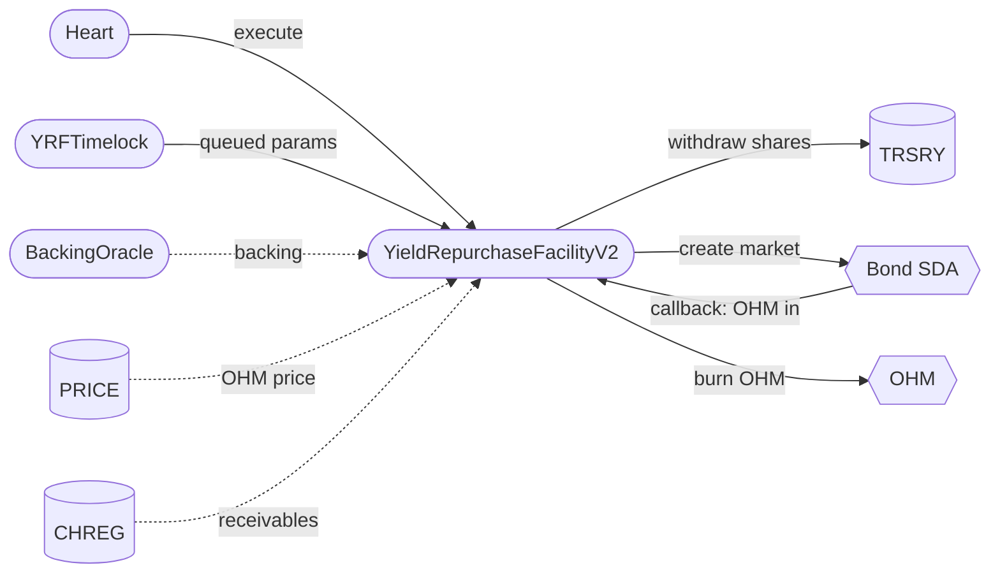

# Yield Repurchase Facility v2 Audit

## Purpose

Review the rewrite of the Yield Repurchase Facility from a single-asset weekly buyback facility into a multi-asset one, together with the new `BackingOracle` policy and the `YRFTimelock` that owns its operational parameters.

The facility draws yield from a governance-approved whitelist of ERC4626 reserve vaults held by the treasury, spends each asset's share of that yield through daily Bond Protocol SDA markets that buy OHM, and burns the purchased OHM against a treasury withdrawal priced by the backing oracle.

## Design

Key changes from v1.2:

- Multi-asset ERC4626 whitelist, replacing the fixed USDS/sUSDS asset; each asset gets its own market, and assets whose shares cannot be redeemed synchronously (sUSDe) sell the shares directly.
- Per-asset yield split between buybacks and retained backing, replacing the unconditional 100% burn.
- The facility reads the governance-set backing value from the new `BackingOracle` policy, initialized at `$12.04`; the value can be updated without redeploying the facility and replaces v1.2's hardcoded `$11.33`.
- Non-zero bond-market minimum price, set by a configurable initial discount and a configurable max price premium, replacing v1.2's minimum price of zero.
- Governance-controlled Clearinghouse receivables offsets and one-way downward yield correction.
- Accounting driven by tracked balances rather than raw token balances.
- Mutable teller/auctioneer, and the `IEnabler` lifecycle in place of the bespoke `isShutdown` flag.

Governance authorization is [OIP-194](https://snapshot.box/#/s:olympusdao.eth/proposal/0x5c5a16fefe142bf09bc94814b926204e41b5c58fefc6dfae74ebe7e93b6023cb).

## Scope

Branch: `feat/multi-asset-yrf-updates`

Code commit: `7e72c9a75995b13900dbadf2bb2c0f659086e08e`. See [scopefile.txt](./scopefile.txt) for the machine-readable list.

### In-Scope Contracts

The contracts in scope for this audit are:

- [src/](../../src)
    - [policies/](../../src/policies)
        - [YieldRepurchaseFacility/](../../src/policies/YieldRepurchaseFacility)
            - [YieldRepurchaseFacilityV2.sol](../../src/policies/YieldRepurchaseFacility/YieldRepurchaseFacilityV2.sol)
            - [YRFBondMarketLib.sol](../../src/policies/YieldRepurchaseFacility/YRFBondMarketLib.sol)
            - [YRFClearinghouseLib.sol](../../src/policies/YieldRepurchaseFacility/YRFClearinghouseLib.sol)
            - [YRFTimelock.sol](../../src/policies/YieldRepurchaseFacility/YRFTimelock.sol)
        - [interfaces/YieldRepurchaseFacility/](../../src/policies/interfaces/YieldRepurchaseFacility)
            - [IYieldRepurchaseFacilityV2.sol](../../src/policies/interfaces/YieldRepurchaseFacility/IYieldRepurchaseFacilityV2.sol)
            - [IYRFTimelock.sol](../../src/policies/interfaces/YieldRepurchaseFacility/IYRFTimelock.sol)
        - [BackingOracle.sol](../../src/policies/BackingOracle.sol)
        - [interfaces/IBackingOracle.sol](../../src/policies/interfaces/IBackingOracle.sol)
    - [proposals/](../../src/proposals)
        - [YieldRepurchaseFacilityV2Proposal.sol](../../src/proposals/YieldRepurchaseFacilityV2Proposal.sol)
        - [YieldRepurchaseFacilityV2Activator.sol](../../src/proposals/YieldRepurchaseFacilityV2Activator.sol)
    - [scripts/ops/batches/](../../src/scripts/ops/batches)
        - [YieldRepoV2Install.sol](../../src/scripts/ops/batches/YieldRepoV2Install.sol)

## Previous Audits

**Olympus Bridge (06/2026)** — [report](https://storage.googleapis.com/olympusdao-landing-page-reports/audits/2026-06-Bridge.pdf). Its explicit scope includes `TimelockBatchQueue`, `ITimelockBatchQueue`, and `PolicyAdminOptimized`, which are reused by `YRFTimelock` and the in-scope policies. Package: [audit/2026-03_lz-bridge-upgrade](../2026-03_lz-bridge-upgrade/README.md).

**PRICE v1.2 (03/2026)** — the [audit package](../2026-03_price-feed-improvements/README.md) includes `PriceConfigv2` and its timelock behavior.

## Architecture

## Key Flows

**Weekly reset** (every 21st beat) — re-absorbs facility-held funds into each asset's budget, injects the stored yield projection, projects the next one from the vault conversion rate and (for the backing vault) Clearinghouse interest net of offsets, refreshes snapshots, and prefunds the budget with treasury share withdrawals.

**Daily cycle** (every 3rd beat) — burns accumulated purchased OHM against a fresh backing withdrawal credited to the backing vault's budget, then opens one 24-hour market per enabled asset sized at `weeklyBudgetRemaining / daysRemaining`. Market creation is skipped entirely when the OHM oracle price is zero or below backing; the burn still runs.

**Market pricing** — the market quotes OHM per payout unit, so prices invert the oracle price: the initial price applies the configured discount, and the minimum price applies the configured max price premium on top of that discounted price, capping the payout per OHM at `oraclePrice * (1 - initialDiscount) * (1 + maxPricePremium)`. The premium is therefore the width of the market's decay band: too small and a market cannot reach a clearing price when the OHM price rises after it opens, too large and the facility can pay more for one OHM. Both parameters are read at market creation, so a market keeps the band it was created with.

**Activation** — the one-shot `seedCycle` carries v1.2's epoch position and unspent weekly budget into v2 so the migration does not forfeit the remainder of the current buyback week.

## Access Control

The production role holders are:

| Role            | Holder             |
| --------------- | ------------------ |
| `admin`         | OCG timelock       |
| `yrf_admin`     | DAO multisig       |
| `backing_admin` | DAO multisig       |
| `emergency`     | Emergency multisig |
| `heart`         | Heart              |

### YieldRepurchaseFacilityV2

| Caller      | Authority                                                                                                                                                                                                                                                                |
| ----------- | ------------------------------------------------------------------------------------------------------------------------------------------------------------------------------------------------------------------------------------------------------------------------ |
| `admin`     | `enable`, `disable`, `setGracePeriod`, `returnFundsToTreasury`, `addAsset`, `removeAsset`, `seedCycle`, backing-oracle/vault and Bond-contract changes, direct Clearinghouse configuration, direct access to every operation exposed through `YRFTimelock`, and `rescue` |
| `yrf_admin` | `reEnable` during the grace period and `rescue`; operational changes must otherwise be queued through `YRFTimelock`                                                                                                                                                      |
| `emergency` | `disable` and, while disabled, `returnFundsToTreasury`                                                                                                                                                                                                                   |
| `heart`     | `execute`                                                                                                                                                                                                                                                                |
| Bond teller | `callback`, only for a market ID recorded by the facility while both the facility and its asset are enabled                                                                                                                                                              |
| Anyone      | `contribute`                                                                                                                                                                                                                                                             |

### YRFTimelock

| Caller      | Authority                                                                                                                                                                                                                                                     |
| ----------- | ------------------------------------------------------------------------------------------------------------------------------------------------------------------------------------------------------------------------------------------------------------- |
| `admin`     | `enable`, `disable`, `setFacility`, `setTimelockDelay`, and `setGracePeriod`                                                                                                                                                                                  |
| `yrf_admin` | Queue individual or batched calls to set a yield buyback share, initial discount, or max price premium, enable or disable an asset, exclude a Clearinghouse, increase a Clearinghouse offset, or decrease a stored next-yield projection; also `reEnable` during the grace period |
| `emergency` | `disable` and cancel queued actions, including while the policy is disabled                                                                                                                                                                                   |
| Anyone      | Execute a queued action after the 1-day delay and before the end of its 3-day execution window                                                                                                                                                                |

### BackingOracle

| Caller          | Authority                                                                                           |
| --------------- | --------------------------------------------------------------------------------------------------- |
| `admin`         | `enable`, `disable`, direct `setBacking`, queue `setBacking`, and queue a timelock-delay change     |
| `backing_admin` | Queue `setBacking`                                                                                  |
| `emergency`     | `disable` and cancel queued actions, including while the policy is disabled                         |
| Anyone          | Execute a queued action after the configured delay and before the end of its 7-day execution window |

## Known Risks

- **Backing is governance-set.** The ±10% per-update bound is an input-error guard, not an economic protection: repeated updates can move backing arbitrarily, and `enable` can initialize any non-zero value. The emergency role can cancel a queued update; otherwise correctness rests on governance.
- `PRICE.getLastPrice()` **is the stored observation**, refreshed by `Heart.beat()` in the same transaction. Granting the heart role to anything other than the Heart contract would price markets off a stale observation.
- **The configured Bond contracts are trusted dependencies.** The auctioneer can reject market creation or revoke callback authorization, and the teller is trusted to deliver OHM and invoke callbacks correctly. Disabling the facility or an asset, or replacing the teller or the Bond suite while a 24-hour market is open, prevents that market from completing normally.
- **Bond market IDs must be globally unique.** The facility keys market authorization and accounting only by the ID returned by the auctioneer. The configured Bond suite must use an aggregator that preserves a single unique ID namespace; a collision can overwrite the vault associated with an earlier market.
- **Sell-shares markets transfer vault shares, not reserve assets.** The buyer is responsible for redeeming sUSDe shares into USDe and bears the vault's redemption, liquidity, and issuer-control risks.
- **Yield corrections are operationally time-sensitive.** If `yrf_admin` does not execute `decreaseNextYield` before the stored projection is injected at the next weekly reset, the following week's budget is overstated. The recovery path is to disable the facility before the reset, execute the correction, and re-enable within the grace period.
- **A delayed `reEnable` slightly understates Clearinghouse yield.** The interrupted cycle is stretched by the downtime, but the next projection still credits one week of Clearinghouse interest. The maximum error is bounded by the re-enable grace period, which must be shorter than one week.
- **Reserve vault controls remain external dependencies.** sUSDe/USDe controls can freeze facility-held balances, and sUSDS is upgradeable; either can prevent redemptions or invalidate the behavior assumed when the asset was registered.
- **Disabling does not unwind open markets or automatically return funds.** `returnFundsToTreasury` is a separate call, and a vault whose transfer or redemption reverts is skipped until a later retry.
- **Queued YRF actions survive a timelock disable.** A still-live action becomes executable again after re-enable unless the emergency role cancels it. An expired action also retains any per-parameter pending slot until it is cancelled.
- `contribute` **is permissionless and irreversible.** Contributed funds join the facility's tracked pool and cannot be withdrawn by the contributor.
- **The emergency role has no per-asset pause.** It can immediately disable the facility as a whole; an individual asset change must come from `admin` or through `YRFTimelock`.
