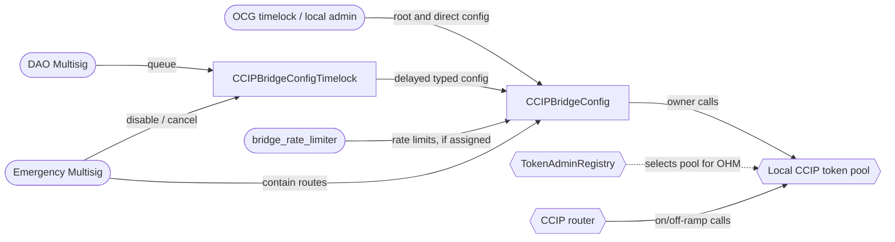

# CCIP Bridge Configuration Audit

## Purpose

Review the new control plane for Olympus's Chainlink CCIP token pools and its rollout across
Ethereum, Arbitrum, Optimism, Base and Berachain.

The change moves each pool's owner authority into a typed `CCIPBridgeConfig` policy. Routine route
changes are queued through `CCIPBridgeConfigTimelock`, while governance retains direct authority and the Emergency Multisig can immediately disable one or all routes.

## Design

- `CCIPBridgeConfig` owns one local pool and exposes only supported pool-owner operations. It does
not forward arbitrary calls.
- Root authority remains with `admin`; `bridge_admin` queues route changes through the timelock;
`bridge_rate_limiter` may change rate limits directly if assigned; and `emergency` may only reduce
route capacity or disable the control-plane policies.
- `CCIPBridgeConfigTimelock` accepts typed route, remote-pool, allowlist and rate-limit changes. It
validates them at queue time and permits execution after an initial one-day delay.
- `ConfigTimelockBatchQueue` reserves the configuration domains touched by an action and records
their state hashes. Execution fails if the destination or guarded state changed after queueing.
This shared abstraction and `ConfigOperatorSingleStep` originated in Burner Loans PR
[#330](https://github.com/OlympusDAO/olympus-v3/pull/330) and were copied into this branch.
- Ethereum uses Chainlink's lock/release pool. The other production EVM chains use the existing
Olympus burn/mint pool. The same config and timelock policies manage both pool types.
- Deployment, proposal and multisig scripts reconcile the on-chain state with `src/scripts/env.json`
and perform the ownership, registry, role, route, funding and periphery handovers.

## Scope

Branch: `feat/ccip-config-timelock-n-evm-chains`

Code commit: `765ead2a60522ba4a5454959a411adc6ae12af88`. See
[scopefile.txt](./scopefile.txt) for the machine-readable list.

### Core Contracts

- `[CCIPBridgeConfig](../../src/policies/bridge/CCIPBridgeConfig.sol)` and its
[interface](../../src/policies/interfaces/bridge/ICCIPBridgeConfig.sol)
- `[CCIPBridgeConfigTimelock](../../src/policies/bridge/CCIPBridgeConfigTimelock.sol)` and its
[interface](../../src/policies/interfaces/bridge/ICCIPBridgeConfigTimelock.sol)
- `[ConfigOperatorSingleStep](../../src/policies/utils/ConfigOperatorSingleStep.sol)` and its
[interface](../../src/policies/interfaces/utils/IConfigOperator.sol)
- `[ConfigTimelockBatchQueue](../../src/policies/utils/ConfigTimelockBatchQueue.sol)` and its
[interface](../../src/policies/interfaces/utils/IConfigTimelockBatchQueue.sol)
- The execution-completion hook added to
`[TimelockBatchQueue](../../src/policies/utils/TimelockBatchQueue.sol)`

The four new shared abstraction files are in scope because no completed external audit was found
for them. The CCIP copies match PR #330 except for Solidity pragma normalization. For
`TimelockBatchQueue`, only the post-audit `_onActionExecuted` hook and its invocation are in scope.

### Partial-File Scope

The Solidity metrics extension accepts file paths, not line ranges. It will therefore count each
file below in full. Audit scope is limited to these ranges at commit
`[765ead2a](https://github.com/OlympusDAO/olympus-v3/commit/765ead2a60522ba4a5454959a411adc6ae12af88)`:

| File                     | In-scope code                                                                                                                                                 | Baseline                                                                                                                   |
| ------------------------ | ------------------------------------------------------------------------------------------------------------------------------------------------------------- | -------------------------------------------------------------------------------------------------------------------------- |
| `TimelockBatchQueue.sol` | Interaction in `executeQueuedAction`, lines 134-154; `_onActionExecuted`, lines 389-397. The new executable statements are lines 149 and 397.                 | Audited version at `[0b7e6138](https://github.com/OlympusDAO/olympus-v3/commit/0b7e61388c7da4fc443f814228ea234a185e76cc)`  |
| `DeployV3.s.sol`         | `_readDeploymentArgUint256OrEnv`, lines 378-398; `deployCCIPBridgeConfig`, lines 526-552; `deployCCIPBridgeConfigTimelock`, lines 565-607; supporting imports | `origin/develop` at `[ad2a6a04](https://github.com/OlympusDAO/olympus-v3/commit/ad2a6a04263da4e8644a96708dbfa4474b59afbf)` |
| `BatchScriptV2.sol`      | `setUpWithEmergencyMS`, lines 130-148                                                                                                                         | `origin/develop` at `[ad2a6a04](https://github.com/OlympusDAO/olympus-v3/commit/ad2a6a04263da4e8644a96708dbfa4474b59afbf)` |
| `CCIPBridge.sol`         | All changes in the audit-commit diff: declarative trusted-remote and gas-limit reconciliation, lifecycle and ownership entry points                           | `origin/develop` at `[ad2a6a04](https://github.com/OlympusDAO/olympus-v3/commit/ad2a6a04263da4e8644a96708dbfa4474b59afbf)` |
| `CCIPTokenPool.sol`      | All changes in the audit-commit diff: bootstrap authority checks, registry and ownership handover, liquidity and direct pool-owner entry points               | `origin/develop` at `[ad2a6a04](https://github.com/OlympusDAO/olympus-v3/commit/ad2a6a04263da4e8644a96708dbfa4474b59afbf)` |

Line numbers are informational and pinned to the audit commit. The named functions and commit diff
define the scope if later edits move the lines.

### Chainlink Pool Interfaces

The local interfaces under `[src/external/bridge](../../src/external/bridge)` define the exact
Chainlink pool, registry, rate-limiter and liquidity calls used by the config policy and rollout
scripts. Their selectors, struct layouts and compatibility with the deployed Chainlink contracts
are in scope.

### Deployment and Configuration

- `[CCIPBridgeConfigProposal](../../src/proposals/CCIPBridgeConfigProposal.sol)`
- `[DeployV3](../../src/scripts/deploy/DeployV3.s.sol)`
- `[CCIPBridgeConfigBatch](../../src/scripts/ops/batches/CCIPBridgeConfigBatch.sol)`
- `[CCIPNonEthereumSetupBatch](../../src/scripts/ops/batches/CCIPNonEthereumSetupBatch.sol)`
- `[CCIPRouteReconcileBatch](../../src/scripts/ops/batches/CCIPRouteReconcileBatch.sol)`
- The modified `[CCIPBridge](../../src/scripts/ops/batches/CCIPBridge.sol)` and
`[CCIPTokenPool](../../src/scripts/ops/batches/CCIPTokenPool.sol)` batch scripts
- `[CCIPConfigLib](../../src/scripts/ops/lib/CCIPConfigLib.sol)`,
`[CCIPFeeBudgetLib](../../src/scripts/ops/lib/CCIPFeeBudgetLib.sol)` and the Emergency Multisig
setup added to `[BatchScriptV2](../../src/scripts/ops/lib/BatchScriptV2.sol)`

### Out of Scope

- Chainlink CCIP contracts and infrastructure, including the router, on/off-ramps,
`TokenAdminRegistry` and `LockReleaseTokenPool`, except for compatibility with the local
interfaces and assumptions made by the in-scope code.
- The unchanged transfer-plane implementations `CCIPBurnMintTokenPool` and
`CCIPCrossChainBridge`; both were reviewed in the 2025 CCIP audit.
- `[RoleDefinitions](../../src/policies/utils/RoleDefinitions.sol)`. CCIP reuses the existing
`bridge_admin` and `bridge_rate_limiter` constants and changes only their explanatory comments.
- Shell scripts, tests, deployment JSON, `env.json` values and Anvil rehearsal tooling. They are
supporting evidence for the intended rollout, not production contracts.
- Solana program changes. This branch only configures the EVM side of the existing Solana lane.

## Previous Audits

- **CCIP Bridge (05/2025)** — [audit package](../2025-05_ccip/README.md). Covers
`CCIPBurnMintTokenPool`, `CCIPCrossChainBridge` and their supporting base contracts.
- **Olympus Bridge (06/2026)** —  
[report](https://storage.googleapis.com/olympusdao-landing-page-reports/audits/2026-06-Bridge.pdf)  
and [audit package](../2026-03_lz-bridge-upgrade/README.md). Covers `TimelockBatchQueue`,  
`ITimelockBatchQueue`, `PolicyAdminOptimized` and the LayerZero V2 bridge architecture. Only the  
new `TimelockBatchQueue` execution hook is part of this audit's scope.

## Architecture

On Ethereum, `admin` and the pool rebalancer are the OCG timelock. On the non-canonical EVM
chains, the local DAO Multisig holds `admin`, `bridge_admin` and the Kernel executor authority. The
Emergency Multisig is the same address on every production chain. The native pool
`rateLimitAdmin` and the `bridge_rate_limiter` role are unassigned at launch.

## Key Flows

### Delayed Route Change

1. `bridge_admin` queues a typed action while both policies are enabled and the timelock is the
  config operator.
2. The config policy's `validate*` mirror checks the request. The timelock reserves the affected
  route domains and stores their current state hashes.
3. After the delay, anyone may execute before the three-day execution window closes.
4. Execution rechecks the destination, operator relationship and guarded state, then dispatches to
  the config policy. All keys are released only after the whole action succeeds or is cancelled.

Each route has separate rate-limit, remote-pool and route-identity domains; the allowlist is one
pool-wide domain. One unresolved action may own a domain at a time.

### Emergency Containment and Recovery

`emergency` or `admin` can set both buckets of one or every route to an enabled capacity of two and
a refill rate of one, even while the config policy is disabled. This blocks transfers of any real
OHM amount without granting the emergency role a path to restore or expand capacity.

Recovery re-enables the control-plane policies, cancels stale or unwanted actions, and queues the
approved limits through the normal timelock. Restoring a limiter does not refill its bucket: it
starts from the contained balance and refills at the restored rate. Messages that failed an inbound
limiter require permissionless manual execution after recovery.

### Initial Rollout

The rollout transfers the OHM registry administrator and pool ownership away from deployer EOAs,
deploys and activates the config policies on five chains, establishes roles and operators, opens
the EVM routes, funds the Ethereum lock/release pool, registers and enables the non-Ethereum pools,
and reconciles the optional periphery. The detailed ordering and failure windows are documented in
`[documentation/bridge/ccip/README.md](../../documentation/bridge/ccip/README.md)`.

## Access Control

This section describes the intended state after the complete rollout. At the audit commit, the new policies and the non-Ethereum production pools have not been deployed and their `env.json` addresses remain zero.

### Authority Holders

| Authority                                 | Ethereum                   | Non-Ethereum EVM chains                                     |
| ----------------------------------------- | -------------------------- | ----------------------------------------------------------- |
| Kernel executor                           | DAO Multisig               | Local DAO Multisig                                          |
| `RolesAdmin.admin`                        | OCG timelock               | Local DAO Multisig                                          |
| `admin` role                              | OCG timelock               | Local DAO Multisig                                          |
| `bridge_admin` role                       | DAO Multisig               | Local DAO Multisig                                          |
| `emergency` role                          | Emergency Multisig         | Emergency Multisig                                          |
| `bridge_rate_limiter` role                | Unassigned                 | Unassigned                                                  |
| OHM administrator in `TokenAdminRegistry` | OCG timelock               | Local DAO Multisig                                          |
| Token pool owner                          | `CCIPBridgeConfig`         | Local `CCIPBridgeConfig`                                    |
| Config policy operator                    | `CCIPBridgeConfigTimelock` | Local `CCIPBridgeConfigTimelock`                            |
| Native pool `rateLimitAdmin`              | Zero address               | Zero address                                                |
| Lock/release pool rebalancer              | OCG timelock               | Not applicable; burn/mint pools have no liquidity container |
| `CCIPCrossChainBridge` owner              | DAO Multisig               | Local DAO Multisig                                          |

| Holder                                    | Address                                      |
| ----------------------------------------- | -------------------------------------------- |
| OCG timelock                              | `0x953EA3223d2dd3c1A91E9D6cca1bf7Af162C9c39` |
| Ethereum DAO Multisig                     | `0x245cc372C84B3645Bf0Ffe6538620B04a217988B` |
| Arbitrum DAO Multisig                     | `0x012BBf0481b97170577745D2167ee14f63E2aD4C` |
| Optimism DAO Multisig                     | `0x559a14a2219Ae81f9a9f857CF31407de2b07F36c` |
| Base DAO Multisig                         | `0x18a390bD45bCc92652b9A91AD51Aed7f1c1358f5` |
| Berachain DAO Multisig                    | `0x91494D1BC2286343D51c55E46AE80C9356D099b5` |
| Emergency Multisig, all production chains | `0xa8A6ff2606b24F61AFA986381D8991DFcCCd2D55` |
| Zero address                              | `0x0000000000000000000000000000000000000000` |

The `admin` role is chain-wide. On a non-Ethereum Kernel, granting it to the local DAO Multisig
authorizes that Multisig on every policy using the same role, not only the CCIP policies.

### Timelock and Recovery Parameters

| Parameter                                  | Value        |
| ------------------------------------------ | ------------ |
| Initial timelock delay                     | 1 day        |
| Timelock delay bounds                      | 1 to 30 days |
| Execution window                           | 3 days       |
| Maximum sub-actions per batch              | 15           |
| Maximum configuration keys per batch       | 24           |
| Config and timelock re-enable grace period | 3 days       |

There is no separately stored re-enabler address. The `bridge_admin` role authorizes `reEnable`
during the grace period. The `admin` role is deliberately excluded from `reEnable`; while disabled,
it can use the ordinary `enable` path without a grace deadline.

### Framework Authority

| Function                             | Direct access               | Production holder                                      | Effect on CCIP                                                                                      |
| ------------------------------------ | --------------------------- | ------------------------------------------------------ | --------------------------------------------------------------------------------------------------- |
| `Kernel.executeAction`               | Kernel executor             | DAO Multisig on each chain                             | Can activate or deactivate the policies and pool policy, change the executor, or migrate the Kernel |
| `RolesAdmin.grantRole`, `revokeRole` | `RolesAdmin.admin`          | OCG timelock on Ethereum; local DAO Multisig elsewhere | Assigns or removes every role used below                                                            |
| `RolesAdmin.pushNewAdmin`            | Current `RolesAdmin.admin`  | Same as above                                          | Nominates a replacement roles administrator                                                         |
| `RolesAdmin.pullNewAdmin`            | Pending roles administrator | Nominated address                                      | Completes the two-step roles-administrator transfer                                                 |

### `CCIPBridgeConfig`

The policy owns one fixed local token pool. Unless stated otherwise, every state-changing function
requires the policy to be enabled.

| Function                                                                   | Direct access                                      | Production holder / path                                           | Additional constraint or effect                                                                  |
| -------------------------------------------------------------------------- | -------------------------------------------------- | ------------------------------------------------------------------ | ------------------------------------------------------------------------------------------------ |
| `acceptPoolOwnership`                                                      | `admin`                                            | OCG timelock; local DAO Multisig                                   | Config policy must be the pool's pending owner                                                   |
| `transferPoolOwnership`                                                    | `admin`                                            | OCG timelock; local DAO Multisig                                   | Proposes another pool owner; queued actions stop executing after ownership is accepted elsewhere |
| `setConfigOperator`                                                        | `admin`                                            | OCG timelock; local DAO Multisig                                   | Immediate single-step replacement or revocation; zero revokes delegated configuration            |
| `setRouter`                                                                | `admin`                                            | OCG timelock; local DAO Multisig                                   | Changes the pool router                                                                          |
| `setRebalancer`                                                            | `admin`                                            | OCG timelock                                                       | Reverts unless the fixed pool supports the liquidity-container interface                         |
| `setRateLimitAdmin`                                                        | `admin`                                            | OCG timelock; local DAO Multisig                                   | Launch value is zero so native pool rate-limit authority cannot bypass this policy               |
| `transferLiquidity`                                                        | `admin`                                            | OCG timelock                                                       | Reverts unless the fixed pool is a liquidity container                                           |
| `setGracePeriod`                                                           | `admin`                                            | OCG timelock; local DAO Multisig                                   | Policy must be enabled; period must be non-zero                                                  |
| `addChain`                                                                 | Config operator or `admin`                         | Config timelock; direct governance/local DAO path                  | Adds the route, remote token, remote pools and both rate limits atomically                       |
| `removeChain`                                                              | Config operator or `admin`                         | Config timelock; direct governance/local DAO path                  | Deletes the route and its pool configuration                                                     |
| `setRemoteToken`                                                           | Config operator or `admin`                         | Config timelock; direct governance/local DAO path                  | Replaces the route through `applyChainUpdates` while preserving pools and limiter state          |
| `addRemotePool`                                                            | Config operator or `admin`                         | Config timelock; direct governance/local DAO path                  | Route must already exist                                                                         |
| `removeRemotePool`                                                         | Config operator or `admin`                         | Config timelock; direct governance/local DAO path                  | In-flight messages from that pool may subsequently fail                                          |
| `applyAllowListUpdates`                                                    | Config operator or `admin`                         | Config timelock; direct governance/local DAO path                  | Reverts on the launch pools because their allowlist is disabled                                  |
| `setChainRateLimits`                                                       | `bridge_rate_limiter`, config operator, or `admin` | Unassigned role; config timelock; direct governance/local DAO path | Route must exist and both limiters must be enabled with `0 < rate < capacity`                    |
| `disableChain`                                                             | `emergency` or `admin`                             | Emergency Multisig; OCG timelock/local DAO Multisig                | Works while policy is disabled; can only write the contained `capacity = 2`, `rate = 1` limits   |
| `disableAllChains`                                                         | `emergency` or `admin`                             | Emergency Multisig; OCG timelock/local DAO Multisig                | Same containment for every configured route; works while disabled                                |
| `enable`                                                                   | `admin`                                            | OCG timelock; local DAO Multisig                                   | Requires disabled state; first enable and unrestricted-time administrative recovery path         |
| `disable`                                                                  | `emergency` or `admin`                             | Emergency Multisig; OCG timelock/local DAO Multisig                | Requires enabled state; freezes policy configuration but does not stop pool transfers            |
| `reEnable`                                                                 | `bridge_admin`                                     | DAO Multisig                                                       | Requires disabled state, a previous enable and an unexpired grace period                         |
| `changeKernel`                                                             | Current Kernel                                     | Kernel, indirectly controlled by its executor                      | Used during Kernel migration                                                                     |
| `configureDependencies`                                                    | Unrestricted                                       | Any caller; normally Kernel                                        | Refreshes the ROLES module from the current Kernel and enforces major version 1                  |
| `requestPermissions`, `validate*`, getters, `VERSION`, `supportsInterface` | Unrestricted, read-only                            | Any caller                                                         | No state-changing authority; validators mirror the config checks without calling the pool        |

### `CCIPBridgeConfigTimelock`

| Function                                                                             | Direct access                              | Production holder / path                                                   | Additional constraint or effect                                                                                                       |
| ------------------------------------------------------------------------------------ | ------------------------------------------ | -------------------------------------------------------------------------- | ------------------------------------------------------------------------------------------------------------------------------------- |
| `queueAddChain`                                                                      | `bridge_admin`                             | DAO Multisig                                                               | Reserves all three route domains                                                                                                      |
| `queueRemoveChain`                                                                   | `bridge_admin`                             | DAO Multisig                                                               | Reserves all three route domains                                                                                                      |
| `queueSetRemoteToken`                                                                | `bridge_admin`                             | DAO Multisig                                                               | Reserves route identity, remote pools and rate limits because the route is replaced                                                   |
| `queueAddRemotePool`                                                                 | `bridge_admin`                             | DAO Multisig                                                               | Reserves the remote-pools domain                                                                                                      |
| `queueRemoveRemotePool`                                                              | `bridge_admin`                             | DAO Multisig                                                               | Reserves the remote-pools domain                                                                                                      |
| `queueApplyAllowListUpdates`                                                         | `bridge_admin`                             | DAO Multisig                                                               | Reserves the pool-wide allowlist domain                                                                                               |
| `queueSetChainRateLimits`                                                            | `bridge_admin`                             | DAO Multisig                                                               | Reserves the rate-limits domain                                                                                                       |
| `queueBatch`                                                                         | `bridge_admin`                             | DAO Multisig                                                               | Accepts only supported config-policy selectors and canonical payloads; no arbitrary calls                                             |
| `executeQueuedAction`                                                                | Permissionless                             | Any address                                                                | Requires maturity, an unexpired window, both policies enabled, unchanged guarded state and this timelock still set as config operator |
| `cancelQueuedAction`                                                                 | `admin`, `emergency`, or original proposer | OCG timelock/local DAO Multisig; Emergency Multisig; queueing DAO Multisig | Works while disabled and after expiry; releases reserved configuration domains                                                        |
| `setTimelockDelay`                                                                   | `admin`                                    | OCG timelock; local DAO Multisig                                           | Timelock must be enabled; bounded to 1-30 days                                                                                        |
| `setGracePeriod`                                                                     | `admin`                                    | OCG timelock; local DAO Multisig                                           | Timelock must be enabled; period must be non-zero                                                                                     |
| `enable`                                                                             | `admin`                                    | OCG timelock; local DAO Multisig                                           | Requires disabled state and the config policy to be active in the same Kernel                                                         |
| `disable`                                                                            | `emergency` or `admin`                     | Emergency Multisig; OCG timelock/local DAO Multisig                        | Requires enabled state; queued actions persist                                                                                        |
| `reEnable`                                                                           | `bridge_admin`                             | DAO Multisig                                                               | Requires disabled state, prior enable, unexpired grace period and active config policy                                                |
| `changeKernel`                                                                       | Current Kernel                             | Kernel, indirectly controlled by its executor                              | Used during Kernel migration                                                                                                          |
| `configureDependencies`                                                              | Unrestricted                               | Any caller; normally Kernel                                                | Refreshes the ROLES module from the current Kernel and enforces major version 1                                                       |
| `requestPermissions`, queue-state getters, constants, `VERSION`, `supportsInterface` | Unrestricted, read-only                    | Any caller                                                                 | No state-changing authority                                                                                                           |

Queueing additionally requires both policies to be enabled and this timelock to be the config
operator. The `admin` role is not a queue proposer because it can call the same route operations
directly on `CCIPBridgeConfig`.

### `CCIPBurnMintTokenPool`

This existing policy is the intended pool on Arbitrum, Optimism, Base and Berachain. It is deployed
with an empty allowlist and uses the legacy `PolicyEnabler` lifecycle.

| Function                                                                        | Direct access                    | Production holder / path                            | Additional constraint or effect                                                                              |
| ------------------------------------------------------------------------------- | -------------------------------- | --------------------------------------------------- | ------------------------------------------------------------------------------------------------------------ |
| `acceptOwnership`                                                               | Pending owner                    | Local `CCIPBridgeConfig`                            | Completes the two-step pool ownership transfer                                                               |
| `transferOwnership`                                                             | Owner                            | Local `CCIPBridgeConfig`                            | Proposes a replacement owner                                                                                 |
| `applyChainUpdates`                                                             | Owner                            | Local `CCIPBridgeConfig`                            | Used by config-policy route addition, removal and remote-token replacement                                   |
| `addRemotePool`, `removeRemotePool`                                             | Owner                            | Local `CCIPBridgeConfig`                            | Direct pool primitives called through typed config functions                                                 |
| `applyAllowListUpdates`                                                         | Owner                            | Local `CCIPBridgeConfig`                            | Reverts because the deployed pool's allowlist is disabled                                                    |
| `setRouter`                                                                     | Owner                            | Local `CCIPBridgeConfig`                            | Changes ramp resolution to another router                                                                    |
| `setRateLimitAdmin`                                                             | Owner                            | Local `CCIPBridgeConfig`                            | Intended value is zero                                                                                       |
| `setChainRateLimiterConfig`, `setChainRateLimiterConfigs`                       | Owner or native `rateLimitAdmin` | Local `CCIPBridgeConfig`; no native admin at launch | Config policy uses the single-route setter                                                                   |
| `enable`                                                                        | Local `admin`                    | Local DAO Multisig                                  | Requires disabled state                                                                                      |
| `disable`                                                                       | `emergency` or local `admin`     | Emergency Multisig; local DAO Multisig              | Requires enabled state; blocks mint and burn callbacks                                                       |
| `lockOrBurn`                                                                    | Configured router's on-ramp      | Chainlink infrastructure                            | Route must exist, RMN must not curse it, outbound limiter must allow it and the policy must be enabled       |
| `releaseOrMint`                                                                 | Configured router's off-ramp     | Chainlink infrastructure                            | Source pool and route must be accepted, RMN and inbound limiter checks must pass, and policy must be enabled |
| `changeKernel`                                                                  | Current Kernel                   | Kernel, indirectly controlled by its executor       | Used during Kernel migration                                                                                 |
| `configureDependencies`                                                         | Unrestricted                     | Any caller; normally Kernel                         | Refreshes MINTR and ROLES dependencies and validates OHM                                                     |
| `requestPermissions`, getters, `VERSION`, `typeAndVersion`, `supportsInterface` | Unrestricted, read-only          | Any caller                                          | No state-changing authority                                                                                  |

The deployed burn/mint implementation has no `reEnable` or `setGracePeriod`. After a disable, only
local `admin` can restore it through `enable`.

### Ethereum `LockReleaseTokenPool`

This is the existing Chainlink pool at `0xa5588e518CE5ee0e4628C005E4edAbD5e87de3aD`.
It has no policy lifecycle flag.

| Function                                                  | Direct access                    | Production holder / path                      | Additional constraint or effect                                                |
| --------------------------------------------------------- | -------------------------------- | --------------------------------------------- | ------------------------------------------------------------------------------ |
| `acceptOwnership`                                         | Pending owner                    | `CCIPBridgeConfig`                            | Completes the two-step pool ownership transfer                                 |
| `transferOwnership`                                       | Owner                            | `CCIPBridgeConfig`                            | Proposes a replacement owner                                                   |
| `applyChainUpdates`                                       | Owner                            | `CCIPBridgeConfig`                            | Used by config-policy route addition, removal and remote-token replacement     |
| `addRemotePool`, `removeRemotePool`                       | Owner                            | `CCIPBridgeConfig`                            | Direct pool primitives called through typed config functions                   |
| `applyAllowListUpdates`                                   | Owner                            | `CCIPBridgeConfig`                            | Reverts because the deployed pool's allowlist is disabled                      |
| `setRouter`                                               | Owner                            | `CCIPBridgeConfig`                            | Changes ramp resolution to another router                                      |
| `setRateLimitAdmin`                                       | Owner                            | `CCIPBridgeConfig`                            | Intended value is zero                                                         |
| `setChainRateLimiterConfig`, `setChainRateLimiterConfigs` | Owner or native `rateLimitAdmin` | `CCIPBridgeConfig`; no native admin at launch | Config policy uses the single-route setter                                     |
| `setRebalancer`                                           | Owner                            | `CCIPBridgeConfig`                            | Intended rebalancer is the OCG timelock                                        |
| `transferLiquidity`                                       | Owner                            | `CCIPBridgeConfig`                            | Pulls liquidity from an older pool that recognizes this pool as its rebalancer |
| `provideLiquidity`                                        | Rebalancer                       | OCG timelock                                  | Requires approval and the pool to accept liquidity                             |
| `withdrawLiquidity`                                       | Rebalancer                       | OCG timelock                                  | Sends withdrawn OHM to the rebalancer caller                                   |
| Direct OHM transfer to the pool                           | Permissionless token transfer    | Any address                                   | Funds the pool without emitting `LiquidityAdded`                               |
| `lockOrBurn`                                              | Configured router's on-ramp      | Chainlink infrastructure                      | Locks OHM after route, RMN, allowlist and outbound-limiter checks              |
| `releaseOrMint`                                           | Configured router's off-ramp     | Chainlink infrastructure                      | Releases OHM after route, source-pool, RMN and inbound-limiter checks          |
| Getters and `supportsInterface`                           | Unrestricted, read-only          | Any caller                                    | No state-changing authority                                                    |

### `CCIPCrossChainBridge`

This existing convenience periphery is optional: users may call the CCIP router directly. Disabling
it does not stop token-pool transfers.

| Function                                                                                     | Direct access           | Production holder / path | Additional constraint or effect                                                                 |
| -------------------------------------------------------------------------------------------- | ----------------------- | ------------------------ | ----------------------------------------------------------------------------------------------- |
| `transferOwnership`                                                                          | Owner                   | DAO Multisig             | Immediate Solmate ownership transfer                                                            |
| `setTrustedRemoteEVM`, `unsetTrustedRemoteEVM`                                               | Owner                   | DAO Multisig             | Controls EVM destination and source bridge trust                                                |
| `setTrustedRemoteSVM`, `unsetTrustedRemoteSVM`                                               | Owner                   | DAO Multisig             | Controls SVM destination trust                                                                  |
| `setGasLimit`                                                                                | Owner                   | DAO Multisig             | Sets destination execution gas used in outgoing messages                                        |
| `enable`, `disable`                                                                          | Owner                   | DAO Multisig             | Controls periphery sends and successful receive handling, not the pool                          |
| `withdraw`                                                                                   | Owner                   | DAO Multisig             | Withdraws accumulated native fee token only; cannot withdraw OHM                                |
| `sendToEVM`, `sendToSVM`                                                                     | Permissionless          | Any user                 | Requires enabled periphery, trusted destination, OHM approval/balance and sufficient native fee |
| `ccipReceive`                                                                                | Configured router       | Chainlink infrastructure | Router-authenticated entry; failed inner handling is stored for retry                           |
| `receiveMessage`                                                                             | Self-call only          | `CCIPCrossChainBridge`   | Validates enabled state, trusted source and OHM payload before delivery                         |
| `retryFailedMessage`                                                                         | Permissionless          | Any address              | Succeeds only when the current enabled-state, source-trust and payload checks pass              |
| Fee, router, failure, gas-limit, trust, ownership and lifecycle getters; `supportsInterface` | Unrestricted, read-only | Any caller               | No state-changing authority                                                                     |

### Chainlink `TokenAdminRegistry`

| Function                                    | Direct access                       | Production holder / path         | Additional constraint or effect                                                     |
| ------------------------------------------- | ----------------------------------- | -------------------------------- | ----------------------------------------------------------------------------------- |
| `setPool(OHM, pool)`                        | OHM administrator                   | OCG timelock; local DAO Multisig | Selects the pool used by CCIP; zero delists OHM                                     |
| `transferAdminRole(OHM, newAdmin)`          | OHM administrator                   | OCG timelock; local DAO Multisig | Nominates a successor or zero to cancel a pending transfer                          |
| `acceptAdminRole(OHM)`                      | Pending OHM administrator           | Nominated address                | Completes the two-step transfer                                                     |
| `proposeAdministrator(OHM, admin)`          | Registry owner or registered module | Chainlink                        | Only works while OHM has no administrator; cannot replace an existing administrator |
| `addRegistryModule`, `removeRegistryModule` | Registry owner                      | Chainlink                        | Changes which modules may make first-administrator proposals                        |
| Registry `transferOwnership`                | Registry owner                      | Chainlink                        | Nominates a replacement global registry owner                                       |
| Registry `acceptOwnership`                  | Pending registry owner              | Nominated address                | Completes the registry ownership transfer                                           |
| Registry getters                            | Unrestricted, read-only             | Any caller                       | No state-changing authority                                                         |

Disabling `CCIPBridgeConfig`, `CCIPBridgeConfigTimelock` or `CCIPCrossChainBridge` does not stop the
Ethereum pool. Transfer containment requires `disableChain` or `disableAllChains`. On a burn/mint
chain, disabling the pool itself also stops its mint and burn callbacks.

## Known Risks and Assumptions

- **Governance bypasses the delay.** `admin` can call every route function directly. This is
intentional for OCG authority on Ethereum and local administration on the other EVM chains.
- **The optional rate-limiter role bypasses the delay.** If assigned, `bridge_rate_limiter` can
change limits directly. The native pool `rateLimitAdmin` must remain zero to avoid another bypass.
- **Expired and stale actions retain their domains.** They must be cancelled before a replacement
can be queued. Actions also survive policy disable/re-enable unless cancelled.
- **Containment does not cancel a queued restore.** If a restore action was already queued when a
route is contained again, its state hash may remain valid and later lift containment. Incident
response must cancel such actions.
- **Policy shutdown is not transfer shutdown.** Disabling the config policy, timelock or periphery
does not stop direct CCIP sends; only pool rate-limit containment does.
- **Pool ownership and operator rotation invalidate queued execution.** An action remains reserved
until cancellation if the config loses pool ownership or the timelock ceases to be its operator.
- **Chainlink state layout is trusted.** State-hash guards depend on the local interfaces matching
the deployed CCIP 1.6 pool getters, structs and semantics on every chain.
- **Non-Ethereum** `admin` **is chain-wide.** Granting it to a local DAO Multisig applies to every policy
attached to that Kernel, not only the CCIP policies.
- **The burn/mint pool uses the legacy lifecycle.** After it is disabled on a non-canonical chain,
only local `admin` can enable it; the config and timelock grace-window recovery does not apply.
- **Rollout has a short destination gap.** After Ethereum opens a route and before a destination
pool is finalized, messages may enter CCIP failure state and require manual execution.
- **Ethereum solvency depends on pool backing.** The lock/release pool bounds releases by its OHM
balance. The rollout scripts assume the configured backing target covers supply previously minted
on the non-canonical chains.

