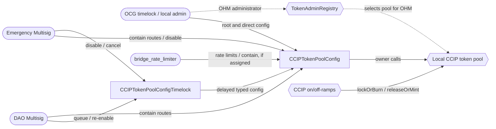

# CCIP Token Pool Configuration Audit

## Purpose

Review the new control plane for Olympus's Chainlink CCIP token pools and its rollout across
Ethereum, Arbitrum, Optimism, Base and Berachain.

The change moves each pool's owner authority into a typed `CCIPTokenPoolConfig` policy. Routine
route changes are queued through `CCIPTokenPoolConfigTimelock`, while governance retains direct
authority and the `emergency`, `admin`, `bridge_admin` and, if assigned, `bridge_rate_limiter`
roles can immediately contain one or all routes.

## Design

- `CCIPTokenPoolConfig` owns one local pool and exposes only supported pool-owner operations. It does
    not forward arbitrary calls.
- The `admin` role holds root authority and may also call every route function directly;
    `bridge_admin` queues route changes through the timelock, may contain routes and re-enables
    either policy inside its grace window; `bridge_rate_limiter` may change rate limits directly and
    contain routes if assigned; and `emergency` may contain routes or disable the control-plane
    policies.
- `CCIPTokenPoolConfigTimelock` accepts typed route, remote-pool, allowlist and rate-limit changes,
    validated at queue time against the config policy's `validate*` mirrors. Execution is
    permissionless once the delay has elapsed and before a three-day window closes; the delay is one
    day at deployment and `admin` may set it between one and thirty days. The constructor binds the
    timelock to one config policy: that policy must advertise `ICCIPTokenPoolConfig`,
    `IConfigOperator` and `IEnabler` and report the same Kernel.
- `ConfigTimelockBatchQueue` reserves the configuration domains touched by an action and records
    their state hashes. Execution fails if the destination or guarded state changed after queueing.
    This shared abstraction and `ConfigOperatorSingleStep` originated in Burner Loans PR
    [`#330`](https://github.com/OlympusDAO/olympus-v3/pull/330) and were copied into this branch.
- Ethereum uses the deployed Chainlink lock/release pool. The four other production EVM chains
    receive the Olympus `CCIPBurnMintTokenPool` policy, which this work does not modify. The same
    config and timelock policies manage both pool types.
- The OHM administrator position in Chainlink's `TokenAdminRegistry`, which selects or delists the
    pool that serves OHM, stays outside the config policy. The rollout moves it to the OCG timelock
    on Ethereum and to the local DAO Multisig elsewhere.
- Deployment, proposal and multisig scripts reconcile the on-chain state with `src/scripts/env.json`
    and perform the ownership, registry, role, route, funding and periphery handovers.

## Scope

Branch: `feat/ccip-config-timelock-n-evm-chains`

Code commit: `<to-be-added>`. See
[scopefile.txt](./scopefile.txt) for the machine-readable list.

### Core Contracts

- [CCIPTokenPoolConfig](../../src/policies/bridge/CCIPTokenPoolConfig.sol) and its
    [interface](../../src/policies/interfaces/bridge/ICCIPTokenPoolConfig.sol)
- [CCIPTokenPoolConfigTimelock](../../src/policies/bridge/CCIPTokenPoolConfigTimelock.sol) and its
    [interface](../../src/policies/interfaces/bridge/ICCIPTokenPoolConfigTimelock.sol)
- [ConfigOperatorSingleStep](../../src/policies/utils/ConfigOperatorSingleStep.sol) and its
    [interface](../../src/policies/interfaces/utils/IConfigOperator.sol)
- [ConfigTimelockBatchQueue](../../src/policies/utils/ConfigTimelockBatchQueue.sol) and its
    [interface](../../src/policies/interfaces/utils/IConfigTimelockBatchQueue.sol)
- The execution-completion hook added to
    [TimelockBatchQueue](../../src/policies/utils/TimelockBatchQueue.sol)

The four shared abstraction files are in scope. The CCIP copies match PR `#330` except
for Solidity pragma normalization. For `TimelockBatchQueue`, only the `_onActionExecuted` hook and
its invocation are in scope.

### Lifecycle Mix-Ins

Both policies inherit the shared enable, disable, re-enable and grace-period mix-ins. These files
were added by the LayerZero bridge remediation commit and were reviewed by Guardian, but they were
never listed in an official audit scope. They are in scope here.

- [PolicyEnablerV2](../../src/policies/utils/PolicyEnablerV2.sol)
- [EnablerV2](../../src/bases/EnablerV2.sol) and its
    [interface](../../src/bases/interfaces/IEnablerV2.sol), which extends
    [IEnabler](../../src/periphery/interfaces/IEnabler.sol)
- [ReEnabler](../../src/bases/ReEnabler.sol) and its
    [interface](../../src/bases/interfaces/IReEnabler.sol)
- [ReEnablerGracePeriod](../../src/bases/ReEnablerGracePeriod.sol) and its
    [interface](../../src/bases/interfaces/IGracePeriod.sol)

### Partial-File Scope

The Solidity metrics extension accepts file paths, not line ranges. It will therefore count each
file below in full. Audit scope is limited to these ranges at commit
[`<to-be-added>`](https://github.com/#<to-be-added>):

| File                     | In-scope code                                                                                                                                                       | Baseline                                                                                                                   |
| ------------------------ | ------------------------------------------------------------------------------------------------------------------------------------------------------------------- | -------------------------------------------------------------------------------------------------------------------------- |
| `TimelockBatchQueue.sol` | Interaction in `executeQueuedAction`, lines 134-154; `_onActionExecuted`, lines 389-397. The new call is line 149 and the new hook is line 397.                                 | Audited version at [`0b7e6138`](https://github.com/OlympusDAO/olympus-v3/commit/0b7e61388c7da4fc443f814228ea234a185e76cc)  |
| `DeployV3.s.sol`         | `_readDeploymentArgUint256OrEnv`, lines 384-404; `deployCCIPTokenPoolConfig`, lines 526-558; `deployCCIPTokenPoolConfigTimelock`, lines 560-605; supporting imports           | `origin/develop` at [`ad2a6a04`](https://github.com/OlympusDAO/olympus-v3/commit/ad2a6a04263da4e8644a96708dbfa4474b59afbf) |
| `BatchScriptV2.sol`      | `setUpWithEmergencyMS`, lines 133-147                                                                                                                                         | `origin/develop` at [`ad2a6a04`](https://github.com/OlympusDAO/olympus-v3/commit/ad2a6a04263da4e8644a96708dbfa4474b59afbf) |
| `CCIPBridge.sol`         | All changes in the audit-commit diff: declarative trusted-remote and gas-limit reconciliation, lifecycle and ownership entry points                                 | `origin/develop` at [`ad2a6a04`](https://github.com/OlympusDAO/olympus-v3/commit/ad2a6a04263da4e8644a96708dbfa4474b59afbf) |
| `CCIPTokenPool.sol`      | All changes in the audit-commit diff: bootstrap authority checks, registry and ownership handover, liquidity and direct pool-owner entry points                     | `origin/develop` at [`ad2a6a04`](https://github.com/OlympusDAO/olympus-v3/commit/ad2a6a04263da4e8644a96708dbfa4474b59afbf) |

Line numbers are informational and pinned to the audit commit. The named functions and commit diff
define the scope if later edits move the lines.

### Chainlink Pool Interfaces

The local interfaces under [src/external/bridge](../../src/external/bridge) define the exact
Chainlink pool, registry, rate-limiter and liquidity calls used by the config policy and rollout
scripts. Their selectors, struct layouts and compatibility with the deployed Chainlink contracts
are in scope.

### Deployment and Configuration

- [CCIPTokenPoolConfigProposal](../../src/proposals/CCIPTokenPoolConfigProposal.sol)
- [DeployV3](../../src/scripts/deploy/DeployV3.s.sol)
- [CCIPTokenPoolConfigBatch](../../src/scripts/ops/batches/CCIPTokenPoolConfigBatch.sol)
- [CCIPNonEthereumSetupBatch](../../src/scripts/ops/batches/CCIPNonEthereumSetupBatch.sol)
- [CCIPRouteReconcileBatch](../../src/scripts/ops/batches/CCIPRouteReconcileBatch.sol)
- The modified [CCIPBridge](../../src/scripts/ops/batches/CCIPBridge.sol) and
    [CCIPTokenPool](../../src/scripts/ops/batches/CCIPTokenPool.sol) batch scripts
- [CCIPConfigLib](../../src/scripts/ops/lib/CCIPConfigLib.sol),
    [CCIPFeeBudgetLib](../../src/scripts/ops/lib/CCIPFeeBudgetLib.sol) and the Emergency Multisig
    setup added to [BatchScriptV2](../../src/scripts/ops/lib/BatchScriptV2.sol)

Both policies are deployed under the Foundry `deploy` profile, which enables the optimizer at 400
runs and which `shell/deployV3.sh` sets. Unoptimized, both runtime artifacts exceed the EIP-170
code-size limit, so a deployment that bypasses that profile cannot succeed.

### Out of Scope

- Chainlink CCIP contracts and infrastructure, including the router, on/off-ramps,
    `TokenAdminRegistry` and `LockReleaseTokenPool`, except for compatibility with the local
    interfaces and assumptions made by the in-scope code.
- The transfer-plane implementations `CCIPBurnMintTokenPool` and `CCIPCrossChainBridge`. This work
    does not modify them and both were reviewed in the 2025 CCIP audit.
- [RoleDefinitions](../../src/policies/utils/RoleDefinitions.sol). CCIP reuses the existing
    `bridge_admin` and `bridge_rate_limiter` constants and changes only their explanatory comments.
- [PolicyAdminOptimized](../../src/policies/utils/PolicyAdminOptimized.sol). It was audited as
    part of the 2026 LayerZero bridge upgrade. The hooks the two policies override
    (`_authorizeReEnable`, `_authorizeSetGracePeriod`, `_authorizeSetConfigOperator`,
    `_beforeEnable`, `_beforeReEnable`) and the resulting authorization remain in scope.
- [DeployV2](../../src/scripts/deploy/DeployV2.sol). Its executable code is unchanged; only the
    general deploy-profile guidance in comments was updated.
- Tests, shell scripts, deployment JSON, `env.json` values and Anvil rehearsal tooling. The unit and
    invariant suites under `src/test/policies/bridge/CCIPTokenPoolConfig` and
    `CCIPTokenPoolConfigTimelock` and the fork-based migration suites under
    `src/test/policies/bridge/scenarios` are supporting evidence for the intended authorization and
    rollout behaviour, not production code.
- Solana program changes. This branch only configures the EVM side of the existing Solana lane.

## Previous Audits

- **Cooler V2 by Electisec (03/2025)** —
    [report](https://storage.googleapis.com/olympusdao-landing-page-reports/audits/Olympus_CoolerV2-Electisec_report.pdf).
    Covers `PolicyEnabler` and `PolicyAdmin`, the originals that `PolicyEnablerV2` and
    `PolicyAdminOptimized` derive from.
- **CCIP Bridge (05/2025)** — [audit package](../2025-05_ccip/README.md). Covers
    `CCIPBurnMintTokenPool`, `CCIPCrossChainBridge` and their supporting base contracts.
- **Olympus Bridge (06/2026)** —
    [report](https://storage.googleapis.com/olympusdao-landing-page-reports/audits/2026-06-Bridge.pdf)
    and [audit package](../2026-03_lz-bridge-upgrade/README.md). Its scope list covers the
    LayerZero V2 bridge architecture and, among the shared bases this work reuses,
    `TimelockBatchQueue`, `ITimelockBatchQueue` and `PolicyAdminOptimized`. Only the new
    `TimelockBatchQueue` execution hook is part of this audit's scope.

## Architecture

On Ethereum, `admin`, the pool rebalancer and the OHM registry administrator are the OCG timelock.
On the non-canonical EVM chains, the local DAO Multisig holds `admin`, `bridge_admin`, the registry
administrator and the Kernel executor authority. The Emergency Multisig is the same address on
every production chain. The pool's native `rateLimitAdmin` is unset and the `bridge_rate_limiter`
role is unassigned at launch. The per-function authority matrix for both chain classes is in
[ACCESS_CONTROL.md](../../documentation/bridge/ccip/ACCESS_CONTROL.md).

## Key Flows

### Delayed Route Change

1. `bridge_admin` queues a typed action while both policies are enabled and the timelock is the
   config operator.
2. The config policy's `validate*` mirror checks the request. The timelock reserves the affected
   route domains and stores their current state hashes.
3. After the delay, anyone may execute before the three-day execution window closes.
4. Execution rechecks the destination, operator relationship and guarded state, then dispatches to
   the config policy. All keys are released only after the whole action succeeds or is cancelled.

Each route has separate rate-limit, remote-pool and route-identity domains; the allowlist is one
pool-wide domain. One unresolved action may own a domain at a time.

### Emergency Containment and Recovery

`emergency`, `admin`, `bridge_admin` or `bridge_rate_limiter` can set both buckets of one or every
route to an enabled capacity of two and a refill rate of one, even while the config policy is
disabled. This blocks transfers of any real OHM amount. Restoring or raising capacity needs
`setChainRateLimits`, which only the config operator, `admin` or `bridge_rate_limiter` may call, so
`emergency` and `bridge_admin` cannot lift containment without the timelock delay or further
authority.

Recovery re-enables the control-plane policies, cancels stale or unwanted actions, and queues the
approved limits through the normal timelock. Restoring a limiter does not refill its bucket: it
starts from the contained balance and refills at the restored rate. Messages that failed an inbound
limiter require permissionless manual execution after recovery.

### Initial Rollout

The rollout transfers the OHM registry administrator and pool ownership away from deployer EOAs,
deploys and activates the config policies on five chains, establishes roles and operators, opens
the EVM routes, funds the Ethereum lock/release pool, enables and registers the non-Ethereum pools,
and reconciles the optional periphery.

The mainnet OCG proposal carries at most twelve actions: eight conditional handover steps and one
`addChain` per new EVM route. It fails closed unless its deployment bindings, Solana route, exact
set of four missing EVM routes, lock/release backing and per-lane delivery budgets match the
desired state. On each burn/mint chain, setup runs during the voting window but leaves the pool
disabled and unregistered. Finalization enables the pool and then registers it immediately after
the mainnet proposal executes. This ordering keeps a failed vote recoverable, at the cost of a
short post-execution window in which messages to a not-yet-finalized destination require
permissionless manual execution.

## Documentation

- [CCIP Access Control Matrix](../../documentation/bridge/ccip/ACCESS_CONTROL.md) — the complete,
    source-verified authority matrix for both chain classes.
- [CCIP bridging infrastructure](../../documentation/bridge/ccip/RUNBOOK.md) — the operator
    documentation: desired state in `env.json`, the rollout sequences, the emergency levers and the
    recovery procedures.

## Known Risks and Assumptions

- **Direct paths bypass the delay.** `admin` can call every route function without the timelock: it
    can appoint any config operator anyway, and on Ethereum its own execution path is already
    timelocked. If assigned, `bridge_rate_limiter` can change rate limits the same way.
- **The pool's native `rateLimitAdmin` is a bypass if set.** It is unset at launch and only `admin`
    can set it, through the config policy. A non-zero holder could write rate limits straight to the
    pool, outside the policy's validation, enabled-state check and events.
- **Containment is one way and widely held.** Four roles can contain instantly, but lifting
    containment takes a delayed action or direct `admin`/`bridge_rate_limiter` authority. If a
    restore action was already queued when a route is contained again, its recorded state hash may
    still match, so the restore can later lift the new containment; incident response has to cancel
    such actions.
- **Queued actions keep their domains until cancelled.** Expiry, a direct change to the same state,
    loss of pool ownership and a config-operator rotation each leave an action unexecutable while it
    still reserves its keys, and disabling or re-enabling the policies does not clear the queue. A
    replacement action can only be queued after the holder is cancelled.
- **A disabled policy can be re-enabled without governance.** `bridge_admin` may call `reEnable()`
    on the config policy or the timelock within the grace window that starts at any disable,
    including one made by the Emergency Multisig; the window is three days at deployment and
    `admin` can change it while the policy is enabled. Afterwards only `admin` can enable them.
- **Policy shutdown is not transfer shutdown.** Disabling the config policy, timelock or periphery
    does not stop direct CCIP sends; only pool rate-limit containment does.
- **Removals reject in-flight messages.** Removing a route or a remote pool makes messages already
    in flight from that remote fail on arrival. The reconciler therefore removes only what
    `env.json` marks with `enabled: false`, and warns when it does.
- **Two domains are guarded by an order-independent digest.** The remote-pool set and the allowlist
    are hashed as a XOR aggregate of their hashed members plus the member count, because the pool
    stores them in enumerable sets whose order changes on removal. The aggregate detects drift
    between queueing and execution; it is not collision resistant against chosen members, and only
    the pool owner writes those sets.
- **Chainlink pool compatibility is assumed.** The local interfaces mirror the pools in use: the
    deployed Ethereum pool reports `LockReleaseTokenPool 1.5.1`, and the pool this rollout deploys
    on the other chains reports `BurnMintTokenPool 1.5.1`. Every owner call and every state-hash
    guard depends on those getters, structs and semantics.
- **Non-Ethereum** `admin` **is chain-wide.** Granting it to a local DAO Multisig applies to every policy
    attached to that Kernel, not only the CCIP policies.
- **The burn/mint pool uses the legacy lifecycle.** After it is disabled on a non-canonical chain,
    only local `admin` can enable it; the grace-window recovery covers the config policy and the
    timelock only.
- **Rollout has a short destination gap.** After Ethereum opens a route and before a destination
    pool is finalized, messages may enter CCIP failure state and require manual execution.
- **Ethereum solvency depends on pool backing.** The lock/release pool bounds releases by its OHM
    balance. The rollout scripts assume the configured backing target covers supply previously minted
    on the non-canonical chains.
- **Burn/mint delivery needs a raised Chainlink fee budget.** Each lane into a burn/mint pool needs
    an enabled OHM fee entry with `destGasOverhead >= 175000`; the rollout scripts refuse to proceed
    without it.
