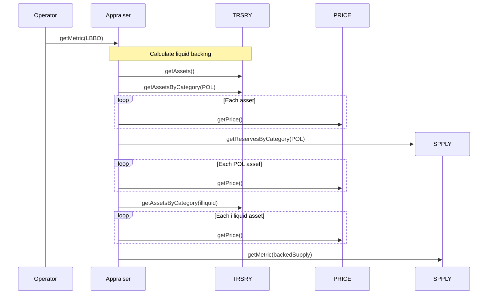
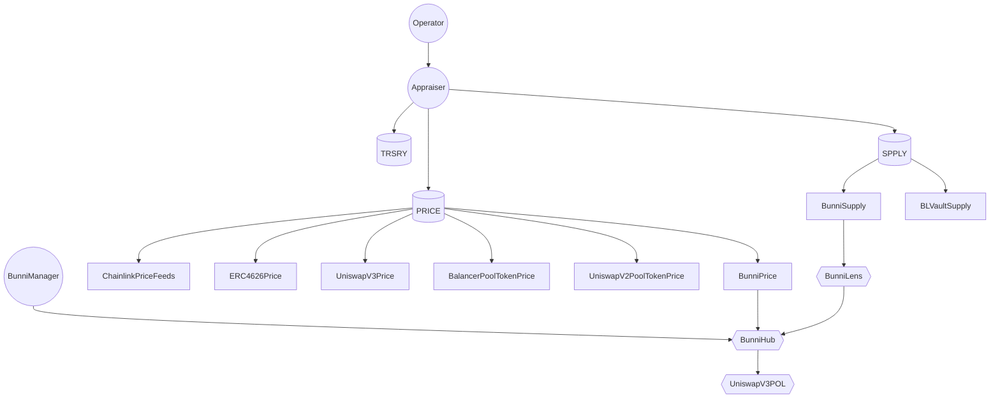

# OlympusDAO RBS v2 Audit

## Purpose

The purpose of this audit is to review an upgraded Range-Bound Stability system that that requires no manual intervention. This is aligned with the progressive automation and decentralization of the Olympus protocol.

These contracts will be installed in the Olympus V3 "Bophades" system, based on the [Default Framework](https://palm-cause-2bd.notion.site/Default-A-Design-Pattern-for-Better-Protocol-Development-7f8ace6d263c4303b108dc5f8c3055b1).

## Scope

### In-Scope Contracts

The contracts in-scope for this audit are:

* [modules/](../../src/modules)
  * [PRICE/](../../src/modules/PRICE)
    * [submodules/](../../src/modules/PRICE/submodules)
      * [feeds/](../../src/modules/PRICE/submodules/feeds)
        * [BalancerPoolTokenPrice.sol](../../src/modules/PRICE/submodules/feeds/BalancerPoolTokenPrice.sol)
        * [BunniPrice.sol](../../src/modules/PRICE/submodules/feeds/BunniPrice.sol)
        * [ChainlinkPriceFeeds.sol](../../src/modules/PRICE/submodules/feeds/ChainlinkPriceFeeds.sol)
        * [ERC4626Price.sol](../../src/modules/PRICE/submodules/feeds/ERC4626Price.sol)
        * [UniswapV2PoolTokenPrice.sol](../../src/modules/PRICE/submodules/feeds/UniswapV2PoolTokenPrice.sol)
        * [UniswapV3Price.sol](../../src/modules/PRICE/submodules/feeds/UniswapV3Price.sol)
      * [strategies/](../../src/modules/PRICE/submodules/strategies)
        * [SimplePriceFeedStrategy.sol](../../src/modules/PRICE/submodules/strategies/SimplePriceFeedStrategy.sol)
    * [OlympusPrice.v2.sol](../../src/modules/PRICE/OlympusPrice.v2.sol)
    * [PRICE.v2.sol](../../src/modules/PRICE/PRICE.v2.sol)
  * [RANGE/](../../src/modules/RANGE)
    * [OlympusRange.sol](../../src/modules/RANGE/OlympusRange.sol)
    * [RANGE.v2.sol](../../src/modules/RANGE/RANGE.v2.sol)
  * [SPPLY/](../../src/modules/SPPLY)
    * [submodules/](../../src/modules/SPPLY/submodules)
      * [AuraBalancerSupply.sol](../../src/modules/SPPLY/submodules/AuraBalancerSupply.sol)
      * [BLVaultSupply.sol](../../src/modules/SPPLY/submodules/BLVaultSupply.sol)
      * [BunniSupply.sol](../../src/modules/SPPLY/submodules/BunniSupply.sol)
      * [CustomSupply.sol](../../src/modules/SPPLY/submodules/CustomSupply.sol)
      * [IncurDebtSupply.sol](../../src/modules/SPPLY/submodules/IncurDebtSupply.sol)
      * [SentimentArbSupply.sol](../../src/modules/SPPLY/submodules/SentimentArbSupply.sol)
      * [SiloArbSupply.sol](../../src/modules/SPPLY/submodules/SiloArbSupply.sol)
      * [SiloSupply.sol](../../src/modules/SPPLY/submodules/SiloSupply.sol)
    * [OlympusSupply.sol](../../src/modules/SPPLY/OlympusSupply.sol)
    * [SPPLY.v1.sol](../../src/modules/SPPLY/SPPLY.v1.sol)
  * [TRSRY/](../../src/modules/TRSRY)
    * [OlympusTreasury.sol](../../src/modules/TRSRY/OlympusTreasury.sol)
    * [TRSRY.v1.sol](../../src/modules/TRSRY/TRSRY.v1.sol)
* [policies/](../../src/policies)
  * [Bonds/](../../src/policies/Bonds)
    * [BondCallback.sol](../../src/policies/Bonds/BondCallback.sol)
    * [BondManager.sol](../../src/policies/Bonds/BondManager.sol)
  * [Distributor/](../../src/policies/Distributor)
    * [ZeroDistributor.sol](../../src/policies/Distributor/ZeroDistributor.sol)
  * [OCA/](../../src/policies/OCA)
    * [interfaces/](../../src/policies/OCA/interfaces)
      * [IAppraiser.sol](../../src/policies/OCA/interfaces/IAppraiser.sol)
    * [Appraiser.sol](../../src/policies/OCA/Appraiser.sol)
    * [Bookkeeper.sol](../../src/policies/OCA/Bookkeeper.sol)
  * [RBS/](../../src/policies/RBS)
    * [interfaces/](../../src/policies/RBS/interfaces)
      * [IDistributor.sol](../../src/policies/RBS/interfaces/IDistributor.sol)
      * [IHeart.sol](../../src/policies/RBS/interfaces/IHeart.sol)
      * [IOperator.sol](../../src/policies/RBS/interfaces/IOperator.sol)
    * [Heart.sol](../../src/policies/RBS/Heart.sol)
    * [Operator.sol](../../src/policies/RBS/Operator.sol)
  * [UniswapV3/](../../src/policies/UniswapV3)
    * [interfaces/](../../src/policies/UniswapV3/interfaces)
      * [IBunniManager.sol](../../src/policies/UniswapV3/interfaces/IBunniManager.sol)
    * [BunniManager.sol](../../src/policies/UniswapV3/BunniManager.sol)
  * [CrossChainBridge.sol](../../src/policies/CrossChainBridge.sol)
  * [Emergency.sol](../../src/policies/Emergency.sol)
  * [RolesAdmin.sol](../../src/policies/RolesAdmin.sol)
  * [TreasuryCustodian.sol](../../src/policies/TreasuryCustodian.sol)
* [scripts/](../../src/scripts)
  * [deploy/](../../src/scripts/deploy)
    * [DeployV2.sol](../../src/scripts/deploy/DeployV2.sol)
    * [deployV2.sh](../../src/scripts/deploy/deployV2.sh)
  * [ops/](../../src/scripts/ops)
    * [batches/](../../src/scripts/ops/batches)
      * [PRICEv2Install.sol](../../src/scripts/ops/batches/PRICEv2Install.sol)
      * [RBS2Install.sol](../../src/scripts/ops/batches/RBS2Install.sol)
    * [lib/](../../src/scripts/ops/lib)
      * [BatchScript.sol](../../src/scripts/ops/lib/BatchScript.sol)
    * [OlyBatch.sol](../../src/scripts/ops/OlyBatch.sol)
  * [README.md](../../src/scripts/README.md)
  * [env.json](../../src/scripts/env.json)
* [Submodules.sol](../../src/Submodules.sol)

Tests for the in-scope contracts are contained in the following locations:

* [test/](../../src/test)
  * [lib/](../../src/test/lib)
    * [UniswapV3/](../../src/test/lib/UniswapV3)
      * [CallbackValidation.sol](../../src/test/lib/UniswapV3/CallbackValidation.sol)
      * [NoDelegateCall.sol](../../src/test/lib/UniswapV3/NoDelegateCall.sol)
      * [SwapRouter.sol](../../src/test/lib/UniswapV3/SwapRouter.sol)
      * [UniswapV3Factory.sol](../../src/test/lib/UniswapV3/UniswapV3Factory.sol)
      * [UniswapV3Pool.sol](../../src/test/lib/UniswapV3/UniswapV3Pool.sol)
      * [UniswapV3PoolDeployer.sol](../../src/test/lib/UniswapV3/UniswapV3PoolDeployer.sol)
  * [mocks/](../../src/test/mocks)
    * [AuraMocks.sol](../../src/test/mocks/AuraMocks.sol)
    * [BalancerMocks.sol](../../src/test/mocks/BalancerMocks.sol)
    * [MockBalancerPool.sol](../../src/test/mocks/MockBalancerPool.sol)
    * [MockBalancerVault.sol](../../src/test/mocks/MockBalancerVault.sol)
    * [MockPrice.v2.sol](../../src/test/mocks/MockPrice.v2.sol)
    * [MockPriceFeed.sol](../../src/test/mocks/MockPriceFeed.sol)
    * [MockSilo.sol](../../src/test/mocks/MockSilo.sol)
    * [MockStakingForZD.sol](../../src/test/mocks/MockStakingForZD.sol)
    * [MockUniV2Pair.sol](../../src/test/mocks/MockUniV2Pair.sol)
    * [MockUniV3Pair.sol](../../src/test/mocks/MockUniV3Pair.sol)
    * [MockUniswapV2Pool.sol](../../src/test/mocks/MockUniswapV2Pool.sol)
  * [modules/](../../src/test/modules)
    * [PRICE.v2/](../../src/test/modules/PRICE.v2)
      * [submodules/](../../src/test/modules/PRICE.v2/submodules)
        * [feeds/](../../src/test/modules/PRICE.v2/submodules/feeds)
          * [BalancerPoolTokenPriceStable.t.sol](../../src/test/modules/PRICE.v2/submodules/feeds/BalancerPoolTokenPriceStable.t.sol)
          * [BalancerPoolTokenPriceWeighted.t.sol](../../src/test/modules/PRICE.v2/submodules/feeds/BalancerPoolTokenPriceWeighted.t.sol)
          * [BunniPrice.t.sol](../../src/test/modules/PRICE.v2/submodules/feeds/BunniPrice.t.sol)
          * [ChainlinkPriceFeeds.t.sol](../../src/test/modules/PRICE.v2/submodules/feeds/ChainlinkPriceFeeds.t.sol)
          * [ERC4626Price.t.sol](../../src/test/modules/PRICE.v2/submodules/feeds/ERC4626Price.t.sol)
          * [UniswapV2PoolTokenPrice.t.sol](../../src/test/modules/PRICE.v2/submodules/feeds/UniswapV2PoolTokenPrice.t.sol)
          * [UniswapV3Price.t.sol](../../src/test/modules/PRICE.v2/submodules/feeds/UniswapV3Price.t.sol)
        * [strategies/](../../src/test/modules/PRICE.v2/submodules/strategies)
          * [SimplePriceFeedStrategy.t.sol](../../src/test/modules/PRICE.v2/submodules/strategies/SimplePriceFeedStrategy.t.sol)
      * [PRICE.v2.t.sol](../../src/test/modules/PRICE.v2/PRICE.v2.t.sol)
    * [SPPLY/](../../src/test/modules/SPPLY)
      * [submodules/](../../src/test/modules/SPPLY/submodules)
        * [AuraBalancerSupply.t.sol](../../src/test/modules/SPPLY/submodules/AuraBalancerSupply.t.sol)
        * [BLVaultSupply.t.sol](../../src/test/modules/SPPLY/submodules/BLVaultSupply.t.sol)
        * [BunniSupply.t.sol](../../src/test/modules/SPPLY/submodules/BunniSupply.t.sol)
        * [IncurDebtSupply.t.sol](../../src/test/modules/SPPLY/submodules/IncurDebtSupply.t.sol)
        * [SentimentArbSupply.t.sol](../../src/test/modules/SPPLY/submodules/SentimentArbSupply.t.sol)
        * [SiloArbSupply.t.sol](../../src/test/modules/SPPLY/submodules/SiloArbSupply.t.sol)
        * [SiloSupply.t.sol](../../src/test/modules/SPPLY/submodules/SiloSupply.t.sol)
      * [SPPLY.v1.t.sol](../../src/test/modules/SPPLY/SPPLY.v1.t.sol)
    * [RANGE.t.sol](../../src/test/modules/RANGE.t.sol)
    * [TRSRY.v1_1.t.sol](../../src/test/modules/TRSRY.v1_1.t.sol)
  * [policies/](../../src/test/policies)
    * [Bonds/](../../src/test/policies/Bonds)
      * [BondCallback.t.sol](../../src/test/policies/Bonds/BondCallback.t.sol)
      * [BondManager.t.sol](../../src/test/policies/Bonds/BondManager.t.sol)
    * [OCA/](../../src/test/policies/OCA)
      * [Appraiser.t.sol](../../src/test/policies/OCA/Appraiser.t.sol)
      * [Bookkeeper.t.sol](../../src/test/policies/OCA/Bookkeeper.t.sol)
    * [RBS/](../../src/test/policies/RBS)
      * [Heart.t.sol](../../src/test/policies/RBS/Heart.t.sol)
      * [Operator.t.sol](../../src/test/policies/RBS/Operator.t.sol)
    * [UniswapV3/](../../src/test/policies/UniswapV3)
      * [BunniManager.t.sol](../../src/test/policies/UniswapV3/BunniManager.t.sol)
    * [CrossChainBridge.t.sol](../../src/test/policies/CrossChainBridge.t.sol)
    * [CrossChainBridgeFork.t.sol](../../src/test/policies/CrossChainBridgeFork.t.sol)
  * [Submodules.t.sol](../../src/test/Submodules.t.sol)

### External Contracts

The in-scope contracts depend on external contracts or interfaces:

* [external/](../../src/external)
  * [aura/](../../src/external/aura)
    * [interfaces/](../../src/external/aura/interfaces)
      * [IAuraRewardPool.sol](../../src/external/aura/interfaces/IAuraRewardPool.sol)
  * [balancer/](../../src/external/balancer)
    * [interfaces/](../../src/external/balancer/interfaces)
      * [IBalancerPool.sol](../../src/external/balancer/interfaces/IBalancerPool.sol)
  * [bunni/](../../src/external/bunni)
    * [base/](../../src/external/bunni/base)
      * [Structs.sol](../../src/external/bunni/base/Structs.sol)
    * [interfaces/](../../src/external/bunni/interfaces)
      * [IBunniHub.sol](../../src/external/bunni/interfaces/IBunniHub.sol)
      * [IBunniLens.sol](../../src/external/bunni/interfaces/IBunniLens.sol)
      * [IBunniToken.sol](../../src/external/bunni/interfaces/IBunniToken.sol)
      * [IERC20.sol](../../src/external/bunni/interfaces/IERC20.sol)
      * [ILiquidityManagement.sol](../../src/external/bunni/interfaces/ILiquidityManagement.sol)
    * [lib/](../../src/external/bunni/lib)
      * [ERC20.sol](../../src/external/bunni/lib/ERC20.sol)
      * [SafeTransferLib.sol](../../src/external/bunni/lib/SafeTransferLib.sol)
    * [uniswap/](../../src/external/bunni/uniswap)
      * [LiquidityManagement.sol](../../src/external/bunni/uniswap/LiquidityManagement.sol)
    * [BunniHub.sol](../../src/external/bunni/BunniHub.sol)
    * [BunniLens.sol](../../src/external/bunni/BunniLens.sol)
    * [BunniToken.sol](../../src/external/bunni/BunniToken.sol)
* [interfaces/](../../src/interfaces)
  * [Silo/](../../src/interfaces/Silo)
    * [IBaseSilo.sol](../../src/interfaces/Silo/IBaseSilo.sol)
    * [ISiloLens.sol](../../src/interfaces/Silo/ISiloLens.sol)
  * [AggregatorV2V3Interface.sol](../../src/interfaces/AggregatorV2V3Interface.sol)
  * [IBondAggregator.sol](../../src/interfaces/IBondAggregator.sol)
  * [IBondAuctioneer.sol](../../src/interfaces/IBondAuctioneer.sol)
  * [IBondCallback.sol](../../src/interfaces/IBondCallback.sol)
  * [IBondFixedExpiryTeller.sol](../../src/interfaces/IBondFixedExpiryTeller.sol)
  * [IBondSDA.sol](../../src/interfaces/IBondSDA.sol)
  * [IBondTeller.sol](../../src/interfaces/IBondTeller.sol)
  * [IEasyAuction.sol](../../src/interfaces/IEasyAuction.sol)
  * [IStaking.sol](../../src/interfaces/IStaking.sol)
  * [IgOHM.sol](../../src/interfaces/IgOHM.sol)
* [libraries/](../../src/libraries)
  * [Balancer/](../../src/libraries/Balancer)
    * [contracts/](../../src/libraries/Balancer/contracts)
      * [BalancerErrors.sol](../../src/libraries/Balancer/contracts/BalancerErrors.sol)
      * [BalancerReentrancyGuard.sol](../../src/libraries/Balancer/contracts/BalancerReentrancyGuard.sol)
      * [VaultReentrancyLib.sol](../../src/libraries/Balancer/contracts/VaultReentrancyLib.sol)
    * [interfaces/](../../src/libraries/Balancer/interfaces)
      * [IAsset.sol](../../src/libraries/Balancer/interfaces/IAsset.sol)
      * [IBasePool.sol](../../src/libraries/Balancer/interfaces/IBasePool.sol)
      * [IStablePool.sol](../../src/libraries/Balancer/interfaces/IStablePool.sol)
      * [IVault.sol](../../src/libraries/Balancer/interfaces/IVault.sol)
      * [IWeightedPool.sol](../../src/libraries/Balancer/interfaces/IWeightedPool.sol)
    * [math/](../../src/libraries/Balancer/math)
      * [FixedPoint.sol](../../src/libraries/Balancer/math/FixedPoint.sol)
      * [LogExpMath.sol](../../src/libraries/Balancer/math/LogExpMath.sol)
      * [Math.sol](../../src/libraries/Balancer/math/Math.sol)
      * [StableMath.sol](../../src/libraries/Balancer/math/StableMath.sol)
  * [UniswapV3/](../../src/libraries/UniswapV3)
    * [BunniHelper.sol](../../src/libraries/UniswapV3/BunniHelper.sol)
    * [PoolLibrary.sol](../../src/libraries/UniswapV3/PoolLibrary.sol)
    * [Positions.sol](../../src/libraries/UniswapV3/Positions.sol)
  * [FullMath.sol](../../src/libraries/FullMath.sol)
  * [QuickSort.sol](../../src/libraries/QuickSort.sol)
  * [TransferHelper.sol](../../src/libraries/TransferHelper.sol)

Several external interfaces and libraries are used to interact with other protocols including Uniswap V2, Uniswap V3, Chainlink, and Balancer V2. These dependencies are stored locally in the following folders:

* `src/external`
* `src/libraries`
* `src/interfaces`

Additionally, the contracts use various base contracts from `solmate` and `openzeppelin`.

### Previously Audited Contracts

The in-scope contracts depend on or are dependencies for these previously audited contracts:

* [modules/](../../src/modules)
  * [MINTR/](../../src/modules/MINTR)
    * [MINTR.v1.sol](../../src/modules/MINTR/MINTR.v1.sol)
    * [OlympusMinter.sol](../../src/modules/MINTR/OlympusMinter.sol)
  * [ROLES/](../../src/modules/ROLES)
    * [OlympusRoles.sol](../../src/modules/ROLES/OlympusRoles.sol)
    * [ROLES.v1.sol](../../src/modules/ROLES/ROLES.v1.sol)
* [policies/](../../src/policies)
  * [OHM/](../../src/policies/OHM)
    * [Burner.sol](../../src/policies/OHM/Burner.sol)
    * [Minter.sol](../../src/policies/OHM/Minter.sol)
  * [RolesAdmin.sol](../../src/policies/RolesAdmin.sol)
* [Kernel.sol](../../src/Kernel.sol)

## Previous Audits

Olympus V3 was audited multiple times prior to launch in November, 2022. The currently deployed Olympus V3 contracts can be found on [GitHub](https://github.com/OlympusDAO/olympus-v3).

You can reference these audits here:

* Spearbit (07/2022)
  * [Report](https://storage.googleapis.com/olympusdao-landing-page-reports/audits/2022-08%20Code4rena.pdf)
* Code4rena Olympus V3 Audit (08/2022)
  * [Repo](https://github.com/code-423n4/2022-08-olympus)
  * [Findings](https://github.com/code-423n4/2022-08-olympus-findings)
* Kebabsec Olympus V3 Remediation and Follow-up Audits (10/2022 - 11/2022)
  * [Remediation Audit Phase 1 Report](https://hackmd.io/tJdujc0gSICv06p_9GgeFQ)
  * [Remediation Audit Phase 2 Report](https://hackmd.io/@12og4u7y8i/rk5PeIiEs)
  * [Follow-on Audit Report](https://hackmd.io/@12og4u7y8i/Sk56otcBs)
* Cross-Chain Bridge by OtterSec (04/2023)
  * [Report](https://storage.googleapis.com/olympusdao-landing-page-reports/audits/Olympus-CrossChain-Audit.pdf)
* PRICEv2 by HickupHH3 (06/2023)
  * [Report](https://storage.googleapis.com/olympusdao-landing-page-reports/audits/2023_7_OlympusDAO-final.pdf)
* RBS 1.3 & 1.4 by HickupHH3 (11/2023)
  * [Report](https://storage.googleapis.com/olympusdao-landing-page-reports/audits/OlympusDAO%20Nov%202023.pdf)

## Architecture

### Overview

The diagram demonstrates the interactions of the different components when calling `getMetric()` to obtain liquid backing per backed OHM:



The diagram illustrates the architecture of the components:



Legend:

* Circle: policy
* Cylinder: module
* Rectangle: submodule
* Hexagon: external contract

The components are outlined in the following sub-sections.

### TRSRY v1.1 (Module)

Features:

* Add/remove assets to be managed and tracked
* Add/remove assets to/from categories
* Add/remove locations to track asset balances in
* Category groups containing mutually-exclusive categories (e.g. liquid and illiquid)

### PRICE v2 (Module)

An upgraded PRICE module that standardizes and simplifies the consumption of oracle price feeds across the Olympus protocol. The vast majority of this module has already undergone an audit.

Features:

* Add/remove price definitions for assets
* Set one or more sources to derive the price (e.g. a Balancer pool, Chainlink price feeds)
* Set a strategy to handle the price(s) received
* Caching price values
* Tracking a moving average

### SPPLY (Module)

A new module to track OHM supply across different locations and categories

Features:

* Add/remove categories of supply
* Add/remove locations to categories
* Calculate OHM supply per category
* Calculate reserves per category
* Calculate supply metrics (e.g. backed OHM supply)
* Submodules to enable different sources to be used to determine supply (e.g. protocol-owned liquidity in a Uniswap V3 position)

### Cross-Chain Bridge (Policy)

Features:

* Adds a variable to track the net quantity of OHM that has been bridged. This is used by SPPLY

### Appraiser (Policy)

A new policy that provides high-level metrics, often combining values from TRSRY, PRICE and SPPLY

Features:

* Calculate the value of asset holdings
* Calculate the value of asset holdings in a category
* Calculate metrics (e.g. liquid backing per backed OHM)

### BookKeeper (Policy)

A new policy to provide convenient configuration of TRSRY, PRICE and SPPLY

### BunniManager (Policy)

A new policy that enables Uniswap V3 positions to be managed by the Bophades system, using the [Bunni contracts](https://github.com/ZeframLou/bunni)

Features:

* Create an ERC20-compatible LP token for a given Uniswap V3 pool
* Deposit/withdraw liquidity into the pool's position
* Harvest and re-invest fees from the position back into the pool
* Register an existing Bunni LP token with the policy, to be used when migrating policy versions

### Operator (Policy)

Features:

* Utilises the liquid backing per backed OHM metric from Appraiser as the target price, instead of a manual value

## Frequent Questions

TODO

## Getting Started

This repository uses Foundry as its development and testing environment. You must first [install Foundry](https://getfoundry.sh/) to build the contracts and run the test suite.

### Clone the repository into a local directory

```sh
git clone https://github.com/OlympusDAO/bophades
```

### Install dependencies

```sh
cd bophades
git checkout price-v2
pnpm run install # install npm modules for linting and doc generation
forge build # installs git submodule dependencies when contracts are compiled
```

### Build

Compile the contracts with `forge build`.

### Tests

Run the full test suite with `pnpm run test`. However, there are some Fork tests for other parts of the protocol that can run into RPC rate limit issues. It is recommended to run the test suite without the fork tests for this audit. Specifically, you can run `pnpm run test:unit`.

Fuzz tests have been written to cover a range of inputs. Default number of runs is 256, more were used when troubleshooting edge cases.

### Linting

Pre-configured `solhint` and `prettier-plugin-solidity`. Can be run by

```sh
pnpm run lint
```
