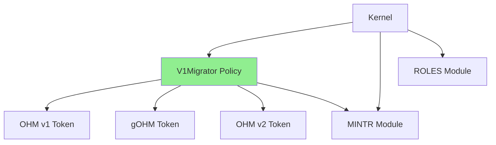
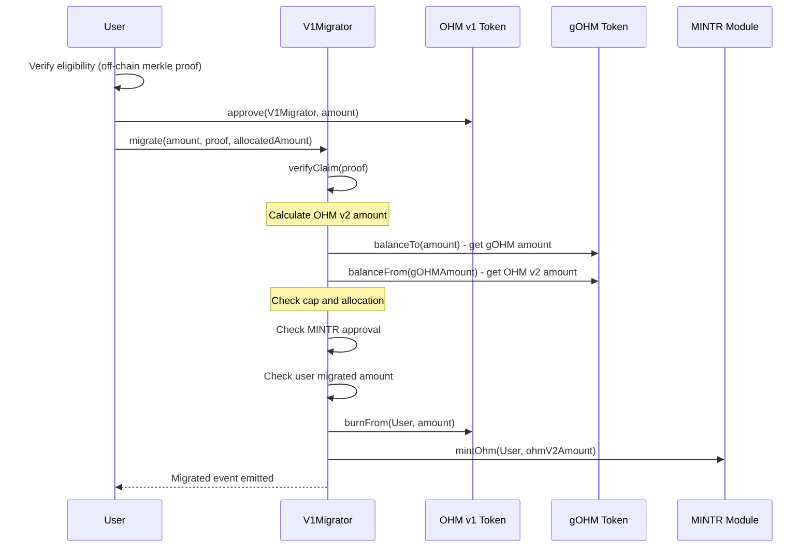

# V1Migrator Policy

The V1Migrator is a policy that allows OHM v1 holders to migrate to OHM v2 via merkle proof verification. This replaces the old TokenMigrator contract.

## Overview

### Problem Statement

The old TokenMigrator contract was part of a previous generation of Olympus contracts and presented technical debt:

- Stranded supply in TokenMigrator was never properly accounted for, inflating supply
- No governance-controlled limits on migrations
- The legacy system pre-minted tokens that could remain unused, inflating supply

### Solution Approach

The new V1Migrator addresses these issues:

1. **Mint-on-Demand Migration**: Instead of holding pre-minted tokens, V1Migrator mints OHM v2 on demand via the MINTR module
2. **Migration Cap via MINTR Approval**: The MINTR module enforces a hard cap on total migrations
3. **Merkle-Based Eligibility**: Users provide a merkle proof to demonstrate eligibility (allowlist)
4. **Partial Migrations**: Users can migrate any amount up to their allocation in multiple transactions

## Architecture

The V1Migrator policy interacts with several contracts and modules:



### Key Components

- **V1Migrator**: Main migration policy with merkle proof verification. Replaces the old TokenMigrator contract.
- **MINTR Module**: Mints OHM v2 to users when they migrate
- **ROLES Module**: Manages access control (`admin`, `legacy_migration_admin` roles)
- **OHM v1 Token**: The legacy OHM token (9 decimals) that users burn
- **gOHM Token**: Used for conversion calculations (balanceTo/balanceFrom)
- **OHM v2 Token**: The current OHM token (9 decimals) minted to users

## User Migration Flow

Users migrate their OHM v1 to OHM v2 by providing a merkle proof:



### Migration Details

**OHM v1 to OHM v2 Conversion**: The migration uses gOHM conversion to match the production flow:

```text
OHM v1 -> gOHM (balanceTo) -> OHM v2 (balanceFrom)
```

- Input: OHM v1 amount (9 decimals)
- gOHM intermediate: `balanceTo(ohmV1Amount)` returns gOHM amount (18 decimals)
- Output: `balanceFrom(gOHMAmount)` returns OHM v2 amount (9 decimals)

When gOHM index is not at base level, the result may be slightly less due to rounding. Users migrating multiple times will lose dust on each transaction—recommended to migrate full allocation in one transaction.

**Tracking**: Migrated amounts are tracked by OHM v1 amount (original allocation), not OHM v2 received.

## Configuration

The primary ongoing configuration operation for V1Migrator is updating the merkle root to add or modify eligible users.

### Setting the Merkle Root

To update the merkle root on V1Migrator, use the `V1MigratorConfig` batch script.

**Using safeBatchV2.sh** (recommended for DAO MS execution):

```bash
./shell/safeBatchV2.sh --chain mainnet --contract V1MigratorConfig --function setMerkleRoot --args src/scripts/ops/batches/args/V1MigratorConfig_setMerkleRoot.json
```

To execute (after simulation), add `--broadcast true`:

```bash
./shell/safeBatchV2.sh --chain mainnet --contract V1MigratorConfig --function setMerkleRoot --args src/scripts/ops/batches/args/V1MigratorConfig_setMerkleRoot.json --broadcast true
```

The args file should contain the merkle root:

```json
{
    "functions": [
        {
            "args": {
                "merkleRoot": "0x..."
            },
            "name": "setMerkleRoot"
        }
    ]
}
```

**Important**: When setting a new merkle root, the nonce increments which resets all previous migration tracking. The new merkle tree should reflect the amount each user can migrate going forward (i.e., their current OHM v1 balance minus any already migrated amounts).

## Admin Functions

### setMerkleRoot

Updates the merkle root for eligible claims.

**Access**: `admin` or `legacy_migration_admin` role

**Effect**: Increments the nonce, resetting all previous migrations. The new merkle tree should reflect the amount each user can migrate going forward (i.e., their current OHM v1 balance).

**Guard**: Cannot set the same root twice (prevents accidental nonce increment and re-migration).

```solidity
function setMerkleRoot(bytes32 merkleRoot_) external;
```

### setRemainingMintApproval

Sets the remaining MINTR mint approval for migration.

**Access**: `admin` role only

**Note**: This sets the remaining amount that can be minted, NOT a lifetime total. If you want 1000 OHM v2 to be available for migration and 600 has already been minted, call this with 1000 (not 400). The function queries the current MINTR approval and adjusts it to the target approval.

```solidity
function setRemainingMintApproval(uint256 approval_) external;
```

**MINTR Cap Note**: Increasing the MINTR cap beyond the initial value requires an OCG proposal.

### enable / disable

Emergency pause/resume functionality.

**Access**: `emergency` role for disable, `admin` role for enable

**Enable Data**: When enabling, provide `abi.encode(uint256 remainingApproval)` to set the initial MINTR approval.

```solidity
function enable(bytes calldata enableData_) external;

function disable(bytes calldata disableData_) external;
```

### rescue

Sweeps accidentally sent tokens from the contract.

**Access**: `admin` or `legacy_migration_admin` role

```solidity
function rescue(IERC20 token_) external;
```

## Merkle Tree Generation

### Leaf Encoding

The merkle tree uses the OpenZeppelin standard for merkle allowlists with double-hashing:

```solidity
bytes32 leaf = keccak256(bytes.concat(keccak256(abi.encode(account, amount))));
```

### Tree Construction

1. **Generate Leaves**: For each eligible address, create a leaf with `(address, amount)` where amount is the OHM v1 allocation (9 decimals)
2. **Sort Leaves**: Sort all leaves in ascending order before computing the root
3. **Compute Root**: Use commutative keccak256 hashing to compute the merkle root

### Example (Off-Chain)

```javascript
const {MerkleTree} = require("merkletreejs");
const keccak256 = require("keccak256");

// Format: [{ account: "0x...", amount: "100000000000" }, ...]
const elements = eligibleAddresses.map(({account, amount}) => {
    // Double-hash each leaf
    const leaf = keccak256(
        Buffer.concat([keccak256(Buffer.from(abi.encode(account, amount).slice(2), "hex"))]),
    );
    return leaf;
});

// Create tree (automatically sorts)
const tree = new MerkleTree(elements, keccak256, {sort: true});
const root = tree.getRoot().toString("hex");

// Generate proof for an address
const leaf = keccak256(Buffer.concat([keccak256(abi.encode(account, amount))]));
const proof = tree.getProof(leaf).map((x) => "0x" + x.data.toString("hex"));
```

### Verification Function

The contract provides a view function to verify claims off-chain:

```solidity
function verifyClaim(
    address account_,
    uint256 allocatedAmount_,
    bytes32[] calldata proof_
) external view returns (bool valid_);
```

## View Functions

### migratedAmounts

Returns the amount a user has migrated under the current merkle root:

```solidity
function migratedAmounts(address account_) external view returns (uint256);
```

### remainingMintApproval

Returns the remaining amount of OHM that can be minted by this contract (queried from MINTR):

```solidity
function remainingMintApproval() external view returns (uint256);
```

### totalMigrated

Returns the total amount of OHM v1 migrated so far:

```solidity
function totalMigrated() external view returns (uint256);
```

### previewMigrate

Preview the OHM v2 amount that will be received for a given OHM v1 amount:

```solidity
function previewMigrate(uint256 amount_) external view returns (uint256 ohmV2Amount_);
```

## Events

- `Migrated(address indexed user, uint256 ohmV1Amount, uint256 ohmV2Amount)` - Emitted when a user migrates
- `MerkleRootUpdated(bytes32 indexed newRoot, address indexed updater)` - Emitted when merkle root is updated
- `RemainingMintApprovalUpdated(uint256 indexed newApproval, uint256 indexed oldApproval)` - Emitted when MINTR approval is updated
- `Rescued(address indexed token, address indexed to, uint256 amount)` - Emitted when tokens are rescued

## Errors

- `InvalidProof()` - Thrown when the provided merkle proof is invalid
- `AmountExceedsAllowance(uint256 requested, uint256 allocated, uint256 migrated)` - Thrown when amount exceeds user's allocation
- `CapExceeded(uint256 amount, uint256 remaining)` - Thrown when the migration cap would be exceeded
- `ZeroAmount()` - Thrown when the OHM v2 amount after gOHM conversion is zero
- `ZeroAddress()` - Thrown when an address parameter is zero
- `SameMerkleRoot()` - Thrown when attempting to set the same merkle root that is already set
