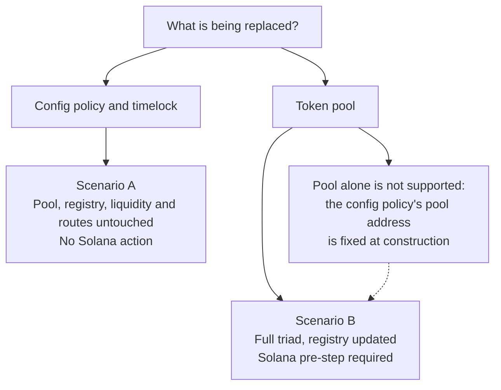
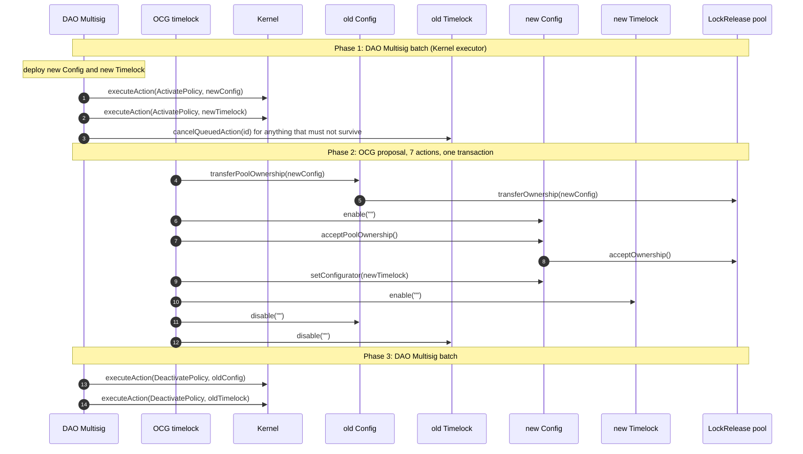
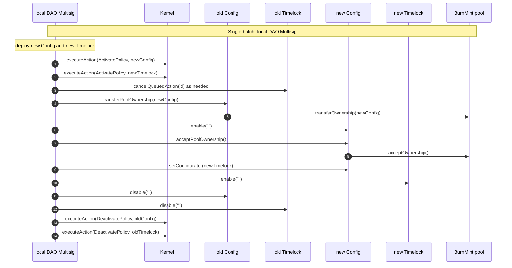
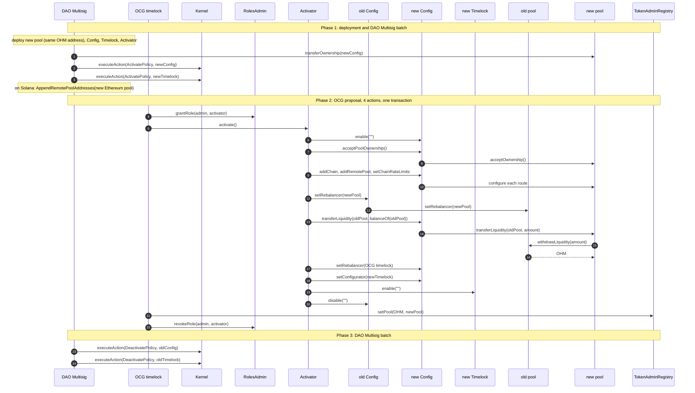
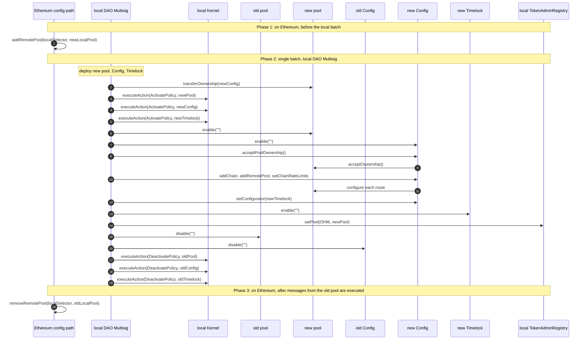

# CCIP Migration Sequences

Diagrams for the two supported replacement procedures, on Ethereum and on a non-Ethereum EVM chain.

## Choosing a scenario

## Scenario A on Ethereum

Config policy and timelock are replaced; the pool keeps its address, owner chain, liquidity, and routes. The new config policy is constructed with the existing pool address.

`enable` precedes `acceptPoolOwnership` because admin functions are gated on the policy being enabled. `transferPoolOwnership` precedes `disable` on the old policy for the same reason.

## Scenario A on a non-Ethereum EVM chain

No OCG timelock exists, so the local DAO Multisig holds `admin` and is the Kernel executor. All three phases collapse into one batch.

The pool is a policy here but is not replaced, so its Kernel state and MINTR permissions are untouched.

## Scenario B on Ethereum

Pool address changes, so liquidity moves and the registry is updated. An activator holding a temporary `admin` grant fits the sequence into the fifteen-action proposal limit.

`setRebalancer` on the old pool must precede `transferLiquidity`, since `withdrawLiquidity` checks the rebalancer. Both must precede `disable` on the old config policy. `setPool` follows `activate()` so the registry points at the new pool only once it holds the liquidity; it is a separate action because the registry gates it on the OHM administrator, which is the OCG timelock rather than the activator. Removing the old pool from Solana's accepted list afterwards is unnecessary.

## Scenario B on a non-Ethereum EVM chain

The pool is a policy with MINTR permissions and its own lifecycle. There is no liquidity to move, and the local DAO Multisig holds every required authority, so no activator is needed. A mainnet step must come first.

`ActivatePolicy` on the new pool grants its MINTR permissions and must precede `setPool`, or a registered pool would be unable to mint. `enable` on the new pool must also precede `setPool`, since `_burn` and `_mint` are gated on it. `setPool` must precede disabling the old pool, for the same two reasons applied in reverse. The Ethereum steps go through the config timelock or directly under `admin`.
