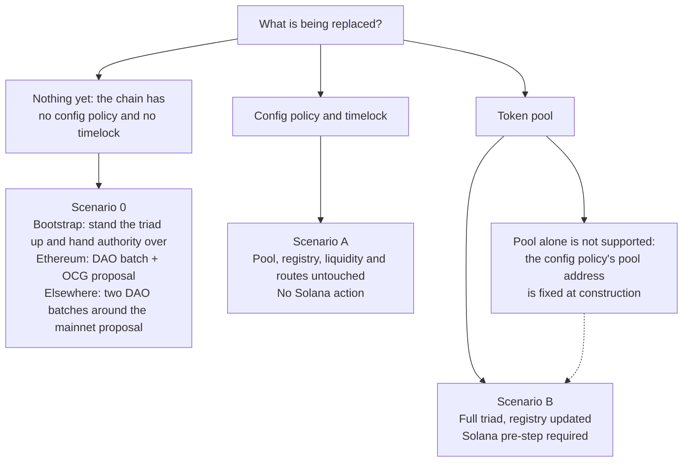
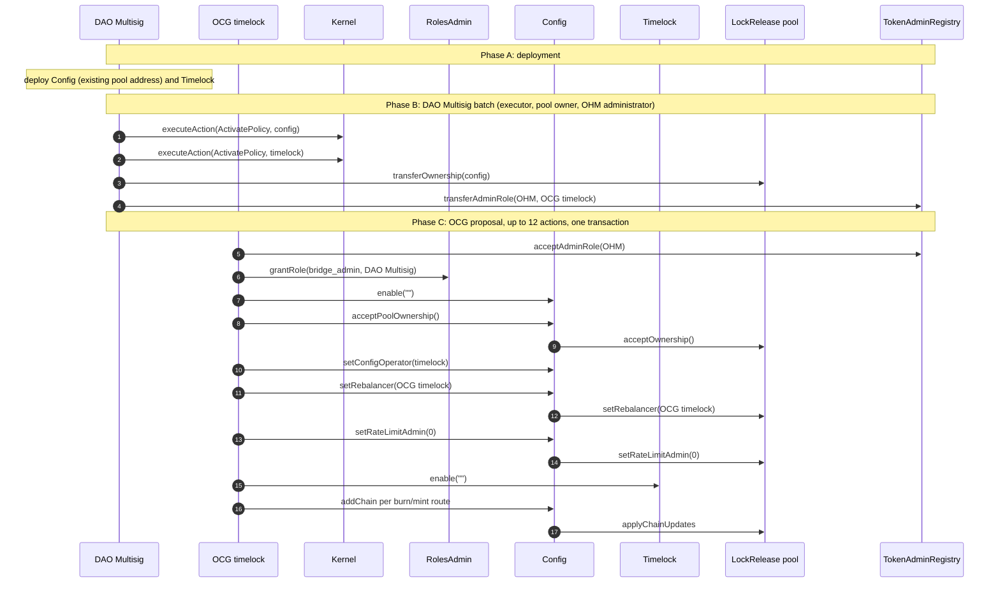
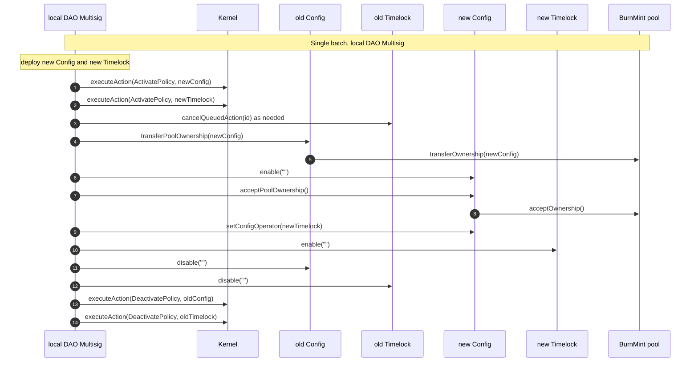
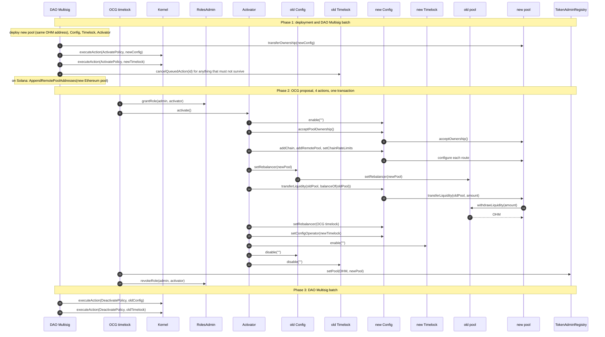
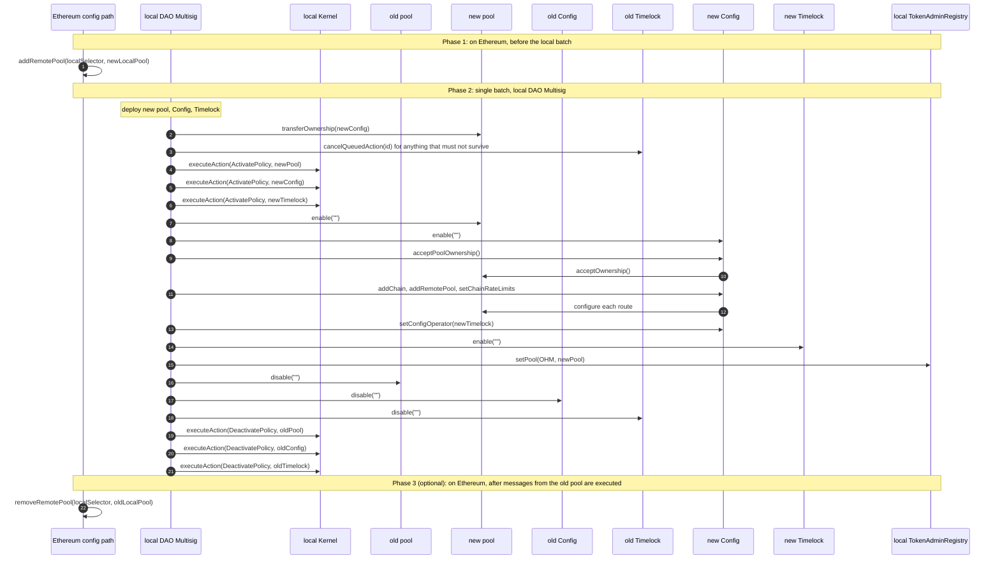

# CCIP Migration Sequences

Diagrams for the bootstrap and the two supported replacement procedures, on Ethereum and on a non-Ethereum EVM chain.

## Choosing a scenario



## Scenario 0 on Ethereum

The pool, its Solana route and the periphery are live and held by the DAO Multisig; the config policy and the timelock are introduced for the first time. Nothing outgoing exists, so no cancellation, no disable of an old policy and no Kernel deactivation appears in this sequence.



Phase B only proposes and nominates; Phase C accepts both transfers, because `Kernel.executor` is the DAO Multisig while `RolesAdmin.admin` and the incoming authorities are the OCG timelock. `enable` on the config policy precedes every other config call, and `acceptPoolOwnership` precedes `setRebalancer` and the `addChain` calls, which run through the pool owner. The new burn/mint routes ride in the proposal so that mainnet's side of the new lanes is opened by the same vote that hands the authority over: `admin` calls the route functions directly, without the nested delay of the config timelock, and until this proposal executes the timelock is neither enabled nor the config operator, so the DAO Multisig could not have queued them beforehand. Every later route change goes through the timelock.

## Scenario 0 on a non-Ethereum EVM chain

Nothing is deployed before this scenario, and the local DAO Multisig holds every Olympus authority. Two batches bracket the mainnet proposal so that the chain stays inert until mainnet has opened its side.

```mermaid
sequenceDiagram
    autonumber
    participant EOA as deployer EOA
    participant DAO as local DAO Multisig
    participant K as Kernel
    participant RA as RolesAdmin
    participant C as Config
    participant T as Timelock
    participant P as BurnMint pool
    participant REG as local TokenAdminRegistry

    Note over EOA,REG: Prerequisites: Chainlink fee budgets set; registry handover
    EOA->>REG: transferAdminRole(OHM, DAO Multisig)
    DAO->>REG: acceptAdminRole(OHM)

    Note over EOA,REG: Deployment
    Note over EOA: deploy pool, periphery, Config, Timelock in one sequence
    EOA->>P: transferOwnership(config)
    Note over EOA,DAO: periphery ownership transferred to the DAO Multisig

    Note over EOA,REG: Batch 1: setup, during the mainnet voting window
    DAO->>K: executeAction(DeactivatePolicy, legacy LZ bridge)
    DAO->>K: executeAction(ActivatePolicy, pool / config / timelock)
    DAO->>RA: grantRole(admin / bridge_admin / emergency) as missing
    DAO->>C: enable("")
    DAO->>C: acceptPoolOwnership()
    C->>P: acceptOwnership()
    DAO->>C: setConfigOperator(timelock)
    DAO->>T: enable("")
    DAO->>C: addChain per env.json route
    C->>P: applyChainUpdates
    Note over P,REG: pool disabled and unregistered: the chain is inert

    Note over EOA,REG: mainnet proposal executes

    Note over EOA,REG: Batch 2: finalize
    DAO->>P: enable("")
    DAO->>REG: setPool(OHM, pool)
```

`enable` on the pool precedes `setPool` so that a registered pool is never unable to mint, and the activation in batch 1 already granted its MINTR permissions. Unlike Scenario B on these chains, `setPool` is deferred to a separate batch: until `finalize`, no outbound send and no inbound delivery can touch the pool, so a failed mainnet vote leaves nothing to roll back. A message sent toward the chain between the proposal execution and `finalize` parks in FAILURE and is recovered permissionlessly with manual execution afterwards.

## Scenario A on Ethereum

Config policy and timelock are replaced; the pool keeps its address, owner chain, liquidity, and routes. The new config policy is constructed with the existing pool address.


`enable` precedes `acceptPoolOwnership` because admin functions are gated on the policy being enabled. `transferPoolOwnership` precedes `disable` on the old policy for the same reason.

## Scenario A on a non-Ethereum EVM chain

No OCG timelock exists, so the local DAO Multisig holds `admin` and is the Kernel executor. All three phases collapse into one batch.



The pool is a policy here but is not replaced, so its Kernel state and MINTR permissions are untouched.

## Scenario B on Ethereum

Pool address changes, so liquidity moves and the registry is updated. An activator holding a temporary `admin` grant fits the sequence into the fifteen-action proposal limit.



`setRebalancer` on the old pool must precede `transferLiquidity`, since `withdrawLiquidity` checks the rebalancer. Both must precede `disable` on the old config policy. `setPool` follows `activate()` so the registry points at the new pool only once it holds the liquidity; it is a separate action because the registry gates it on the OHM administrator, which is the OCG timelock rather than the activator. Removing the old pool from Solana's accepted list afterwards is unnecessary.

The old timelock is disabled inside `activate()` rather than left until Phase 3. Deactivating it in the Kernel is what finally retires it, but that happens in a separate batch some time later, and until then an action queued before the migration would still be executable against a config policy that no longer owns the pool. Cancelling in Phase 1 removes the actions that are known about; disabling closes the window for the rest.

## Scenario B on a non-Ethereum EVM chain

The pool is a policy with MINTR permissions and its own lifecycle. There is no liquidity to move, and the local DAO Multisig holds every required authority, so no activator is needed. A mainnet step must come first.



Phase 3 is optional: once the old pool is no longer registered in its own chain's registry, no on-ramp will call it, so its stale entry on the Ethereum side cannot be exercised. Removing it is hygiene, and doing it too early rejects messages still in flight.

`ActivatePolicy` on the new pool grants its MINTR permissions and must precede `setPool`, or a registered pool would be unable to mint. `enable` on the new pool must also precede `setPool`, since `_burn` and `_mint` are gated on it. `setPool` must precede disabling the old pool, for the same two reasons applied in reverse. The Ethereum steps go through the config timelock or directly under `admin`.
