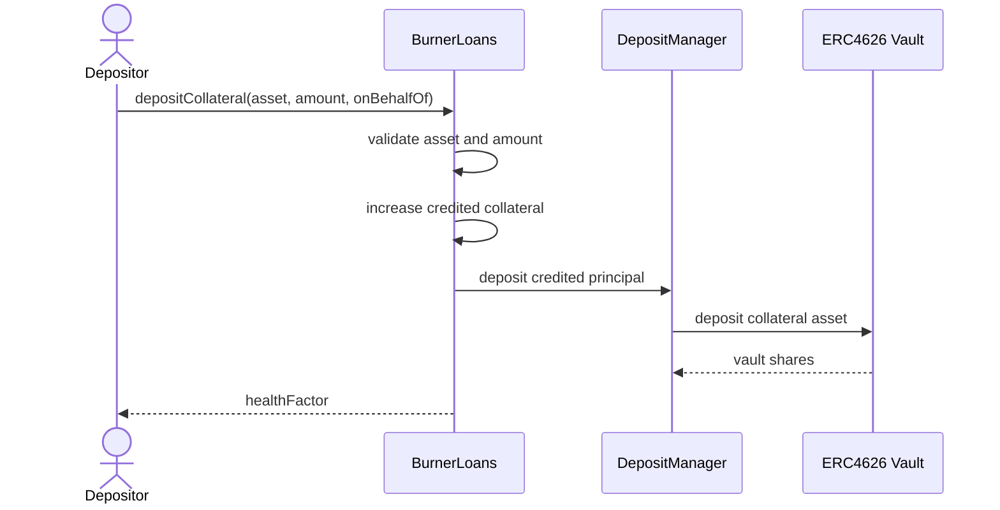
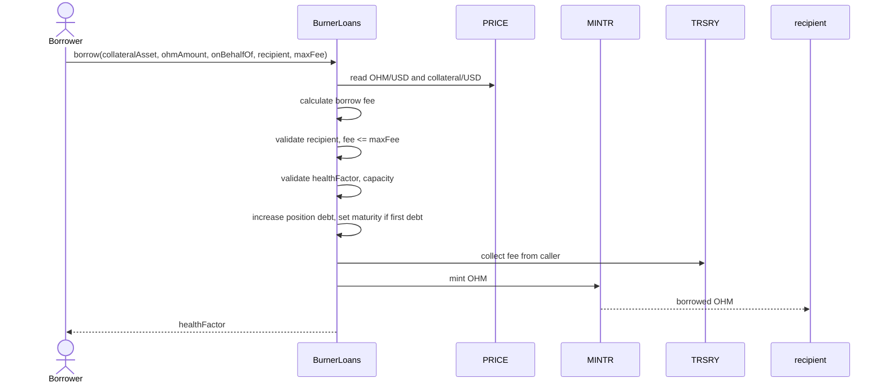
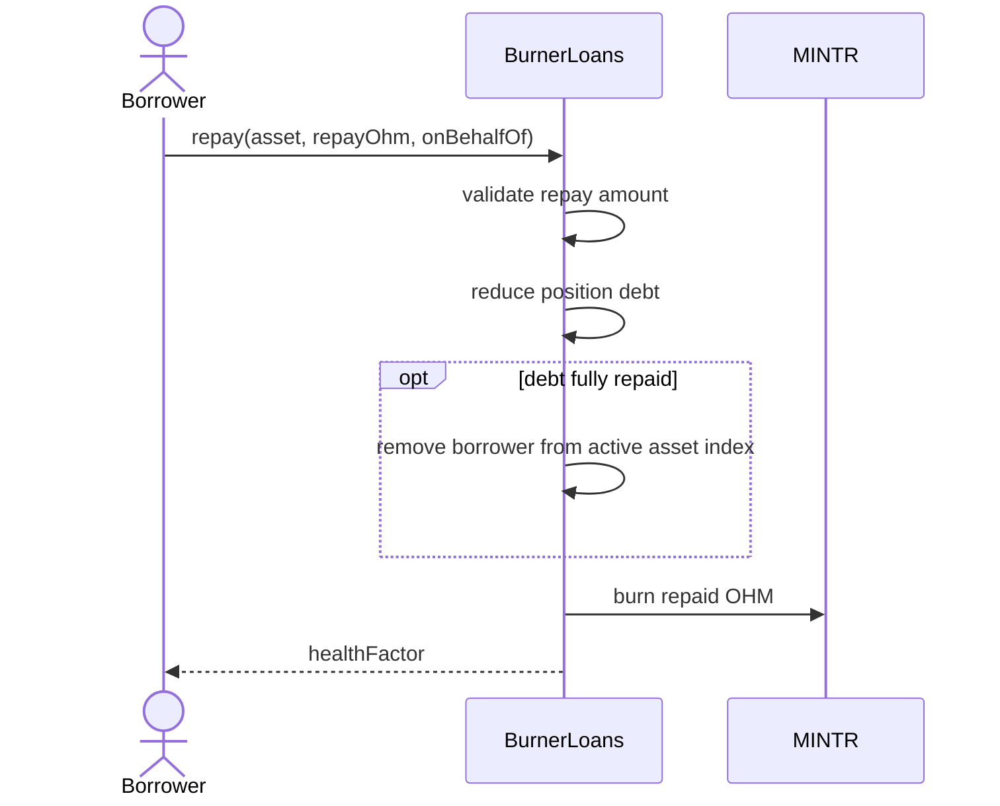
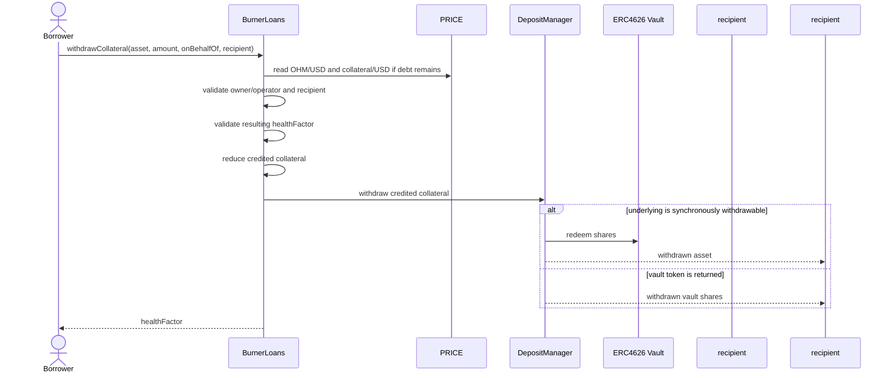
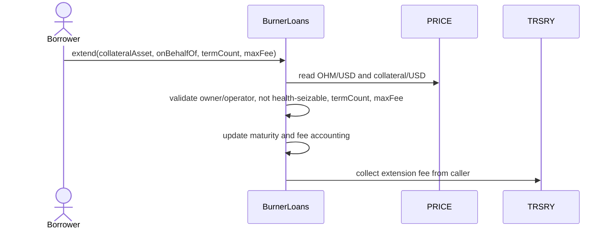
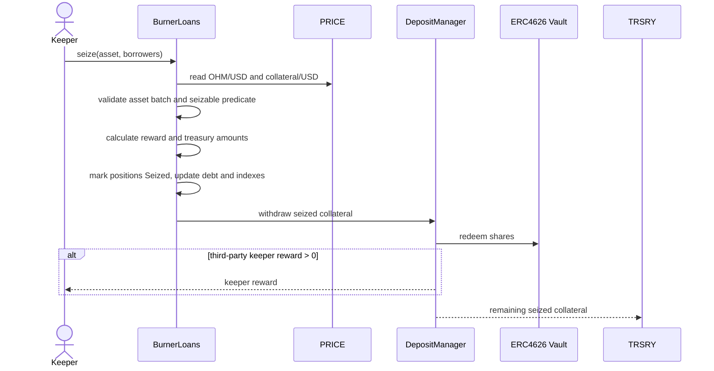
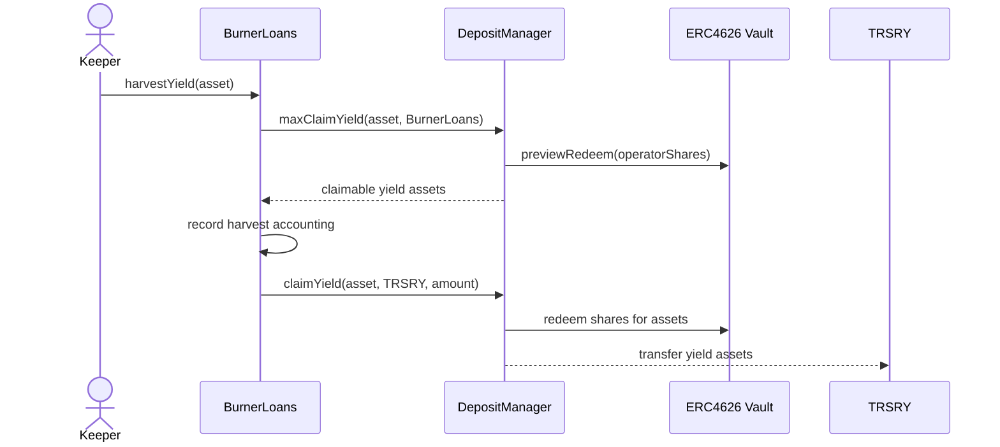

# Burner Loans Design

## Overview

`BurnerLoans` is a fixed-term, 0% interest rate OHM shorting facility. Borrowers deposit approved collateral, borrow newly minted OHM, and may sell that OHM externally. Repaid OHM is burned. If a position becomes seizable, collateral is seized to `TRSRY`, the position debt is closed, and unrepaid OHM remains circulating but backed by the seized collateral.

The design goal is to make shorting OHM self-funding for the protocol. Collateral yield routes to protocol repurchases, while backing-based collateral requirements make shorting near backing increasingly capital-inefficient.

## System Design

Burner Loans uses a MonoCooler-style position model:

- One position per owner per collateral asset.
- Separate collateral and debt actions.
- Explicit extensions while debt is active.
- Repayment reduces debt only.
- Withdrawal releases collateral only through `withdrawCollateral`.

This gives borrowers clear health-management tools. A borrower whose health worsens can deposit more collateral or repay OHM; both improve health. A borrower who wants collateral back calls `withdrawCollateral`, which must leave the position healthy unless there is no debt.

The main user-facing actions are:

1. `depositCollateral`: add credited collateral to an owner/asset position.
2. `borrow`: increase OHM debt against an existing collateral position, pay the borrow fee, and set maturity if this is the first debt in the position.
3. `repay`: burn OHM and reduce debt without releasing collateral.
4. `withdrawCollateral`: withdraw credited collateral if the remaining position is healthy or has no debt.
5. `extend`: move maturity forward by whole asset terms and pay the extension fee.
6. `seize`: close a seizable debt position and send its collateral to `TRSRY`, with a capped keeper reward where applicable.

Open interest is measured as active OHM debt. V1 should enforce a global debt cap across the facility and a separate active debt cap for each collateral asset:

```text
totalActiveDebtOhm <= globalDebtCap
assetActiveDebtOhm[asset] <= assetDebtCap[asset]
```

These caps limit minted OHM supply, market impact, governance exposure, collateral-concentration risk, and custody/oracle blast radius. The global cap bounds the facility as a whole. Per-asset caps prevent one collateral type from consuming all capacity or exposing the protocol to a single asset, vault, or PRICE path.

Fixed maturity is the main tool that prevents stale 0% shorts from consuming capacity without repricing. Borrow and extension are fee events. Additional borrowing against an already-active position is allowed, but it pays the current borrow fee on the incremental OHM amount and does not extend maturity. Extension pays the current extension fee on the active debt and is the only way to move maturity forward.

Maturity also makes open interest self-cleaning. Positions with active debt must either repay, extend under current conditions, or become seizable after maturity. Debt-free collateral-only positions can remain withdrawable, but they do not count as open interest and cannot be seized.

The authorization model should mirror Cooler V2/MonoCooler: owner/operator approvals and `onBehalfOf` support are useful for integrators without requiring transferable position ownership.

## Process Diagrams

### Deposit Collateral Sequence



### Borrow Sequence



### Repay Sequence



### Withdraw Collateral Sequence



### Extend Sequence



### Seize Sequence



### Harvest Yield Sequence



## Core Mechanics

### Health Factor

Health is a WAD-scaled ratio where `1e18` is the seizure boundary:

```text
requiredCollateralUsd = max(
    // Round requirements up so the protocol does not accept undercollateralized debt.
    ceil(debtValueUsd * minCollateralRatioBps / 10_000),
    ceil(debtOhm * backingPerOhmUsd * backingMultiplierBps / 10_000)
)

// Round down so borrower health is never overstated.
healthFactor = floor(riskAdjustedCollateralUsd * 1e18 / requiredCollateralUsd)
```

`riskAdjustedCollateralUsd` is the current principal-equivalent collateral value after asset-level haircuts. Yield above credited principal must not improve borrower `healthFactor`. Requirements round up so the protocol does not accept a position that is short by one unit. `healthFactor` rounds down so borrower health is never overstated.

A position is healthy when `healthFactor >= 1e18`. A position is seizable when it has active debt and either `healthFactor < 1e18` with fresh PRICE inputs or the fixed maturity has passed. Seizure execution still needs fresh PRICE inputs for collateral and reward accounting. This follows the common lending-market convention that `1.0` is the liquidation boundary. If the implementation also exposes a signed margin, `0` is the equivalent boundary:

```text
healthMarginUsd = riskAdjustedCollateralUsd - requiredCollateralUsd
```

For user-facing previews, expose `healthFactor` because `1.0` is familiar to borrowers. For internal checks, compare the underlying inequality directly where practical to avoid precision surprises.

If `debtOhm == 0`, `healthFactor` should return `type(uint256).max`. A debt-free position can still hold collateral, but it has no liquidation or maturity risk.

### Decimal Scales

`BurnerLoans` must be explicit about every numeric scale used in accounting and risk checks:

- PRICE values use the scale returned by `PRICE.decimals()`. Do not assume PRICE is WAD-scaled unless `PRICE.decimals() == 18`.
- `healthFactor` is WAD-scaled. `1e18` is exactly the seizure boundary.
- OHM debt amounts use OHM's native token decimals. Mainnet OHM is 9 decimals.
- Collateral amounts use the collateral token's native decimals, as returned by ERC20 `decimals()` and represented by `balanceOf()`.
- ERC4626 share amounts use the vault token's native decimals; asset amounts use the underlying asset's native decimals.
- Basis-point parameters use `10_000 == 100%`.

Internal helpers should either carry scale-specific variable names or normalize to a documented internal scale before doing comparisons. Tests must include assets where token decimals, PRICE decimals, and WAD health factor scale differ so a raw `balanceOf()` value is never accidentally compared as if it were USD or WAD.

### Positions And Borrowing

For v1, USDS deposited into sUSDS should be the initial enabled collateral path. The contract should still support whitelisted non-USDS collateral from launch, subject to PRICE support, DepositManager support, and asset-level risk parameters.

Burner Loans should use one position per owner per collateral asset:

```text
positions[owner][collateralAsset] = Position({
    creditedCollateral,
    debtOhm,
    maturity,
    lastBorrowBlock,
    status
})
```

There are no arbitrary loan IDs in v1. A user can hold multiple Burner Loans positions only by using multiple collateral assets. A debt-free position may keep deposited collateral, but it is not active, cannot be seized, and does not consume debt capacity.

Borrowing can execute only if the resulting `healthFactor >= 1e18` after applying the requested debt, credited collateral, asset haircut, and current PRICE inputs:

```text
riskAdjustedCollateralUsd >= max(
    // Round requirements up before comparing against borrower collateral.
    ceil(debtValueUsd * minCollateralRatioBps / 10_000),
    ceil(debtOhm * backingPerOhmUsd * backingMultiplierBps / 10_000)
)
```

Example:

```text
market requirement = 20 * 1,000 * 1.15 = 23,000 USD
backing requirement = 11.33 * 1,000 * 1.5 = 16,995 USD
required collateral = 23,000 USD
```

The market requirement protects repayment solvency. The backing requirement prevents new OHM from reducing liquid backing per backed OHM when OHM trades near backing.

If `debtOhm == 0`, a borrow starts a new debt episode and sets:

```text
maturity = block.timestamp + asset.termLength
```

If `debtOhm > 0`, a borrow increases debt and charges a borrow fee on the incremental OHM amount, but it must not move maturity. Extending maturity is only done by `extend`, which charges the extension fee on the active position. This prevents a borrower from borrowing a small additional amount to roll the entire position for free.

`borrow` does not deposit collateral. A borrower must already have enough credited collateral in the owner/asset position, or use `BurnerLoansComposites.depositAndBorrow(...)` to deposit collateral and borrow in one transaction.

### Collateral Maintenance

`depositCollateral` increases credited principal without changing debt or maturity. It improves health and should be allowed for active positions, including unhealthy unseized positions, because it reduces protocol risk.

`withdrawCollateral` reduces credited principal and transfers collateral to a recipient. It can execute only if the remaining position is healthy or has zero debt:

```text
if debtOhm > 0:
    resultingHealthFactor >= 1e18
```

Withdrawals must use current PRICE inputs when debt remains. If PRICE is stale or unavailable, withdrawal should revert because it could make the position unsafe. Deposits do not need PRICE because they only improve health.

The returned token may be the underlying collateral asset or the vault/holding token. Burner Loans should support both paths through DepositManager. If a vault has a warm-up period or asynchronous underlying withdrawal, the supported synchronous path is to return vault shares instead of blocking the position state transition.

### Repayment

The borrower repays OHM, and all repaid OHM is burned immediately. Repayment must not depend on collateral price, vault conversion rate, `healthFactor`, or seizable status. A borrower should always be able to close active debt by returning OHM until the position has already been seized.

Repayment reduces debt only. It does not automatically release collateral:

```text
debtOhmAfter = debtOhmBefore - min(repayOhm, debtOhmBefore)
creditedCollateralAfter = creditedCollateralBefore
```

This is what lets repayment improve `healthFactor` when OHM rises or collateral falls. Collateral is returned only by an explicit `withdrawCollateral` call, which applies the health check above.

Example: a borrower deposits `1,000 USDS` and borrows `4 OHM`. Repaying `1 OHM` burns `1 OHM`, leaves `1,000 USDS` credited to the position, and improves health. If the borrower also wants collateral back, they call `withdrawCollateral` after repayment.

Full repayment burns all remaining OHM debt, removes the borrower from the active asset index, and leaves credited collateral withdrawable. Full repayment must not leave debt dust or active-index dust.

### Seizure

A position is seizable if it has active debt and either `healthFactor < 1e18` with fresh PRICE inputs or the fixed maturity has passed. `Seizable` is a derived predicate, not a stored state. A debt-free position that still holds collateral is not seizable, even if a prior maturity timestamp has passed.

On seizure, collateral is sent to `TRSRY`, the position debt is closed, and unrepaid OHM remains circulating. This is first-party default liquidation by collateral seizure, not third-party debt purchase.

Seizure is for the entire active debt position. After seizure, `debtOhm == 0`, credited collateral is zero, and the borrower is removed from the active borrower index for that asset.

Seizure can be executed by the protocol or by third-party keepers. The distinction should be role-based, not address-name based:

```text
isProtocolSeizureCaller = ROLES.hasRole(msg.sender, "burner_loans_seizer")
```

If the protocol-owned periodic seizer calls `seize`, `BurnerLoans` sees the `burner_loans_seizer` role and pays no Burner Loans keeper reward. The seizer is operational infrastructure, not a third-party liquidator.

If the caller does not have the `burner_loans_seizer` role, the call is treated as third-party keeper execution. The caller may receive a capped reward, and the remaining collateral goes to `TRSRY`.

The reward should be small, deterministic, asset-denominated, and bounded per asset:

```text
configuredRewardAsset = min(
    // Round down because this value is paid out to a keeper.
    floor(seizedCollateralAmount * rewardBps / 10_000),
    maxKeeperRewardAsset[asset]
)

requiredBackingUsd =
    // Round up because this is the backing floor that must remain after rewards.
    ceil(seizedUnrepaidDebtOhm * backingPerOhmUsd * backingMultiplierBps / 10_000)

// Round up so rewards cannot consume the last unit needed for backing.
requiredBackingAsset = ceil(requiredBackingUsd / collateralUsdPrice)

surplusAfterBackingAsset = max(
    0,
    seizedCollateralAmount - requiredBackingAsset
)

if isProtocolSeizureCaller || rewardBps == 0 || maxKeeperRewardAsset[asset] == 0:
    keeperRewardAsset = 0
else:
    // Round down because this value is paid out to a keeper.
    keeperRewardAsset = min(configuredRewardAsset, surplusAfterBackingAsset)
```

If `keeperRewardAsset == 0`, seizure can still proceed without a reward. Keeper rewards must not cause a seizure to violate backing preservation.

`configuredRewardAsset` is the incentive the facility would pay under normal conditions, bounded by `rewardBps` and `maxKeeperRewardAsset[asset]`. `surplusAfterBackingAsset` is the maximum reward that can be paid without taking collateral needed to back the unrepaid OHM left circulating after seizure. The actual reward is the lower of the two.

`requiredBackingUsd` should use the same backing leg used by `healthFactor` checks, not the market value of the debt. For a batch, `seizedUnrepaidDebtOhm` is the sum of the remaining OHM debt for the seized positions. `requiredBackingAsset` must round up so the reward cannot take the last unit of collateral needed for backing.

Example: a position is seized with `1,000 USDS` of collateral and `90 OHM` unrepaid. If backing is `10 USD/OHM` and `backingMultiplierBps = 10,000`, the seized OHM needs `900 USD` of backing. With USDS at `1 USD`, `requiredBackingAsset = 900 USDS`, leaving only `100 USDS` available for keeper rewards. If the configured reward would otherwise be `150 USDS`, paying it would leave `850 USDS` backing `90 OHM`, or `9.44 USD/OHM`, below the required backing floor. The `surplusAfterBackingAsset` cap prevents that.

Asset-denominated keeper rewards avoid converting a USD reward back into collateral units and let governance set caps appropriate to each collateral token. The remaining USD dependency is still necessary for the backing safety cap, because the invariant is denominated in liquid backing per backed OHM.

Expose seizure status separately from execution:

```text
isSeizable(asset, borrower) -> bool
getSeizableBorrowers(asset, startIndex, maxBorrowersToCheck, maxBorrowersToReturn)
    -> borrowers, nextIndex, expectedKeeperReward
previewSeize(asset, borrowers) -> keeperReward, collateralToTreasury, executable
seize(asset, borrowers) -> seizedBorrowers, keeperReward, collateralToTreasury
```

`previewSeize` should not return a single `healthFactor` because a batch can contain multiple borrowers with different health. For per-position diagnostics, callers can query `isSeizable(asset, borrower)` or `getPosition(owner, asset)`. `previewSeize` should return batch-level execution outputs: keeper reward, collateral routed to `TRSRY`, and whether execution would revert.

`getSeizableBorrowers` must be gas-bounded and on-chain usable. A separate `BurnerLoansSeizer` contract should call it periodically without scanning the full position set or risking unbounded memory growth. The function should scan at most `maxBorrowersToCheck`, return at most `maxBorrowersToReturn`, return `nextIndex` so callers can paginate, and return expected keeper reward for the returned batch. `expectedKeeperReward` should be calculated for `msg.sender` using the same protocol-caller reward rules as `seize`: callers with `burner_loans_seizer` receive zero Burner Loans keeper reward. These scan limits should be caller-supplied inputs, not stored contract parameters.

Maintain per-asset active borrower indexes. A borrower is active for an asset when `positions[borrower][asset].debtOhm > 0`. Seizure scanning should use:

```text
activeBorrowersByAsset[asset]
```

This adds storage writes on first borrow, full repayment, and seizure, but it matches how `getSeizableBorrowers` is used and keeps scans collateral-specific.

Do not also maintain a global active-borrower index unless there is a concrete on-chain need for global active iteration.

The asset-specific scan API is:

```text
getSeizableBorrowers(asset, startIndex, maxBorrowersToCheck, maxBorrowersToReturn)
```

This lets callers choose which collateral they are willing to receive as a reward, avoids one stale or broken asset blocking scans for other assets, and lets the implementation read each asset's PRICE data once per scan. It also keeps batches homogeneous by collateral token.

The active index can use OpenZeppelin `EnumerableSet.AddressSet`, which is already available in the repo, or a custom address array plus index mapping if gas profiling shows that cheaper. Add a borrower on first borrow for an asset and remove the borrower on full repayment or seizure.

Enumerable sets and swap-and-pop arrays have unstable ordering on removal. That is acceptable for periodic scanning: a cursor may skip a moved borrower until a later wrap, but the borrower remains in the active set and can still be found by `isSeizable(asset, borrower)` or a later scan. If exact ordered iteration becomes necessary, use a linked list or queue, but expect higher write gas.

Expose an off-chain convenience getter for exhaustive indexing:

```text
getActiveBorrowers(asset) -> borrowers
```

This full-array getter is intended for off-chain callers, indexers, and dashboards. On-chain automation should use the paginated seizable scan, because returning every active borrower can become too expensive as the set grows.

`BurnerLoans` should not store the scan cursor. The automation caller should store or derive the cursor, because different callers may scan at different cadences and batch sizes.

Periodic seizure should live in a small separate contract to keep `BurnerLoans` focused on loan accounting. During periodic automation, `BurnerLoansSeizer` can call:

```text
(borrowers, nextIndex, expectedKeeperReward) = getSeizableBorrowers(
    asset,
    storedAssetCursor,
    maxBorrowersToCheck,
    maxBorrowersToSeize
)

storedAssetCursor = nextIndex

if borrowers.length > 0:
    seize(asset, borrowers)
```

When `nextIndex` reaches the active set length, the seizer should wrap to zero. The seizer should keep a cursor per asset or scan one asset per execution. `BurnerLoansSeizer` should be granted `burner_loans_seizer` so it receives no keeper reward. Off-chain keepers can still prefer event/indexer-driven discovery plus `isSeizable(asset, borrower)` checks and may receive the capped keeper reward.

`seize` should accept multiple borrowers by default and be asset-specific. A single-position seizure is `seize(asset, [borrower])`. Batch size should be capped to avoid griefing. All borrowers in the batch must have active, seizable positions for the `asset` parameter; otherwise the batch should revert. Zero addresses, duplicate borrowers, borrowers for a different collateral asset, debt-free positions, already seized positions, and active-but-not-seizable positions should all revert the whole batch. Because the batch is single-asset, `BurnerLoans` should fetch OHM/USD, collateral/USD, and backing inputs once before the loop, then reuse those values for every position in the batch. Prefer reverting the batch for invalid or no-longer-seizable borrowers unless partial execution is explicitly required.

For seizure, after validating the full batch, mark each position `Seized`, update active debt totals, update active borrower indexes, and accumulate reward/treasury amounts before external calls to `DepositManager` or collateral transfers. If an external call fails, the transaction reverts and the state update is rolled back.

### Terms

Positions have 0% interest but fixed maturity while debt is active. Before maturity, a borrower can repay, deposit collateral, withdraw collateral subject to health checks, borrow additional OHM subject to health checks, or extend if current requirements are met. If maturity has passed but the position is still otherwise healthy and has not been seized, the borrower may extend before the next seizure execution. If the position is health-seizable, it can still be repaid or topped up with collateral, but cannot be extended or increased with additional debt.

Each collateral asset defines its own `termLength`. New borrows use that asset's current term length:

```text
maturity = block.timestamp + asset.termLength
```

Extensions are expressed as a whole number of asset terms:

```text
extensionDuration = termCount * asset.termLength
newMaturity = oldMaturity + extensionDuration

require(newMaturity <= block.timestamp + asset.maxMaturityHorizon)
```

`termCount` must be greater than zero. `maxMaturityHorizon` is a per-asset duration, expressed in the same day-based unit as `termLength`, that caps how far into the future the position's maturity can be after an extension. The cap is a risk control for a 0% short facility: it prevents a borrower from locking very long-dated debt at today's fee, oracle state, and risk configuration. Burner Loans uses extension cadence as the main repricing mechanism. A borrower can still keep a position open indefinitely, but only by returning periodically for current health checks and current utilization-based fees.

### Composites

The core `BurnerLoans` policy should keep the primitive surface small. One-transaction UX should live in a periphery contract, similar to `CoolerComposites`:

```text
BurnerLoansComposites.depositAndBorrow(...)
BurnerLoansComposites.repayAndWithdraw(...)
```

`depositAndBorrow` can pull collateral and fee from the caller, deposit collateral into `BurnerLoans`, then borrow OHM to the allowed recipient. `repayAndWithdraw` can pull OHM from the caller, repay debt, then withdraw collateral if the resulting position remains healthy. Future composites can add wrapping and unwrapping paths, such as accepting an underlying asset, wrapping into the supported holding token, depositing it, and borrowing in one transaction.

Keeping composites outside the core policy saves bytecode and avoids turning `BurnerLoans` into a routing contract. The core policy should expose the primitives and safety checks; composites should compose them.

### Fee Calculations

The fixed term prevents perpetual 0% shorts from consuming capacity indefinitely. The same capacity fee curve should be used for borrows and extension terms:

```text
// Round utilization up so fee pressure is not understated near a boundary.
globalUtilizationBps = ceil(totalActiveDebtOhm * 10_000 / globalDebtCap)
assetUtilizationBps = ceil(assetActiveDebtOhm[asset] * 10_000 / assetDebtCap[asset])
utilizationBps = max(globalUtilizationBps, assetUtilizationBps)

if utilizationBps <= kinkBps:
    // Round down because this computes a fee rate from utilization.
    feeBps = baseFeeBps + floor(utilizationBps * slope1Bps / 10_000)
else:
    feeBps = baseFeeBps
        // Round down because this computes a fee rate from utilization.
        + floor(kinkBps * slope1Bps / 10_000)
        + floor((utilizationBps - kinkBps) * slope2Bps / 10_000)
```

This follows the standard piecewise linear borrow-market shape used by Euler's `IRMLinearKink` and Compound's `JumpRateModel`: a base rate, a first slope up to the kink, then a steeper second slope above the kink.

Rate components round down because they are intermediate rate calculations, not the final value transfer. This avoids charging an extra basis point from each curve segment due only to integer precision and keeps the configured curve predictable. Protocol-favorable rounding still applies where value moves: utilization rounds up before entering the curve, and actual collateral-denominated fees round up when charged. If governance wants higher protocol compensation, it should increase `baseFeeBps`, `slope1Bps`, or `slope2Bps` rather than rely on rounding artifacts.

Use one facility-level fee curve for both global and asset utilization. `kinkBps`, `slope1Bps`, and `slope2Bps` should be consistent across both; asset-specific risk should be handled through debt caps, collateral factor, minimum collateral ratio, `termLength`, and `maxMaturityHorizon`. Per-asset fee curves can be added later only if there is a clear need.

The curve is continuous at `kinkBps` and monotonic when both slopes are non-negative. Example with `baseFeeBps = 25`, `slope1Bps = 100`, `slope2Bps = 900`, and `kinkBps = 8,000`:

```text
utilization = 70%  -> fee = 25 + 70 = 95 bps
utilization = 80%  -> fee = 25 + 80 = 105 bps
utilization = 90%  -> fee = 25 + 80 + 90 = 195 bps
utilization = 100% -> fee = 25 + 80 + 180 = 285 bps
```

For v1, use one dynamic lever: utilization-based fees. Keep collateral ratios, term lengths, and max maturity horizons as admin-set, timelocked parameters. Use one fee curve for both borrows and extensions.

Fees are charged only at borrow and extension, so high utilization affects users when they create or extend debt, not continuously while a position is active. This keeps the product 0% interest, but means stale open interest can stay cheap until the next extension. Fixed maturity and the shared borrow/extension fee are therefore the mechanism that eventually reprices high utilization.

`borrow` should be asset-specific and debt-targeted:

```text
borrow(collateralAsset, ohmAmount, onBehalfOf, recipient, maxFee)
```

The requested amount is `ohmAmount`, and `collateralAsset` selects the collateral configuration and PRICE feeds. `onBehalfOf` is the position owner whose debt is increased. `recipient` receives the borrowed OHM. `maxFee` is the caller's cap on the collateral-token fee charged for the incremental borrow.

The contract calculates the fee from the incremental borrow:

```text
incrementalRequiredCollateral = ceil(incrementalRequiredCollateralUsd / collateralUsdPrice)
feeCollateral = ceil(incrementalRequiredCollateral * feeBps / 10_000)

require(feeCollateral <= maxFee)
```

Round `incrementalRequiredCollateral` up because it is the minimum collateral requirement implied by the incremental debt. Round `feeCollateral` up so a tiny borrow cannot avoid the fee through truncation. Fees are pulled from the caller and routed to `TRSRY`; they must not reduce credited collateral, count as borrower collateral, or count as protocol yield.

Extension fees are denominated in the position's collateral asset. `maxFee` is the borrower's cap on the total fee for the full extension:

```text
singleTermExtensionFee = ceil(currentRequiredCollateral * feeBps / 10_000)
extensionFee = singleTermExtensionFee * termCount

require(extensionFee <= maxFee)
```

The single-term fee rounds up so fee dust cannot be avoided. The total extension fee scales linearly with `termCount`: extending by three terms costs exactly three times the single-term fee.

## Scenario Analysis

| Scenario | Position | Protocol Impact | Desired Outcome |
| --- | --- | --- | --- |
| User deposits collateral | Credited collateral increases for `positions[owner][asset]`; debt and maturity do not change. | Health improves if debt is active. No new OHM is minted. | Yes. This is the primary maintenance action when health falls. |
| User withdraws collateral | Credited collateral decreases only if the position remains healthy or has no debt. | Borrower claim falls; backing-eligible collateral may fall but must remain sufficient for active debt. | Yes, subject to current PRICE and health checks. |
| User partially repays | Repaid OHM is burned. Debt decreases and credited collateral stays posted. | Active debt and capacity usage fall. Backing requirement falls with remaining OHM debt. | Yes. Repayment should improve health and not depend on current prices. |
| User fully repays | All remaining OHM debt is burned. Position exits the active borrower index but collateral remains withdrawable. | Active debt falls by the full remaining debt. No seized unrepaid OHM remains. | Yes. Debt close and collateral withdrawal are separate actions. |
| OHM/USDS rises to seizure boundary | `healthFactor` falls below `1e18`; position becomes seizable if PRICE is fresh. Borrower can still repay or deposit collateral before seizure. | Seizure moves collateral to `TRSRY`; unrepaid OHM remains circulating but should be backed by seized collateral. | Yes, if backing preservation still holds and maintenance actions remain available before seizure. |
| OHM/USDS falls | `healthFactor` improves. Borrower can repay cheaper OHM and later withdraw collateral subject to health checks. | Repaid OHM is burned; fees and harvested surplus remain protocol benefit. | Yes. This is the intended short payoff. |
| OHM/USDS falls and borrower wants more debt | Borrower can borrow more against the same asset position if health, maturity, capacity, and fees permit. The new borrow pays the current borrow fee and does not extend maturity. | Additional borrowing is exposed to current utilization fees and capacity checks. | Yes. Repricing happens at each borrow and extension. |
| OHM/USDS falls below backing | Market requirement may fall, but backing requirement should dominate. | Prevents below-backing OHM from being minted without backing-eligible collateral. | Yes. Backing floor must remain binding. |
| User borrows while OHM is below backing | Borrow succeeds only if collateral covers the backing requirement. | Mints OHM but adds enough backing-eligible collateral to avoid reducing backing per backed OHM. | Yes, if backing-eligible accounting caps counted collateral. |
| Collateral asset depegs or falls | Collateral USD value falls; `healthFactor` can fall below `1e18` even if OHM price is unchanged. | Seizure may deliver impaired collateral to `TRSRY`; asset caps and haircuts absorb this risk. | Desired only with conservative asset parameters and fresh PRICE. |
| Collateral asset rallies | `healthFactor` improves. Borrower remains entitled only to credited principal plus price exposure of their collateral claim, not vault surplus. | Seizure becomes less likely. Protocol should not count all excess active collateral as backing. | Yes. Excess borrower collateral is not free protocol backing. |
| Vault earns yield | Borrower `healthFactor` does not improve from vault yield. Surplus can be claimed to `TRSRY` through the custody layer. | Protocol captures surplus without weakening borrower collateral accounting. | Yes. |
| Vault suffers loss | Non-monotonic vault losses are out of v1 scope. The affected collateral asset should be disabled until custody accounting supports losses. | Hidden insolvency risk if loss-making vaults are enabled under monotonic assumptions. | Not desired for v1. |
| Vault has async underlying withdrawals | Burner Loans should require synchronous custody actions. If the underlying asset cannot be withdrawn synchronously, DepositManager may synchronously return the vault token instead. | Keeps position state transitions synchronous while leaving async withdrawal handling to the custody/YRF layer. | Yes, if the returned holding token is explicitly supported. |
| Active debt position reaches maturity | If not repaid or extended, it becomes seizable. Repayment, collateral deposits, and extension remain available until seizure if the position is otherwise healthy; new borrow does not. | Prevents indefinite 0% capacity usage while still allowing a borrower to rescue a healthy matured position before automation acts. | Yes. |
| Debt-free position passes old maturity | No seizure is allowed because `debtOhm == 0`. Collateral remains withdrawable. | No protocol debt remains, so there is no default to resolve. | Yes. |
| PRICE is stale or unavailable | Opens, extensions, and seizures should revert. Repayment should remain available. | Protocol risk-taking pauses without trapping borrowers. | Yes. |
| Large borrower consumes debt cap | New borrows and extensions are constrained by global and asset caps. | Limits market, governance, and Cooler side effects. | Yes. |

## Interaction Ordering

All user-facing state-changing functions should follow checks-effects-interactions:

- Validate authorization, enabled state, asset support, maturity, capacity, price freshness, and `healthFactor` first where relevant. Risk-increasing actions need current PRICE checks; risk-reducing `depositCollateral` and `repay` should not be blocked solely by missing price freshness.
- Update position state, aggregate debt, principal accounting, active borrower indexes, and nonces before external calls.
- Perform token, MINTR, DepositManager, and vault interactions last.

This applies to `depositCollateral`, `withdrawCollateral`, `borrow`, `repay`, `extend`, `seize`, and `harvestYield`. If an external call fails, the transaction reverts and the state update is rolled back.

## Preview Functions

State-changing functions should use consistent names, parameters, and return ordering:

```text
depositCollateral(collateralAsset, collateralAmount, onBehalfOf)
    -> creditedCollateral, healthFactor
withdrawCollateral(collateralAsset, collateralAmount, onBehalfOf, recipient)
    -> withdrawnToken, withdrawnAmount, remainingCollateral, healthFactor
borrow(collateralAsset, ohmAmount, onBehalfOf, recipient, maxFee)
    -> amountBorrowed, fee, maturity, healthFactor
repay(collateralAsset, repayOhm, onBehalfOf)
    -> amountRepaid, remainingDebt, healthFactor
extend(collateralAsset, onBehalfOf, termCount, maxFee)
    -> fee, newMaturity
seize(asset, borrowers)
    -> seizedBorrowers, keeperReward, collateralToTreasury
harvestYield(asset)
    -> yieldClaimed
```

Position state should be available through a dedicated getter:

```text
getPosition(owner, collateralAsset)
    -> owner,
       collateralAsset,
       debtOhm,
       collateral,
       maturity,
       status,
       isSeizable,
       healthFactor
```

`collateral` is the remaining principal-denominated collateral associated with the position. `status` is stored lifecycle state, such as `NoDebt`, `Active`, or `Seized`. `isSeizable` is a derived current predicate, so an active position can return `status = Active` and `isSeizable = true`. `healthFactor` should be computed from current PRICE, not stored, so callers see the same health basis used by `isSeizable`, `previewWithdrawCollateral`, `previewBorrow`, `previewExtend`, and `seize`.

Every user-facing action should have a matching preview that uses the same internal math as the state-changing path. Preview names should mirror the write function name:

```text
previewDepositCollateral(collateralAsset, collateralAmount, onBehalfOf)
    -> resultingCollateral, healthFactor, executable
previewWithdrawCollateral(collateralAsset, collateralAmount, onBehalfOf)
    -> withdrawnToken, withdrawnAmount, remainingCollateral, healthFactor, executable
previewBorrow(collateralAsset, ohmAmount, onBehalfOf)
    -> fee, maturity, healthFactor, executable
previewRepay(collateralAsset, repayOhm, onBehalfOf)
    -> amountRepaid, remainingDebt, healthFactor, executable
previewExtend(collateralAsset, onBehalfOf, termCount)
    -> fee, newMaturity, executable
previewSeize(asset, borrowers)
    -> keeperReward, collateralToTreasury, executable
getPosition(owner, collateralAsset)
    -> owner, collateralAsset, debtOhm, collateral, maturity, status, isSeizable, healthFactor
isSeizable(asset, borrower) -> bool
getSeizableBorrowers(asset, startIndex, maxBorrowersToCheck, maxBorrowersToReturn)
    -> borrowers, nextIndex, expectedKeeperReward
getActiveBorrowers(asset) -> borrowers
isSenderAuthorized(sender, owner) -> bool
previewHarvestYield(asset) -> claimableYield
```

Parameter ordering should follow these conventions:

- Asset first for collateral-asset namespaces. `depositCollateral`, `withdrawCollateral`, `borrow`, `repay`, `extend`, `previewSeize`, `seize`, `getSeizableBorrowers`, and `harvestYield` all operate inside one collateral asset namespace.
- User intent amount next. `borrow(collateralAsset, ohmAmount, ...)` identifies the requested OHM debt after the asset. Collateral actions identify collateral amount after the asset.
- `onBehalfOf` identifies the position owner. `recipient` identifies where output tokens go.
- Slippage or spend caps last. `maxFee` is a caller protection value denominated in the collateral asset.
- Return primary action data first, pagination state next, and ancillary economics last. For example, `getSeizableBorrowers` returns `(borrowers, nextIndex, expectedKeeperReward)`.

Previews should return quoted amounts, fees, token-transfer totals, resulting `healthFactor` where applicable, capacity usage, and whether the action is currently executable. `previewBorrow(collateralAsset, ohmAmount, onBehalfOf)` should return the borrow fee, maturity, and resulting health using current PRICE and asset configuration. `previewWithdrawCollateral` should return the token and amount expected from custody, which may be the underlying collateral asset or the vault/holding token. It should also show the resulting health and reject stale PRICE when debt remains. `previewExtend(collateralAsset, onBehalfOf, termCount)` should return the extension fee, new maturity, and non-executable status when the position is health-seizable or already seized; maturity alone should not make extension non-executable. `previewSeize(asset, borrowers)` should return batch-level reward and treasury amounts, not a single `healthFactor`. Previews should surface the same stale-price, unsupported-asset, expired-term, and capacity failures that the write path would hit.

Returning `healthFactor` from state-changing functions is useful for frontends, but it must not make risk-reducing actions unsafe or unavailable. `borrow` and `withdrawCollateral` already require current PRICE checks. `depositCollateral` and `repay` improve risk and should not revert solely because a fresh health quote is unavailable; if the implementation cannot produce a reliable current `healthFactor` without adding that dependency, it should expose an explicit availability flag or sentinel value rather than blocking the action.

## Collateral Accounting

Burner Loans collateral should be isolated from convertible deposits. The subgraph should index backing-eligible balances by facility and manager, not by all `DepositManager` balances.

After seizure, `BurnerLoans` sends collateral to `TRSRY`. Backing classification of seized collateral is handled off-chain by the backing/indexing process, not by this policy.

Do not count all active borrower collateral as protocol backing. A borrower may deposit more collateral than the backing floor requires, and the excess remains a borrower claim while the position is active. The backing-eligible amount should be capped by OHM debt multiplied by backing:

```text
backingEligibleCollateralUsd = min(
    // Round active debt backing down for indexing so backing is not overstated.
    currentCollateralValueUsd,
    floor(activeDebtOhm * backingPerOhmUsd)
)

excessBorrowerCollateralUsd = max(
    0,
    currentCollateralValueUsd - backingEligibleCollateralUsd
)
```

Example: if backing is `12 USD/OHM` and a borrower deposits `18 USD/OHM`, only `12 USD/OHM` should be counted as active Burner Loans backing. The remaining `6 USD/OHM` protects the position and may be seized on default, but it is not protocol-owned backing while the position is open.

### DepositManager Custody

V1 should use a dedicated `DepositManager` for custody, stored as an immutable dependency on `BurnerLoans`. Reusing DepositManager keeps ERC4626 custody, receipt accounting, operator isolation, deposit, withdrawal, and yield-claim behavior out of the core lending policy.

`BurnerLoans` should hold the controlling DepositManager receipt tokens internally and maintain its own position accounting for borrowers. That keeps seizure enforceable without relying on borrower-held receipt-token approvals. If a user-visible receipt is needed, it should represent the Burner Loans position rather than the underlying DepositManager claim.

The current DepositManager implementation assumes monotonically increasing vaults. It must not be used unchanged for loss-prone vaults. V1 should only enable custody paths that satisfy the monotonic assumption; loss-aware custody can be added later in DepositManager before enabling non-monotonic vaults.

DepositManager receipt token IDs include manager, asset, deposit period, and operator. The period cannot be zero in the current implementation, so Burner Loans should use a nonzero sentinel period such as `1`.

Non-monotonic vault support is deferred. For v1, enabled collateral vaults should be treated as monotonic, and governance should not whitelist vaults where losses or negative share drift are expected. A future custody implementation can add pro rata shortfall accounting before enabling loss-prone vaults.

Burner Loans should require synchronous custody actions. For vaults whose underlying asset withdrawal is asynchronous, the supported path is for `DepositManager` to synchronously withdraw or transfer the vault token itself instead of the underlying asset. Detailed async withdrawal handling belongs in the DepositManager/YRF workstream, not in `BurnerLoans`.

For each collateral pool:

```text
currentAssets = vault.convertToAssets(totalSharesHeld)
creditedPrincipal = total credited borrower collateral
surplus = max(0, currentAssets - creditedPrincipal)
```

Use the vault's rounded-down redeemable asset quote for `currentAssets` where possible. That prevents surplus from being overstated and harvested before it is actually redeemable.

Borrower collateral credit is principal-denominated:

```text
borrower deposits 100 USDS
shares later redeem for 101 USDS -> borrower credit remains 100 USDS, 1 USDS is protocol yield
```

If shares later redeem for less than credited principal, the asset has violated the v1 monotonic custody assumption. New borrows and extensions for that asset should be disabled until a loss-aware custody implementation is available.

Harvestable yield is only surplus over credited principal:

```text
harvestable = max(0, currentAssets - creditedPrincipal)
```

Round harvestable surplus down because the value is transferred to `TRSRY`. No harvest buffer is required if the implementation uses current redeemable assets, credits principal separately, rounds harvests down, and never lets yield improve borrower `healthFactor`.

Surplus should always be collectible to `TRSRY` when it exists. There should not be a per-asset `yieldEnabled` switch; if an asset has no yield-bearing custody path, its surplus will normally be zero.

With the current `DepositManager`, Burner Loans should call `maxClaimYield(asset, address(this))` to preview claimable yield and `claimYield(asset, TRSRY, amount)` to claim it. `DepositManager` calculates operator surplus from assets, liabilities, and borrowed amount, then validates solvency after withdrawal. Burner Loans should not duplicate that current-asset calculation in `harvestYield`.

The current `DepositManager` claim path transfers underlying assets to `TRSRY`. A future share-aware DepositManager may instead transfer surplus vault tokens to `TRSRY`; if so, Burner Loans should continue to delegate surplus calculation and claim execution to the custody layer rather than implementing vault-specific harvest logic.

## Pricing

Risk checks use USD as the unit of account via PRICE:

```text
// `collateralUsdPrice` and `ohmUsdPrice` are scaled by PRICE.decimals().
// `collateralAmount` uses collateral token decimals.
// `borrowedOhm` uses OHM decimals.
// Output USD values remain scaled by PRICE.decimals().
// Round collateral down so solvency is not overstated.
collateralValueUsd = floor(
    collateralAmount * collateralUsdPrice / 10 ** collateralDecimals
)
// Round debt up so solvency is not overstated.
debtValueUsd = ceil(
    borrowedOhm * ohmUsdPrice / 10 ** ohmDecimals
)
```

Do not assume USDS is worth $1. If USDS depegs, collateral value changes.

The implementation must account for token decimals when converting token amounts into USD value and back. Raw ERC20 balances are token-unit amounts, not normalized USD values. PRICE output scale, token decimals, and WAD health factor scale should not be conflated.

When converting a USD requirement back into collateral token units, invert the same scale:

```text
// `requiredCollateralUsd` is scaled by PRICE.decimals().
// Output uses collateral token decimals.
requiredCollateral = ceil(
    requiredCollateralUsd * 10 ** collateralDecimals / collateralUsdPrice
)
```

`BurnerLoans` depends on a PRICE module that implements the `IPRICEv2` interface. PRICE v1.2 satisfies this through the v2-compatible interface while preserving v1 compatibility. Burner Loans should enforce the same assumption as `PriceConfig.v2`: PRICE version `1.2+` or `2+`, with ERC165 support for `IPRICEv2`.

`BurnerLoans` should read live prices through PRICE, not directly from raw oracle contracts or `PriceCache`. PRICE should own the source configuration. If governance wants a moving average for an asset, that should be configured inside PRICE rather than selected ad hoc inside `BurnerLoans`.

Seizure is especially sensitive: stale data can cause false seizure or block valid seizure, so the PRICE source used for seizure must be fresh under the configured max age.

Do not use a direct OHM/collateral pair as the only solvency input. Independent USD legs make collateral depegs explicit and keep backing math in the same unit of account:

```text
OHM/USD
collateral/USD
```

Oracle tests should cover stale prices, collateral depegs, OHM gaps, unexpected ERC4626 share-rate loss, share-rate manipulation, moving-average divergence, PRICE configuration changes, and rounding at borrow, extend, repay, and seize thresholds. Unexpected share-rate loss should force the asset into the deferred non-monotonic custody path, not be treated as supported v1 behavior.

For all risk checks, `BurnerLoans` should use the current PRICE output:

```text
priceForAction = PRICE.getPrice(...)
```

If that output is a moving average, that is a governance decision in PRICE configuration.

## Asset Configuration

Volatile collateral should be supported by the data model, even if not enabled as an initial asset. Nothing should structurally prevent adding collateral later, provided the asset is explicitly onboarded and risk-configured.

The contract should be reconfigurable over time. USDS can be the first enabled asset, but the storage model and admin functions should support adding assets and updating asset parameters without redeploying `BurnerLoans`.

Adding a future collateral asset requires:

- PRICE support for the collateral/USD leg.
- Custody support for the asset or its yield-bearing holding token.
- Asset-level debt cap.
- Asset-level `minCollateralRatioBps`.
- Asset-level `collateralFactorBps`.
- Asset-level term length and max maturity horizon.
- Tests for depeg, volatility, oracle staleness, unexpected vault loss, seizure, repayment, and backing preservation.

Volatile collateral does not need automatic conversion to a stable asset. `BurnerLoans` should value the collateral through PRICE, apply asset-level haircuts and caps, and return or seize the same collateral type or its DepositManager shares. After seizure, `TRSRY` can decide whether to hold, sell, or otherwise manage the asset outside this policy.

Each collateral asset should define:

```text
enabled
collateralFactorBps
minCollateralRatioBps
assetDebtCap
termLength
maxMaturityHorizon
```

Parameter effects:

- `enabled`: Allows new borrows and extensions for the asset. Disabling must not block repayment, seizure, or cleanup.
- `collateralFactorBps`: Haircut applied after USD valuation.
- `minCollateralRatioBps`: Per-asset market solvency threshold.
- `assetDebtCap`: Maximum active OHM debt backed by this asset.
- `termLength`: Duration of one borrow or extension term for this asset.
- `maxMaturityHorizon`: Maximum time from the current block timestamp to a position's maturity after extension, expressed in days.

The asset vault should be handled by `DepositManager`, not duplicated in `BurnerLoans` asset config. `BurnerLoans` only needs to know how to deposit, withdraw, value current holdings, and account for principal.

The core checks using asset configuration are:

```text
activeDebtOhmByAsset[asset] + newDebtOhm <= assetDebtCap
totalActiveDebtOhm + newDebtOhm <= globalDebtCap
termLength > 0
maxMaturityHorizon >= termLength
0 < termCount
oldMaturity + termCount * termLength <= block.timestamp + maxMaturityHorizon
riskAdjustedCollateralUsd =
    // Round down so collateral value is not overstated.
    floor(effectivePrincipal * collateralUsdPrice * collateralFactorBps / 10_000)
riskAdjustedCollateralUsd >=
    // Round up so the minimum collateral requirement is not understated.
    ceil(debtValueUsd * minCollateralRatioBps / 10_000)
```

Asset configuration updates should support:

- Add a new asset.
- Enable or disable new borrows and extensions for an asset.
- Update asset debt cap.
- Update collateral factor within admin-set bounds.
- Update minimum collateral ratio within admin-set bounds.
- Update term length or max maturity horizon within admin-set bounds.

Disabling an asset should block new borrows and extensions, but must not block repayment, seizure, or yield/accounting cleanup for existing positions.

`collateralFactorBps` is a haircut applied after USD valuation:

```text
// Round collateral value down so solvency is not overstated.
rawCollateralValueUsd = floor(effectivePrincipal * collateralUsdPrice)
// Round haircut value down so borrower health is not overstated.
riskAdjustedCollateralUsd = floor(rawCollateralValueUsd * collateralFactorBps / 10_000)
```

The factor covers volatility, oracle lag, slippage, and delayed seizure execution.

`minCollateralRatioBps` should be per asset. A volatile asset can require a higher ratio than USDS without changing the position engine.

## Position Ownership And Callers

Positions are keyed by owner and collateral asset:

```text
positions[owner][asset]
```

For v1, position ownership should not be transferable. Operator and `onBehalfOf` support gives enough composability without changing borrower terms. A transfer would effectively create a new counterparty relationship and may imply new terms, so it should be handled as a future explicit migration or refinance flow.

If transfers are added later, they should update only `BurnerLoans` internal ownership and move any user-visible position receipt. If the actual `DepositManager` receipt token is held by borrowers, ownership transfer is unsafe unless the receipt token is also moved atomically.

Reuse the MonoCooler authorization pattern:

- `authorizations[owner][operator] = authorizationDeadline`.
- `authorizationNonces[owner]` prevents signature replay.
- `setAuthorization(operator, deadline)` allows direct approvals and revocation by setting a past deadline.
- `setAuthorizationWithSig(...)` allows one-transaction onboarding for integrators.
- `isSenderAuthorized(sender, owner)` returns true when `sender == owner` or the approval has not expired.

Caller rules:

- `depositCollateral` may be permissionless because it only increases credited collateral for `onBehalfOf`. If future deposit hooks can also delegate, route rewards, or change metadata, those hooks need owner/operator authorization.
- `withdrawCollateral` may be called by the owner or an authorized operator only if the recipient is safe.
- `borrow` may be called by the owner or an authorized operator only if the OHM recipient is safe.
- `extend` may be called by the owner or an authorized operator if the position is not health-seizable and has not already been seized. Maturity alone does not block extension if the borrower extends before seizure executes. Operators enable contracts to build on top of Burner Loans, similar to migration helpers around Cooler V2.
- `repay` may be permissionless because the caller pays OHM, reduces debt, and receives no collateral.
- `seize` may be permissionless if `isSeizable(asset, borrower)` is true and the reward is capped.

Recipient safety matters. An operator acting on behalf of an owner can redirect borrowed OHM or withdrawn collateral if it is authorized for that owner. This is useful for composites, migrators, swaps, wrapping flows, and other integrations that need to receive assets atomically. It is also powerful: the operator can create debt or remove collateral from the owner's position while sending value somewhere other than the owner.

```text
require(isSenderAuthorized(msg.sender, onBehalfOf))
require(recipient != address(0))
```

The implementation should treat recipient control as part of the authority being delegated. User interfaces and previews should make the recipient explicit whenever `onBehalfOf != msg.sender`, and integrations should avoid broad standing approvals unless the operator is trusted to route borrowed OHM and withdrawn collateral correctly.

This means `borrow`, `withdrawCollateral`, and `extend` follow MonoCooler's authorized `onBehalfOf` pattern, while `repay` follows MonoCooler's permissionless `repay(..., onBehalfOf)` pattern. Authorization is required for actions that can create debt, extend maturity, route borrowed OHM, withdraw collateral, or consume fees. Authorization is not required for repayment because the caller pays OHM and only reduces debt.

Approved operators should not be allowed to change position ownership. Previews must include the OHM recipient, collateral recipient, fees, new maturity, and resulting `healthFactor` so owners can reason about operator behavior.

Governance should not be able to rewrite terms for already-active debt positions. A position should snapshot the terms needed to evaluate its borrower obligation, including collateral asset, credited principal, debt, maturity, term length used at borrow or extension, fee paid, and any borrower-facing collateral requirements. Parameter updates should apply to new borrows and extensions only, except for objective PRICE changes handled by PRICE and emergency disables that restrict new risk.

## External Risks

**Premium collapse:** Borrowers can sell newly minted OHM into thin liquidity faster than YRF can absorb. Debt caps should be set against market depth, protocol-owned liquidity, and RBS lower-wall capacity.

**Cooler availability:** Borrowed OHM increases circulating supply while active collateral remains isolated from treasury spending. Do not move active borrower collateral into `TRSRY` merely to improve Cooler reserve availability.

Borrowed OHM does not imply a promise that Cooler liquidity will be available. A shorter may borrow OHM, wrap it, and still be unable to borrow through Cooler if Cooler capacity is exhausted. Conversely, if Cooler accepts the collateral path, a large shorter could consume Cooler liquidity and block other borrowers. Burner Loans caps should therefore account for Cooler liquidity and governance exposure, not only OHM market depth.

**Flash-loan behavior:** Same-block borrow and repay must be blocked:

```text
repayBlock > borrowBlock
```

This blocks direct same-block OHM flash liquidity through Burner Loans. Tests should still cover same-block price reads, wrapping, delegation, and repayment attempts.

**Governance effects:** Borrowed OHM can be wrapped to gOHM and affect proposal power, quorum, or thresholds after snapshot delays. Caps should account for governance exposure as well as market exposure.

## Governance And Timelocks

Use a dedicated Burner Loans admin role for routine parameter changes that may later be automated:

```text
burner_loans_admin
```

Parameter changes should be split by blast radius.

Timelocked admin-only functions:

- `addCollateralAsset(...)`
- `setGlobalDebtCap(...)`, when increasing the cap.
- `setAssetDebtCap(...)`, when increasing the cap.
- `setBackingMultiplierBps(...)`
- `setMinCollateralRatioBps(...)`
- `setCollateralFactorBps(...)`
- `setAssetTermLength(...)`
- `setAssetMaxMaturityHorizon(...)`
- Any change that can reduce active-position `healthFactor` or make active positions newly seizable.
- Any change that can reduce backing protection or increase mint capacity.

Admin or `burner_loans_admin`, with a timelock when enabling risk:

- `enableAsset(asset)`, if the asset has already been added and remains within admin-set bounds.
- `disableAsset(asset)`, which blocks new borrows and extensions for that asset.

Burner Loans should use `PolicyEnablerV2` for global enable/disable behavior. `PolicyEnablerV2` is being developed on the `lz-bridge-upgrade` branch, so implementation requires cross-porting that utility and its tests before building `BurnerLoans`. Burner Loans should then layer asset-level `enableAsset(asset)` and `disableAsset(asset)` on top of the global switch.

Global functions:

- `disable()` stops risk-taking actions and should be callable by emergency/admin authority.
- `enable()` resumes normal operation and should be admin-only.

When disabled, `borrow` and `extend` should be blocked. `repay` should remain available. `seize` should remain available unless the emergency is specifically an oracle compromise, in which case seizure safety depends on PRICE freshness and may need to revert through normal oracle checks. Harvesting surplus to `TRSRY` may remain available if it cannot reduce borrower collateral.

`burner_loans_admin` functions within admin-set bounds:

- `setUtilizationCurve(...)`
- `setFeeParams(...)`, for the shared borrow and extension fee curve.
- `setGlobalDebtCap(...)`, only when lowering the cap and not below active debt.
- `setAssetDebtCap(...)`, only when lowering the cap and not below active asset debt.
- `setMaxKeeperRewardAsset(asset, ...)`.
- `setKeeperRewardBps(...)`.
- `setAssetTermLength(...)`, only if it affects new borrows/extensions and not active position maturity.
- `setAssetMaxMaturityHorizon(...)`, only if it affects new extensions and not active position maturity.
- `disableAsset(asset)`, if asset-level risk events require blocking new borrows and extensions.

Debt cap decreases and keeper reward changes should be timelocked even when performed by `burner_loans_admin`.

Even within bounds, `burner_loans_admin` should not be able to:

- Add assets.
- Increase global or asset debt caps.
- Make active positions seizable by parameter update without a timelock.

PRICE configuration is out of scope for `BurnerLoans` and is handled by PRICE. Seized collateral and harvested yield go to `TRSRY`; there is no configurable yield recipient.

Repayment should not be pausable.

## Parameter Bounds

Admin should set hard bounds that `burner_loans_admin` cannot exceed:

```text
assetDebtCap[asset] <= globalDebtCap
totalActiveDebtOhm <= globalDebtCap
assetActiveDebtOhm[asset] <= assetDebtCap[asset]

0 < kinkBps < 10_000
baseFeeBps <= feeCapBps
slope1Bps <= slope2Bps
baseFeeBps
    + floor(kinkBps * slope1Bps / 10_000)
    + floor((10_000 - kinkBps) * slope2Bps / 10_000)
    <= feeCapBps

10_000 <= minCollateralRatioBps <= maxCollateralRatioBps
0 < collateralFactorBps <= maxCollateralFactorBps <= 10_000
backingMultiplierBps >= 10_000

minTermLength <= termLength <= maxTermLength
termLength <= maxMaturityHorizon <= protocolMaxMaturityHorizon
seizureRewardBps <= maxSeizureRewardBps
maxKeeperRewardAsset[asset] <= maxKeeperRewardAssetBound[asset]
```

Asset-level bounds should be at least as strict as global bounds. Disabling an asset must not block repayment or seizure of existing positions.

## Invariants

### OHM Supply

```text
mintedOhmByBurnerLoans - burnedOhmByBurnerLoans
    == totalActiveDebtOhm + seizedUnrepaidDebtOhm
```

Every OHM minted by the facility is owed, burned, or permanently circulating after seizure.

### Repayment Burn

```text
repaidOhm == burnedOhm for every repayment
```

Burner Loans must not retain repaid OHM or double-count repayment.

### Capacity

```text
totalActiveDebtOhm <= globalDebtCap
assetActiveDebtOhm[asset] <= assetDebtCap[asset]
```

Mint, market, and governance impact must remain bounded. For v1, `globalDebtCap` is also the governance exposure cap because borrowed OHM is the unit of voting-power concern.

### Repayment Debt Reduction

```text
amountRepaid == min(repayOhm, debtOhmBefore)
debtOhmAfter == debtOhmBefore - amountRepaid
creditedCollateralAfter == creditedCollateralBefore
```

Repayment burns OHM and reduces debt. It must not release or reduce credited collateral. This is what makes repayment a health-improving maintenance action.

### Full Repayment No Debt Dust

```text
if repayOhm >= debtOhmBefore:
    position.debtOhm == 0
    activeBorrowersByAsset[asset] excludes owner
    creditedCollateral is unchanged
```

Full repayment must clear debt and remove the borrower from the active asset index. Rounding must not leave debt dust or active-index dust. Collateral remains withdrawable through `withdrawCollateral`.

### Withdrawal Health

```text
if debtOhm > 0:
    resultingHealthFactor >= 1e18
```

Withdrawals must not make an active debt position seizable. If debt is zero, collateral can be withdrawn without PRICE checks because no debt is at risk.

### Same-Block Repayment Delay

```text
repayBlock > borrowBlock
```

The facility must not provide direct same-block OHM flash liquidity.

### Active Position Health

For every active, non-seizable position:

```text
healthFactor >= 1e18
```

This preserves both market solvency and backing-floor protection.

### Returnable Collateral

```text
returnableCollateral <= creditedPrincipal
returnableCollateral <= proRataCurrentVaultAssets
```

`proRataCurrentVaultAssets` must round down because it caps value returned to borrowers. Yield must not improve borrower `healthFactor`. For v1, enabled assets should satisfy the monotonic custody assumption; if they do not, new borrows, extensions, and harvests for that asset should halt until loss-aware custody exists.

### Pool Accounting

For each collateral/operator pool:

```text
currentVaultAssets + borrowedAssets >= creditedPrincipalLiabilities
```

If false:

```text
harvestableYield == 0
new borrows and extensions are disabled for the affected asset
```

Non-monotonic ERC4626 vault support is deferred, so a detected shortfall is an asset-level emergency condition rather than a supported steady state.

### Harvest Bound

```text
harvestedPrincipalEquivalent <= max(
    0,
    // Round down because this value is transferred to TRSRY.
    currentVaultAssets - creditedPrincipalLiabilities
)
```

Only surplus over borrower principal can be routed to `TRSRY`. The current `DepositManager` routes underlying assets; a future share-aware custody layer may route vault tokens.

### Seizure Eligibility

```text
seizure allowed only if:
    position has active debt
    healthFactor < 1e18 or maturity has passed
    oracle inputs are fresh
```

Seizure must be objective and reproducible.

### Seizure Closes Entire Position

```text
if position is seized:
    debtOhmAfter == 0
    creditedCollateralAfter == 0
    activeBorrowersByAsset[asset] excludes owner
    seizedUnrepaidDebtOhm increases by debtOhmBefore
```

Seizure is not partial liquidation. It resolves the entire debt position, transfers collateral to `TRSRY` and any keeper reward recipient, and leaves no borrower claim against the seized position.

### No Residual Custody Balances

```text
for each DepositManager interaction:
    BurnerLoans asset balance after == BurnerLoans asset balance before
    BurnerLoans vault-token balance after == BurnerLoans vault-token balance before
```

Collateral asset and vault-token balances should not remain stranded in `BurnerLoans` after deposit, withdrawal, seizure, or harvest operations. Where tokens must temporarily pass through `BurnerLoans`, the implementation should check pre/post balances and sweep any unexpected positive residual to `TRSRY` rather than crediting it to a borrower.

### Backing Preservation

```text
liquidBackingUsdAfter / backedOhmAfter
    >= liquidBackingUsdBefore / backedOhmBefore
```

Borrowing mints OHM before repayment exists, and seizure leaves unrepaid OHM circulating. This invariant is the core safety check that the facility cannot create a lower-backed OHM supply. Collateral can sit outside `TRSRY` while active, but it must be backing-eligible, liquid, correctly priced, and unavailable for unrelated protocol spending until repayment or seizure.

### Repayability

```text
repay must not depend on collateral price, vault price, or seizable status
```

Borrowers must always be able to close active debt by returning OHM until the position has already been seized.

## Open Questions

- Should active Burner Loans backing be indexed from on-chain state directly, or should the subgraph compute the backing cap from active debt off-chain?
  Answer: unresolved. The contract should expose the raw position, collateral, and asset state needed by indexers. The subgraph can compute the backing cap off-chain, but the exact indexing source should be decided with the subgraph implementation.

## Recommended V1 Scope

Launch with:

- `BurnerLoans` policy.
- USDS collateral via sUSDS as the initial asset.
- Whitelisted non-USDS collateral support in the contract design.
- DepositManager-backed custody under a monotonic vault assumption.
- Synchronous custody actions, including vault-token withdrawal support where underlying withdrawals are async.
- USD unit-of-account pricing through PRICE.
- PRICE-backed preview functions for all user actions.
- `PolicyEnablerV2` global enable/disable semantics cross-ported from the LayerZero bridge branch.
- Fixed term and 0% interest.
- Utilization-based borrow and extension fees.
- Dedicated `burner_loans_admin` role.
- Principal-denominated collateral credit.
- Volatile-capable data model and tests.

Defer:

- Transferable position ownership.
- Non-monotonic vault accounting.
- Per-asset fee curves.
- Automatic risk-parameter changes based on utilization.
- General collateral marketplace behavior.
