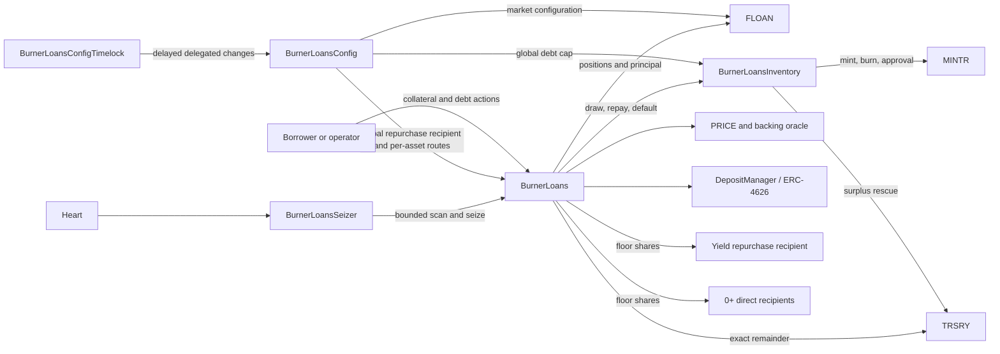
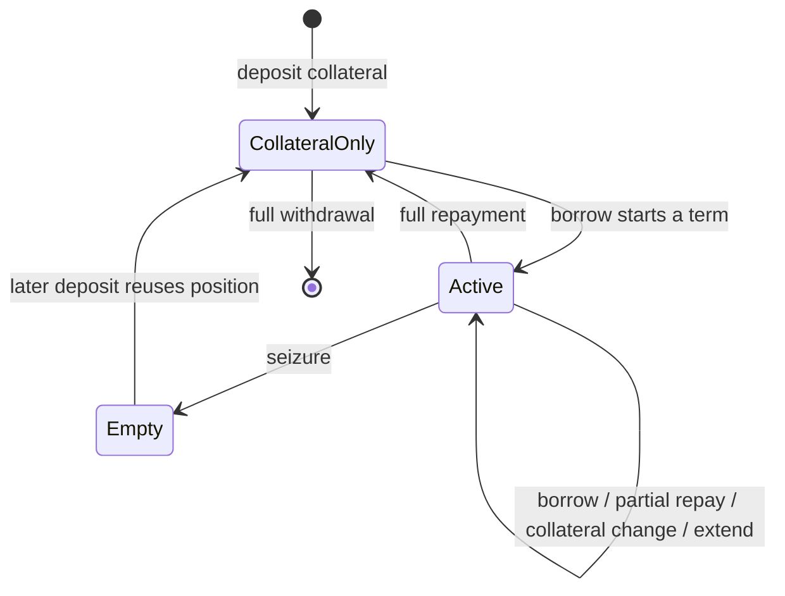
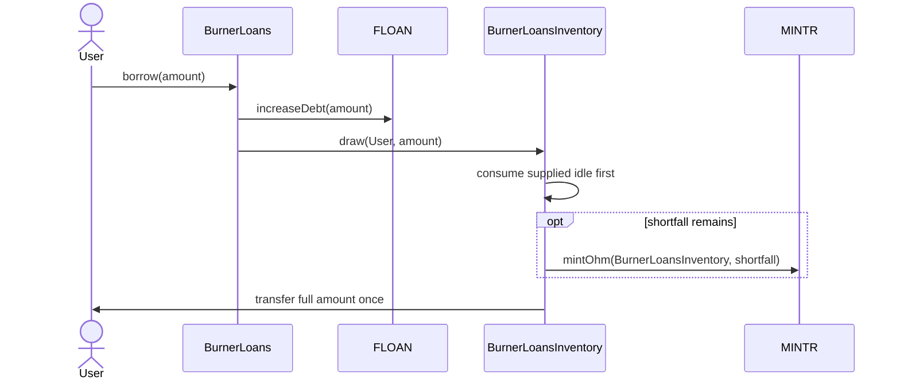
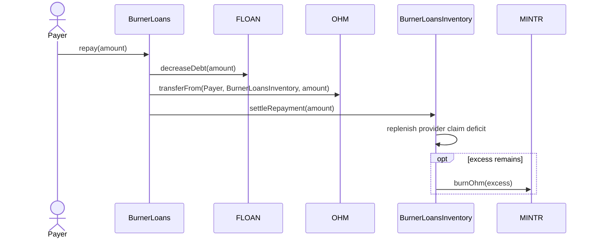
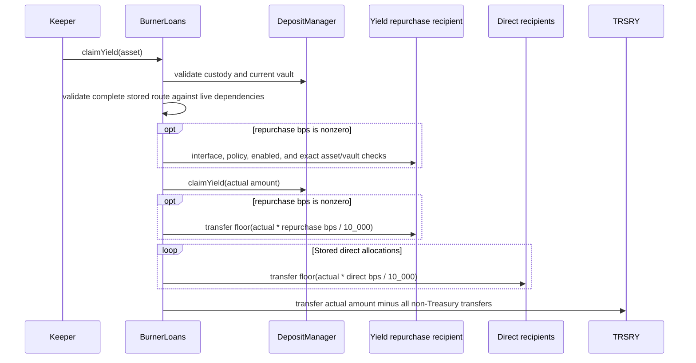
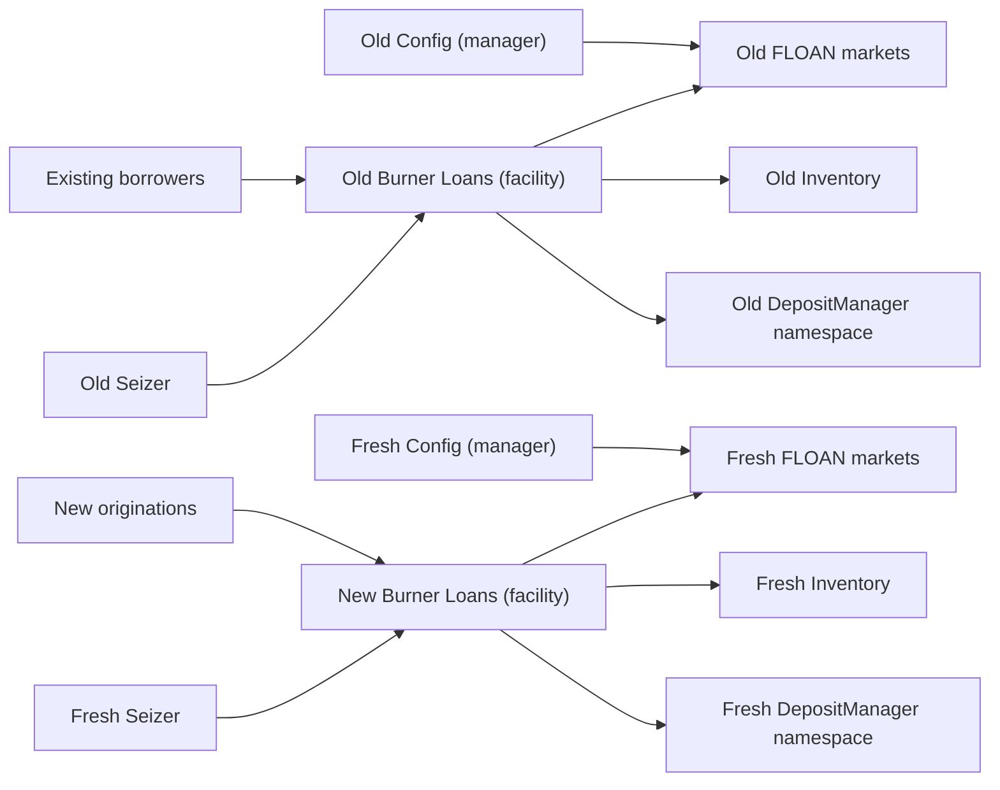

# Burner Loans

## Purpose

`BurnerLoans` is a fixed-term, 0% interest OHM shorting facility. A borrower deposits an approved
collateral asset, draws OHM, and later repays OHM. The draw may use protocol-supplied OHM, newly
minted OHM, or both. If a position matures or becomes unhealthy, its collateral is settled to
`TRSRY` and its principal is recorded as defaulted.

The generic [FLOAN module](./floan.md) owns markets, positions, and principal indexes. Burner Loans
adds collateral custody, pricing, fees, health rules, funding inventory, and automated seizure.

## Architecture



| Component                                             | Responsibility                                                                |
| ----------------------------------------------------- | ----------------------------------------------------------------------------- |
| `BurnerLoans`                                         | User lifecycle, health, custody, fees, seizure, and yield-routing state       |
| [`BurnerLoansInventory`](./burner_loans_inventory.md) | OHM custody, provider claim, global cap, principal total, and MINTR authority |
| `BurnerLoansConfig`                                   | Authorized market, debt-cap, and yield-routing forwarding                     |
| [`BurnerLoansConfigTimelock`](./burner_loans_access_control.md#config-timelock-matrix) | Timelocked delegate for bounded Config setters |
| `BurnerLoansSeizer`                                   | Gas-bounded, fail-open periodic seizure                                       |
| `FLOAN`                                               | Generic fixed-term market, position, active-index, and aggregate state        |
| `DepositManager`                                      | Collateral custody and optional ERC-4626 routing                              |

Burner Loans Config requires exactly one FLOAN market for its facility, collateral token, and OHM
pair when reading or updating configuration. FLOAN itself permits another contract to create an
additional matching market. Lifecycle, quote, view, and seizure paths deliberately continue using
the earliest matching market so that such an external market creation cannot block servicing of
existing Burner Loans positions. Config lookups fail closed when the pair is missing or ambiguous.

Burner Loans is deployed before Burner Loans Inventory. `BurnerLoansInventory` permanently binds
that Burner Loans address as its facility, while Burner Loans stores a replaceable
`BurnerLoansInventory` pointer. Burner Loans Config is deployed without a facility link. After all
three policies are active, admin links Config to Burner Loans, Burner Loans Inventory to Config,
and Burner Loans to both policies while each destination contract is disabled. Enablement
revalidates the complete relationship before Burner Loans becomes operational.

## Position Lifecycle

Burner Loans uses the first FLOAN position for a borrower and market. FLOAN remains generic and can
store multiple positions. A completed Burner Loans debt episode reuses its position ID.



| Action              | Effect                                                        | Main condition                                                   |
| ------------------- | ------------------------------------------------------------- | ---------------------------------------------------------------- |
| Deposit collateral  | Adds DepositManager credit to the position                    | Burner Loans and asset originations are enabled                  |
| Borrow              | Adds principal and draws OHM from Burner Loans Inventory      | Position is healthy, within both caps, and not matured           |
| Repay               | Reduces principal and settles OHM into Burner Loans Inventory | Not in the borrow block; live PRICE unless repayment clears debt |
| Withdraw collateral | Removes credit and returns custody assets                     | Remaining debt stays healthy                                     |
| Extend              | Advances the prior maturity by whole terms                    | Position stays healthy and maturity remains within its horizon   |
| Seize               | Defaults all principal and removes all collateral             | Position is matured or below the health boundary                 |
| Claim yield         | Splits custody surplus across its complete stored route       | Custody and the live route remain valid                          |

Full repayment and seizure clear the episode's financial fields and active indexes. The position
ID remains reusable. `PositionClosed` and `PositionDefaulted` events contain the pre-clear snapshot;
market cumulative-default accounting preserves defaulted principal.

## Operating States

Asset `originationsEnabled` is an exit-enabled pause. The Burner Loans global `enabled` flag is a
strict pause.

| Burner Loans action | Asset originations enabled | Asset originations disabled | Burner Loans disabled |
| ------------------- | -------------------------- | --------------------------- | --------------------- |
| Deposit collateral  | Allowed                    | Blocked                     | Blocked               |
| Borrow              | Allowed                    | Blocked                     | Blocked               |
| Extend              | Allowed                    | Blocked                     | Blocked               |
| Repay               | Allowed                    | Allowed                     | Blocked               |
| Withdraw collateral | Allowed                    | Allowed                     | Blocked               |
| Seize               | Allowed                    | Allowed                     | Blocked               |
| Claim yield         | Allowed                    | Allowed                     | Blocked               |

Burner Loans Inventory has only its global enabled state; Burner Loans owns origination control at
the asset level. See
[Burner Loans Inventory operating states](./burner_loans_inventory.md#operating-states) for its
complete action table and manual MINTR synchronization behavior.

## Health, Pricing, And Fees

Health is WAD-scaled; `1e18` is the seizure boundary.

All USD values in the calculation use `PRICE.decimals()`. The backing oracle's 18-decimal value is
rounded up into that scale before `backingRequirementUsd` is calculated, so debt, collateral, and
both requirements share one scale.

```text
marketRequirementUsd = ceil(debtValueUsd * 10_000 / maxLtvBps)
backingRequirementUsd = ceil(debtBackingValueUsd * backingMultiplierBps / 10_000)
requiredCollateralUsd = max(marketRequirementUsd, backingRequirementUsd)
healthFactor = floor(collateralValueUsd * 1e18 / requiredCollateralUsd)
```

`debtBackingValueUsd` is the backing value of the outstanding OHM debt.

Collateral uses its gross current oracle value; no separate haircut is applied. `maxLtvBps`
converts debt market value into the market collateral requirement, so one parameter supplies the
market-value buffer.

`backingMultiplierBps` protects the liquid backing per backed OHM rate when OHM trades below its
backing value. Protecting that rate means the backing branch requires each borrowed OHM to have
collateral whose oracle value is at least its liquid backing multiplied by the configured factor.
At 100%, the position could be originated with collateral equal to liquid backing. A value above
100% requires additional collateral above that backing value.

The protocol uses the larger of the market and backing requirements, so a position cannot borrow
below either its maximum-LTV requirement or its backing requirement. The stricter branch changes at
this OHM market-price-to-backing-value ratio:

```text
crossover ratio = maxLtvBps / 10_000 * backingMultiplierBps / 10_000
```

Above the crossover, maximum LTV is stricter. Below it, the backing multiplier is stricter. Keeper
rewards are calculated separately and cannot consume collateral required by the backing branch.

| State                      | Borrow or withdraw                | Seizure                       |
| -------------------------- | --------------------------------- | ----------------------------- |
| No debt                    | Debt-free health is max `uint256` | Not seizable                  |
| `healthFactor > 1e18`      | Allowed if other checks pass      | Not health-seizable           |
| `healthFactor == 1e18`     | Exact boundary is allowed         | Not health-seizable           |
| `healthFactor < 1e18`      | New risk is blocked               | Seizable with current prices  |
| Maturity reached with debt | New risk is blocked               | Seizable without a price read |

PRICE values use `PRICE.decimals()`. OHM and collateral amounts use their token scales. The
backing oracle returns 18-decimal USD per OHM. Rounding is conservative for the protocol: debt USD,
backing conversion, collateral requirements, required collateral-token amounts, utilization, and
final transferred fees round up. Gross collateral values, health factors, and fee-curve slope
contributions round down.

Every borrower lifecycle action and position-action preview reports the resulting health factor.
`depositCollateral` and `previewDepositCollateral` return credited collateral, resulting collateral,
and resulting health. `repay` and `previewRepay` report actual or projected health after the debt
reduction rather than an unknown-health sentinel. A debt-free result is `type(uint256).max` and does
not read PRICE.

Previews expose unhealthy hypothetical outcomes instead of reverting solely because health is below
`1e18`. Borrow, withdrawal, and extension previews set `executable` to `false`; their corresponding
writes still revert. Deposits and repayments remain executable when they improve a position but
leave health below `1e18`.

When resulting debt is nonzero, these returns require the standard live collateral and OHM pricing
inputs. The preview or action is expected to revert if PRICE is unavailable, unsupported, zero, or
stale. A write that reaches the health calculation and then encounters a PRICE failure reverts the
entire collateral or debt transition atomically. There is no no-oracle escape-hatch flag: seizure
that depends on the same unavailable prices cannot proceed either. Full repayment and debt-free
collateral operations remain available because their health is unambiguous without PRICE.

Borrow and extension fees are paid in the collateral asset directly to `TRSRY`. They do not reduce
credited collateral. The fee curve uses pre-action market utilization; the global cap is not a fee
input.

```text
utilization = ceil(marketPrincipalDue * 1e18 / marketPrincipalCap)
baseFee = baseFeeBps * 1e14
kink = kinkBps * 1e14
preKinkSlope = preKinkSlopeBps * 1e14
postKinkSlope = postKinkSlopeBps * 1e14

zero kink (single slope):
feeRate = baseFee + floor(utilization * preKinkSlope / 1e18)

at or before a non-zero kink:
feeRate = baseFee + floor(utilization * preKinkSlope / kink)

after kink:
feeRate = baseFee
        + preKinkSlope
        + floor((utilization - kink) * postKinkSlope / (1e18 - kink))
```

`utilization`, `baseFee`, `kink`, both slopes, and `feeRate` are WAD-scaled. The stored fee
parameters are basis points and are converted to WAD before applying the piecewise curve.

The final fee rounds up so a non-zero rate cannot disappear through token-decimal truncation.
`maxFee` protects execution against a fee above the caller's accepted amount.

## Launch Parameters

See [Burner Loans launch parameters](./burner_loans_launch_parameters.md) for the proposed USDS and
USDe configuration, parameter rationale, and worked normal and stress cases.

## Burner Loans Inventory Accounting

FLOAN owns each market cap. Burner Loans Inventory owns the facility-wide cap, OHM funding, provider
claims, and MINTR authority. Burner Loans changes the FLOAN and Burner Loans Inventory principal
ledgers in one transaction. See [Burner Loans Inventory](./burner_loans_inventory.md) for the
formulas, state transitions, invariants, and failure behavior.

## Funding And Settlement Flows





FLOAN, Burner Loans Inventory, collateral fees, and token transfers normally change atomically.
Repayment is deliberately resilient to a MINTR burn failure: principal settlement remains valid,
the unburned OHM becomes ordinary surplus, and `OhmBurnFailed` reports the failure. A failed
approval increase is also conservative: the principal transition remains valid, the shortfall is
reported by event, and an admin may reconcile it later. Approval reductions are safety-critical;
a reduction failure reverts the transition.

## Custody And Token Assumptions

DepositManager may route collateral into an ERC-4626 vault. FLOAN records withdrawable collateral
credit, not vault shares. Vault yield does not increase borrower health. `claimYield` distributes
only custody surplus and does not read or mutate Burner Loans Inventory, OHM balances, capacity, or
MINTR approval.

| Stage                       | Enforcement or assumption                                                   |
| --------------------------- | --------------------------------------------------------------------------- |
| Asset admission             | Governance verifies exact-transfer collateral and any configured vault path |
| Collateral deposit          | Exact receipt into Burner Loans and then DepositManager custody             |
| Provider supply / draw      | Exact receipt on supply; trusted-OHM assumption for outgoing draws          |
| Repayment settlement        | Exact Burner Loans Inventory balance increase before settlement             |
| Fees and outgoing transfers | Safe transfer; exact behavior follows the admitted-token assumption         |
| Token callbacks             | Token-touching lifecycle functions use storage-backed reentrancy guards     |

Fee-on-transfer, rebasing, and otherwise balance-changing collateral is unsupported. ERC-20 has no
reliable capability flag, and an admission-time transfer probe can be bypassed by amount-, address-,
or upgrade-dependent behavior. Asset admission is therefore a governance-reviewed invariant.
Exact receipt applies to the underlying token transfer at each custody boundary; it does not require
an ERC-4626 deposit to produce collateral credit equal to the transferred amount. FLOAN credits the
actual withdrawable amount returned by DepositManager, which may be lower because of vault rounding.

## Yield Routing

Burner Loans owns one optional, facility-wide yield repurchase recipient and one complete,
declarative route per collateral asset. It also tracks how many asset routes allocate a nonzero
share to that global recipient and keeps an append-only registry of all collateral assets created
through Config. Config calls the facility's matching `addAsset` function immediately after creating
each FLOAN market. A newly registered asset's all-zero route means Treasury-only: it has
`repurchaseRecipientBps = 0` and no direct allocations. Claims never call Config. Disabling,
deactivating, or replacing Config therefore does not change stored runtime routing.

`AssetYieldRouting` contains the complete intended split:

```solidity
struct DirectYieldAllocation {
    address recipient;
    uint16 bps;
}

struct AssetYieldRouting {
    uint16 repurchaseRecipientBps;
    DirectYieldAllocation[] directAllocations;
}
```

`setYieldAssetRouting(asset, routing)` replaces the whole route atomically; there is no additive
per-recipient mutation. The route states every non-Treasury allocation. Treasury is the implicit
remainder, which keeps configuration compact and prevents a redundant Treasury entry from
disagreeing with the fallback behavior.



The repurchase BPS plus every direct BPS must not exceed `10_000`. The difference from `10_000` is
Treasury's implicit share, so a route may allocate `0` BPS or the complete `10_000` BPS away from
Treasury. Direct allocations have no separate count limit. Because every direct allocation must
have nonzero integer BPS, the BPS bound provides a mathematical maximum of 10,000 direct
allocations. Each direct allocation
must also have a unique, nonzero recipient. A direct recipient can be an EOA or contract and does
not need to implement a special interface, but it cannot be Burner Loans, the current `TRSRY`
module, or the global repurchase recipient. Treasury cannot appear in the direct array because it is
always the implicit remainder.

The global repurchase recipient is the only specialized destination. A nonzero address must support
`IYieldRepurchaseRecipient` and `IEnabler`, be an active policy in Burner Loans' Kernel, and be
enabled. Burner Loans' Kernel registry is authoritative; Burner Loans does not trust or compare a
recipient-reported Kernel. For every route with nonzero `repurchaseRecipientBps`, the recipient's
configuration must match the exact asset/vault pair currently reported by DepositManager,
including a zero vault, and that pair must be enabled.

Rotating the global recipient preserves every per-asset route. A nonzero replacement is checked
against all registered assets: it cannot collide with any stored direct recipient, and every active
repurchase allocation must have a valid replacement asset/vault route. The global address cannot
be cleared while any asset has nonzero repurchase BPS. To remove it, first replace every active
asset route with `repurchaseRecipientBps = 0`, then set the global recipient to zero.

Configuration and execution revalidate live dependencies. A `TRSRY` module upgrade can make a
stored direct recipient invalid, and a repurchase policy can later be disabled or have its vault
configuration changed. `previewClaimYield` and `claimYield` fail under the same route conditions;
governance can repair a stale route by replacing it, including by setting its repurchase share to
zero without consulting a broken repurchase recipient. Yield-routing setters require Burner Loans
to be enabled.

ConfigTimelock guards global-recipient changes against the complete yield-routing configuration and
guards each per-asset route independently. A global-recipient change conflicts with every pending
asset-route change, while route changes for different assets may be queued and executed together.
The global state hash covers the facility address, global recipient, append-only asset order, and
every complete ordered route. An asset-route hash covers the facility, global recipient, target
asset, and that asset's complete ordered route. Relevant direct changes during the delay therefore
invalidate the queued action without a separate revision counter.

Those hashes cover Burner Loans-owned routing configuration only. Config and facility enablement,
ConfigTimelock authority, recipient interface support, recipient Kernel activity and enablement,
and the exact DepositManager asset-vault route remain live prerequisites. The timelock validates a
complete proposed asset route before queueing, and the forwarded Burner Loans setter revalidates it
when the action executes. Asset originations, market risk and fee configuration, debt, deposits, and
custody balances do not change the meaning of a recipient or per-asset allocation update and
therefore are not part of its conflict domain.

The intended YRF v2 implementation will implement `IYieldRepurchaseRecipient` and register reserve
assets by their ERC-4626 vault. A nonzero YRF allocation therefore requires DepositManager to report
a nonzero vault that YRF v2 has registered for the same underlying asset. Direct-custody assets can
still claim yield to direct recipients and Treasury, but configuring nonzero repurchase BPS for one
reverts before Burner Loans queries YRF with the zero address.

Direct `claimYield(asset)` calls are permissionless and fail-closed for the specified registered
asset. An invalid route, mismatched repurchase pair, DepositManager failure, or outbound-transfer
failure reverts the asset's claim and every transfer within that call.
Unsupported custody, insolvency, or a globally disabled Burner Loans facility also reverts.
Disabling market originations does not disable custody exits or yield claims. A configured market
with no deposits is solvent and contributes zero without calling DepositManager's claim function.

Each non-Treasury share is calculated independently as
`floor(actualClaimed * bps / 10_000)`. Zero-value token transfers are skipped. Treasury receives
`actualClaimed - sum(nonTreasuryAmounts)`, so it receives its intended share plus all rounding dust
and Burner Loans retains no newly claimed residual. `YieldClaimed` records the asset, authoritative
claimed amount, and one ordered `(recipient, amount)[]`. When configured, the repurchase result is
first, followed by direct results in stored order, with Treasury last; zero-value configured legs
remain present in the event.

Focused gas snapshots measured Treasury-only, repurchase-only, and mixed YRF-plus-two-direct claims
at 132,383, 140,281, and 225,365 gas. Routes containing YRF plus five, ten, and twenty-five direct
recipients measured 311,495, 455,067, and 885,912 gas. These measurements use successful nonzero
transfers to previously empty recipient balances.

Because direct-recipient count is not separately capped, configure
`BurnerLoansYieldClaimer.executionGasLimit` as the gas forwarded to one complete periodic task body.
Remeasure with the deployed routes, recipients, tokens, and DepositManager behavior. The claimer
runs the registry loop through an external self-call, so exhausting the limit reverts every claim
performed by that task body. The outer Heart entry point catches the failure and emits one
`ExecutionFailed` event. Assets remain recoverable through permissionless direct
`claimYield(asset)` calls.

`BurnerLoansYieldClaimer` provides the fail-soft Heart integration. A failed attempted asset emits
an event and does not prevent later assets or later Heart tasks from running. Failure events contain
the first four bytes of underlying revert data, or zero when the call runs out of gas or returns no
reason. If the complete task body fails, its individual asset events are also rolled back and the
outer `ExecutionFailed` event provides the bounded reason instead. Complete failure details remain
available from the transaction trace. The OCG admin or `burner_loans_admin` may set the nonzero
complete-task gas limit; the task reads the facility's asset registry and has no separate asset list
or routing configuration.

The claimer starts disabled. OCG admin may enable it after the immutable Burner Loans target is an
active Kernel policy; OCG admin or emergency may disable it. OCG admin or `burner_loans_admin` may
re-enable it during the standard Burner Loans grace period, with target activity revalidated. The
OCG admin may update that grace period while the claimer is enabled. An authorized Heart call while
the claimer is disabled is a no-op before any Burner Loans registry read.

See [Burner Loans Access Control](./burner_loans_access_control.md) for the exact caller, role,
policy-state, and timelock requirements.

## Seizure Automation

Seizure clears the full debt episode, routes the capped ordinary-keeper reward, sends remaining
collateral to `TRSRY`, and records the default in FLOAN and Burner Loans Inventory atomically.

Direct seizure is permissionless. Protocol-operated seizure does not receive a product keeper
reward. See the [user and automation access matrix](./burner_loans_access_control.md#user-and-automation-matrix)
for the exact role paths.

The seizer bounds both its scan and its complete self-execution gas. A scan or seizure failure does
not advance its cursor and does not fail Heart. The seizer does not reconcile MINTR approval. If
automatic restoration does not occur, `burner_loans_admin` must call `syncMintApproval`.

## Configuration Model

See [Burner Loans Access Control](./burner_loans_access_control.md) for the function-level role and
timelock matrices. That document distinguishes the Burner Loans timelock from the external OCG
governance delay.

Backing-oracle rotation is intentionally available only while Burner Loans is enabled. It changes
health and seizure economics, so it cannot be performed while borrower actions are paused.

Config creates one market per collateral/OHM pair under its currently bound Burner Loans facility.
Each market stores Config as its manager and Burner Loans as its facility: Config is the
Kernel-permissioned pass-through for market configuration, while Burner Loans services positions.
Config finds those markets by the bound facility, collateral token, and OHM debt-token tuple.

`Config.setFacility` is disabled-state, one-time deployment wiring. Rebinding only Config would
switch that lookup tuple without updating the manager or facility stored in existing markets, so
Config would remain their configuration authority but could no longer discover them. It would
also leave custody, liabilities, and receipt-token state keyed to the old Burner Loans address in
DepositManager. After a non-zero facility is stored, Config therefore rejects every rebind.

Burner Loans-specific fields use `bytes16("Burner Loans v1")`; standard fixed-term fields remain
typed in FLOAN. Config resolves Burner Loans Inventory through Burner Loans, so it follows an
approved Burner Loans Inventory pointer change without maintaining a second link. Burner Loans
Inventory's facility is immutable in v1.

`BurnerLoansConfig` uses the shared `ConfigOperatorSingleStep` mix-in. Config advertises the shared
`IConfigOperator` interface. The operator can be set to zero to revoke delegated access.

## Deployment And Activation

The order below establishes every link through an active-policy check without introducing a
circular enablement dependency.

1. Install the required FLOAN, MINTR, PRICE, ROLES, and TRSRY modules.
2. Deploy `BurnerLoans(...)`. Its Burner Loans Inventory and Config pointers are initially zero, so
   enabling it will revert.
3. Deploy `BurnerLoansInventory(kernel, ohm, facility = BurnerLoans)`. The immutable facility may
   be inactive at construction, but must already be deployed and belong to the same Kernel.
4. Deploy `BurnerLoansConfig(kernel, ohm)` without a facility link. If delegated configuration is
   required, deploy ConfigTimelock with that Config address.
5. Activate DepositManager, Burner Loans, Burner Loans Inventory, Config, any deployed
   ConfigTimelock, and the other required policies. Link setters require their policy arguments to
   be active in the same Kernel.
6. Grant the roles and exact-address permissions listed in
   [Burner Loans Access Control](./burner_loans_access_control.md#authorities-and-expected-assignments).
7. While the destination policies remain globally disabled, OCG admin calls, in order:
   `Config.setFacility(BurnerLoans)`, `BurnerLoansInventory.setConfigurator(Config)`,
   `BurnerLoans.setInventory(BurnerLoansInventory)`, and
   `BurnerLoans.setConfigurator(Config)`. Each setter validates the relationship it can observe;
   enablement later validates the complete reverse links.
8. Enable DepositManager and Config. Config can enable while Burner Loans and Burner Loans
   Inventory are globally disabled, but both linked policies must remain active and all reverse
   links must agree.
9. Optionally call `Config.setConfigOperator(ConfigTimelock)` and enable ConfigTimelock. Setting the
   operator to zero disables delegated execution. Delayed execution requires Config and
   ConfigTimelock to remain enabled and ConfigTimelock to remain the configured operator.
10. Through Config, set the Burner Loans Inventory global cap. Its cap setter remains available
    while Burner Loans Inventory is globally disabled so deployment can reconcile MINTR approval
    before user operations begin.
11. Add each collateral asset and configure its FLOAN market, custody path, PRICE support, cap,
    risk parameters, fee curve, and asset-level originations state.
12. If any route will use the repurchase leg, activate and enable the intended
    `IYieldRepurchaseRecipient` policy, register each exact DepositManager asset/vault pair, and set
    it as the global recipient. Then use Config directly or through ConfigTimelock to replace each
    complete per-asset route. Assets that do not need custom routing may retain the Treasury-only
    route installed by `addAsset`.
13. Enable Burner Loans Inventory, then enable Burner Loans last. Burner Loans enablement requires
    active Config and DepositManager policies plus an active, enabled, compatible Burner Loans
    Inventory. Then configure and enable Seizer and other periphery contracts, including seizer
    assets and its execution gas limit.

V1 launches with zero Burner Loans Inventory active principal, supplied idle, and provider claim.
Importing a non-zero live Burner Loans Inventory ledger requires a future migration design. See
[replacing Burner Loans Inventory](./burner_loans_inventory.md#replacement) for the v1 replacement
constraints.

## Policy Replacement And Wind-Down

A live Burner Loans policy address and its DepositManager operator namespace are not migratable in
v1. Replacement is side by side: the old stack services its own positions to zero while a fresh
stack originates separate positions.



The replacement deploys a fresh Config and Burner Loans pair, plus a fresh Inventory, Seizer,
FLOAN markets, and DepositManager operator namespace. The old Config remains the manager of the old
markets, and the old Burner Loans remains their facility until wind-down completes. The same
DepositManager contract may host both namespaces, but they remain keyed to different policy
addresses. `Config.setFacility` links each fresh pair once during deployment; it is not a migration
operation. FLOAN's generic `setMarketFacility` remains available for products that can coordinate
their own custody and authority transition, but Burner Loans cannot use it to transfer this
policy-scoped state.

| Path         | Old stack during wind-down                                          | New stack                                              |
| ------------ | ------------------------------------------------------------------- | ------------------------------------------------------ |
| Originations | Disable each old asset; deposit, borrow, and extend are blocked     | Originate only in fresh markets and custody accounting |
| Servicing    | Keep the old policy globally enabled for repay, withdraw, and seize | Service only new positions                             |
| Automation   | Keep the old Seizer operational until no position requires seizure  | Configure a fresh Seizer independently                 |
| Retirement   | Allowed only after every condition below is reconciled              | Independent of old position IDs and balances           |

Active-borrower membership can be reconciled from current positions, but its set order is not
guaranteed. A fresh Seizer must reset or reconcile both `nextAssetIndex` and each per-asset
`assetCursor`; it must not copy cursors against an assumed borrower order.

### Retirement Checklist

| Area                   | Required state before retiring the old stack                                                                                                                                              |
| ---------------------- | ----------------------------------------------------------------------------------------------------------------------------------------------------------------------------------------- |
| FLOAN markets          | Originations disabled; collateral, principal due, interest due, and active borrowers are zero for every old market                                                                        |
| Facility accounting    | `getFacilityPrincipalDue(oldFacility, debtToken)` is zero for every debt token used by the old facility                                                                                   |
| DepositManager         | Liabilities and borrowed balances are zero for every old collateral asset; remaining vault yield and dust are claimed or explicitly accepted                                              |
| Burner Loans Inventory | Active principal, provider claims, and supplied idle are zero; the global cap and actual MINTR approval are zero; residual OHM is burned, withdrawn, or rescued through the intended path |
| Automation             | The old Seizer has completed all required seizure work and is then disabled                                                                                                               |
| Authority              | DepositManager operator rights and operational Burner Loans roles are revoked only after user exits and seizure work are complete; Config and lifecycle policies are deactivated last     |

## Preview Semantics

| Preview     | Includes                                                   | Does not guarantee                                                      |
| ----------- | ---------------------------------------------------------- | ----------------------------------------------------------------------- |
| Deposit     | Expected custody credit, resulting collateral, and health  | Future vault state                                                      |
| Borrow      | Fee, debt, maturity, health, and local capacity            | Caller authorization, token approval, recipient, or `maxFee` acceptance |
| Repay       | Applied repayment, remaining debt, and resulting health    | Payer balance or approval                                               |
| Withdraw    | Return token/amount, remaining collateral, and health      | Successful future vault redemption                                      |
| Extend      | Fee, resulting maturity, and health                        | Caller token approval or `maxFee` acceptance                            |
| Seize       | Debt, collateral, reward, and treasury amount              | Unchanged prices or custody at execution                                |
| Claim yield | Current claimable surplus and complete live-route validity | Exact output after vault rounding or later transfer success             |

Previews enforce deterministic local eligibility. Execution return values and events remain
authoritative.
