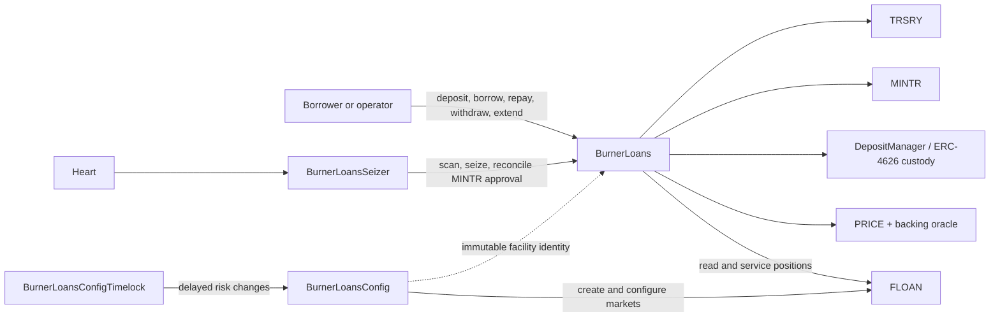
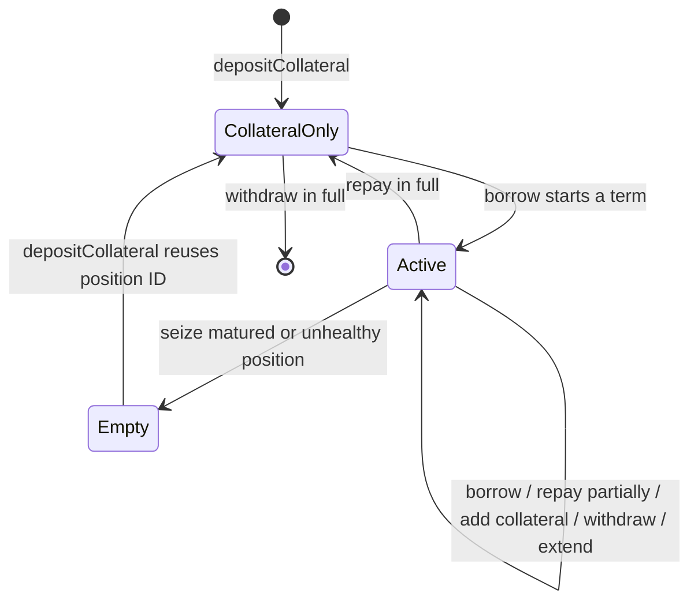

# Burner Loans

## Purpose

`BurnerLoans` is a fixed-term, 0% interest OHM shorting facility. Borrowers deposit approved
collateral, borrow newly minted OHM, and repay by burning OHM. If a position becomes seizable, its
collateral is settled to `TRSRY`; the defaulted OHM remains circulating but is backed by the seized
collateral.

The product uses the generic [FLOAN module](./floan.md) as its ledger. Burner Loans adds custody,
prices, fees, health rules, user authorization, global capacity, and seizure behavior.

## Architecture



`BurnerLoansConfig` is immutably bound to a deployer-trusted `BurnerLoans` facility that reports the
same Kernel; `BurnerLoans` does not store or call Config. Config and lifecycle operations resolve
markets through FLOAN using `(bound facility, collateral asset, OHM)`.
`BurnerLoansConfigTimelock` similarly verifies that Config reports the same Kernel but does not
require Config to be active during deployment. FLOAN permits multiple matching markets; Burner
Loans deliberately requires exactly one and fails closed if the lookup is missing or ambiguous.
`BurnerLoansSeizer` verifies that its lifecycle target reports the same Kernel. The optional
`BurnerLoansComposites` periphery verifies the target interfaces and rejects an OHM token that does
not match the target's configured debt token.

| Contract                    | Responsibility                                                                        |
| --------------------------- | ------------------------------------------------------------------------------------- |
| `BurnerLoans`               | User lifecycle, previews, global cap, backing oracle, custody, mint/burn, and seizure |
| `BurnerLoansConfig`         | Opinionated creation and configuration of Burner Loans FLOAN markets                  |
| `BurnerLoansConfigTimelock` | Queues delayed asset-cap, risk, and fee changes                                       |
| `BurnerLoansSeizer`         | Fail-open Heart task for bounded seizure scans and MINTR approval reconciliation       |
| `FLOAN`                     | Generic market, position, index, and aggregate ledger                                 |

Linked libraries split bytecode-heavy implementation from the deployable policies; they do not own
state or introduce another authority layer.

## Position Lifecycle

Burner Loans exposes one FLOAN position per borrower and collateral market, even though FLOAN can
store several. Collateral and debt actions remain separate so a borrower can improve health by
adding collateral or repaying without changing maturity.



| Action              | Main effect                                  | Important rule                                                       |
| ------------------- | -------------------------------------------- | -------------------------------------------------------------------- |
| Deposit collateral  | Credits collateral through DepositManager    | Requires global and asset originations enabled                       |
| Borrow              | Increases principal and mints OHM            | First borrow sets maturity; later borrows preserve it                |
| Repay               | Burns OHM and reduces principal              | Does not require a fresh price; same-block repayment is blocked      |
| Withdraw collateral | Reduces credit and returns custody assets    | Remaining debt must stay healthy                                     |
| Extend              | Moves maturity by whole terms                | Charges the current fee and cannot rescue a health-seizable position |
| Seize               | Defaults all debt and removes all collateral | Position must be matured or unhealthy; no partial seizure            |
| Harvest yield       | Sends custody surplus to `TRSRY`             | Cannot consume borrower collateral liabilities                       |

Owner/operator authorization applies to deposit, borrow, withdrawal, and extension. Repayment is
permissionless because it can only reduce another account's debt. Fees are paid by the caller, not
by `onBehalfOf`, and do not reduce credited collateral. Seizure is permissionless when the position
is eligible, subject to the keeper-reward rules below.

Full repayment and seizure end the current debt episode without deleting the FLOAN identity or its
indexes. Episode fields are zeroed, and a later deposit/borrow reuses the same position ID. FLOAN's
`PositionClosed` and `PositionDefaulted` events contain the pre-clear episode snapshot; defaulted
principal also remains in the market's cumulative historical total.

## Operating States

Global disable is a policy pause. Disabling asset originations maps to FLOAN's origination flag and
is a new-exposure freeze, leaving safe exits and settlement available while the policy remains enabled.

| Action              | Originations enabled | Originations disabled | Global disabled |
| ------------------- | -------------------- | --------------------- | --------------- |
| Deposit collateral  | Allowed              | Blocked               | Blocked         |
| Borrow              | Allowed              | Blocked               | Blocked         |
| Extend              | Allowed              | Blocked               | Blocked         |
| Repay               | Allowed              | Allowed               | Blocked         |
| Withdraw collateral | Allowed              | Allowed               | Blocked         |
| Seize               | Allowed              | Allowed               | Blocked         |
| Harvest yield       | Allowed              | Allowed               | Blocked         |

Disabling originations therefore stops new risk without trapping borrowers or preventing settlement.

## Health And Pricing

Health is WAD-scaled; `1e18` is the seizure boundary.

```text
marketRequirementUsd = ceil(debtValueUsd * minCollateralRatioBps / 10_000)
backingRequirementUsd = ceil(debtOhm * backingPerOhmUsd * backingMultiplierBps / 10_000)
requiredCollateralUsd = max(marketRequirementUsd, backingRequirementUsd)
riskAdjustedCollateralUsd = collateralValueUsd * collateralFactorBps / 10_000
healthFactor = floor(riskAdjustedCollateralUsd * 1e18 / requiredCollateralUsd)
```

| Result                    | Meaning                            | Borrow/withdraw                       | Seizure                    |
| ------------------------- | ---------------------------------- | ------------------------------------- | -------------------------- |
| No debt                   | `healthFactor = type(uint256).max` | Collateral may be withdrawn           | Not seizable               |
| `healthFactor > 1e18`     | Healthy                            | Allowed if all other checks pass      | Not health-seizable        |
| `healthFactor == 1e18`    | Exact boundary                     | Allowed                               | Not health-seizable        |
| `healthFactor < 1e18`     | Unhealthy                          | New debt and risky withdrawal blocked | Seizable with fresh prices |
| Maturity passed with debt | Matured                            | New debt blocked                      | Seizable                   |

PRICE values use `PRICE.decimals()`. OHM and collateral amounts use their native token scales;
health uses 18 decimals. The backing oracle returns 18-decimal USD backing per OHM. Conversion to
PRICE scale rounds up when reducing precision so the backing floor cannot be weakened.

Borrow, withdrawal with debt, extension, and seizure require current supported prices. Repayment
does not depend on price freshness. Requirements and transferred fees round up; health and
intermediate rate components round down.

## Fees

Borrow and extension are the only fee events. Fees are denominated in the collateral asset,
transferred from the caller directly to `TRSRY`, and never counted as deposited collateral or
DepositManager yield.

The utilization curve uses pre-action asset utilization; the global cap is not a fee input.

```text
utilization = ceil(assetPrincipalDue * 1e18 / assetPrincipalCap)

before kink:
feeRate = baseFee + floor(utilization * preKinkSlope / 10_000)

after kink:
feeRate = baseFee
        + floor(kink * preKinkSlope / 10_000)
        + floor((utilization - kink) * postKinkSlope / 10_000)
```

| Circumstance                    | Fee basis                                              | Caller protection |
| ------------------------------- | ------------------------------------------------------ | ----------------- |
| Borrow                          | Incremental required collateral for newly borrowed OHM | `fee <= maxFee`   |
| Extend                          | Current required collateral, once per added term       | `fee <= maxFee`   |
| Repay, withdraw, seize, harvest | No product fee                                         | Not applicable    |

The final collateral fee rounds up, so a non-zero fee cannot disappear through token-decimal
truncation. Preview and execution use the same formula when state is unchanged.

## Capacity And MINTR Approval

Two independent caps constrain live OHM principal:

```text
marketPrincipalDue + newPrincipal <= assetDebtCap
facilityPrincipalDue + newPrincipal <= globalDebtCap
```

| Event             | Active principal | Available cap | MINTR approval                                |
| ----------------- | ---------------- | ------------- | --------------------------------------------- |
| Borrow            | Increases        | Decreases     | Consumed by minted amount                     |
| Repay             | Decreases        | Increases     | Restored by repaid amount                     |
| Seize/default     | Decreases        | Increases     | Reconciled by the next seizer Heart execution |
| Global cap change | Unchanged        | Recalculated  | Reconciled to `cap - active principal`        |

`BurnerLoans` stores the global cap; FLOAN stores each market cap and reports live facility OHM
principal. Mint approval is finite rather than unlimited. Reconciliation always targets:

```text
MINTR approval = max(globalDebtCap - facilityPrincipalDue, 0)
```

The `burner_loans_admin` role may call `syncMintApproval` manually. `BurnerLoansSeizer` also calls it
after every Heart execution, including executions with no managed assets, no seizable borrowers, or
failed scans/seizures. The call is separate from seizure settlement and caught on failure, so MINTR
unavailability cannot roll back a completed default or block later Heart tasks. Sync access is not
permissionless: only `burner_loans_admin` and `burner_loans_seizer` may restore approval, preventing
an arbitrary caller from undoing an intentional emergency approval reduction. Governance can stop
automatic restoration by revoking the seizer policy's `burner_loans_seizer` role.

## Custody And Settlement

DepositManager holds the custody accounting for Burner Loans and may route collateral into an
ERC-4626 vault. FLOAN records only credited collateral.

```mermaid
sequenceDiagram
    actor User
    participant BL as BurnerLoans
    participant FLOAN
    participant DM as DepositManager
    participant Vault as ERC-4626 vault

    User->>BL: depositCollateral(asset, amount, owner)
    BL->>DM: deposit as facility operator
    DM->>Vault: deposit asset
    DM-->>BL: actual withdrawable credit
    BL->>FLOAN: create position if needed; add collateral credit
```

| Quantity           | Definition                                                         |
| ------------------ | ------------------------------------------------------------------ |
| Borrower liability | Sum of FLOAN credited collateral for the market                    |
| Custody assets     | Assets currently returnable by DepositManager                      |
| Claimable yield    | Custody assets above liabilities, subject to DepositManager limits |
| Solvent            | Custody assets cover borrower liabilities                          |

Vault yield does not increase borrower health. `harvestYield` may claim only surplus and routes it
to `TRSRY`. If an external transfer, vault operation, fee collection, mint, burn, or seizure
settlement fails, the transaction reverts with FLOAN and token state unchanged.

### Token Compatibility And Transfer Safety

Burner Loans supports collateral with exact ERC-20 transfer semantics. Fee-on-transfer, rebasing,
or otherwise balance-changing collateral is unsupported. ERC-20 has no standard capability flag
for these behaviors, and a transfer probe in `addAsset` could be bypassed by amount-dependent,
address-dependent, or upgradeable token logic. Asset admission is therefore a governance-reviewed
compatibility decision rather than an automated claim made by `BurnerLoansConfig`.

| Stage                            | Enforcement or assumption                                                                 |
| -------------------------------- | ----------------------------------------------------------------------------------------- |
| Governance asset review          | Tests both `transfer` directions, `transferFrom`, and any configured ERC-4626 custody path |
| `BurnerLoansConfig.addAsset`      | Requires PRICE and DepositManager configuration; performs no token-transfer probe          |
| Collateral custody entry         | Safe transfer failures revert; DepositManager requires its exact requested balance increase |
| Fees, withdrawal, yield, seizure | Safe transfer failures revert; exact outgoing behavior relies on the admission invariant   |
| Token callback                   | Every token-touching Burner Loans lifecycle action uses the shared reentrancy guard         |

Safe-transfer helpers accept standard boolean returns and successful no-return tokens. A reverted
call, malformed return, or explicit `false` return reverts the complete lifecycle transaction, so
callers do not separately monitor the ERC-20 return value. The exact-receipt check remains active
on every custody deposit as defense in depth; outgoing balance-delta checks are not repeated on hot
paths.

## Seizure And Automation

A debt-bearing position is seizable when it is matured or has `healthFactor < 1e18`. Seizure closes
the entire episode, zeroes its financial fields, removes it from active indexes, transfers the
capped keeper reward when applicable, and routes the remainder to `TRSRY`. The retained position ID
can be used for a later episode; historical details come from the seizure/default events.

| Caller                       | Required role                                | Burner Loans keeper reward |
| ---------------------------- | -------------------------------------------- | -------------------------- |
| Ordinary keeper              | None                                         | Capped configured reward   |
| Heart caller acting directly | `heart`                                      | None                       |
| `BurnerLoansSeizer`          | `burner_loans_seizer` on the seizer contract | None                       |

The Heart account needs `heart` to call `BurnerLoansSeizer.execute`. The seizer contract separately
needs `burner_loans_seizer` when it calls Burner Loans. Either protocol role suppresses the product
keeper reward when its holder calls the seizure surface directly.

The seizer scans bounded borrower batches and advances across configured assets, then independently
reconciles MINTR approval. Heart forwards the complete task body through a configurable gas limit.
Ordinary scan, seizure, or reconciliation failures emit specific events; exhaustion of the task
budget rolls back that execution and emits `ExecutionFailed`. In either case `execute` returns to
Heart so subsequent periodic tasks can run, and later executions can retry the same borrower range
or approval repair. Heart callers must still supply enough transaction gas for the configured task
budget and the tasks that follow it.

## Configuration And Governance

| Change                                | Normal authority                          | Delay model                                                     |
| ------------------------------------- | ----------------------------------------- | --------------------------------------------------------------- |
| Add asset or rotate facility          | `admin`                                   | OCG governance timelock                                         |
| Set global cap or backing oracle      | `admin` on `BurnerLoans`                  | OCG governance timelock                                         |
| Asset cap, risk, or fee configuration | `admin` or configured timelock            | Delayed through `BurnerLoansConfigTimelock` for delegated admin |
| Asset origination state               | `admin` directly                          | OCG governance timelock                                         |
| Asset origination state               | `burner_loans_admin` via config timelock  | Queued Burner Loans delay                                       |
| Global disable                        | `admin` or `burner_loans_admin`           | Immediate risk reduction                                        |
| Re-enable                             | Governed grace-period rules               | Prevents indefinite emergency authority                         |
| Reconcile mint approval               | `burner_loans_admin` or seizer policy     | Manual repair or every seizer Heart execution                    |

`BurnerLoansConfig` creates exactly one FLOAN market for each collateral/OHM pair under its bound
facility and stores Burner Loans-specific values in `configData` under
`bytes16("Burner Loans v1")`. Standard fixed-term fields remain typed in FLOAN. Constructor linkage
checks DepositManager interface compatibility and reported-Kernel equality. The backing oracle is
required at deployment and both constructor installation and later rotation require ERC-165 support
for `IOlympusBackingOracle`. The deployer is responsible for supplying the intended immutable
facility because those responses are not identity proofs.

## Preview Semantics

| Preview  | Includes                                                   | Does not guarantee                                                        |
| -------- | ---------------------------------------------------------- | ------------------------------------------------------------------------- |
| Deposit  | Expected custody credit and resulting collateral           | Post-transaction vault state                                              |
| Borrow   | Fee, resulting debt, maturity, health, local executability | Caller authorization, recipient, balance/approval, or `maxFee` acceptance |
| Repay    | Applied repayment, remaining debt, debt-free health        | Payer balance or approval                                                 |
| Withdraw | Return token/amount, remaining collateral, health          | Successful future vault redemption                                        |
| Extend   | Fee, maturity, health, local executability                 | Caller balance/approval or `maxFee` acceptance                            |
| Seize    | Batch debt, collateral, reward, treasury amount            | Unchanged prices or custody at execution                                  |
| Harvest  | Theoretical claimable surplus                              | Exact amount after ERC-4626 rounding                                      |

Previews enforce deterministic local eligibility. Their `executable` result is not a promise that
caller-specific authorization, token approval, balances, or external protocol state will remain
valid. Execution return values and events are authoritative.

## Core Invariants

| Invariant                                               | Consequence                                                |
| ------------------------------------------------------- | ---------------------------------------------------------- |
| Minted OHM equals principal added                       | No unrecorded supply is created                            |
| Repaid OHM is burned                                    | Repayment cannot recycle borrowed OHM through the facility |
| Market and global caps bound live principal             | No borrow can exceed remaining capacity                    |
| Active debt is never undercollateralized at origination | Successful borrow leaves health at or above `1e18`         |
| Debt-bearing withdrawal preserves health                | Collateral cannot leave an unhealthy active position       |
| Seizure closes the full position                        | No residual debt or borrower collateral claim remains      |
| Custody assets cover credited collateral                | Yield harvesting cannot consume borrower liabilities       |
| Backing requirement is never below the configured floor | Low OHM market price cannot weaken required backing        |
