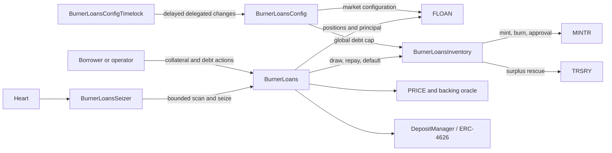
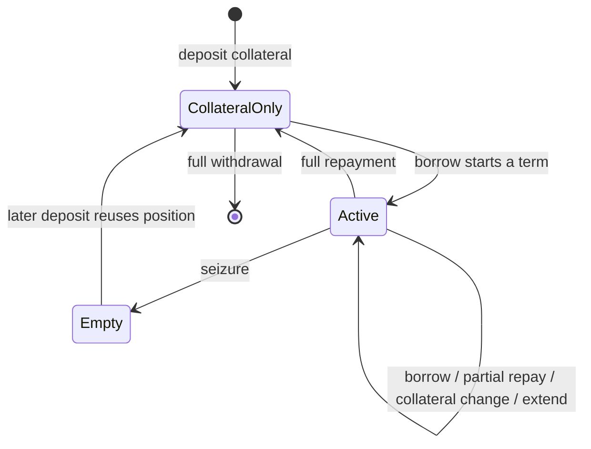
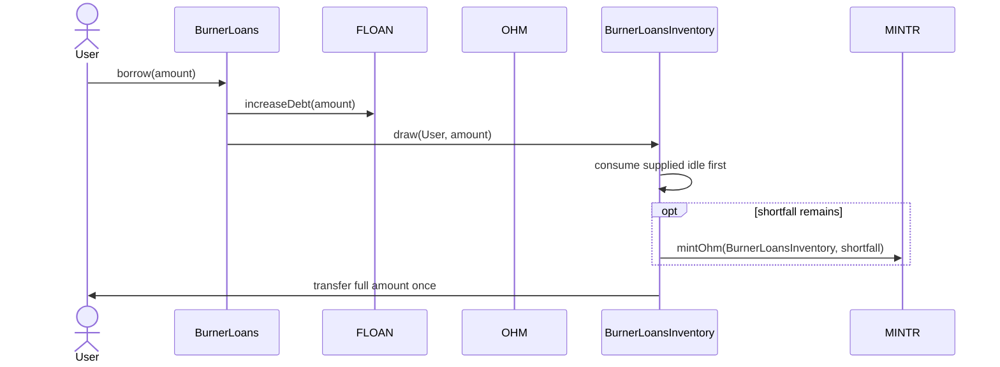
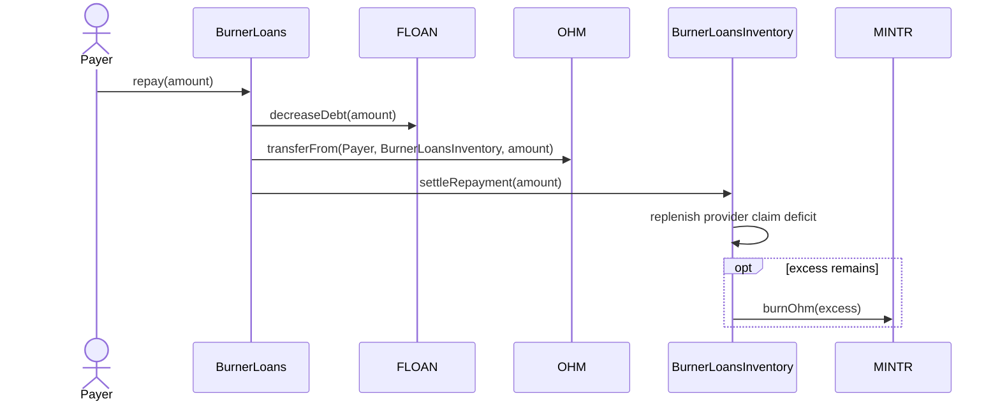

# Burner Loans

## Purpose

`BurnerLoans` is a fixed-term, 0% interest OHM shorting facility. A borrower deposits an approved
collateral asset, draws OHM, and later repays OHM. The draw may use protocol-supplied OHM, newly
minted OHM, or both. If a position matures or becomes unhealthy, its collateral is settled to
`TRSRY` and its principal is recorded as defaulted.

The generic [FLOAN module](./floan.md) owns markets, positions, and principal indexes. Burner Loans
adds collateral custody, pricing, fees, health rules, funding inventory, and automated seizure.

## Architecture



| Component                                             | Responsibility                                                                |
| ----------------------------------------------------- | ----------------------------------------------------------------------------- |
| `BurnerLoans`                                         | User lifecycle, previews, health, custody, fees, and seizure                  |
| [`BurnerLoansInventory`](./burner_loans_inventory.md) | OHM custody, provider claim, global cap, principal total, and MINTR authority |
| `BurnerLoansConfig`                                   | FLOAN market creation/configuration and global debt-cap administration        |
| `BurnerLoansConfigTimelock`                           | Optional timelocked implementation of Config's config-operator role           |
| `BurnerLoansSeizer`                                   | Gas-bounded, fail-open periodic seizure                                       |
| `FLOAN`                                               | Generic fixed-term market, position, active-index, and aggregate state        |
| `DepositManager`                                      | Collateral custody and optional ERC-4626 routing                              |

Burner Loans requires exactly one FLOAN market for its facility, collateral token, and OHM pair.
FLOAN itself permits more than one matching market. A missing or ambiguous Burner Loans lookup
fails closed.

Burner Loans is deployed before Burner Loans Inventory. `BurnerLoansInventory` permanently binds
that Burner Loans address as its facility, while Burner Loans stores a replaceable
`BurnerLoansInventory` pointer. Burner Loans Config is deployed without a facility link. After all
three policies are active, admin links Config to Burner Loans, Burner Loans Inventory to Config,
and Burner Loans to both policies while each destination contract is disabled. Enablement
revalidates the complete relationship before Burner Loans becomes operational.

## Position Lifecycle

Burner Loans uses the first FLOAN position for a borrower and market. FLOAN remains generic and can
store multiple positions. A completed Burner Loans debt episode reuses its position ID.



| Action              | Effect                                                    | Main condition                                                 |
| ------------------- | --------------------------------------------------------- | -------------------------------------------------------------- |
| Deposit collateral  | Adds DepositManager credit to the position                | Burner Loans and asset originations are enabled                |
| Borrow              | Adds principal and draws OHM from Burner Loans Inventory   | Position is healthy, within both caps, and not matured         |
| Repay               | Reduces principal and settles OHM into Burner Loans Inventory | Not in the borrow block; no price read required                |
| Withdraw collateral | Removes credit and returns custody assets                 | Remaining debt stays healthy                                   |
| Extend              | Advances the prior maturity by whole terms                | Position stays healthy and maturity remains within its horizon |
| Seize               | Defaults all principal and removes all collateral         | Position is matured or below the health boundary               |
| Harvest yield       | Sends custody surplus to `TRSRY`                          | Custody remains solvent                                        |

Full repayment and seizure clear the episode's financial fields and active indexes. The position
ID remains reusable. `PositionClosed` and `PositionDefaulted` events contain the pre-clear snapshot;
market cumulative-default accounting preserves defaulted principal.

## Operating States

Asset `originationsEnabled` is an exit-enabled pause. The Burner Loans global `enabled` flag is a
strict pause.

| Burner Loans action | Asset originations enabled | Asset originations disabled | Burner Loans disabled |
| ------------------- | -------------------------- | --------------------------- | --------------------- |
| Deposit collateral  | Allowed                    | Blocked                     | Blocked               |
| Borrow              | Allowed                    | Blocked                     | Blocked               |
| Extend              | Allowed                    | Blocked                     | Blocked               |
| Repay               | Allowed                    | Allowed                     | Blocked               |
| Withdraw collateral | Allowed                    | Allowed                     | Blocked               |
| Seize               | Allowed                    | Allowed                     | Blocked               |
| Harvest yield       | Allowed                    | Allowed                     | Blocked               |

Burner Loans Inventory has only its global enabled state; Burner Loans owns origination control at
the asset level. See
[Burner Loans Inventory operating states](./burner_loans_inventory.md#operating-states) for its
complete action table and manual MINTR synchronization behavior.

## Health, Pricing, And Fees

Health is WAD-scaled; `1e18` is the seizure boundary.

```text
marketRequirementUsd = ceil(debtValueUsd * minCollateralRatioBps / 10_000)
backingRequirementUsd = ceil(debtBackingValueUsd * backingMultiplierBps / 10_000)
requiredCollateralUsd = max(marketRequirementUsd, backingRequirementUsd)
riskAdjustedCollateralUsd = collateralValueUsd * collateralFactorBps / 10_000
healthFactor = floor(riskAdjustedCollateralUsd * 1e18 / requiredCollateralUsd)
```

`debtBackingValueUsd` is the backing value of the outstanding OHM debt.

| State                      | Borrow or withdraw                | Seizure                       |
| -------------------------- | --------------------------------- | ----------------------------- |
| No debt                    | Debt-free health is max `uint256` | Not seizable                  |
| `healthFactor > 1e18`      | Allowed if other checks pass      | Not health-seizable           |
| `healthFactor == 1e18`     | Exact boundary is allowed         | Not health-seizable           |
| `healthFactor < 1e18`      | New risk is blocked               | Seizable with current prices  |
| Maturity reached with debt | New risk is blocked               | Seizable without a price read |

PRICE values use `PRICE.decimals()`. OHM and collateral amounts use their token scales. The
backing oracle returns 18-decimal USD per OHM. Requirements and transferred fees round up; health
and intermediate rate components round down.

Borrow and extension fees are paid in the collateral asset directly to `TRSRY`. They do not reduce
credited collateral. The fee curve uses pre-action market utilization; the global cap is not a fee
input.

```text
utilization = ceil(marketPrincipalDue * 1e18 / marketPrincipalCap)

before kink:
feeRate = baseFee + floor(utilization * preKinkSlope / 10_000)

after kink:
feeRate = baseFee
        + floor(kink * preKinkSlope / 10_000)
        + floor((utilization - kink) * postKinkSlope / 10_000)
```

The final fee rounds up so a non-zero rate cannot disappear through token-decimal truncation.
`maxFee` protects execution against a fee above the caller's accepted amount.

## Burner Loans Inventory Accounting

FLOAN owns each market cap. Burner Loans Inventory owns the facility-wide cap, OHM funding, provider
claims, and MINTR authority. Burner Loans changes the FLOAN and Burner Loans Inventory principal
ledgers in one transaction. See [Burner Loans Inventory](./burner_loans_inventory.md) for the
formulas, state transitions, invariants, and failure behavior.

## Funding And Settlement Flows





FLOAN, Burner Loans Inventory, collateral fees, and token transfers normally change atomically.
Repayment is deliberately resilient to a MINTR burn failure: principal settlement remains valid,
the unburned OHM becomes ordinary surplus, and `OhmBurnFailed` reports the failure. A failed
approval restoration is also conservative: the principal transition remains valid, the shortfall
is reported by event, and an admin may reconcile it later.

## Custody And Token Assumptions

DepositManager may route collateral into an ERC-4626 vault. FLOAN records withdrawable collateral
credit, not vault shares. Vault yield does not increase borrower health; `harvestYield` sends only
custody surplus to `TRSRY`.

| Stage                       | Enforcement or assumption                                                           |
| --------------------------- | ----------------------------------------------------------------------------------- |
| Asset admission             | Governance verifies exact-transfer collateral and any configured vault path         |
| Collateral deposit          | Safe transfer plus DepositManager exact-receipt accounting                          |
| Provider supply / draw      | Trusted OHM; SafeTransferLib without repeated balance-delta reads                   |
| Repayment settlement        | Safe transfer plus exact Burner Loans Inventory balance increase                    |
| Fees and outgoing transfers | Safe transfer; exact behavior follows the admitted-token assumption                 |
| Token callbacks             | Token-touching lifecycle and Burner Loans Inventory functions use transient guards  |

Fee-on-transfer, rebasing, and otherwise balance-changing collateral is unsupported. ERC-20 has no
reliable capability flag, and an admission-time transfer probe can be bypassed by amount-, address-,
or upgrade-dependent behavior. Asset admission is therefore a governance-reviewed invariant.

## Seizure Automation

Seizure clears the full debt episode, routes the capped ordinary-keeper reward, sends remaining
collateral to `TRSRY`, and records the default in FLOAN and Burner Loans Inventory atomically.

| Caller                       | Required role                                | Product reward |
| ---------------------------- | -------------------------------------------- | -------------- |
| Ordinary direct keeper       | None                                         | Configured cap |
| Heart caller acting directly | `heart`                                      | None           |
| `BurnerLoansSeizer`          | `burner_loans_seizer` on the seizer contract | None           |

Heart needs `heart` to call `BurnerLoansSeizer.execute`. The seizer contract separately needs
`burner_loans_seizer` when it calls Burner Loans. Either protocol role suppresses the product
keeper reward on a direct seizure call.

The seizer bounds both its scan and its complete self-execution gas. A scan or seizure failure does
not advance its cursor and does not fail Heart. The seizer does not reconcile MINTR approval. If
automatic restoration does not occur, `burner_loans_admin` must call `syncMintApproval`.

## Configuration And Authority

| Change                                               | Authority                         | Path                                |
| ---------------------------------------------------- | --------------------------------- | ----------------------------------- |
| Add a collateral market                              | `admin`                           | Direct Config call                  |
| Set global cap                                       | `admin`                           | Config calls Burner Loans Inventory |
| Set market cap, risk, fee, or asset originations     | `admin` or config operator        | Config / optional ConfigTimelock    |
| Set backing oracle                                   | `admin`                           | Direct Burner Loans call            |
| Set Burner Loans Inventory while Burner Loans paused | `admin`                           | Direct Burner Loans call            |
| Set policy links while destination policy is paused  | `admin`                           | Direct destination-policy setter    |
| Sync MINTR approval                                  | `burner_loans_admin`              | Direct Burner Loans Inventory call  |
| Supply / withdraw protocol OHM                       | `burner_loans_inventory_provider` | Direct Burner Loans Inventory call  |

Config creates one market per collateral/OHM pair under its currently bound Burner Loans facility.
The facility link may change only while Config is disabled. Burner Loans-specific fields use
`bytes16("Burner Loans v1")`; standard fixed-term fields remain typed in FLOAN. Config resolves
Burner Loans Inventory through Burner Loans, so it follows an approved Burner Loans Inventory
pointer change without maintaining a second link. Burner Loans Inventory's facility is immutable
in v1.

## Deployment And Activation

The order below establishes every link through an active-policy check without introducing a
circular enablement dependency.

1. Install the required FLOAN, MINTR, PRICE, ROLES, and TRSRY modules.
2. Deploy `BurnerLoans(...)`. Its Burner Loans Inventory and Config pointers are initially zero, so
   enabling it will revert.
3. Deploy `BurnerLoansInventory(kernel, ohm, facility = BurnerLoans)`. The immutable facility may
   be inactive at construction, but must already be deployed and belong to the same Kernel.
4. Deploy `BurnerLoansConfig(kernel, ohm)` without a facility link. If delegated configuration is
   required, deploy ConfigTimelock with that Config address.
5. Activate DepositManager, Burner Loans, Burner Loans Inventory, Config, any deployed
   ConfigTimelock, and the other required policies. Link setters require their policy arguments to
   be active in the same Kernel.
6. Grant `admin`, `burner_loans_admin`, `burner_loans_inventory_provider`,
   `burner_loans_seizer`, `heart`, and DepositManager operator permissions to the intended
   addresses and policies.
7. While the destination policies remain globally disabled, OCG admin calls, in order:
   `Config.setFacility(BurnerLoans)`, `BurnerLoansInventory.setConfigurator(Config)`,
   `BurnerLoans.setInventory(BurnerLoansInventory)`, and
   `BurnerLoans.setConfigurator(Config)`. Each setter validates the relationship it can observe;
   enablement later validates the complete reverse links.
8. Enable DepositManager and Config. Config can enable while Burner Loans and Burner Loans
   Inventory are globally disabled, but both linked policies must remain active and all reverse
   links must agree.
9. Optionally call `Config.setConfigOperator(ConfigTimelock)` and enable ConfigTimelock. The config
   operator does not have to be a policy or implement a timelock, and may remain zero to disable
   delegated execution. When ConfigTimelock is used as the operator, delayed execution additionally
   requires Config to remain enabled and ConfigTimelock to remain the configured operator.
10. Through Config, set the Burner Loans Inventory global cap. Its cap setter remains available
    while Burner Loans Inventory is globally disabled so deployment can reconcile MINTR approval
    before user operations begin.
11. Add each collateral asset and configure its FLOAN market, custody path, PRICE support, cap,
    risk parameters, fee curve, and asset-level originations state.
12. Enable Burner Loans Inventory, then enable Burner Loans last. Burner Loans enablement requires
    active Config and DepositManager policies plus an active, enabled, compatible Burner Loans
    Inventory. Then configure and enable Seizer and other periphery contracts, including seizer
    assets and its execution gas limit.

V1 launches with zero Burner Loans Inventory active principal, supplied idle, and provider claim.
Importing a non-zero live Burner Loans Inventory ledger requires a future migration design. See
[replacing Burner Loans Inventory](./burner_loans_inventory.md#replacement) for the v1 replacement
constraints.

## Preview Semantics

| Preview  | Includes                                                  | Does not guarantee                                                      |
| -------- | --------------------------------------------------------- | ----------------------------------------------------------------------- |
| Deposit  | Expected custody credit and resulting collateral          | Future vault state                                                      |
| Borrow   | Fee, debt, maturity, health, and local capacity           | Caller authorization, token approval, recipient, or `maxFee` acceptance |
| Repay    | Applied repayment, remaining debt, and debt-free sentinel | Payer balance or approval                                               |
| Withdraw | Return token/amount, remaining collateral, and health     | Successful future vault redemption                                      |
| Extend   | Fee, resulting maturity, and health                       | Caller token approval or `maxFee` acceptance                            |
| Seize    | Debt, collateral, reward, and treasury amount             | Unchanged prices or custody at execution                                |
| Harvest  | Current theoretical custody surplus                       | Exact output after vault rounding                                       |

Previews enforce deterministic local eligibility. Execution return values and events remain
authoritative.
