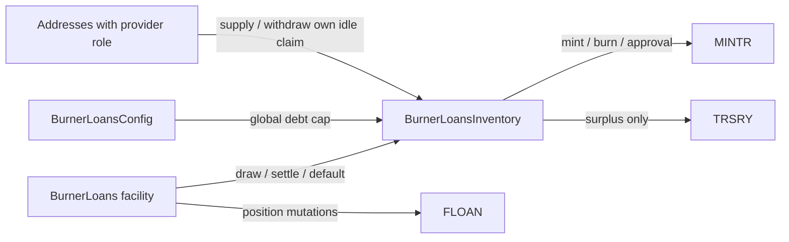

# Burner Loans Inventory

## Purpose

`BurnerLoansInventory` is the OHM funding and aggregate-principal policy for
[Burner Loans](./burner_loans.md). It lets protocol-owned OHM fund loans before MINTR creates new
OHM, replenishes providers' aggregate claim from repayments, and keeps finite MINTR approval
aligned with the global active-principal cap.

Burner Loans Inventory is intentionally not a loan ledger. It does not read or write
[FLOAN](./floan.md), does not select markets, and does not know Burner Loans lifecycle rules. Its
exact, immutable facility reports atomic principal deltas in the same transaction as each FLOAN
mutation.

## Relationships



| Principal | Binding                                | Authority                                            |
| --------- | -------------------------------------- | ---------------------------------------------------- |
| Provider  | `burner_loans_inventory_provider` role | Supply OHM and withdraw only its own available claim |
| Config    | `setConfigurator` while disabled       | Set the global cap                                   |
| Facility  | Immutable constructor argument         | Draw, repayment settlement, and default accounting   |
| TRSRY     | Current module dependency              | Receives only unaccounted OHM surplus                |

The facility must be deployed in Burner Loans Inventory's Kernel at construction and active when
Burner Loans Inventory is enabled. `setConfigurator` requires an active same-Kernel Config policy
that already points to the immutable facility. The configurator link can be replaced while Burner
Loans Inventory is disabled. Burner Loans Inventory authenticates both exact addresses, not broad
roles. Revoking a provider role suspends that address's supply and withdrawal access without
erasing its claim; restoring the role restores access to whatever idle liquidity is then available.

## State

| Value                        | Meaning                                                |
| ---------------------------- | ------------------------------------------------------ |
| `globalDebtCapOhm`           | Maximum aggregate active principal                     |
| `activePrincipalOhm`         | Principal reported by the fixed facility               |
| `suppliedOhm`                | All providers' aggregate outstanding claim             |
| `providerClaimOhm(provider)` | One provider's outstanding claim                       |
| `suppliedIdleOhm`            | Claim-backed OHM currently held and available          |
| actual MINTR approval        | Amount MINTR may still mint for Burner Loans Inventory |

The claim can exceed idle OHM while supplied funds are lent. A default reduces active principal
but does not reduce the provider claim or create idle OHM. Repayments later restore the claim's
idle backing before any excess is burned.

## Capacity And Invariants

```text
remainingCapOhm = globalDebtCapOhm - activePrincipalOhm
desiredApproval = remainingCapOhm > suppliedIdleOhm
    ? remainingCapOhm - suppliedIdleOhm
    : 0

availableCapacity = min(
    suppliedIdleOhm + actualApproval,
    remainingCapOhm
)
```

| Invariant                                                                           | Purpose                                            |
| ----------------------------------------------------------------------------------- | -------------------------------------------------- |
| `activePrincipalOhm <= globalDebtCapOhm`                                            | Global cap cannot be bypassed                      |
| `actualApproval <= desiredApproval` after sync or a normal transition               | Idle OHM and mint authority are not double-counted |
| `suppliedIdleOhm <= suppliedOhm`                                                    | Idle provider funds do not exceed the claim        |
| `suppliedIdleOhm <= OHM.balanceOf(BurnerLoansInventory)`                            | Accounted idle funds are physically held           |
| Burner Loans Inventory and FLOAN active principal remain equal after facility calls | Funding and loan ledgers change atomically         |

`suppliedIdleOhm` may exceed the global cap because the cap limits active debt, not custody. The
second capacity bound makes the excess unavailable for draws.

## State Transitions

| Action       | Active principal | Supplied idle              | Claim | Token and approval effect                                                 |
| ------------ | ---------------- | -------------------------- | ----- | ------------------------------------------------------------------------- |
| Supply `x`   | —                | `+x`                       | `+x`  | Safe transfer; increase caller claim; reduce unsafe approval              |
| Withdraw `x` | —                | `-x`                       | `-x`  | Best-effort approval restoration; transfer OHM                            |
| Draw `x`     | `+x`             | Consume idle first         | —     | Mint shortfall to Burner Loans Inventory; transfer full `x` once          |
| Repay `x`    | `-x`             | Refill claim deficit first | —     | Burn only the remainder; a failed burn remains ordinary surplus           |
| Default `x`  | `-x`             | —                          | —     | Best-effort approval restoration                                          |
| Cap change   | —                | —                          | —     | Exactly reconcile approval; revert the cap change if reconciliation fails |

The immutable OHM token is assumed to be a standard, non-fee-on-transfer token. Supply and draw use
`SafeTransferLib` and therefore revert on a failed ERC20 transfer, but do not measure an exact
balance delta. Before settlement, Burner Loans snapshots Burner Loans Inventory's raw balance
around its safe transfer from the payer and rejects any inexact delta. Burner Loans Inventory then
performs an aggregate balance-sufficiency check before applying the authenticated settlement
amount. Direct donations are not accounted as supplied OHM, do not create capacity, and may be
burned through MINTR or transferred to `TRSRY` as surplus.

## Operating States

| Action                         | Globally enabled | Globally disabled |
| ------------------------------ | ---------------- | ----------------- |
| Supply                         | Allowed          | Blocked           |
| Provider withdrawal            | Allowed          | Blocked           |
| Draw                           | Allowed          | Blocked           |
| Repayment / default            | Allowed          | Blocked           |
| Admin approval sync            | Allowed          | Blocked           |
| Burn or rescue surplus         | Allowed          | Blocked           |
| Configurator global-cap change | Allowed          | Allowed           |

Global disable is a strict emergency pause for funding, lifecycle accounting, provider exits, and
recovery actions. The Config-authorized global-cap setter remains available so deployment or
governance can reconcile the cap and MINTR approval while Burner Loans Inventory is disabled.
Burner Loans owns asset-level origination control; Burner Loans Inventory has no separate
origination flag. Burner Loans Inventory can be enabled without a configurator for staged wiring,
but Burner Loans and Config cannot enable until all reverse links agree.

## MINTR Failure Semantics

Approval reductions are safety-critical. A failure reverts the transition. Approval increases only
restore capacity. A failure leaves less capacity than governance permits and emits
`ApprovalRestorationFailed` with the amount and MINTR revert data. The failure does not undo a
provider withdrawal, repayment, or default. In both cases, `burner_loans_admin` may call
`syncMintApproval` while Burner Loans Inventory is enabled to restore capacity.

A repayment burn failure also does not undo settlement. `OhmBurnFailed` reports the failed amount,
which remains on Burner Loans Inventory as ordinary surplus. An enabled admin can later burn all
current surplus through MINTR or transfer it to `TRSRY`.

Dependency configuration accepts only MINTR v1 bound to Burner Loans Inventory's immutable OHM
token. An initial configuration or MINTR upgrade with a different token reverts before changing the
prior burn allowance or mint-approval accounting.

| Recovery action    | Caller role          | Behavior                                                 |
| ------------------ | -------------------- | -------------------------------------------------------- |
| `syncMintApproval` | `burner_loans_admin` | Reconcile approval exactly; may restore unrecorded drift |
| `burnSurplus`      | `admin`              | Burn all ordinary surplus through MINTR                  |
| `rescueSurplus`    | `admin`              | Transfer all ordinary surplus to `TRSRY`                 |

Synchronization cannot raise approval above the current desired amount. A manual approval change
is not persistent configuration: ordinary withdrawals, repayments, defaults, and seizures may
adjust approval back toward the current desired amount as principal and supplied-idle balances
change. Emergency operators must use the global pause or a debt-cap change when the reduction must
remain enforced.

## Deployment

See [Burner Loans deployment and activation](./burner_loans.md#deployment-and-activation) for the
complete system order.

## Replacement

Burner Loans can point to another compatible, active Burner Loans Inventory only while Burner Loans
is globally disabled. The setter does not require the replacement to be enabled, but Burner Loans
cannot be enabled until it is enabled and all reverse links agree. Before re-enabling Burner Loans,
governance must ensure either that the outgoing Burner Loans Inventory has no active principal or
that an accounting migration or per-cohort routing mechanism keeps its outstanding positions
serviceable. V1 does not enforce this operational requirement or move live accounting and custody.
Governance must also explicitly manage the outgoing Burner Loans Inventory's remaining provider
claims, custody, and principal accounting.
