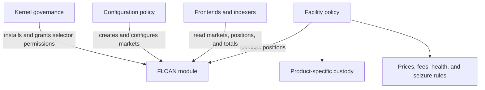

# FLOAN Fixed-Term Loan Module

## Purpose

`FLOAN` is a dependency-free Default Framework module for fixed-term loan markets and positions.
It stores loan state and enforces accounting invariants; a product-specific policy supplies custody,
pricing, fees, authorization, repayment ordering, and seizure rules.

FLOAN is intentionally opinionated about fixed-term debt. Continuously accruing, open-ended loans
need interest indexes and lifecycle semantics that do not belong in this module.

## Architecture



A facility is not a separate stored object. It is the policy address assigned to one or more
markets. That address is the sole authority permitted to mutate positions in those markets and is
also an accounting boundary across them. A separate `manager` creates and changes market
configuration. This lets an opinionated configuration policy administer a lifecycle policy's
markets without either policy depending on the other.

## Markets

Callers create and import markets with the fields they control:

```solidity
struct MarketInput {
    address collateralToken;
    address debtToken;
    address manager;
    address facility;
    bytes16 configId;
    uint128 principalCap;
    uint48 termLength;
    uint48 maxMaturityHorizon;
    uint16 collateralFactorBps;
    uint16 minCollateralRatioBps;
    uint16 baseFeeBps;
}
```

FLOAN reads both token decimal counts and stores the resulting complete market:

```solidity
struct Market {
    address collateralToken;
    address debtToken;
    address manager;
    address facility;
    bytes16 configId;
    uint128 principalCap;
    uint48 termLength;
    uint48 maxMaturityHorizon;
    uint16 collateralFactorBps;
    uint16 minCollateralRatioBps;
    uint16 baseFeeBps;
    uint8 collateralDecimals;
    uint8 debtDecimals;
    bool originationsEnabled;
}
```

`createMarket` always enables originations. `importMarket` accepts the original origination state
separately so a migration can preserve a disabled market while still sharing the same typed input
and validation path. Neither function trusts caller-supplied token decimals.

Every market has a globally unique `marketId`. FLOAN also indexes all market IDs by
`(facility, collateralToken, debtToken)`, but that tuple is not unique: a facility may operate
multiple markets for the same token pair with different terms or product-specific configuration.
`getMarketIds` returns every matching ID, so products can either select a particular market ID or
impose a stricter cardinality rule without adding a second market-reference field.

Common fixed-term terms are typed:

- `principalCap` limits outstanding principal in this market.
- `termLength` is always non-zero.
- `maxMaturityHorizon` caps an extension relative to the current timestamp;
  `type(uint48).max` allows an unlimited horizon.
- `collateralFactorBps`, `minCollateralRatioBps`, and `baseFeeBps` cover terms shared by fixed-term
  products. Zero permits an uncollateralized or fee-free product where appropriate.
- Token decimal counts are cached for scale-aware servicing policies.
- Disabling originations blocks collateral additions, new principal, deferred-interest accrual, and
  extensions but not repayment, collateral withdrawals, or other exposure-reducing work.

### Origination State

`originationsEnabled` is an exposure-control flag, not a complete market pause. Disabling it stops
actions that create or expand a loan commitment while retaining the actions needed to repay, close,
default, or otherwise reduce an existing position.

| Action                          | Originations enabled | Originations disabled                              |
| ------------------------------- | -------------------- | -------------------------------------------------- |
| `createPosition`                | Allowed              | Reverts with `FLOAN_OriginationsDisabled`          |
| `addCollateral`                 | Allowed              | Reverts with `FLOAN_OriginationsDisabled`          |
| `removeCollateral`              | Allowed              | Allowed                                            |
| `increaseDebt` (principal)      | Allowed              | Reverts with `FLOAN_OriginationsDisabled`          |
| `increaseDebt` (interest only)  | Allowed              | Reverts with `FLOAN_OriginationsDisabled`          |
| `decreaseDebt`                  | Allowed              | Allowed                                            |
| `extendMaturity`                | Allowed              | Reverts with `FLOAN_OriginationsDisabled`          |
| `defaultPosition`               | Allowed              | Allowed                                            |
| Market configuration setters    | Allowed              | Allowed; the flag does not remove manager authority |
| `importMarket` / `importPosition` | Allowed            | Allowed; migrations preserve or reconstruct state |

The facility remains responsible for product-level health checks on collateral withdrawal and for
deciding when repayment or default is appropriate. FLOAN only enforces the state transitions shown
above.

`configId` identifies the schema of immutable-typed, product-specific `configData`. Burner Loans
uses `bytes16("Burner Loans v1")`; its backing multiplier, utilization-curve terms, and keeper
reward settings remain in the encoded extension because they are not generic fixed-term terms.

FLOAN maintains current credited collateral, principal, and deferred-interest totals per market.
The collateral total is denominated in the market collateral token and exposed through
`getMarketCollateral`. It uses `uint256` because the sum of several `uint128` position balances may
exceed `uint128` even though each individual position does not. Market aggregate getters return
zero for an ID that has not been created; callers can compare the ID against `getMarketCount()` when
they need to distinguish a missing market from an empty one.

Collection getters likewise return empty arrays, and active-borrower count returns zero, for a
market ID that has not been created. Direct market/position record getters and indexed element
access still revert for missing records or indexes.

Principal accounting additionally maintains totals:

- per market, for the market principal cap and utilization;
- per facility and debt token, for product-wide exposure across several collateral markets.

Both obligations are denominated in `debtToken`. Principal caps apply only to principal; deferred
interest is exposed separately through `getMarketInterestDue`. Facility-wide interest is derived
off-chain because it is not used for an on-chain cap or servicing decision.

The facility total deliberately includes a debt-token dimension. Amounts from different tokens or
decimal scales cannot be summed meaningfully. Product-specific caps, such as Burner Loans' global
OHM debt cap, remain in the facility policy and are checked against this aggregate. FLOAN does not
store a protocol-wide debt-token total because it is not needed for servicing or cap enforcement;
indexers can sum market or facility totals when protocol-wide reporting is required.

## Positions

Positions have globally unique IDs:

```solidity
struct Position {
    address borrower;
    uint32 marketId;
    uint128 collateral;
    uint128 principalDrawn;
    uint128 principalDue;
    uint128 interestDue;
    uint48 maturity;
    uint32 lastBorrowBlock;
    bool defaulted;
}
```

`principalDue` is the principal currently owed. `principalDrawn` is cumulative principal for the
current debt episode and supports origination/default reporting. It does not decrease on partial
repayment. Once both principal and interest reach zero, episode values are cleared and a later draw
starts a new episode. `interestDue` is always denominated in the market debt token and supports
products that defer fixed interest until repayment. The first increase in an episode requires
principal, but an active position may accrue interest without increasing principal. Up-front or
collateral-denominated fees need not use it and remain product-level revenue accounting.

Amounts and mutation parameters use `uint128`, which is ample for token base units and enables
storage packing. Servicing policies should widen values to `uint256` before multiplication or
`FullMath` calculations. Timestamps use `uint48`; the latest borrow block uses `uint32`.

FLOAN permits multiple positions for the same borrower in the same market. It keeps indexes by
market, borrower, and market/borrower pair. Facilities create positions explicitly through
`createPosition`. A product such as Burner Loans that deliberately imposes one position per pair
enforces that rule in its own policy by reading the pair count and indexed position ID. FLOAN does
not designate a canonical or default position.

Active borrower membership is derived from active positions. Closing one position does not remove
a borrower while another position in the same market still owes principal or interest. FLOAN does
not store product-specific statuses such as healthy, matured, or seized; servicing policies derive
those states from debt, maturity, prices, and their own rules.

## Authority And Migration

Kernel selector permission and market authority are both required:

- the market `manager` may change configuration, originations, the manager, or the facility; and
- the market `facility` may create and mutate positions.

Rotating a facility transfers position-record authority and moves the market's outstanding
principal between facility aggregates. Market interest and default history remain keyed by market
ID and therefore need no transfer. Rotation does not transfer collateral, approvals, receipt tokens,
or other external custody. Governance must coordinate those resources atomically or first reduce
the market to zero exposure. A malicious manager can appoint a malicious facility, so manager
assignment and facility rotation are governance-critical actions.

FLOAN itself is upgradeable through the Kernel like other modules. Keeping custody outside the
module avoids a module upgrade or facility rotation automatically gaining control of every
product's assets; each product defines and secures its own custody boundary.

Migration is an explicit, selector-permissioned operation. `importMarket` and `importPosition`
accept only the next contiguous ID, so a replacement ledger can preserve every original numeric
market and position reference without supporting sparse existence state. Markets and positions
must therefore be imported in ascending ID order. Position imports rebuild borrower/market
indexes, active principal and interest totals, active-borrower membership, and defaulted-principal
totals from the imported record; callers do not inject independent aggregate values. The import
validates canonical active, closed, and defaulted position shapes and still enforces the imported
market's principal cap. Governance should grant these selectors only to a temporary migration
policy and remove or deactivate that policy once reconciliation is complete.

## Responsibilities

FLOAN provides:

- typed market creation and configuration;
- dedicated setters for principal cap, standard risk terms, base fee, opaque configuration,
  origination state, manager, and facility;
- manager and facility authorization layered on Kernel permissions;
- per-market principal and interest totals, plus facility-and-debt-token principal totals;
- globally unique positions and multiple-position indexes;
- collateral, principal, fixed interest, maturity, and latest-borrow-block accounting; and
- active-borrower membership and debt-episode cleanup.

The module implements ERC-165 discovery for `IFLOANv1`, `IERC165`, and `IVersioned`.

The product policy remains responsible for:

- collateral custody and debt-token minting or transfers;
- oracle reads and decimal-safe economic calculations;
- fee timing, denomination, collection, and recipient;
- health, repayment ordering, liquidation, seizure, and rollover eligibility;
- borrower and operator authorization; and
- product-wide caps and other rules spanning markets.

## Example Uses

### Burner Loans

[Burner Loans](./burner_loans.md) uses one FLOAN market per collateral/OHM pair. Its lifecycle
policy is the facility and custodian. `BurnerLoansConfig` independently manages FLOAN markets for
that facility and refuses to create a second matching market. Burner Loans requires the FLOAN
tuple index to contain exactly one market and fails closed if it is ambiguous. FLOAN stores the
ledger and exposes aggregate facility OHM principal; Burner Loans owns and enforces its global OHM
cap.

### Cooler V1-style loans

A Cooler V1-style facility could create several loans per borrower and market, record fixed
repayment-time interest in `interestDue`, and custody collateral in product-specific loan
contracts. Its own policy would define repayment and default ordering.

### Deposit Redemption Vault

A future Deposit Redemption Vault could represent each redemption advance as fixed-term principal
and retain claim settlement and custody in its facility policy. FLOAN could replace duplicated loan
records and indexes without requiring the current vault implementation to be retrofitted.

Full position arrays are primarily off-chain read surfaces. State-changing automation should use
bounded input sets rather than copying unbounded indexes into memory.
