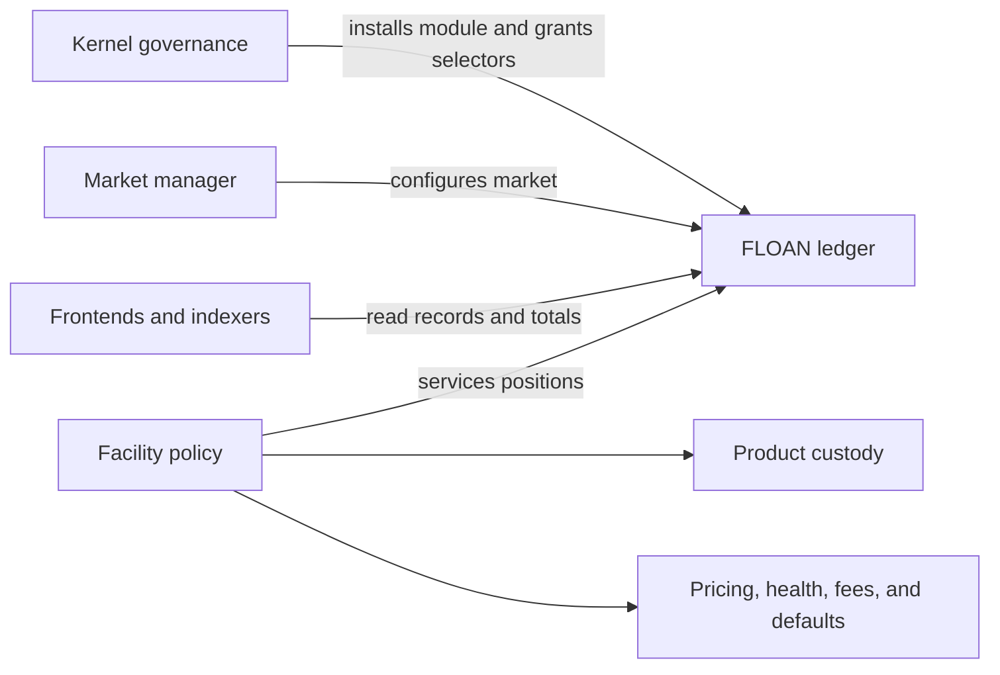
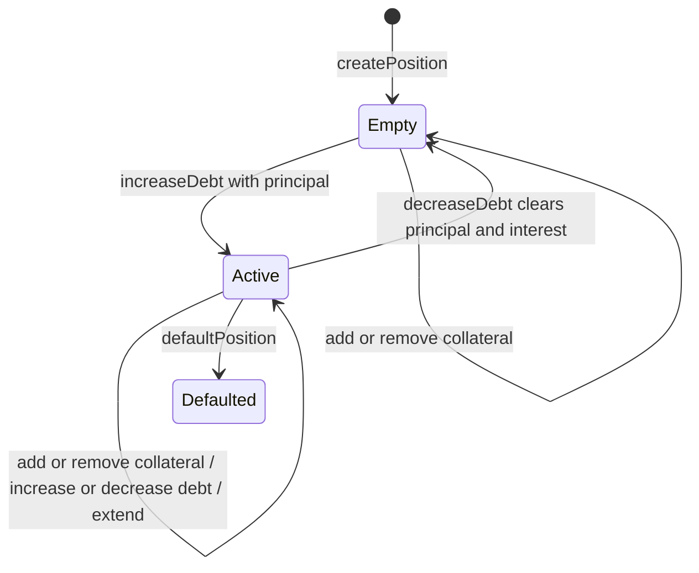

# FLOAN Fixed-Term Loan Module

## Purpose

`FLOAN` is a dependency-free Default Framework module that stores fixed-term loan markets and
positions. It enforces ledger invariants; product policies supply custody, pricing, authorization,
health checks, repayment ordering, and default rules.

FLOAN is deliberately opinionated about fixed-term debt. Continuously accruing, open-ended loans
need interest indexes and lifecycle rules that do not belong in this module.

## Architecture

A facility is the policy assigned to service one or more markets; it is not a separate stored
object. A market manager controls configuration. Separating these roles lets an administration
policy configure markets without either policy depending on the other.

| Layer           | Owns                                                        | Does not own                                     |
| --------------- | ----------------------------------------------------------- | ------------------------------------------------ |
| FLOAN           | Markets, positions, indexes, caps, and aggregate accounting | Tokens, prices, health, or user authorization    |
| Market manager  | Market creation and configuration                           | Position servicing or custody                    |
| Facility        | Position lifecycle and product rules                        | Kernel permissions or another facility's markets |
| Product custody | Collateral and debt-token movement                          | FLOAN records                                    |

FLOAN records token-denominated amounts but never transfers tokens. Each facility is responsible
for defining supported token behavior, using safe transfers, and protecting callback-capable token
interactions. Burner Loans, for example, admits only exact-transfer collateral and enforces receipt
through DepositManager.

Every mutation requires the relevant Kernel selector permission. After creation, configuration
also requires the current manager and position servicing requires the current facility. Migration
selectors are intended for a temporary, separately permissioned policy.

## Markets

Each market defines one collateral token, one debt token, its authorities, and its fixed-term
parameters.

| Field group | Fields                                         | Meaning                                          |
| ----------- | ---------------------------------------------- | ------------------------------------------------ |
| Identity    | `collateralToken`, `debtToken`, `configId`     | Token pair and schema for product-specific data  |
| Authority   | `manager`, `facility`                          | Configuration and servicing authority            |
| Capacity    | `principalCap`                                 | Maximum live principal in debt-token units       |
| Term        | `termLength`, `maxMaturityHorizon`             | Standard term and furthest permitted extension   |
| Risk        | `collateralFactorBps`, `minCollateralRatioBps` | Generic collateral parameters                    |
| Fee         | `baseFeeBps`                                   | Generic fixed fee component; zero is fee-free    |
| Derived     | token decimals, `originationsEnabled`          | Cached scales and exposure-control state         |
| Extension   | `configData`                                   | Product data interpreted according to `configId` |

`termLength` is always non-zero. `type(uint48).max` permits an unlimited maturity horizon. FLOAN
reads token decimals when a market is created or imported rather than trusting caller-supplied
values.

Market IDs are globally unique and sequential. The tuple
`(facility, collateralToken, debtToken)` is an index, not an identity: FLOAN permits multiple
matching markets with different terms or product configuration. `getMarketIds` returns all
matches, leaving products free to select one or enforce stricter cardinality.

### Origination State

`originationsEnabled` is an exposure-control flag, not a complete market pause.

| Action                                  | Enabled | Disabled |
| --------------------------------------- | ------- | -------- |
| Create position                         | Allowed | Reverts  |
| Add collateral                          | Allowed | Reverts  |
| Increase principal or deferred interest | Allowed | Reverts  |
| Extend maturity                         | Allowed | Reverts  |
| Remove collateral                       | Allowed | Allowed  |
| Decrease debt                           | Allowed | Allowed  |
| Default position                        | Allowed | Allowed  |
| Configure or import                     | Allowed | Allowed  |

This design freezes new commitments while preserving repayment, withdrawal, default, and
migration paths. The facility remains responsible for deciding whether a permitted action is safe.

### Accounting

| Aggregate           | Scope                 | Unit             | Purpose                              |
| ------------------- | --------------------- | ---------------- | ------------------------------------ |
| Collateral          | Market                | Collateral token | Custody reconciliation               |
| Principal due       | Market                | Debt token       | Market cap and utilization           |
| Interest due        | Market                | Debt token       | Deferred-interest reporting          |
| Principal defaulted | Market                | Debt token       | Historical loss reporting            |
| Principal due       | Facility + debt token | Debt token       | Product-wide exposure across markets |

The facility aggregate includes a debt-token dimension because amounts with different tokens or
decimal scales cannot be summed meaningfully. Product-wide caps remain in the facility when they
represent product policy rather than a single market rule.

Aggregate and collection getters return zero or an empty array for an unknown market. Direct
record getters and indexed element access revert for an unknown record or invalid index.

## Positions

Positions use globally unique, sequential IDs. FLOAN supports multiple positions for the same
borrower in the same market and indexes positions by borrower, market, and market/borrower pair.

| Field                         | Meaning                                          |
| ----------------------------- | ------------------------------------------------ |
| `borrower`, `marketId`        | Position identity and ownership context          |
| `collateral`                  | Current credited collateral                      |
| `principalDrawn`              | Cumulative principal in the current debt episode |
| `principalDue`                | Current outstanding principal                    |
| `interestDue`                 | Current deferred interest in the debt token      |
| `maturity`, `lastBorrowBlock` | Fixed-term lifecycle data                        |
| `defaulted`                   | Terminal default marker                          |

`principalDrawn` does not decrease on partial repayment, which preserves origination and default
reporting for the current episode. When both principal and interest reach zero, episode fields are
cleared and a later draw starts a new episode. An active episode may add interest without adding
principal; a new episode must begin with non-zero principal.

FLOAN stores no product-specific `Healthy`, `Matured`, or `Seizable` status. Facilities derive
those conditions from the ledger, prices, and their own rules. A borrower remains in a market's
active-borrower set while any of their positions in that market owes principal or interest.

Individual balances and mutation inputs use `uint128`; facilities should widen values before
multiplication. Timestamps use `uint48`, and `lastBorrowBlock` uses `uint32`.

## Configuration And Migration

| Operation                   | Authority                            | Important constraint                                      |
| --------------------------- | ------------------------------------ | --------------------------------------------------------- |
| Create/import market        | Kernel-permissioned creator          | Standard configuration and sequential IDs must be valid   |
| Configure market            | Current manager                      | Standard configuration must remain valid                  |
| Enable/disable originations | Current manager                      | Controls exposure-increasing actions                      |
| Rotate manager              | Current manager                      | Transfers configuration authority                         |
| Rotate facility             | Current manager                      | Transfers servicing authority and live facility principal |
| Create/mutate position      | Current facility                     | Position must belong to its market                        |
| Import position             | Kernel-permissioned migration policy | IDs must be imported contiguously and in order            |

Facility rotation does not transfer collateral, approvals, receipt tokens, or other external
custody. Governance must coordinate those resources atomically or first reduce exposure to zero.
A malicious manager can appoint a malicious facility, so both authorities are governance-critical.

Migration preserves numeric IDs and reconstructs indexes and aggregates from imported records.
Imports validate market configuration and canonical empty, active, closed, and defaulted position
shapes. A temporary migration policy should lose its selector permissions after reconciliation.

## Product Examples

| Product                           | How it can use FLOAN                                                                                       |
| --------------------------------- | ---------------------------------------------------------------------------------------------------------- |
| [Burner Loans](./burner_loans.md) | One product-selected position per borrower/market, with external custody, pricing, fees, and seizure rules |
| Cooler V1-style loans             | Several fixed-term positions per borrower with deferred interest payable at repayment                      |
| Future Deposit Redemption Vault   | Fixed-term redemption advances while claim settlement and custody remain product-specific                  |

FLOAN implements ERC-165 discovery for `IFLOANv1`, `IERC165`, and `IVersioned`.
