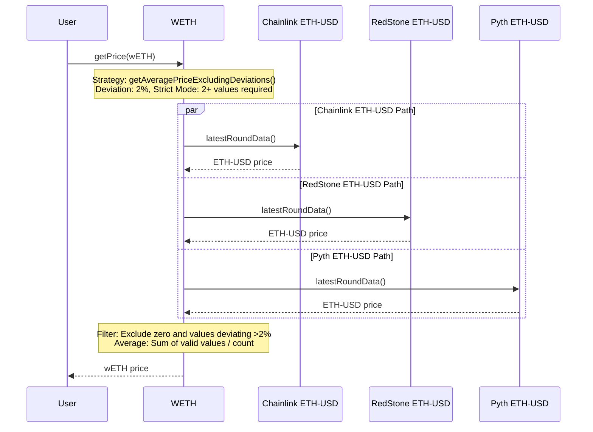
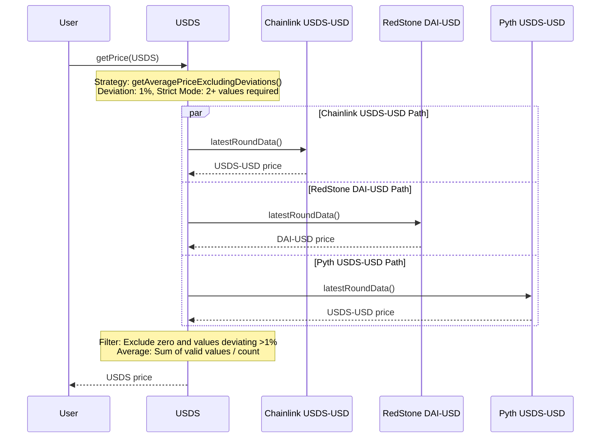
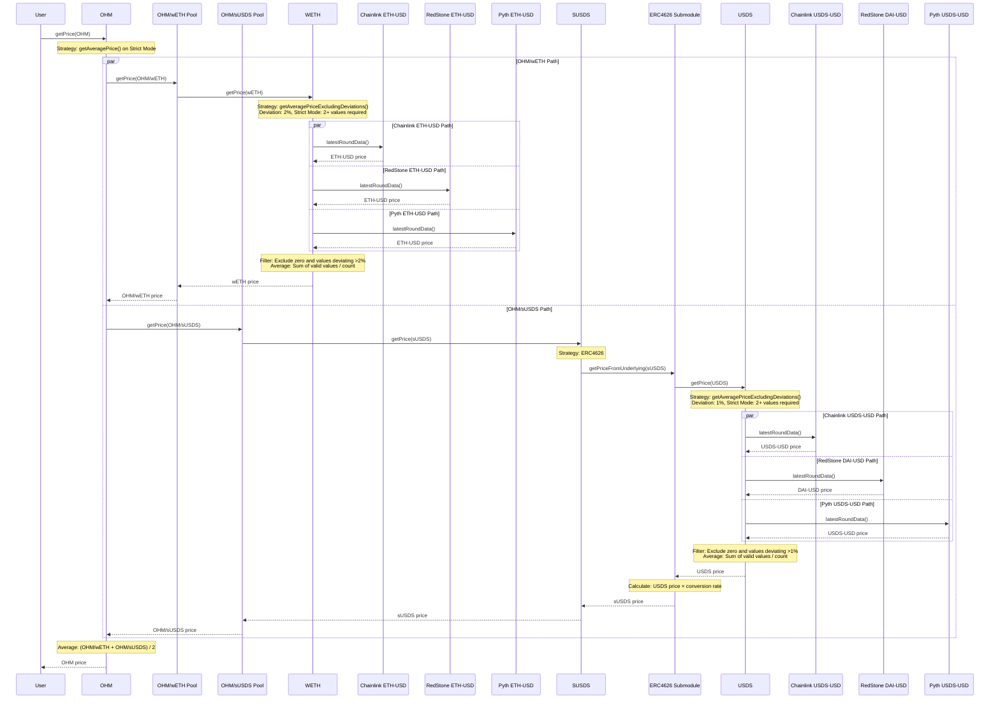

# PRICE Configuration

## Justification

The Olympus protocol currently relies on two price feeds, Chainlink OHM-ETH and Chainlink ETH-USD, in order to determine the price of OHM. If there were to be any mis-configuration or mis-reporting in either of those price feeds, the protocol’s automated operations (YRF and EM) could buy or sell OHM in a market that does not support it.

## Objective

Re-configure price resolution in the protocol to utilise multiple price feeds when determining the price feed of OHM.

## Implementation

- Replace the existing PRICE v1 module with the PRICE v2 module
    - The PRICE v2 module was audited twice as part of the larger RBS v2 project in 2023.
    - Only the PRICE v2 module (and its submodules) would be included in this rollout. The TRSRY v1.1 upgrade, SPPLY module and Appraiser policy (which calculates metrics, similar to the subgraph) are not included.
    - The Operator, YieldRepurchaseFacility and EmissionManager policies rely on the PRICE v1 module interface in order to determine the price of OHM. The v2 module will maintain backwards-compatibility with the v1 interface, so that existing policies do not need to be updated.
- The upgrade will allow assets to be configured with multiple price feeds, and strategies to resolve the price from the multiple price feeds. This will increase resilience in adverse conditions.

## Assets

| Asset | Address   | Price Feeds   | Strategy  | Store MA | Use MA | MA Duration   |
| ----- | --------- | ------------- | --------- | -------- | ------ | ------------- |
| USDS | [0xdC0...84F](https://etherscan.io/address/0xdC035D45d973E3EC169d2276DDab16f1e407384F) | [Chainlink USDS-USD](https://etherscan.io/address/0xfF30586cD0F29eD462364C7e81375FC0C71219b1), [RedStone DAI-USD](https://app.redstone.finance/app/token/DAI/), [Pyth USDS-USD](https://insights.pyth.network/price-feeds/Crypto.USDS%2FUSD) | `getAveragePriceExcludingDeviations()` with 1% deviation on strict mode | No | No | 0 |
| sUSDS | [0xa39...fbD](https://etherscan.io/address/0xa3931d71877C0E7a3148CB7Eb4463524FEc27fbD) | ERC4626 Submodule | None | No | No | 0 |
| wETH | [0xc02...cc2](https://etherscan.io/address/0xc02aaa39b223fe8d0a0e5c4f27ead9083c756cc2) | [Chainlink ETH-USD](https://etherscan.io/address/0x5f4eC3Df9cbd43714FE2740f5E3616155c5b8419), [RedStone ETH-USD](https://etherscan.io/address/0x67F6838e58859d612E4ddF04dA396d6DABB66Dc4), [Pyth ETH-USD](https://insights.pyth.network/price-feeds/Crypto.ETH%2FUSD) | `getAveragePriceExcludingDeviations()` with 2% deviation on strict mode | No | No | 0 |
| OHM | [0x64a...1d5](https://etherscan.io/address/0x64aa3364f17a4d01c6f1751fd97c2bd3d7e7f1d5) | [Uniswap V3 OHM/WETH](https://etherscan.io/address/0x88051b0eea095007d3bef21ab287be961f3d8598), [Uniswap V3 OHM/sUSDS](https://etherscan.io/address/0x0858e2b0f9d75f7300b38d64482ac2c8df06a755) | `getAveragePrice()` on strict mode | No | No | 0 |

- Ultimately, price resolution for all assets into USD will be reliant on a combination of Chainlink, Redstone and Pyth oracles.
- The price of USDS will be determined as the average of the price feeds from 3 different vendors.
    - After any zero value or deviating values (> 1%) have been excluded, the average is taken.
    - This ensures that price feeds that are deviating don't alter the average.
    - Strict mode will be enabled, which means that if there are insufficient remaining values to make an average (2), the price resolution will fail.
- The price of ETH will be determined as the average of the price feeds from 3 different vendors.
    - After any zero value or deviating values (> 2%) have been excluded, the average is taken.
    - This ensures that price feeds that are deviating don't alter the average.
    - Strict mode will be enabled, which means that if there are insufficient remaining values to make an average (2), the price resolution will fail.
- The price of OHM will be determined by completely separate paths - USDS and wETH, to reduce the impact from the manipulation of price feeds.

### wETH Price Resolution

### USDS Price Resolution

### OHM Price Resolution

