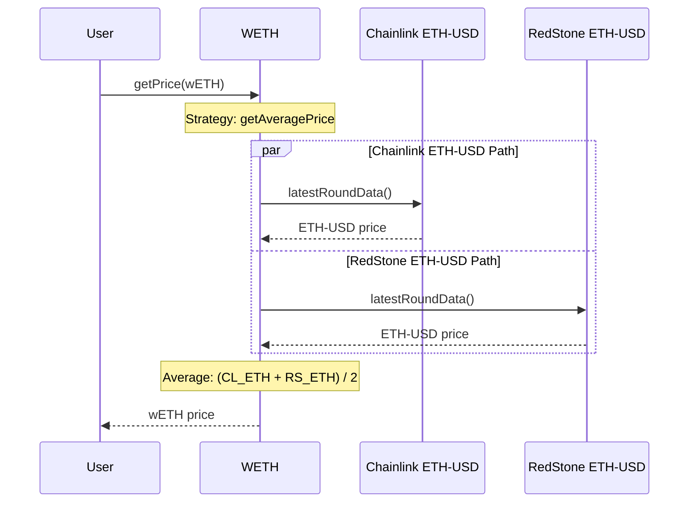
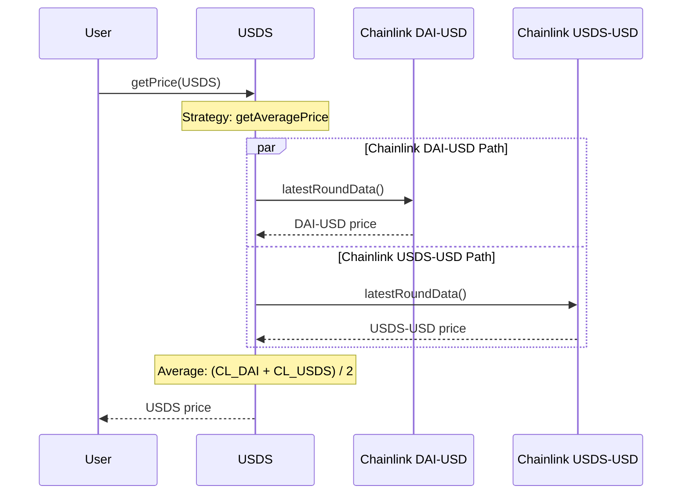
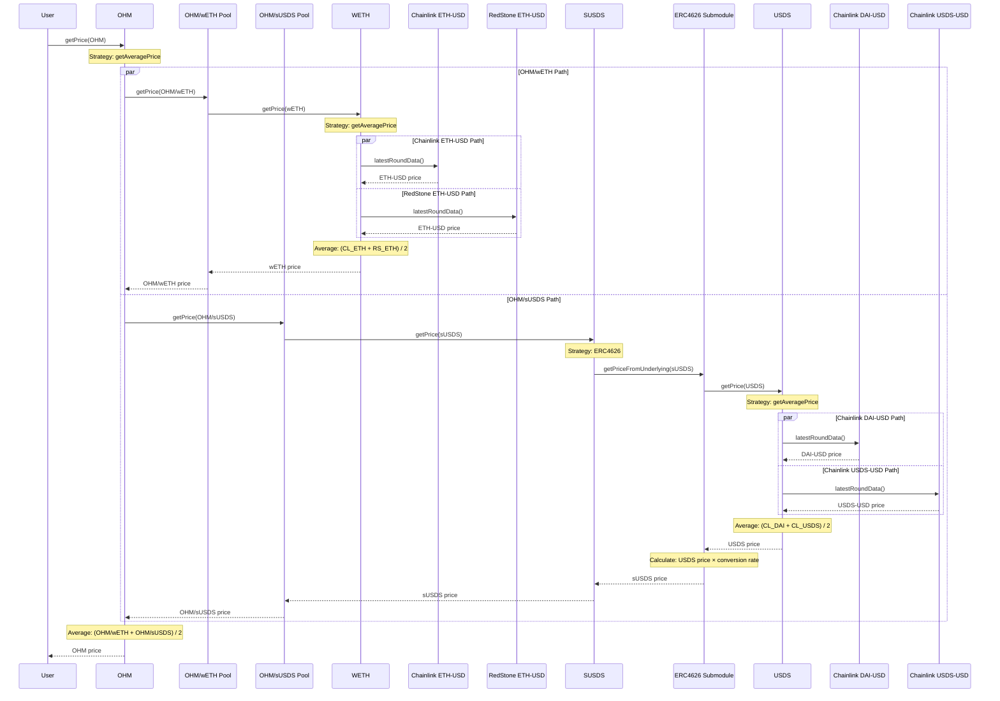

# PRICE Configuration

## Justification

The Olympus protocol currently relies on two price feeds, Chainlink OHM-ETH and Chainlink ETH-USD, in order to determine the price of OHM. If there were to be any mis-configuration or mis-reporting in either of those price feeds, the protocol’s automated operations (YRF and EM) could buy or sell OHM in a market that does not support it.

## Objective

Replace the existing PRICE v1 module with a backwards-compatible PRICE v2 module that can support multiple price feeds per asset, and strategies to resolve the price from the multiple price feeds. This will increase resilience in adverse conditions.

## Assets

| Asset | Address   | Price Feeds   | Strategy  | Store MA | Use MA | MA Duration   |
| ----- | --------- | ------------- | --------- | -------- | ------ | ------------- |
| USDS  | [0xdC0...84F](https://etherscan.io/address/0xdC035D45d973E3EC169d2276DDab16f1e407384F) | [Chainlink DAI-USD](https://etherscan.io/address/0xaed0c38402a5d19df6e4c03f4e2dced6e29c1ee9)  [Chainlink USDS-USD](https://etherscan.io/address/0xfF30586cD0F29eD462364C7e81375FC0C71219b1) | `getAveragePrice()` | No      | No    | 0 |
| sUSDS | [0xa39...fbD](https://etherscan.io/address/0xa3931d71877C0E7a3148CB7Eb4463524FEc27fbD) | ERC4626 Submodule | None         | No    | No     | 0 |
| wETH  | [0xc02...cc2](https://etherscan.io/address/0xc02aaa39b223fe8d0a0e5c4f27ead9083c756cc2) | [Chainlink ETH-USD](https://etherscan.io/address/0x5f4eC3Df9cbd43714FE2740f5E3616155c5b8419)  [RedStone ETH-USD](https://etherscan.io/address/0x67F6838e58859d612E4ddF04dA396d6DABB66Dc4)   | `getAveragePrice()` | No      | No    | 0 |
| OHM   | [0x64a...1d5](https://etherscan.io/address/0x64aa3364f17a4d01c6f1751fd97c2bd3d7e7f1d5) | [Uniswap V3 OHM/WETH](https://etherscan.io/address/0x88051b0eea095007d3bef21ab287be961f3d8598)   [Uniswap V3 OHM/sUSDS](https://etherscan.io/address/0x0858e2b0f9d75f7300b38d64482ac2c8df06a755) | `getAveragePrice()`      | No       | No     | 0 |

- Ultimately, price resolution for all assets into USD will be reliant on Chainlink or Redstone oracles.
- The price of OHM will be determined by completely separate paths - USDS and wETH, to reduce the impact from the manipulation of price feeds.

### wETH Price Resolution

### USDS Price Resolution

### OHM Price Resolution

