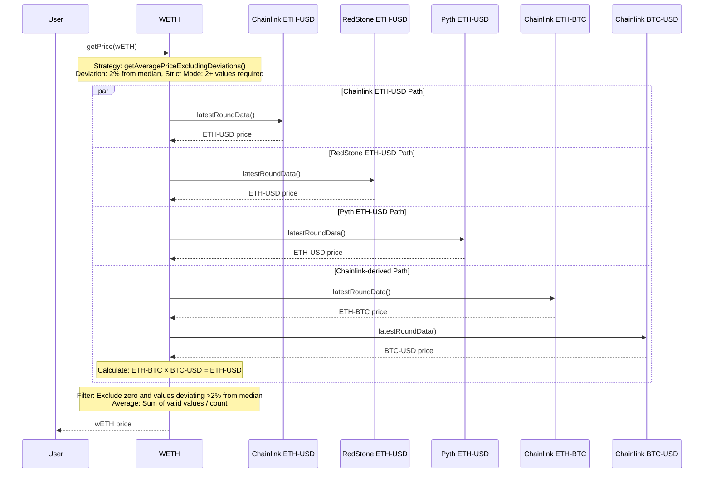
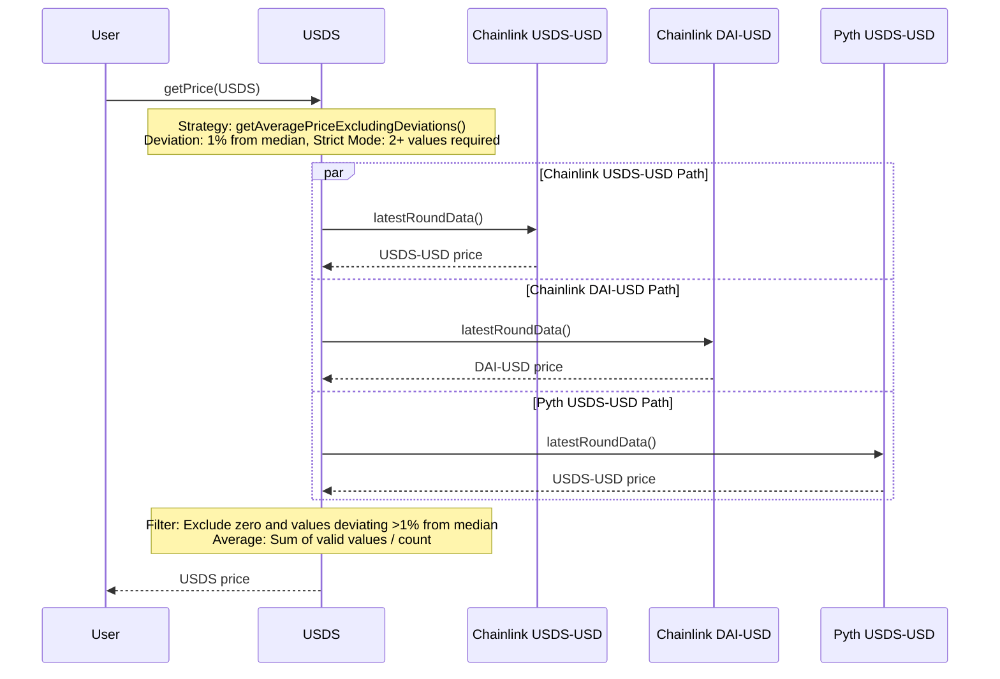
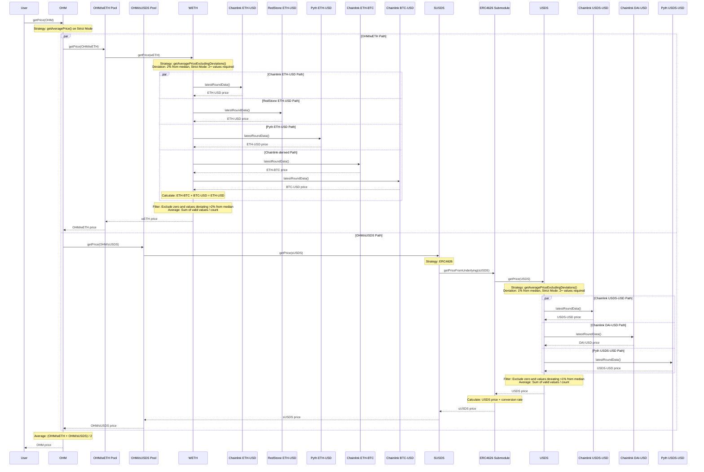

# PRICE Configuration

## Justification

The Olympus protocol currently relies on two price feeds, Chainlink OHM-ETH and Chainlink ETH-USD, in order to determine the price of OHM. If there were to be any mis-configuration or mis-reporting in either of those price feeds, the protocol’s automated operations (YRF and EM) could buy or sell OHM in a market that does not support it.

## Objective

Re-configure price resolution in the protocol to utilise multiple price feeds when determining the price feed of OHM.

## Implementation

- Replace the existing PRICE v1 module with the PRICE v1.2 module
    - The PRICE v1.2 module (based on the PRICEv2 architecture) was audited twice as part of the larger RBS v2 project in 2023.
    - Only the PRICE v1.2 module (and its submodules) would be included in this rollout. The TRSRY v1.1 upgrade, SPPLY module and Appraiser policy (which calculates metrics, similar to the subgraph) are not included.
    - The Operator, YieldRepurchaseFacility and EmissionManager policies rely on the PRICE v1 module interface in order to determine the price of OHM. The v1.2 module maintains backwards-compatibility with the v1 interface, so that existing policies do not need to be updated.
- The upgrade will allow assets to be configured with multiple price feeds, and strategies to resolve the price from the multiple price feeds. This will increase resilience in adverse conditions.

## Assets

| Asset | Address | Price Feeds | Strategy | Store MA | Use MA | MA Duration |
| ----- | ------- | ----------- | -------- | -------- | ------ | ----------- |
| USDS | [0xdC0...84F](https://etherscan.io/address/0xdC035D45d973E3EC169d2276DDab16f1e407384F) | [Chainlink USDS-USD](https://etherscan.io/address/0xfF30586cD0F29eD462364C7e81375FC0C71219b1), [Chainlink DAI-USD](https://etherscan.io/address/0xAed0c38402a5d19df6E4c03F4E2DceD6e29c1ee9), [Pyth USDS-USD](https://insights.pyth.network/price-feeds/Crypto.USDS%2FUSD) | `getAveragePriceExcludingDeviations()` with 1% deviation from median on strict mode | No | No | 0 |
| sUSDS | [0xa39...fbD](https://etherscan.io/address/0xa3931d71877C0E7a3148CB7Eb4463524FEc27fbD) | ERC4626 Submodule | None | No | No | 0 |
| wETH | [0xc02...cc2](https://etherscan.io/address/0xc02aaa39b223fe8d0a0e5c4f27ead9083c756cc2) | [Chainlink ETH-USD](https://etherscan.io/address/0x5f4eC3Df9cbd43714FE2740f5E3616155c5b8419), [RedStone ETH-USD](https://etherscan.io/address/0x67F6838e58859d612E4ddF04dA396d6DABB66Dc4), [Pyth ETH-USD](https://insights.pyth.network/price-feeds/Crypto.ETH%2FUSD), [ETH-BTC](https://etherscan.io/address/0xAc559F25B1619171CbC396a50854A3240b6A4e99)x[BTC-USD](https://etherscan.io/address/0xF4030086522a5bEEa4988F8cA5B36dbC97BeE88c) | `getAveragePriceExcludingDeviations()` with 2% deviation from median on strict mode | No | No | 0 |
| OHM | [0x64a...1d5](https://etherscan.io/address/0x64aa3364f17a4d01c6f1751fd97c2bd3d7e7f1d5) | [Uniswap V3 OHM/WETH](https://etherscan.io/address/0x88051b0eea095007d3bef21ab287be961f3d8598), [Uniswap V3 OHM/sUSDS](https://etherscan.io/address/0x0858e2b0f9d75f7300b38d64482ac2c8df06a755) | `getAveragePrice()` on strict mode | Yes | No | 604800 (7 days) |

- Ultimately, price resolution for all assets into USD will be reliant on a combination of Chainlink, RedStone, Pyth and Chainlink-derived (ETH-BTC × BTC-USD) oracles.
- The price of USDS will be determined as the average of the price feeds from 3 sources: 2 Chainlink feeds (USDS-USD and DAI-USD) and 1 Pyth feed (USDS-USD).
    - After any zero value or deviating values (> 1% from the median) have been excluded, the average is taken.
    - This ensures that price feeds that are deviating don't alter the average.
    - Strict mode will be enabled, which means that if there are insufficient remaining values to make an average (2), the price resolution will fail.
- The price of ETH will be determined as the average of the price feeds from 4 different sources.
    - After any zero value or deviating values (> 2% from the median) have been excluded, the average is taken.
    - This ensures that price feeds that are deviating don't alter the average.
    - Strict mode will be enabled, which means that if there are insufficient remaining values to make an average (2), the price resolution will fail.
- The price of OHM will be determined by completely separate paths - USDS and wETH, to reduce the impact from the manipulation of price feeds.

### Price Feed Configuration Parameters

#### Update Threshold

The **update threshold** is the maximum number of seconds that can elapse since the last price feed update before the price is considered stale. If a feed's last update is older than this threshold, the feed returns zero and is excluded from price calculation.

| Asset | Feed | Update Threshold |
| ----- | ---- | ---------------- |
| USDS | Chainlink USDS-USD | 86,400 sec (24 hours) |
| USDS | Chainlink DAI-USD | 86,400 sec (24 hours) |
| USDS | Pyth USDS-USD | 86,400 sec (24 hours) |
| wETH | Chainlink ETH-USD | 3,600 sec (1 hour) |
| wETH | RedStone ETH-USD | 3,600 sec (1 hour) |
| wETH | Pyth ETH-USD | 3,600 sec (1 hour) |
| wETH | Chainlink ETH-BTC × BTC-USD | 3,600 sec (1 hour) |

> **IMPORTANT:** Pyth price feeds require regular price updates to remain valid. If the feed is not updated within the `updateThreshold` period, the price resolution will fail. Use the [pyth-price-pusher](https://github.com/OlympusDAO/pyth-price-pusher) tool to manage automated price updates for all Pyth feeds.

#### Observation Window (Uniswap TWAP Only)

The **observation window** is used only for Uniswap V3 price feeds to calculate a Time-Weighted Average Price (TWAP). Unlike the update threshold (which checks staleness), the observation window smooths price data over a time period to reduce manipulation risk.

- Uniswap V3 pools store price observations at regular intervals
- The TWAP is calculated by averaging observations within the window
- A longer window = more manipulation resistance but slower price updates

| Asset | Feed | Observation Window |
| ----- | ---- | ------------------ |
| OHM | Uniswap V3 OHM/WETH | 1,800 sec (30 min) |
| OHM | Uniswap V3 OHM/sUSDS | 1,800 sec (30 min) |

#### Max Confidence Interval (Pyth Only)

The **max confidence interval** is a Pyth-specific parameter that sets the maximum acceptable confidence interval for a price. Pyth returns a confidence value representing the uncertainty range around the reported price. If the confidence interval exceeds this threshold, the feed is considered unreliable and returns zero.

- Confidence is measured in the same decimals as the price (18 decimals)
- Higher confidence values = more uncertainty in the price
- A zero confidence indicates a very precise price

| Asset | Pyth Feed | Max Confidence |
| ----- | --------- | -------------- |
| USDS | Pyth USDS-USD | 0.01e18 ($0.01) |
| wETH | Pyth ETH-USD | 10e18 ($10) |

**How Confidence is Used:**

1. Pyth returns both a `price` and a `conf` (confidence) value
2. The contract converts `maxConfidence` from 18-decimal scale to Pyth's native scale (based on the feed's exponent)
3. If `priceData.conf > maxConfidenceInPythScale`, the feed reverts with `Pyth_FeedConfidenceExcessive`
4. This prevents using prices with high uncertainty

### wETH Price Resolution

### USDS Price Resolution

### OHM Price Resolution

