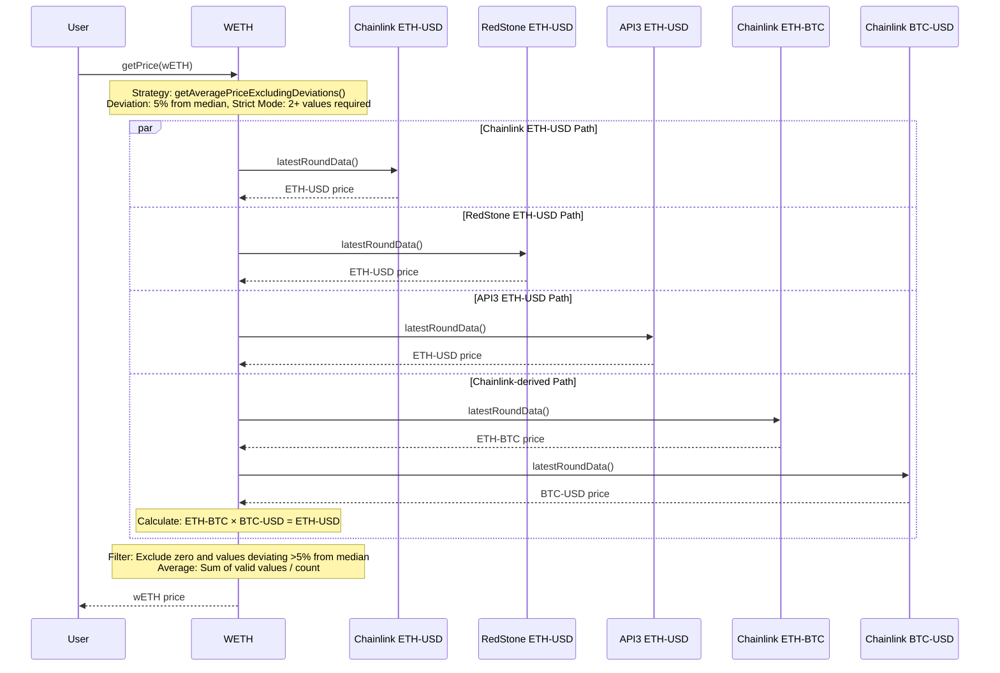
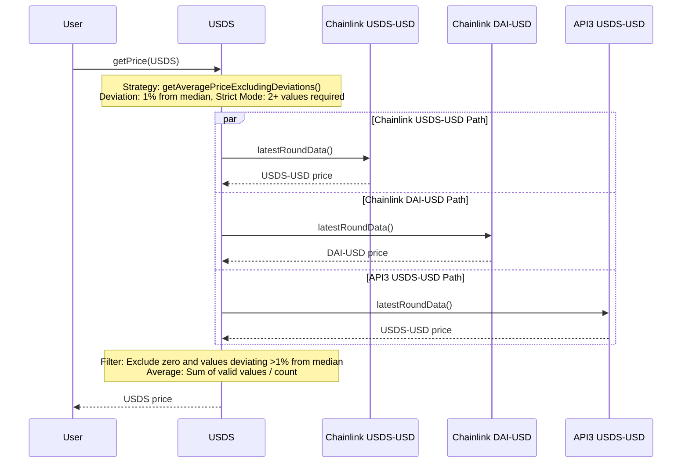
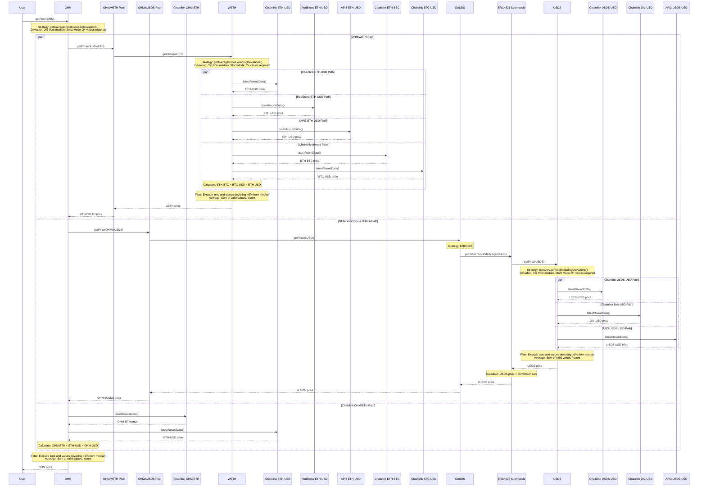

# PRICE Configuration

## Justification

The Olympus protocol currently relies on two price feeds, Chainlink OHM-ETH and Chainlink ETH-USD, in order to determine the price of OHM. If there were to be any mis-configuration or mis-reporting in either of those price feeds, the protocol’s automated operations (YRF and EM) could buy or sell OHM in a market that does not support it.

## Objective

Re-configure price resolution in the protocol to utilise multiple price feeds when determining the price feed of OHM.

## Implementation

- Replace the existing PRICE v1 module with the PRICE v1.2 module
    - The PRICE v1.2 module (based on the PRICEv2 architecture) was audited twice as part of the larger RBS v2 project in 2023.
    - Only the PRICE v1.2 module (and its submodules) would be included in this rollout. The TRSRY v1.1 upgrade, SPPLY module and Appraiser policy (which calculates metrics, similar to the subgraph) are not included.
    - The Operator, YieldRepurchaseFacility and EmissionManager policies rely on the PRICE v1 module interface in order to determine the price of OHM. The v1.2 module maintains backwards-compatibility with the v1 interface, so that existing policies do not need to be updated.
- The upgrade will allow assets to be configured with multiple price feeds, and strategies to resolve the price from the multiple price feeds. This will increase resilience in adverse conditions.

## Timelock Behaviour

PRICE configuration is split between immediate operational actions and queued configuration actions. The timelock is intended to give governance and emergency operators time to review material changes to live price resolution before they can affect protocol behaviour.

The following actions are queued through `PriceConfigv2` and can only be executed after the current `timelockDelay`:

- `queueRemoveAsset`: removes an approved asset from PRICE.
- `queueUpdateAsset`: updates an approved asset's feeds, strategy or moving-average configuration.
    - When the final configuration uses the moving average, validation uses a synthetic moving-average value derived from the current raw feed observation, in order to allow for re-configuration when the last observation is stale or out of consensus. If the stored value is stale or out of consensus, call `storeObservation(asset)` after updating the asset before consumers rely on CURRENT price reads.
- `queueUpgradeSubmodule`: upgrades an already-installed PRICE submodule.
- `queueExecOnSubmodule`: performs a call on an installed PRICE submodule.
- `queueTimelockDelay`: changes the delay used for newly queued actions.

Queued actions store their action type, proposer, queue timestamp, executable timestamp, expiry timestamp and encoded payload. They are executable by any address after the delay has elapsed and before expiry. This keeps execution permissionless while the delay and emergency cancellation are the authorization boundaries. The emergency role can cancel queued actions before execution; this role is expected to be independent from the roles that can queue PRICE changes.

The following actions are not timelocked:

- `addAsset`: Adding a new asset will not affect existing price resolution paths, so this does not require a timelock.
    - When the final configuration uses the moving average, validation uses a synthetic moving-average value derived from the current raw feed observation. If the stored value is out of consensus, call `storeObservation(asset)` after adding the asset before consumers rely on CURRENT price reads.
- `installSubmodule`: used to install new submodule keycodes. Installing a submodule does not replace an existing live submodule path; replacement is handled by `queueUpgradeSubmodule`.
- `storeObservation` and `storeObservations`: operational maintenance for moving-average data.

## Non-Contract Assets and ERC-7726

The `PriceCache` policy supports non-contract assets in addition to normal ERC-20 addresses. This is relevant for standards such as ERC-7726, which explicitly allows special asset identifiers such as:

- the ERC-7528 ETH sentinel `0xEeeeeEeeeEeEeeEeEeEeeEEEeeeeEeeeeeeeEEeE`
- ISO-4217 code addresses such as `address(840)` for USD

For contract assets, oracle adapters and factories can read decimals and symbols directly from the token contract. For non-contract assets, that metadata must instead be configured in `PriceCache` via `setNonContractAssetMetadata(asset_, decimals_, symbol_)`.

Unlike ERC-20 metadata, a non-contract asset does not have an intrinsic decimal scale. Its decimal scale is the value currently configured in `PriceCache`. Integrations that use non-contract assets should confirm the active value with `PriceCache.assetDecimals(asset_)`, especially after metadata updates. Morpho-compatible oracles recalculate their scale factor from the active cache decimals when read, so a non-contract asset decimal update changes the scale used by `scaleFactor()` and `price()`.

The required conditions for non-contract asset support are:

1. the asset must be registered in `PRICE` as a non-contract asset, unless it is the configured unit of account
2. the asset must be configured in `PRICE` with a price source
3. the asset must have metadata configured in `PriceCache`

This allows `ERC7726OracleCloneable`, `MorphoOracleFactory`, and `ChainlinkOracleFactory` to support non-contract assets without assuming that the asset implements ERC-20 metadata methods such as `decimals()` or `symbol()`.

## Assets

| Asset | Address | Price Feeds | Strategy | Store MA | Use MA | MA Duration |
| ----- | ------- | ----------- | -------- | -------- | ------ | ----------- |
| USDS | [0xdC0...84F](https://etherscan.io/address/0xdC035D45d973E3EC169d2276DDab16f1e407384F) | [Chainlink USDS-USD](https://etherscan.io/address/0xfF30586cD0F29eD462364C7e81375FC0C71219b1), [Chainlink DAI-USD](https://etherscan.io/address/0xAed0c38402a5d19df6E4c03F4E2DceD6e29c1ee9), [API3 USDS-USD](https://etherscan.io/address/0x6C3C2A615Ea3c592487b3e06ecAF01D9a3181f47) | `getAveragePriceExcludingDeviations()` with 1% price-feed deviation and revert on insufficient price feeds | No | No | 0 |
| sUSDS | [0xa39...fbD](https://etherscan.io/address/0xa3931d71877C0E7a3148CB7Eb4463524FEc27fbD) | ERC4626 Submodule | None | No | No | 0 |
| wETH | [0xc02...cc2](https://etherscan.io/address/0xc02aaa39b223fe8d0a0e5c4f27ead9083c756cc2) | [Chainlink ETH-USD](https://etherscan.io/address/0x5f4eC3Df9cbd43714FE2740f5E3616155c5b8419), [RedStone ETH-USD](https://etherscan.io/address/0x67F6838e58859d612E4ddF04dA396d6DABB66Dc4), [API3 ETH-USD](https://etherscan.io/address/0x5b0cf2b36a65a6BB085D501B971e4c102B9Cd473), [ETH-BTC](https://etherscan.io/address/0xAc559F25B1619171CbC396a50854A3240b6A4e99)x[BTC-USD](https://etherscan.io/address/0xF4030086522a5bEEa4988F8cA5B36dbC97BeE88c) | `getAveragePriceExcludingDeviations()` with 5% price-feed deviation and revert on insufficient price feeds | No | No | 0 |
| OHM | [0x64a...1d5](https://etherscan.io/address/0x64aa3364f17a4d01c6f1751fd97c2bd3d7e7f1d5) | [Uniswap V3 OHM/WETH](https://etherscan.io/address/0x88051b0eea095007d3bef21ab287be961f3d8598), [Uniswap V3 OHM/sUSDS](https://etherscan.io/address/0x0858e2b0f9d75f7300b38d64482ac2c8df06a755), [Chainlink OHM-ETH](https://etherscan.io/address/0x9a72298ae3886221820B1c878d12D872087D3a23)x[Chainlink ETH-USD](https://etherscan.io/address/0x5f4eC3Df9cbd43714FE2740f5E3616155c5b8419) | `getAveragePriceExcludingDeviations()` with 2% price-feed deviation and revert on insufficient price feeds | Yes | No | 2592000 (30 days) |

### Final Configuration Values

The following values describe the target oracle configuration.

| Asset | Strategy | Price-Feed Deviation | Revert on Insufficient Price Feeds | Expected Price | Expected Tolerance |
| ----- | -------- | -------------------- | ---------------------------------- | -------------- | ------------------ |
| USDS | `getAveragePriceExcludingDeviations()` | 100 bps | Yes | 1e18 | 100 bps |
| sUSDS | None, uses ERC4626 feed only | N/A | N/A | 1.095038992740982406e18 | 100 bps |
| wETH | `getAveragePriceExcludingDeviations()` | 500 bps | Yes | 2282.17e18 | 500 bps |
| OHM | `getAveragePriceExcludingDeviations()` | 200 bps | Yes | 16.89e18 | 500 bps |

| Asset | Feed Path | Source | Update Threshold | Observation Window | Max Confidence |
| ----- | --------- | ------ | ---------------- | ------------------ | -------------- |
| USDS | Chainlink USDS-USD | `chainlinkUsdsUsd` | 86,400 sec (24 hours) | N/A | N/A |
| USDS | Chainlink DAI-USD | `chainlinkDaiUsd` | 86,400 sec (24 hours) | N/A | N/A |
| USDS | API3 USDS-USD | `api3UsdsUsd` | 90,000 sec (25 hours) | N/A | N/A |
| sUSDS | ERC4626 derived from USDS | `getPriceFromUnderlying(sUSDS)` | N/A | N/A | N/A |
| wETH | Chainlink ETH-USD | `chainlinkEthUsd` | 3,600 sec (1 hour) | N/A | N/A |
| wETH | RedStone ETH-USD | `redstoneEthUsd` | 86,400 sec (24 hours) | N/A | N/A |
| wETH | API3 ETH-USD | `api3EthUsd` | 90,000 sec (25 hours) | N/A | N/A |
| wETH | Chainlink ETH-BTC leg | `chainlinkEthBtc` | 86,400 sec (24 hours) | N/A | N/A |
| wETH | Chainlink BTC-USD leg | `chainlinkBtcUsd` | 3,600 sec (1 hour) | N/A | N/A |
| OHM | Uniswap V3 OHM/WETH | `uniswapOhmWeth` | N/A | 1,500 sec (25 min) | N/A |
| OHM | Uniswap V3 OHM/sUSDS | `uniswapOhmSusds` | N/A | 1,500 sec (25 min) | N/A |
| OHM | Chainlink OHM-ETH leg | env `external.chainlink.ohmEthPriceFeed` | 86,400 sec (24 hours) | N/A | N/A |
| OHM | Chainlink ETH-USD leg | `chainlinkEthUsd` | 3,600 sec (1 hour) | N/A | N/A |

- Ultimately, price resolution for all assets into USD will be reliant on a combination of Chainlink, RedStone, API3 and Chainlink-derived (ETH-BTC × BTC-USD) oracles.
- Pyth feeds are not included in the target configuration because the protocol would need paid Hermes access to reliably operate the required feed updates. This would add an external subscription dependency for the PRICE module and make the oracle path reliant on a paid off-chain update service.
- The price of USDS will be determined as the average of the price feeds from 3 sources: 2 Chainlink feeds (USDS-USD and DAI-USD) and 1 API3 feed (USDS-USD).
    - After any zero value or deviating values (> 1% from the median) have been excluded, the average is taken.
    - This ensures that price feeds that are deviating don't alter the average.
    - Strict mode will be enabled, which means that if there are insufficient remaining values to make an average (2), the price resolution will fail.
- The price of wETH will be determined as the average of the price feeds from 4 different sources.
    - After any zero value or deviating values (> 5% from the median) have been excluded, the average is taken.
    - This ensures that price feeds that are deviating don't alter the average.
    - Strict mode will be enabled, which means that if there are insufficient remaining values to make an average (2), the price resolution will fail.
    - If exactly two WETH feeds remain, the strategy uses their average as the deviation benchmark. With a 5% threshold, a $1,900 and $2,100 pair is exactly at the boundary around a $2,000 average, allowing a 10% spread between the two surviving feeds.
- The price of OHM will be determined by three separate paths: OHM/sUSDS (via USDS through `ERC4626.getPriceFromUnderlying(sUSDS)`), wETH and the Chainlink OHM-ETH × ETH-USD derived feed.
    - After any zero value or deviating values (> 2% from the median) have been excluded, the average is taken.
    - Strict mode remains enabled, so OHM requires two valid prices and can tolerate one failed OHM path.
    - If one OHM path is unavailable or returns zero, the two remaining non-zero prices are compared against their midpoint. With a 200 bps tolerance, two prices that differ by a little more than 400 bps relative to the lower price can both sit outside the allowed range from that midpoint, causing `SimpleStrategy_PriceCountInvalid(0, 2)`.
    - Guardian Audits' historical analysis found no observed threshold crossings in the checked windows. During the known OHM/sUSDS zero-quote period from block `24831090` through `24877959`, sampled every 300 blocks, all `155` comparable OHM/WETH-vs-Chainlink samples stayed below the two-price threshold, with a maximum divergence of `183` bps. A broader daily-scale review from block `24000000` through `25021851` likewise found no crossings across `142` comparable samples, with a maximum divergence of `190` bps.
    - Based on this analysis, the 200 bps tolerance should be sufficient and avoid disruption of the heartbeat.
- OHM's 30-day moving average state is migrated from the live PRICE v1 module during the upgrade. The moving average is stored for backwards-compatible target-price reads and is not used as an input to OHM spot price resolution.

### Price Feed Configuration Parameters

#### Update Threshold

The **update threshold** is the maximum number of seconds that can elapse since the last price feed update before the price is considered stale. If a feed's last update is older than this threshold, the feed returns zero and is excluded from price calculation.

| Asset | Feed | Update Threshold |
| ----- | ---- | ---------------- |
| USDS | Chainlink USDS-USD | 86,400 sec (24 hours) |
| USDS | Chainlink DAI-USD | 86,400 sec (24 hours) |
| USDS | API3 USDS-USD | 90,000 sec (25 hours) |
| wETH | Chainlink ETH-USD | 3,600 sec (1 hour) |
| wETH | RedStone ETH-USD | 86,400 sec (24 hours) |
| wETH | API3 ETH-USD | 90,000 sec (25 hours) |
| wETH | Chainlink ETH-BTC leg | 86,400 sec (24 hours) |
| wETH | Chainlink BTC-USD leg | 3,600 sec (1 hour) |
| OHM | Chainlink OHM-ETH | 86,400 sec (24 hours) |
| OHM | Chainlink OHM-ETH × ETH-USD | 3,600 sec (1 hour) for ETH-USD |

> **IMPORTANT:** API3 feeds are consumed through Chainlink-interface compatible reader proxies. The configured update threshold is 25 hours for feeds with a 24-hour heartbeat. This gives a one-hour grace period for heartbeat updates that land slightly late, while still failing stale feeds promptly if an update is missed. API3 feed operation also requires regular payment to keep the reader proxy active and the feed updating.

#### Observation Window (Uniswap TWAP Only)

The **observation window** is used only for Uniswap V3 price feeds to calculate a Time-Weighted Average Price (TWAP). Unlike the update threshold (which checks staleness), the observation window smooths price data over a time period to reduce manipulation risk.

- Uniswap V3 pools store price observations at regular intervals
- The TWAP is calculated by averaging observations within the window
- A longer window = more manipulation resistance but slower price updates

| Asset | Feed | Observation Window |
| ----- | ---- | ------------------ |
| OHM | Uniswap V3 OHM/WETH | 1,500 sec (25 min) |
| OHM | Uniswap V3 OHM/sUSDS | 1,500 sec (25 min) |

### wETH Price Resolution

```mermaid
sequenceDiagram
    participant User
    participant WETH
    participant CL_ETH as Chainlink ETH-USD
    participant RS_ETH as RedStone ETH-USD
    participant API3_ETH as API3 ETH-USD
    participant CL_ETHBTC as Chainlink ETH-BTC
    participant CL_BTCUSD as Chainlink BTC-USD

    User->>WETH: getPrice(wETH)

    Note over WETH: Strategy: getAveragePriceExcludingDeviations()<br/>Deviation: 5% from median, Strict Mode: 2+ values required

    par Chainlink ETH-USD Path
        WETH->>CL_ETH: latestRoundData()
        CL_ETH-->>WETH: ETH-USD price
    and RedStone ETH-USD Path
        WETH->>RS_ETH: latestRoundData()
        RS_ETH-->>WETH: ETH-USD price
    and API3 ETH-USD Path
        WETH->>API3_ETH: latestRoundData()
        API3_ETH-->>WETH: ETH-USD price
    and Chainlink-derived Path
        WETH->>CL_ETHBTC: latestRoundData()
        CL_ETHBTC-->>WETH: ETH-BTC price
        WETH->>CL_BTCUSD: latestRoundData()
        CL_BTCUSD-->>WETH: BTC-USD price
        Note over WETH: Calculate: ETH-BTC × BTC-USD = ETH-USD
    end

    Note over WETH: Filter: Exclude zero and values deviating >5% from median<br/>Average: Sum of valid values / count
    WETH-->>User: wETH price
```

### USDS Price Resolution

```mermaid
sequenceDiagram
    participant User
    participant USDS
    participant CL_USDS as Chainlink USDS-USD
    participant CL_DAI as Chainlink DAI-USD
    participant API3_USDS as API3 USDS-USD

    User->>USDS: getPrice(USDS)

    Note over USDS: Strategy: getAveragePriceExcludingDeviations()<br/>Deviation: 1% from median, Strict Mode: 2+ values required

    par Chainlink USDS-USD Path
        USDS->>CL_USDS: latestRoundData()
        CL_USDS-->>USDS: USDS-USD price
    and Chainlink DAI-USD Path
        USDS->>CL_DAI: latestRoundData()
        CL_DAI-->>USDS: DAI-USD price
    and API3 USDS-USD Path
        USDS->>API3_USDS: latestRoundData()
        API3_USDS-->>USDS: USDS-USD price
    end

    Note over USDS: Filter: Exclude zero and values deviating >1% from median<br/>Average: Sum of valid values / count
    USDS-->>User: USDS price
```

### OHM Price Resolution

```mermaid
sequenceDiagram
    participant User
    participant OHM
    participant OHM_WETH_Pool as OHM/wETH Pool
    participant OHM_SUSDS_Pool as OHM/sUSDS Pool
    participant CL_OHMETH as Chainlink OHM-ETH
    participant WETH
    participant CL_ETH as Chainlink ETH-USD
    participant RS_ETH as RedStone ETH-USD
    participant API3_ETH as API3 ETH-USD
    participant CL_ETHBTC as Chainlink ETH-BTC
    participant CL_BTCUSD as Chainlink BTC-USD
    participant SUSDS
    participant ERC4626 as ERC4626 Submodule
    participant USDS
    participant CL_USDS as Chainlink USDS-USD
    participant CL_DAI as Chainlink DAI-USD
    participant API3_USDS as API3 USDS-USD

    User->>OHM: getPrice(OHM)

    Note over OHM: Strategy: getAveragePriceExcludingDeviations()<br/>Deviation: 2% from median, Strict Mode: 2+ values required

    par OHM/wETH Path
        OHM->>OHM_WETH_Pool: getPrice(OHM/wETH)
        OHM_WETH_Pool->>WETH: getPrice(wETH)

        Note over WETH: Strategy: getAveragePriceExcludingDeviations()<br/>Deviation: 5% from median, Strict Mode: 2+ values required

        par Chainlink ETH-USD Path
            WETH->>CL_ETH: latestRoundData()
            CL_ETH-->>WETH: ETH-USD price
        and RedStone ETH-USD Path
            WETH->>RS_ETH: latestRoundData()
            RS_ETH-->>WETH: ETH-USD price
        and API3 ETH-USD Path
            WETH->>API3_ETH: latestRoundData()
            API3_ETH-->>WETH: ETH-USD price
        and Chainlink-derived Path
            WETH->>CL_ETHBTC: latestRoundData()
            CL_ETHBTC-->>WETH: ETH-BTC price
            WETH->>CL_BTCUSD: latestRoundData()
            CL_BTCUSD-->>WETH: BTC-USD price
            Note over WETH: Calculate: ETH-BTC × BTC-USD = ETH-USD
        end

        Note over WETH: Filter: Exclude zero and values deviating >5% from median<br/>Average: Sum of valid values / count
        WETH-->>OHM_WETH_Pool: wETH price
        OHM_WETH_Pool-->>OHM: OHM/wETH price
    and OHM/sUSDS (via USDS) Path
        OHM->>OHM_SUSDS_Pool: getPrice(OHM/sUSDS)
        OHM_SUSDS_Pool->>SUSDS: getPrice(sUSDS)

        Note over SUSDS: Strategy: ERC4626

        SUSDS->>ERC4626: getPriceFromUnderlying(sUSDS)
        ERC4626->>USDS: getPrice(USDS)

        Note over USDS: Strategy: getAveragePriceExcludingDeviations()<br/>Deviation: 1% from median, Strict Mode: 2+ values required

        par Chainlink USDS-USD Path
            USDS->>CL_USDS: latestRoundData()
            CL_USDS-->>USDS: USDS-USD price
        and Chainlink DAI-USD Path
            USDS->>CL_DAI: latestRoundData()
            CL_DAI-->>USDS: DAI-USD price
        and API3 USDS-USD Path
            USDS->>API3_USDS: latestRoundData()
            API3_USDS-->>USDS: USDS-USD price
        end

        Note over USDS: Filter: Exclude zero and values deviating >1% from median<br/>Average: Sum of valid values / count
        USDS-->>ERC4626: USDS price
        Note over ERC4626: Calculate: USDS price × conversion rate
        ERC4626-->>SUSDS: sUSDS price
        SUSDS-->>OHM_SUSDS_Pool: sUSDS price
        OHM_SUSDS_Pool-->>OHM: OHM/sUSDS price
    and Chainlink OHM/ETH Path
        OHM->>CL_OHMETH: latestRoundData()
        CL_OHMETH-->>OHM: OHM-ETH price
        OHM->>CL_ETH: latestRoundData()
        CL_ETH-->>OHM: ETH-USD price
        Note over OHM: Calculate: OHM-ETH × ETH-USD = OHM-USD
    end

    Note over OHM: Filter: Exclude zero and values deviating >2% from median<br/>Average: Sum of valid values / count
    OHM-->>User: OHM price
```
