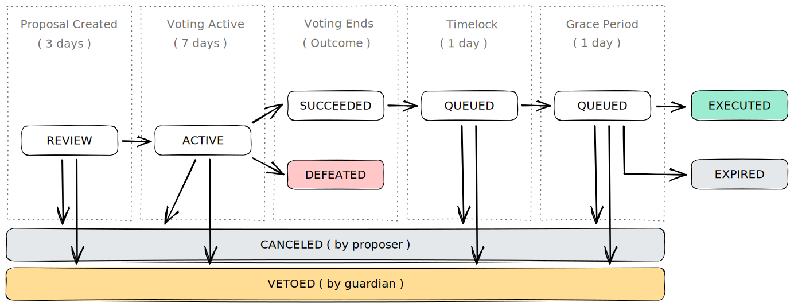

# Olympus Governor Bravo Implementation

The Olympus protocol is governed and upgraded by gOHM (Governance OHM) token holders, using three distinct components: the [gOHM](https://etherscan.io/token/0x0ab87046fBb341D058F17CBC4c1133F25a20a52f) token, the governance policy ([Governor Bravo](../external/governance/GovernorBravoDelegate.sol)), and a [Timelock](../external/governance/Timelock.sol). Together, these contracts enable the community to propose, vote on, and implement changes to the Olympus V3 system. Proposals can modify system parameters, activate or deactivate policies, and even install or upgrade modules, effectively allowing the addition of new features and the mutation of the protocol.

gOHM token holders can delegate their voting rights either to themselves or to an address of their choice. Due to the elasticity in the gOHM supply, and unlike the original implementation of Governor Bravo, the Olympus governance system relies on dynamic thresholds based on the total gOHM supply. This mechanism sets specific thresholds for each proposal, based on the current supply at that time, ensuring that the requirements (in absolute gOHM terms) for proposing and executing proposals scale with the token supply.

## Proposal Thresholds

When someone attempts to create a new governance proposal, the required thresholds for successfully submitting and executing the proposal are calculated. These thresholds determine:

- The minimum amount of votes (either by direct voting power or delegated) required by the proposer to submit the proposal.
- The minimum quorum required to pass the proposal (determined in favorable votes).

### Proposal Submission Threshold

The proposal submission threshold is determined by calling the `getProposalThresholdVotes()` function:

```solidity
function getProposalThresholdVotes() public view returns (uint256) {
    return (gohm.totalSupply() * proposalThreshold) / 100_000;
}
```

### Proposal Quorum Threshold

The minimum proposal quorum is determined in two steps. First, the contract checks whether the proposal attempts to perform a Kernel action that directly targets a high-risk module or attempts to (un)install a policy that requires permissions from a high-risk module.
If the proposal targets a high-risk module, the quorum is calculated using the `getHighRiskQuorumVotes()` function:

```solidity
function getHighRiskQuorumVotes() public view returns (uint256) {
    return (gohm.totalSupply() * highRiskQuorum) / 100_000;
}
```

_Note that a set of high-risk modules is tracked in the `isKeycodeHighRisk` mapping. The set is upgradable with the admin function `_setModuleRiskLevel()`._

Otherwise, it is calculated using the `getQuorumVotes()` function:

```solidity
function getQuorumVotes() public view returns (uint256) {
    return (gohm.totalSupply() * quorumPct) / 100_000;
}
```

## Proposal Timeline

When a governance proposal is created, it enters a 3-day review period, after which the proposer must call `activate()` so that voting weights are recorded and voting begins. Voting lasts for 7 days. After the voting period concludes, if a majority of votes, along with a minimum quorum, are cast in favor of the proposal, it is queued in the `Timelock` and can be implemented 1 day later.

Considerations:

- The proposal can then be executed during a grace period of 24 hours; afterwards, it will expire.
- The proposal can be canceled at any time (before execution) by the proposer.
- The proposal can be vetoed at any time (before execution) by the veto guardian. Initially, this role will belong to the DAO multisig. However, once the system matures, it could be set to the zero address.



## Vote Delegation

gOHM is an [ERC-20](https://github.com/ethereum/EIPs/blob/master/EIPS/eip-20.md) token that allows the owner to delegate voting rights to any address, including their own.

Considerations:

- Users can delegate to only one address at a time.
- The entire gOHM balance of the delegator is added to the delegatee’s vote count.
- Changes to the delegator's token balance automatically adjust the voting rights of the delegatee.
- Votes are delegated from the current block and onward, until the delegator delegates again or transfers all their gOHM.

Delegation can be achieved by calling the `delegate()` function or via a valid off-chain signature using `delegateBySig()`.

### Delegate

```solidity
function delegate(address delegatee)
```

- `delegatee`: The address in which the sender wishes to delegate their votes to.
- `msg.sender`: The address of the COMP token holder that is attempting to delegate their votes.
- `RETURN`: No return, reverts on error.

### DelegateBySig

Delegate votes from the signatory to the delegatee. This method has the same purpose as Delegate but it instead enables off-chain signatures to participate in Olympus governance vote delegation. For more details on how to create an off-chain signature, review [EIP-712](https://eips.ethereum.org/EIPS/eip-712).

```solidity
function delegateBySig(address delegatee, uint nonce, uint expiry, uint8 v, bytes32 r, bytes32 s)
```

- `delegatee`: The address in which the sender wishes to delegate their votes to.
- `nonce`: The contract state required to match the signature. This can be retrieved from the contract’s public nonces mapping.
- `expiry`: The time at which to expire the signature. A block timestamp as seconds since the unix epoch (uint).
- `v`: The recovery byte of the signature.
- `r`: Half of the ECDSA signature pair.
- `s`: Half of the ECDSA signature pair.
- `RETURN`: No return, reverts on error.

## Vote Casting

Olympus' implementation of Governor Bravo employs a pessimistic vote casting mechanism. This mechanism operates under the assumption that all governance proposals could potentially be malicious. Therefore, it consistently computes the most unfavorable vote cast numbers at different timestamps for each participant. The rationale behind this approach is to safeguard the system against scenarios where voters or proposers might attempt to gain or lose exposure during the lifetime of a proposal by trying to front-run the outcome of the vote.

This pessimistic vote casting approach aims to align each participants's interests with the long-term health and stability of the system, ensuring that decisions reflect the genuine consensus of the Olympus community, rather than short-term, opportunistic actions.

### **Proposer**

As the participant introducing a (potentially malicious) change to the system, the proposer is required to gather enough votes to meet the minimum proposal submission threshold. Therefore, before queuing and executing a successful proposal, the system ensures that this requirement is still valid. Additionally, at any point in time within the proposal timeline, anybody can cancel a proposal if the proposer's voting power drops below the threshold. This approach ensures that proposers (or their delegators) maintain skin in the game, preventing them from benefiting from malicious proposals that could depreciate the value of the gOHM token.

```solidity
function queue(uint256 proposalId) external {
    // Checks ...

    // Check that proposer has not fallen below proposal threshold since proposal creation
    // If proposer is whitelisted, they can queue regardless of threshold
    if (gohm.getPriorVotes(proposal.proposer, block.number - 1) < proposal.proposalThreshold)
        revert GovernorBravo_Queue_BelowThreshold();

    // Effects and interactions...
}
```

```solidity
function execute(uint256 proposalId) external payable {
    // Checks...

    // Check that proposer has not fallen below proposal threshold since proposal creation
    // If proposer is whitelisted, they can execute regardless of threshold
    if (gohm.getPriorVotes(proposal.proposer, block.number - 1) < proposal.proposalThreshold)
        revert GovernorBravo_Queue_BelowThreshold();

    // Effects and interactions...
}
```

### **Voters**

As the participants responsible for approving changes within the system, voters play a crucial role in maintaining the integrity of the governance process. To ensure fairness, the system records the minimum amount of voting power held by a voter between the time a proposal is created and when the voter casts their vote. This mechanism is designed to prevent voters from altering their exposure level to the gOHM and influence the outcome of the vote. By doing so, it attempts to safeguard the voting process against strategies that manipulate voting power.

```solidity
function castVoteInternal(
    address voter,
    uint256 proposalId,
    uint8 support
) internal returns (uint256) {
    // Checks...

    // Get the user's votes at the start of the proposal and at the time of voting. Take the minimum.
    uint256 originalVotes = gohm.getPriorVotes(voter, proposal.startBlock);
    uint256 currentVotes = gohm.getPriorVotes(voter, block.number - 1);
    uint256 votes = currentVotes > originalVotes ? originalVotes : currentVotes;

    // Effects...
}
```
